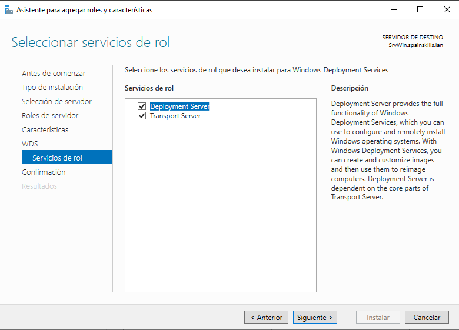
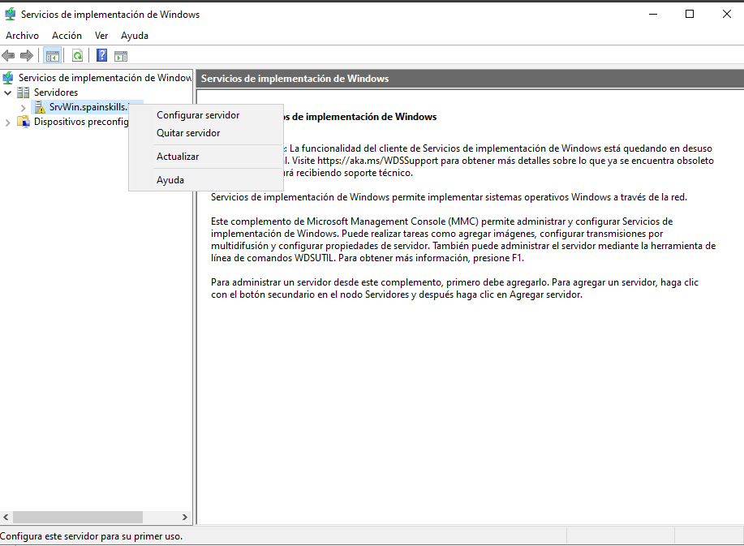
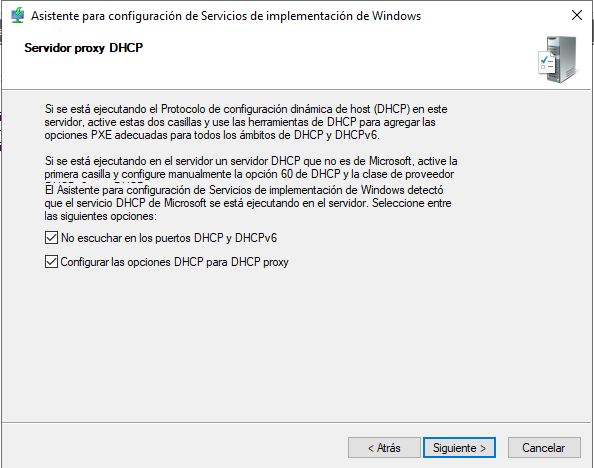
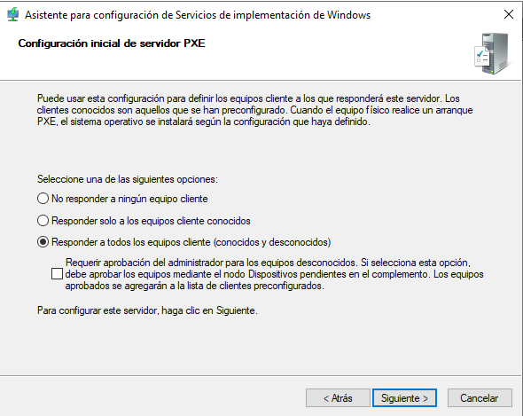
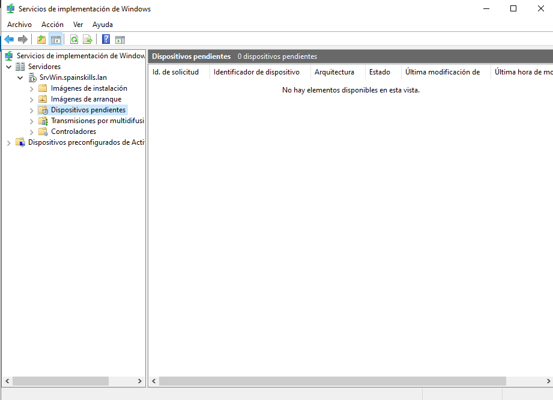
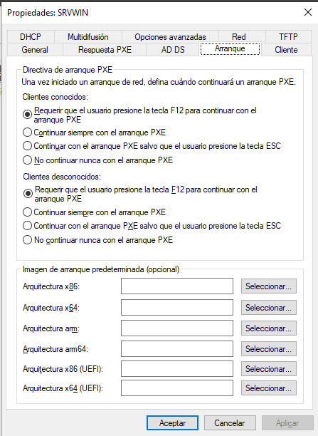
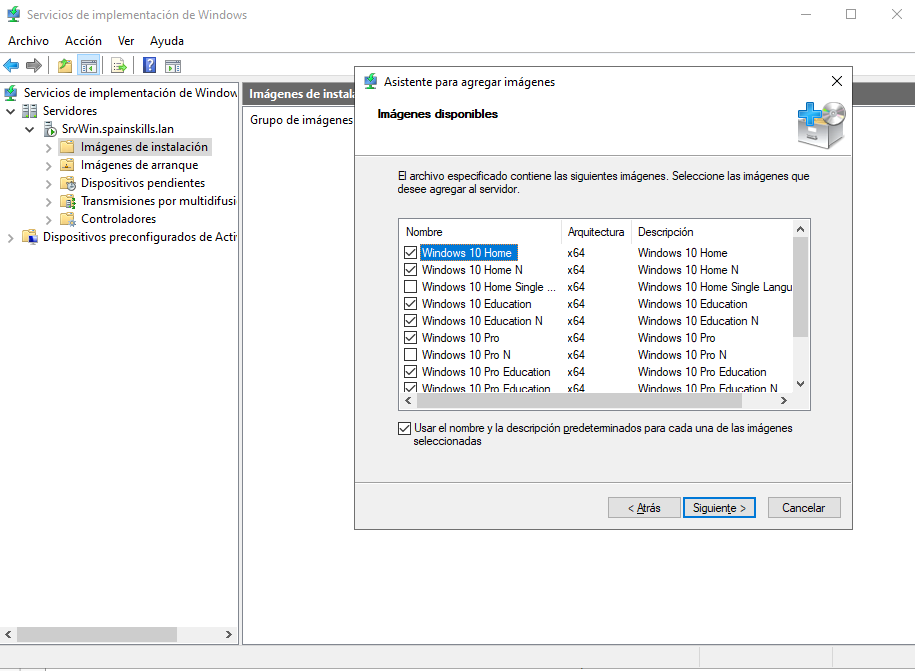
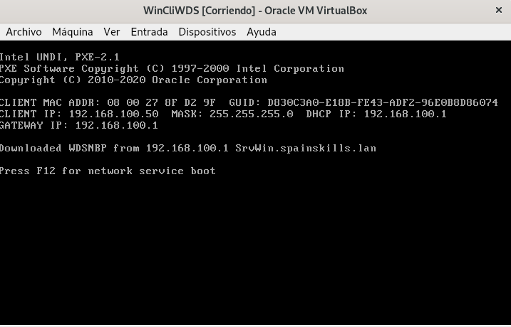
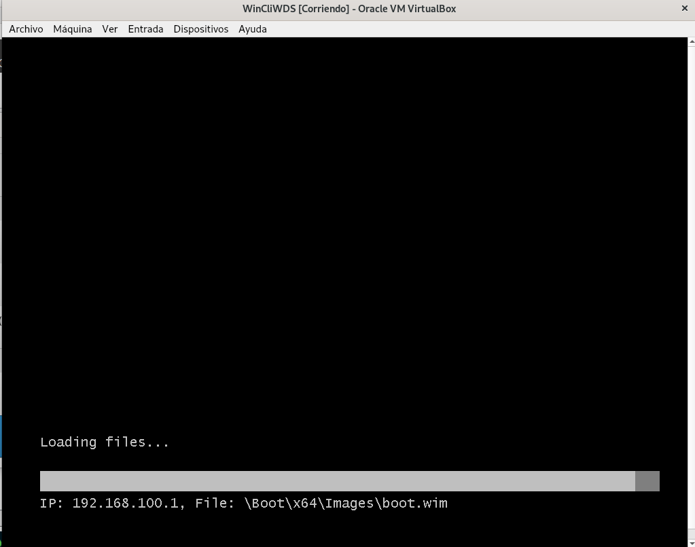

# Windows Deployment System

## Introducción
El _Windows Deployment System (WDS)_ es un sistema que nos permite desplegar el sistema operativo en los nuevos equipos de nuestra organización de manera más sencilla que ir uno por uno instalándolo. Junto con el _Microsoft Deployment Tool (MDT)_ permite crear imágenes personalizadas para realizar instalaciones desatendidas o instalar también las aplicaciones en los equipos nuevos.

También permite realizar la isntalación de muchos equipos a la vez por multicast lo que disminuye enormemente el tiempo necesario y esfuerzo para tener los nuevos equipos listos para su uso.

## Instalación
El rol a instalar es el de _Windows Deployment Services_ (Servicios de Implementación de Windows). Al seleccionarlo nos pregunta qué servicios queremos instalar:
- _Deployment Service_: proporciona toda la funcionalidad de WDS para configurar imágenes, etc
- _Transport Server_: proporciona el servicio básico para enviar las imágenes a los clientes (este servicio es imprescindible)
- 

## Configuración
Una vez instalado abrimos la herramienta _Servicios de implementación de Windows_ para configurar nuestro servidor WDS.

Este servicio necesita que tengamos un DHCP funcionando en nuestro sistema ya que depende de él para comunicarse con los nuevos clientes. SI no lo tenemos debemos instalarlo y configurarlo antes de configurar WDS. Si lo tenemos nuestro servidor escuchará en los puertos del DHCP y ahora configuraremos las opciones adecuadas.

La principal es a qué clientes vamos a responder para enviarles el sistema operativo:

Si decidimos responder a todos los clientes pero marcamos 'Requerir aprobación' cuando un nuevo cliente vaya a ser instalado nos aparecerá en la carpeta de '_Dispositivos pendientes_'

Una vez acabada la configuración debemos **iniciar** el servidor WDS para que comience a funcionar. Si abrimos su propiedades hay muchas opciones que podemos configurar como:
- Respuesta PXE: aquí podemos cambiar a qué clientes vamos a contestar
- Arranque: por defecto el cliente debe pulsar F12 para que se le envía el sistema a instalar (para evitar que se le envíe por error a una máquina que ya tiene S.O.)
- Cliente: 
- ...

## Imágenes a utilizar
Una vez que el servidor está configurado y funcionando debemos añadir las imágenes que querramos desplegar. Hay 2 tipos de imágenes y hay que añadir al menos una de cada tipo:
- **Imágenes de arranque**: permiten al equipo cliente arrancar un sistema operativo básico que ejecutará en instalador de Windows. La podemos obtener del CD de instalación de Windows (por defecto está en `\sources\boot.wim`)
- **Imágenes de instalación**: es la imagen para instalar Windows en el equipo cliente. La podemos obtener del CD de instalación de Windows (por defecto está en `\sources\boot.wim`) e incluirá muchas imágenes diferentes de las que seleccionaremos las que queramos

Al instalar el sistema en el cliente aparecerá una ventana donde seleccionar cuál de estas imágenes instalaremos y el resto del proceso será igual que si lo estuviéramos instalando desde una imagen local (en el DVD o USB).

La máxima utilidad de WDS es cuando lo usamos junto a _Microsoft Deployment Toolkiy (MDT)_ que nos permite personalizar esas imágenes para que no pregunte determinadas opciones (las guarda en un fichero) o incluso ninguna (instalación desatendida), y que permite instalar aplicaciones además del sistema operativo lo que dejaría nuestro equipo listo para funcionar.

Podéis obtener información de cómo utilizar WDS con esta herramienta en numerosas páginas como:
- <https://pc-solucion.es/unidad/9-instalacion-y-configuracion-de-wds/#Windows_ADK>
- <https://rdr-it.com/es/wds-instalacion-y-configuracion/7/>

## Instalación de los clientes
Necesitamos que los clientes a los que queramos instalar el sistema operativo arranquen por red, para lo quen habrá que habilitar en la BIOS el arranque PXE.

Como marcamos la opción de que deben pulsar F12 antes de comenzar el proceso nos pide que lo hagamos:

A continuación se carga la imagen de arranque proporcionada por el servidor WDS

y nos pregunta cuál de las imágenes de instalación disponibles es la que queremos usar

Tras ello comienza el proceso de instalación igual que se hacía desde una máquina local.

