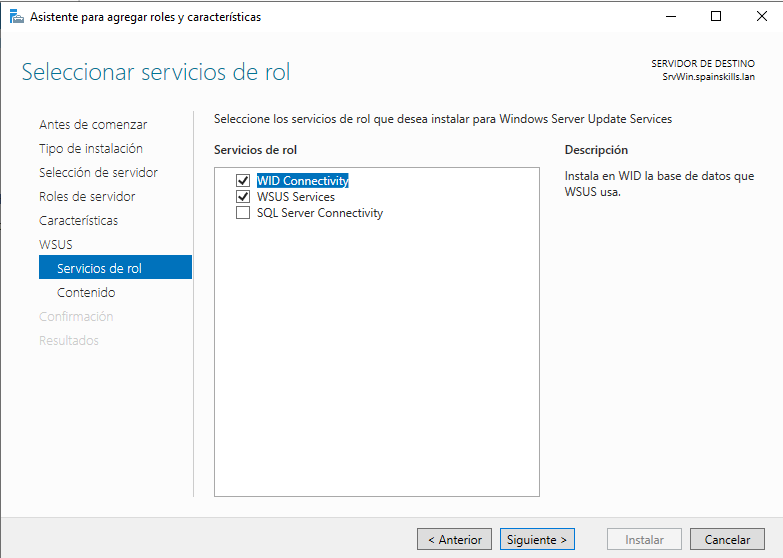
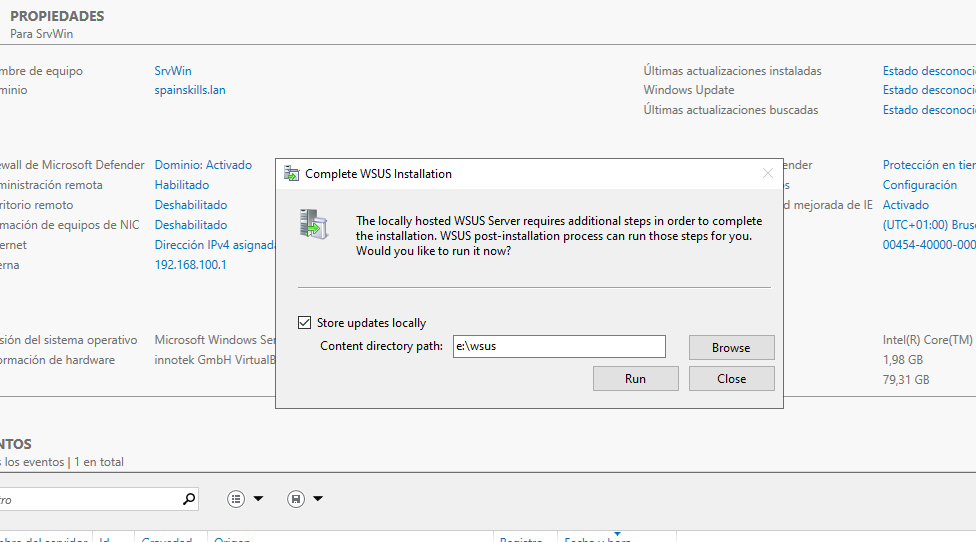
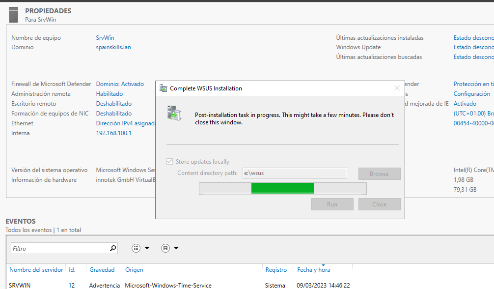
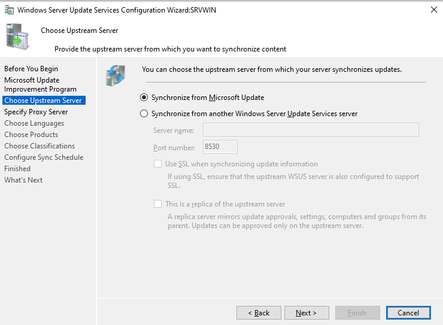
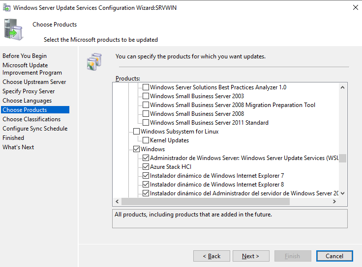
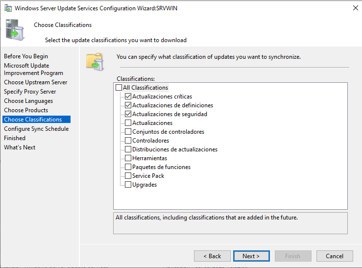
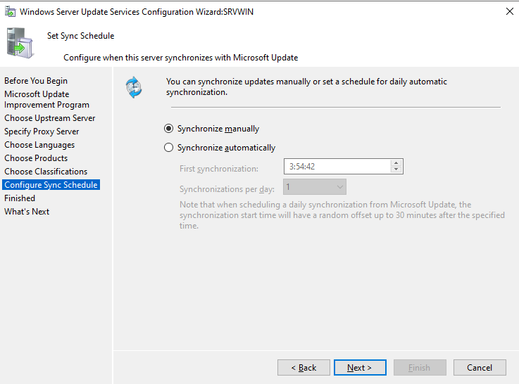
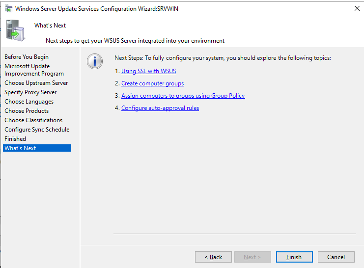
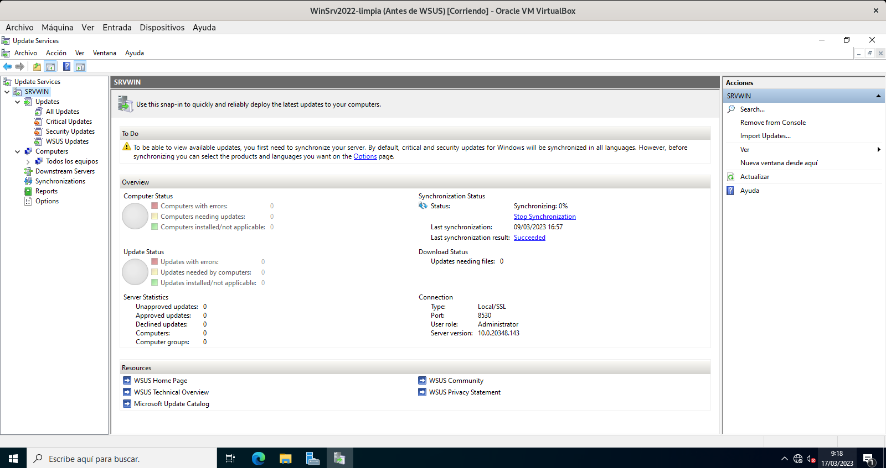
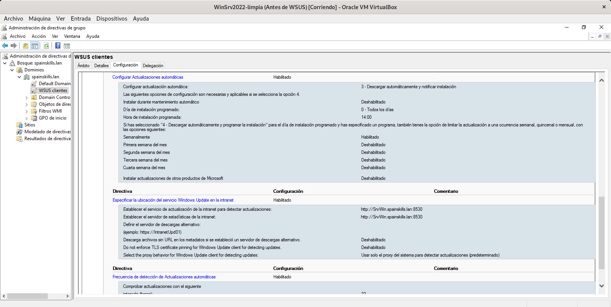

# WSUS

## Instalación
**_WSUS_** (_Windows Server Update Services_ – _Actualización de Servicios para Windows Server_) permite configurar todas las actualizaciones de productos Microsoft, descargando las mismas en el servidor WSUS y distribuyéndolas a todos los equipos del dominio automáticamente.

En primer lugar instalamos el rol. Por defecto no se instalará el servicio para conectar WSUS a una base de datos SQL Server.

Durante la instalación nos pregunta dónde guardar las actualizaciones descargadas (no es necesario que sea en una carpeta compartida).

## Configuración
Una vez instalado abrimos la herramienta _WSUS_. En primer lugar nos pregunta por la ubicación de la carpeta donde guaddar las actualizaciones:

Si pulsamos _Iniciar_ (_Run_) se conecta a _Windows Update_ y crea unas carpetas en la ubicación escogida (pero no descarga nada aún).

Con esto termina la instalación y se abre el asistente para configurar WSUS. Nos pregunta:
- si queremos participar en el programa de mejora de Windows Update (marcado por defecto)
- si descargaremos las actualizaciones de Windows Update o de otro servidor WSUS

A continuación conecta con Windows Update (o el WSUS indicado) y, tras unos minutos, nos pide:
- los idiomas de los que descargarnos las actualizaciones (por defecto los del sistema: inglés y español)
- los productos que queremos actualizar con WSUS. Tenemos todos los de Microsoft (Office, ...) y por defecto están seleccionados todos los Windows

- los tipos de actualizaciones a desplegar (críticas, Service Packs, ...)

- cuándo queremos que se realice la sincronización (por defecto manualmente)

- podemos indicar que haga ahora la descarga

y termina la configuración inicial. 

En la pantalla del servicio tenemos un resumen del estado y desde allí podemos cambiar la configuración. Lo primero que haremos es crear dentro de '_Computers_' carpetas para los distintos tipos de equipos de nuestra red:

A continuación crearemos una GPO para los clientes y otra para los servidores para que se actualicen contra nuestro servidor WSUS. Configuraremos en _Configuración de equipo -> Directivas -> Plantillas administrativas -> Componentes de Windows -> Windows Update_:
- Configurar actualizaciones automáticas
  - Configurar: elegimos cómo actualizarse (por ejemplo, descargar automáticamente y notificar instalación)
  - Día y hora programado
- Especificar la ubicación de Windows Update
  - Establecer el servicio de actualizaciones (por ejemplo: http://winserver.midominio.lan:8530). El puerto que usa por defecto el servicio WSUS es el 8530
  - Establecer el servicio de estadísticas (por ejemplo: http://winserver.midominio.lan:8530)
- Frecuencia de detección de actualizaciones automáticas (podemos cambiarlo a, por ejemplo 20 horas)
- No ajustar la opción 'Instalar actualizaciones y apagar' en el cuadro de diálogo Apagar
- ...

Al ejecutarse nos a aprecerán los equipos en _Computers_ -> _Equipos sin asignar_. Deberemos asignar cada uno a la carpeta que le corresponda según su sistema operativo.

Más información:
- RAGASYS: https://blog.ragasys.es/instalacion-y-configuracion-de-wsus-en-ms-windows-server-2019
- Solvetic: https://www.solvetic.com/tutoriales/article/9790-instalar-y-configurar-wsus-en-windows-server-2022/

