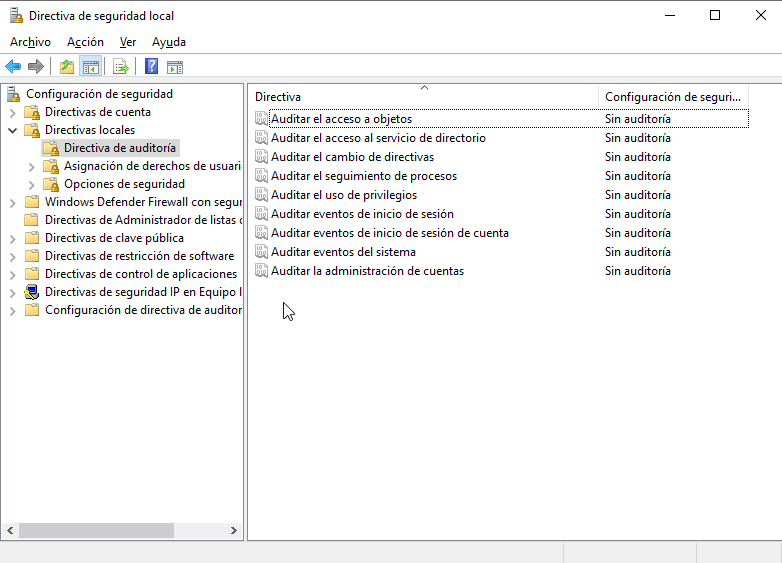

# Auditoría de sistemas informáticos
- [Auditoría de sistemas informáticos](#auditoría-de-sistemas-informáticos)
  - [Introducción](#introducción)
  - [Auditoría básica en Windows](#auditoría-básica-en-windows)
  - [Auditoría avanzada](#auditoría-avanzada)
  - [Políticas de auditoría de Microsoft](#políticas-de-auditoría-de-microsoft)

## Introducción
Auditar consiste en recoger datos y analizarlos, generando informes que recojan el estado del sistema en ese momento.

Podemos auditar para determinar el uso eficiente de los recursos del sistema informático y también para supervisar la seguridad del sistema.

## Auditoría básica en Windows
Las **Directivas de auditoría** de Windows incluyen las siguientes categorías:
- Acceso a objetos: se registra en acceso a determinados recursos del sistema, como archivos, directorios, impresoras, etc
- Acceso al servicio de directorio: se auditan los accesos de un usuario o un equipo al servicio de directorio
- Cambio de directiva: registra cambios en los permisos de usuario, auditoría y relaciones de confianza
- Seguimiento de procesos registra los procesos del sistema y los recursos que utilizan
- Uso de privilegios: registra el uso de permisos y privilegios del usuario
- Eventos de inicio de sesión: recoge los inicios y cierres de conexiones a los sistemas de red
- Eventos de inicio de sesión de cuenta: registra los inicios y cierres de sesión
- Eventos de sistema: registra el arranque, cierre y reinicio del sistema
- Administración de cuentas: registra la creación, modificación o eliminación de cuentas de usuario, equipo o grupo

Por defecto todas las auditorías están desactivadas pero podemos activar cualquiera de ellas creando una nueva GPO y configurando la auditoría que queramos en el `Editor de administración de directivas de grupo->Configuración de equipo->Directivas->Configuración de Windows->Configuración de seguridad->Directivas locales->Directiva de auditoría`.

Si queremos activarlas para un equipo lo haremos desde `Inicio->Herramientas administrativas->Directivas de seguridad local->_Configuración de seguridad_->_Directivas locales_->Directiva de auditoría`.

Los eventos generados por las auditorías podremos verlos en el **Visor de eventos** de Windows, dentro de _Registros de Windows_->_Seguridad_.

## Auditoría avanzada
Si queremos tener más control sobre lo que se audita lo haremos desde `Inicio->Herramientas administrativas->Directivas de seguridad local->Configuración de seguridad->Configuración de directiva de auditoría avanzada`.

En realidad cada categoría básica corresponde con varias de la categoría avanzada (es similar a los permisos donde normalmente usamos permisos estándar cada uno de los cuales corresponde a varios permisos especiales).

- [Crear política de auditoría Directorio Activo Windows Server 2016](https://www.solvetic.com/tutoriales/article/3114-hacer-una-auditoria-al-active-directory-en-windows-server-2016/)

## Políticas de auditoría de Microsoft
Podemos ver diferentes políticas de auditoría que plantea Microsoft como:
- [Supervisión de Active Directory en busca de indicios de riesgo](https://docs.microsoft.com/es-es/windows-server/identity/ad-ds/plan/security-best-practices/monitoring-active-directory-for-signs-of-compromise)
- [Planear la auditoría de acceso a archivos](https://docs.microsoft.com/es-es/windows-server/identity/solution-guides/plan-for-file-access-auditing)
- [Recomendaciones de la directiva de auditoría](https://docs.microsoft.com/es-es/windows-server/identity/ad-ds/plan/security-best-practices/audit-policy-recommendations)
- [Ejemplo](https://docs.microsoft.com/es-es/windows-server/identity/solution-guides/deploy-security-auditing-with-central-audit-policies--demonstration-steps-)