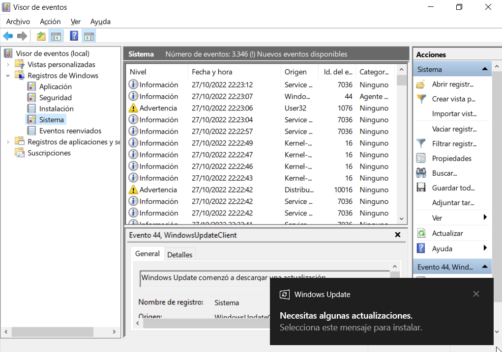
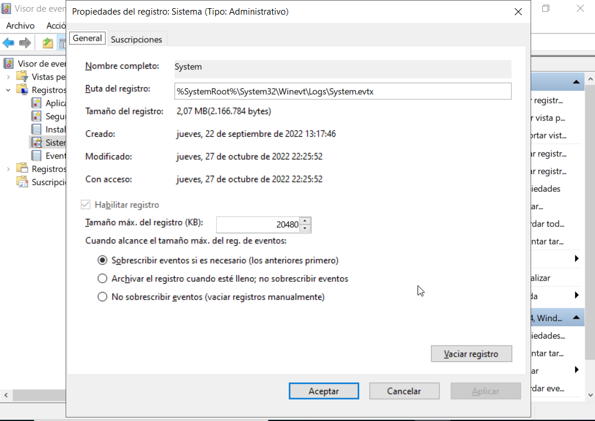

# Registros de un sistema Windows
- [Registros de un sistema Windows](#registros-de-un-sistema-windows)
  - [Introducción](#introducción)
  - [El Registro de Windows](#el-registro-de-windows)
  - [Propiedades de un evento](#propiedades-de-un-evento)
    - [Propiedades del archivo de registro](#propiedades-del-archivo-de-registro)

## Introducción
Continuamente se producen eventos en el sistema, algunos normales (como un inicio de sesión o un acceso al disco) y otros erróneos (como un error de una aplicación o un intento inválido de inicio de sesión). Esos eventos o eventos se guardan en los ficheros de _log_ o registros para su posterior análisis por parte del administrador del sistema.

El sistema operativo o una aplicación guarda en un fichero de _log_ un evento mientras ocurre para su examen posterior. Es un componente importante de cualquier sistema operativo y que tenemos que tener controlado, por ejemplo respecto a posibles ataques de seguridad, son la prueba que hemos sido atacados.

## El Registro de Windows
El principal registro que tenemos es el **Registro de Windows** que tiene 4 registros principales sobre eventos:

- **Aplicación**: aquí encontramos todos los eventos relacionados con las aplicaciones que se ejecutan en el sistema así como las alertas que nosotros configuramos en el _Monitor del sistema_ (posteriormente veremos como hacerlo)
- **Seguridad**: se registran todos los eventos relacionados con las directivas de auditoría establecidas en los directivas de grupo. Podemos registrar todos los eventos (incluyendo los correctos) o solo los errores. También encontramos los eventos de uso de recursos compartidos.
- **Instalación**: eventos relacionados con la instalación y configuración de aplicaciones, incluyendo las operaciones de añadir o quitar funciones en el sistema
- **Sistema**: eventos asociados al uso del sistema y los servicios instalados

Además del _Registro de Windows_ tenemos otros 3 registros:
- **Registros de aplicaciones y servicios**: almacena eventos de una aplicación o componente (como el registro de Internet Explorer, el del Servicio de directorio, el Servidor *DNS, etc.). Incluye 4 registros
    - _De administración_: indican un problema y la solución para el administrador
    -  _Operativos_: para analizar y diagnosticar un problema (pueden usarse para activar herramientas o tareas)
    -  _ Analíticos_: describen el funcionamiento de programas e indican problemas que el usuario no puede controlar
    -  _De depuración_: los utilizan los programadores para solucionar problemas
 - **Suscripciones**: permite ver eventos en un único equipo remoto. Para especificar los eventos que se van a recopilar otros equipos, se tiene que crear una suscripción a un evento.
 - **Vistas personalizadas**: se puede crear un filtro que muestro solo los registros que interesan y guardarlo con un nombre

Los eventos que muestra el _Visor de eventos_ se clasifican en:
- **Críticos**: error del que no se puede recuperar automáticamente la aplicación que lo produjo
- **Error**: es un problema importante que puede afectar a la funcionalidad de la aplicación o a componente
- **Advertencia**: evento que puede no ser importante pero podría dar problemas en el futuro
- **Información**: describe el funcionamiento correcto de una aplicación, un controlador o un servicio
- **Auditoría correcta**: se ha realizado correctamente el ejercicio de los derechos de un usuario
- **Error de auditoría**: se ha producido un error en el ejercicio de los derechos de un usuario

## Propiedades de un evento
Al hacer doble clic sobre un evento podemos ver toda la información del mismo.

Incluye un enlace de ayuda que envía la información del evento en Microsoft y nos abra el explorador de Internet con información sobre el evento de la web de Microsoft.

### Propiedades del archivo de registro
Si seleccionamos un registro en el Visor de eventos y desde su menú contextual elegimos Propiedades nos aparece toda la información del registro:

Desde aquí podemos ver donde se guarda el archivo y su tamaño e indicamos qué hacer cuando llego a su tamaño máxima, si queremos sobrescribir los eventos más antiguos o guardar una copia del registro.

También desde su menú contextual tenemos la opción de vaciar registro que nos permite guardar una copia del registro antes de vaciarlo o simplemente borrar todo su contenido. La opción de Guardar eventos guarda una copia del registro pero sin vaciarlo posteriormente.