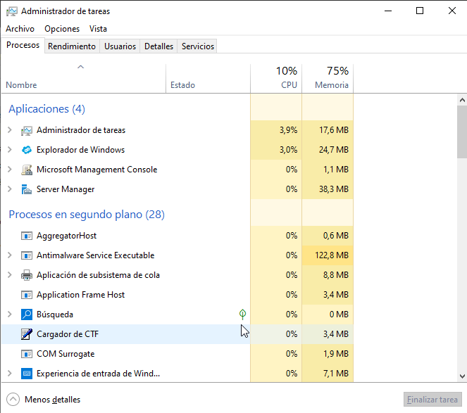
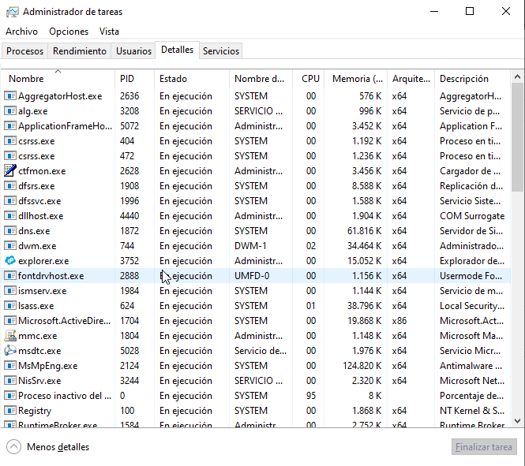
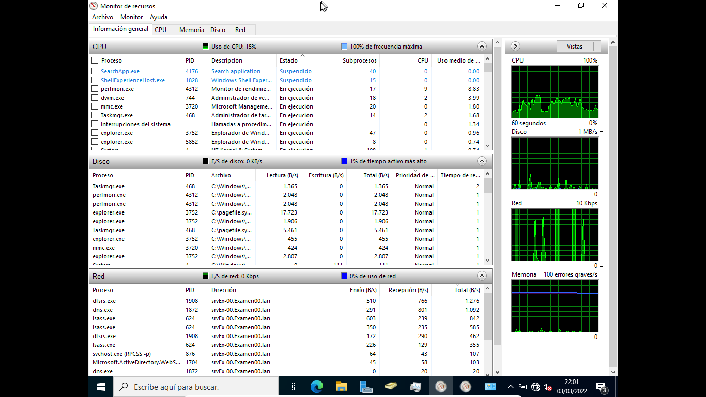
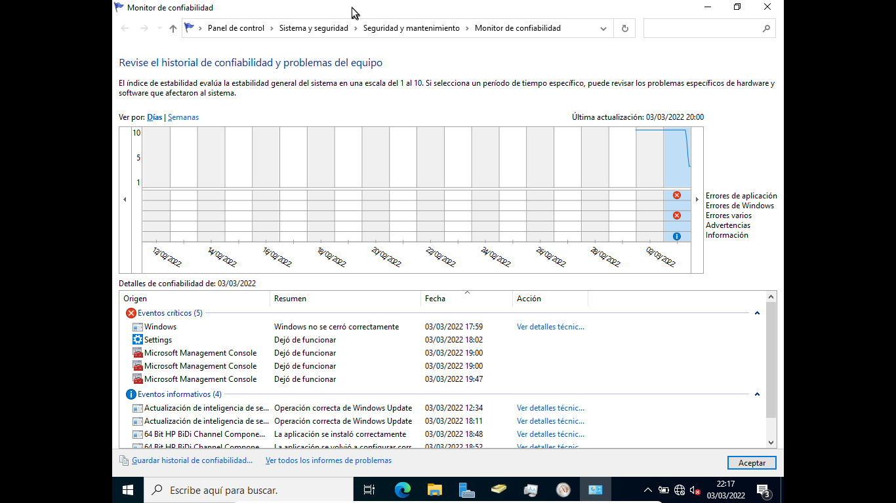
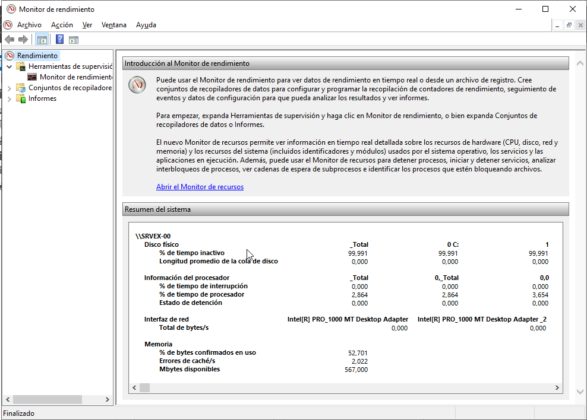

# Supervisión de un sistema Windows
- [Supervisión de un sistema Windows](#supervisión-de-un-sistema-windows)
  - [Introducción](#introducción)
  - [Administrador del servidor](#administrador-del-servidor)
  - [Administrador de tareas](#administrador-de-tareas)
  - [Monitor de recursos](#monitor-de-recursos)
  - [Visor de eventos](#visor-de-eventos)
  - [Monitor de confiabilidad](#monitor-de-confiabilidad)
  - [Monitor de rendimiento](#monitor-de-rendimiento)
  - [Windows Admin Center (WAC)](#windows-admin-center-wac)
  - [Windows Update](#windows-update)

## Introducción
Los sistemas Windows nos proporcionan varias herramientas que podemos utilizar para supervisar y monitorizar el sistema. Las más importantes son:
- El Administrador del servidor
- El Administrador de tareas
- El Monitor de recursos
- El Visor de eventos
- El monitor de confiabilidad
- El monitor de rendimiento
- Windows Admin Center (WAC)

Para gestionar las actualizaciones dispone del servicio **Windows Update** y su herramienta gráfica de configuración.

## Administrador del servidor
Desde aquí tenemos un completo resumen del estado general de cada servidor que nos permite determinar su estado actual así como detectar eventos registrados que puedan afectar a su funcionamiento.

## Administrador de tareas
En sistemas Windows podemos obtener importante información del `Administrador de tareas de Windows`, que nos muestra los programas, procesos y servicios que están en ejecución. Tiene varias pestañas con información sobre:
- **Procesos**: podemos ver los programas que se están ejecutando, tanto los abiertos por nosotros (_aplicaciones_) como los que están en segundo plano y los de Windows. De cada proceso vemos su nombre, el porcentaje de CPU está consumiendo ahora y la memoria que ocupa. Desde ahí podemos finalizar cualquier proceso.

- **Rendimiento**: vemos los datos de uso de CPU, memoria y red así como sus gráficos. Desde aquí podemos abrir el Monitor de recursos.

- **Usuarios**: nos muestra todos los procesos agrupados según el usuario que los haya abierto. Desde aquí podemos desconectar un usuario del sistema.
- **Detalles**: nos muestra todos los procesos con más información de cada uno (PID, estado, ...)

- **Servicios**: muestra todos los servicios de Windows, y de los arrancados nos muestra también su PID

## Monitor de recursos
Es similar a la pestaña de _Rendimiento_ del _Administrador de tareas_ pero nos proporciona mucha más información sobre el uso de CPU, Disco, Red y Memoria por parte de los diferentes procesos en ejecución.

## Visor de eventos
Todos los sistemas Windows disponen de registros de eventos donde se almacenan todos los sucesos importantes del equipo. Podemos consultar estos registros con el _Visor de eventos_. Existen 2 tipos de registros:
- Registros de aplicaciones y servicios: aquí se recogen los eventos que afectan a una sola aplicación
- Registros de Windows: recogen eventos que afectan a todo el sistema. Son:
  - Eventos de aplicaciones: son los generados por las aplicaciones
  - Eventos de seguridad: registran cosas como inicios de sesión, etc
  - Eventos de instalación: los producidos al instalar el sistema o algún componente
  - Eventos del sistema: los que más consultaremos, producidos por los diferentes servicios
  - Eventos reenviados: producidos en otros equipos que los reenvían aquí

Según su gravedad pueden ser:
- crítico: error graves que no pueden recuperarse
- error: error importante
- advertencia: puede ser un problema
- información: sólo se registra un suceso

## Monitor de confiabilidad
Muestra en un gráfico la confiabilidad del equipo, entre 1 (mínima) y 10 (máxima) en función de los problemas y cambios detectados a lo largo del tiempo.

En la parte inferior muestra información sobre los eventos producidos y podemos hacer click sobre cualquiera para obtener más información del mismo.

Desde _Ver todos los informes de problemas_ obtenemos un listado de todos ellos y haciendo click sobre cualquiera obtenemos toda la información.

## Monitor de rendimiento
El Monitor de Rendimiento nos permite visualizar datos sobre el rendimiento tanto en tiempo real como desde recopilando datos de registro. Permite:
- Reunir datos de rendimiento en tiempo real del equipo local o de cualquier otro
- Ver los datos unificados en un registro de **contadores de rendimiento**
- Presentar los datos en un gráfico, histograma o informe
- Exportar los datos a aplicaciones de Microsoft Office
- Crear una página HTML a partir de las vistas de rendimiento.

La información que recoge se reúne en **Conjuntos de Recopiladores de datos** que recogen los datos de los equipos y crean informes de rendimiento. Estos conjuntos usan los siguientes tipos de recopiladores de datos:
- Contadores de rendimiento: son mediciones del estado o de la actividad del sistema
- Datos de seguimiento de eventos: se recopilan de componentes del sistema operativo o de aplicaciones que informan de acciones o eventos
- Información de configuración del sistema: valores de las claves del Registro de Windows
- Alerta de contador de rendimiento: permite definir unos contadores de rendimiento y lanzar una alerta si se supera alguno de los límites que se definan para dichos contadores.

## Windows Admin Center (WAC)

## Windows Update
Esta herramienta gestiona las actualizaciones del sistema y permite configurar:
- cuándo se descargarán las actualizaciones (se puede programar la hora o ponerlo en manual)
- si se instalan automáticamente o debe ser el administrador quien las instale. En un servidor debe ser el administrador quien decida cuándo instalar cada actualización ya que algunas pueden requerir el reinicio del sistema o incluso podrían acer que algo deje de funcionar correctamente
- opciones de reinicio: cuándo reinicar el equipo tras instalar una actualización que lo requiera: inmediatamente, manualmente por el administrador o a la hora programada aquí
- opciones avanzadas: permite indicar si descargar sólo actualizaciones de seguridad o también de características así como descargar también actualizaciones de otros programas de Microsoft

El servicio que gestiona esta herramienta se llama _Windows Update_ (**_wuausrv_**) y deberíamos tenerlo siempre activo.

También pueden configurarse las actualizaciones mediante una GPO que encontramos en **_'Configuración de equipo -> Plantillas adminitrativas -> Componentes de Windows -> Windows Update'_**, lo que nos permite configurar las actualizaciones de todos los equipos del sistema automáticamente.

