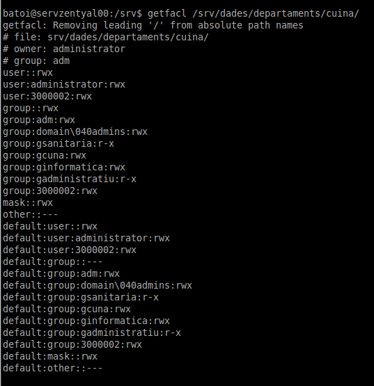

ACL
===

Las listas de control de acceso (ACL) proporcionan una manera mucho más flexible de especificar los permisos de un archivo u otro objeto que el sistema de usuario/grupo/otros (UGO) que es el estándar de Unix.

Las ACL se incluyen por defecto en el sistema de ficheros NTFS de Windows y en GNU/Linux se incluye desde la versión 2.6 del kernel. 

Posiblemente ya tengamos instalado el paquete ***acl***. Si no lo único que hay que hacer es instalarlo. Para poder usar estos permisos en una partición hay que indicarlo al montarla poniéndole las opciones ***user\_xattr y acl***. En las distribuciones modernas por defecto todas las particiones se montan con estas opciones. Podemos comprobarlo con:

    tune2fs -l /dev/sda1 | grep acl

Si no le monta así por defecto debemos configurarlo en el fichero /etc/fstab para que se monte siempre:

    /dev/sda6  /datos  ext4  acl,user\_xattr,defaults  0  0

### Utilizando las ACL

Los dos comandos básicos que utilizaremos para gestionar los permisos ACL son getfacl y setfacl para ver y cambiar los permisos respectivamente.

#### getfacl

Si un directorio o fichero tiene establecidos permisos ACL al listarlo con **ls** aparece un símbolo + que nos indica que no estamos viendo todos los permisos:

Para ver los permisos reales del directorio tenemos que utilizar el comando getfacl que muestra los permisos ACL de un fichero o directorio. Ejemplo:

Las ACL se representan por 3 campos separados por el carácter : (dos puntos) y son:

-   tipo de objeto a quien se aplicará el permiso. Puede ser **user** (o podemos poner simplemente la letra u), **group** (g), **other** (o) o **mask** (m)
-   nombre o ID (UID o GID) del objeto a quien se aplicará el permiso. Si está en blanco quiere decir que se aplicará al propietario
-   permiso a aplicar: r, w, x, o bien - (si no queremos que tenga ese permiso)

En el caso de directorios también tenemos los *Default ACL* o ACL por defecto que nos permiten indicar las ACL que tendrán los nuevos ficheros y directorios que se crean dentro de (es como establecer los permisos que heredarán los nuevos ficheros y carpetas). Si se trata de una ACL por defecto aparece un 4r campo antes de este 3 que pone “**default**:”.

Vamos a comentar algunas de las líneas con información que nos muestra:

\# file: nombre del directorio (cuina)
\# owner: usuario propietario (administrator)
\# group: grupo propietario (adm)
user::rwx: permisos para el usuario propietario puesto que no se especifica un usuario concreto
user:administrator:rwx: permisos para el usuario administrator que podrá leer, escribir y entrar
user:3000002:rwx: permisos para el usuario con ID 3000002 que podrá leer, escribir y entrar dentro de la carpeta
group::rwx: permisos para el grupo propietario puesto que no se especifica grupo
group:gsanitaria:r-x: permisos para el grupo gsanitaria. Todos sus miembros pueden leer y entrar dentro.
mask::rwx: si quitamos algún permiso de la máscara se quitaría automáticamente a todos los usuarios y grupos (excepto a los propietarios)
other:---: permisos para el resto. Ninguno
default: aquí se repiten las líneas de permisos y establece los permisos que tendrá por defecto cualquier fichero o subdirectorio que se cree dentro. En este caso serán los mismos que los de la carpeta cuina.

#### setfacl

Para asignar estos permisos utilizamos el comando setfacl. Su sintaxis es:

    setfacl [-R] [-m | -x ] [ d | default]:{u|g|o|m}:[nombre\_usuario | nombre\_grupo]:{r|w|x|-} nombre\_fichero\_o\_carpeta

Parámetros:

-   -R: recursivo
-   -m o -x: para modificar y añadir una nueva ACL (-m) o para borrar una existente (-x)
-   a quién se aplica: u (o user), g (o group) , o (u other), m (o mask). Si delante ponemos d (o default) será una ACL por defecto
-   si antes hemos indicado user o group tenemos que especificar a qué usuario o grupo se aplica. Si no ponemos nada será para el usuario o grupo propietario
-   permiso o permisos a dar, en formato rwx. Si queremos que tenga el permiso ponemos la letra y si no el guion -.
-   podemos poner más de una ACL, separadas por coma

Ejemplos:

    setacl -R -m user::rwx,user:mcastell:r-x,g::r-x,g:informatica:r-x,o::--- apuntes

En la carpeta apuntes y todo su contenido (-R) da permisos rwx para su propietario (u::rwx), r-x para el usuario mcastell (u:mcastell:r-x), r-x para el grupo propietario (g::r-x) y para el grupo informatica (g:informatica:r-x) y quita los permisos para el resto (o::---)

    setacl -R -x user:mcastell apuntes

En la carpeta apuntes y todo su contenido (-R) quita la ACL que daba permisos al usuario mcastell.