Instalación
===========

Una vez finalizada la planificación procederemos a la instalación del sistema. Si ya tenemos las particiones hechas en la instalación elegiremos el punto de montaje de cada una. Si no las haremos al instalar.

Lo más común es instalar el servidor sin interfaz gráfica. 

Instalación de Debian 8 Jessie
------------------------------

[installDebian.ogv](imgs/installDebian.ogv)

A la hora de particionar el disco elegiremos LVM pero con partición separada para /home. Las particiones que se crean son:

-   /dev/sda1 de 250 MB para arrancar el sistema, que monta en /boot
-   /dev/sda2, partición extendida con el resto de espacio (casi 15 GB). En ella crea
-   /dev/sda5, partición lógica con todo el espacio que asigna a un VG de LVM al que llama /dev/mapper/srvAulaDebian-99. En él crea los LV:
    -   /dev/mapper/srvAulaDebian-99-vg-root, de 4 GB para el sistema (se monta en /)
    -   /dev/mapper/srvAulaDebian-99-vg-swap, de 512 MB para el swap (del mismo tamaño de la RAM)
    -   /dev/mapper/srvAulaDebian-99-vg-home, de 10 GB para el las carpetas de los usuarios (se monta en /home)

Respecto a los paquetes a instalar, por defecto no aparece marcado ningún entorno de escritorio, ni lo marcaremos. Marcar SSH Server.

Instalación de Ubuntu Server LTS
--------------------------------

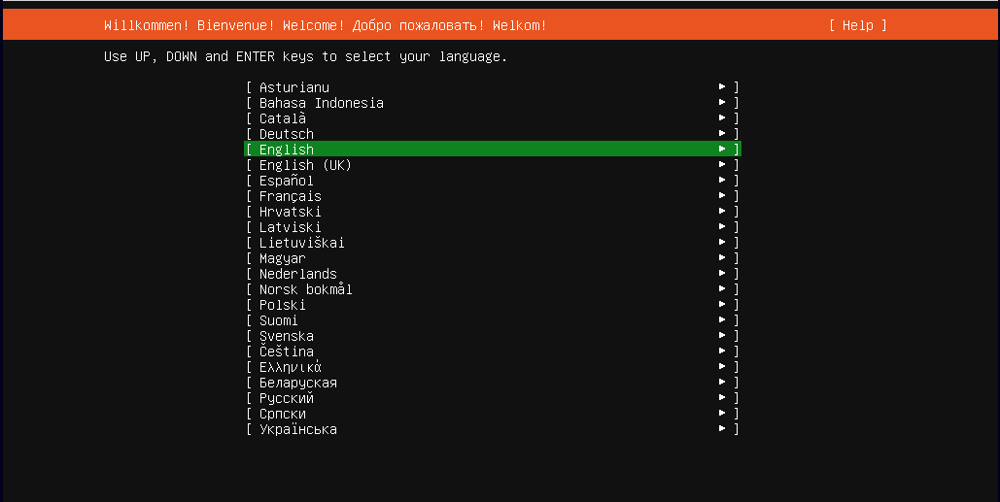

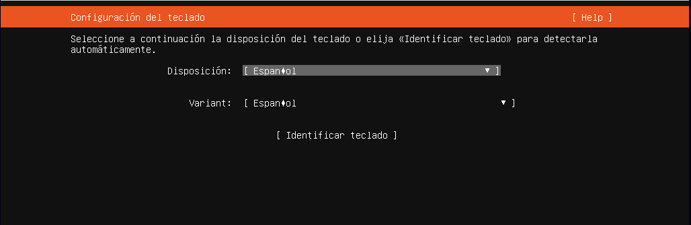

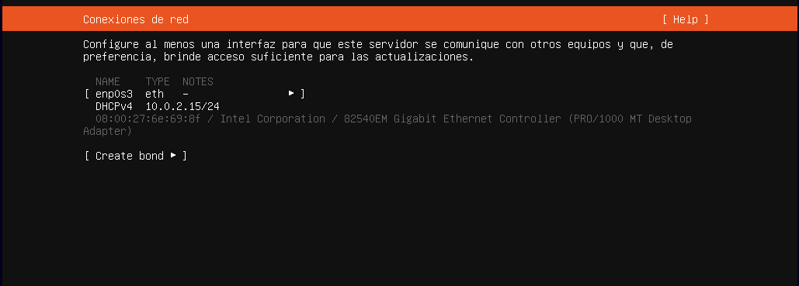

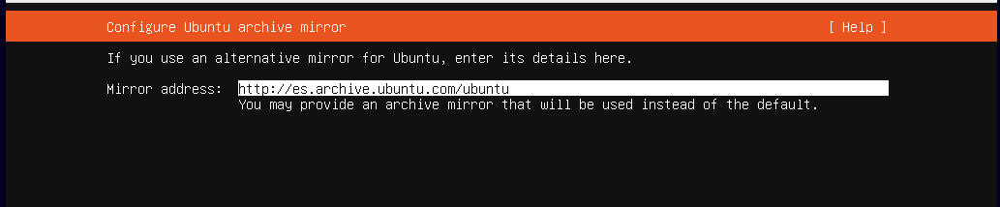

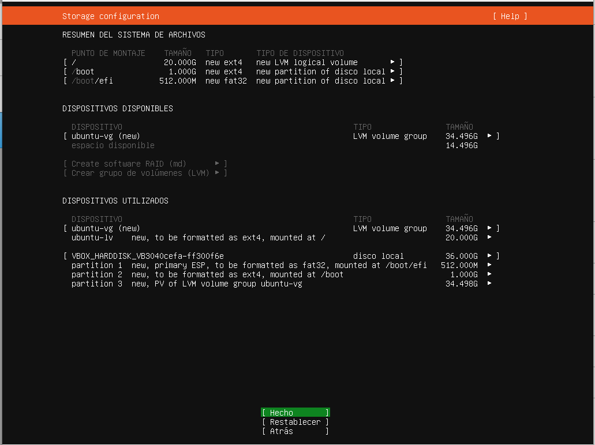

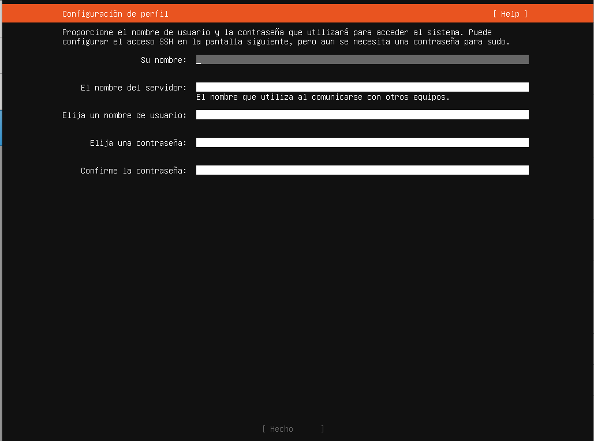

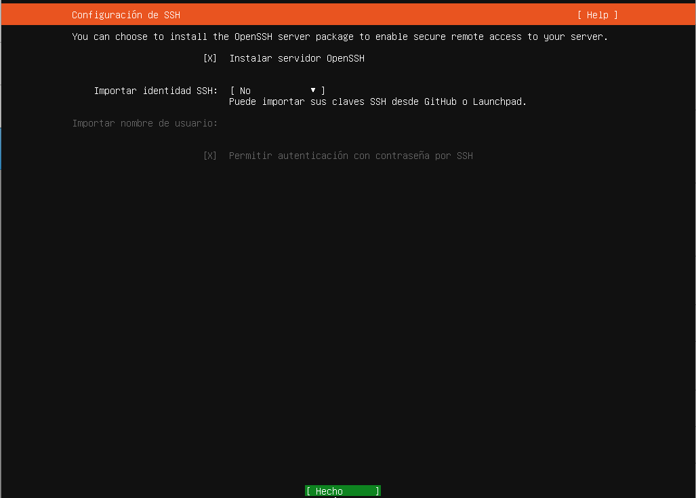

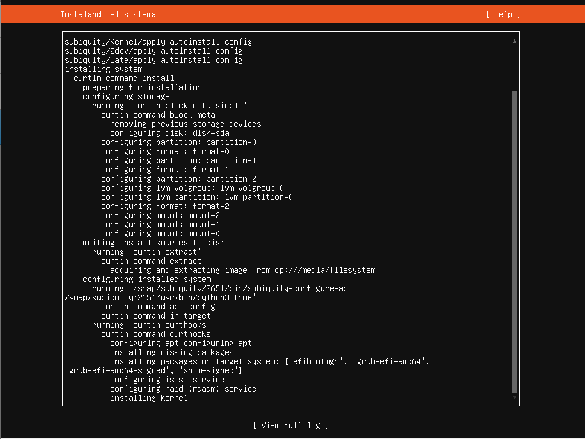

Instalación de Cent OS v.7
---------------------------

Arrancamos la máquina virtual e introducimos el CD de CentOS y comenzamos la instalación:

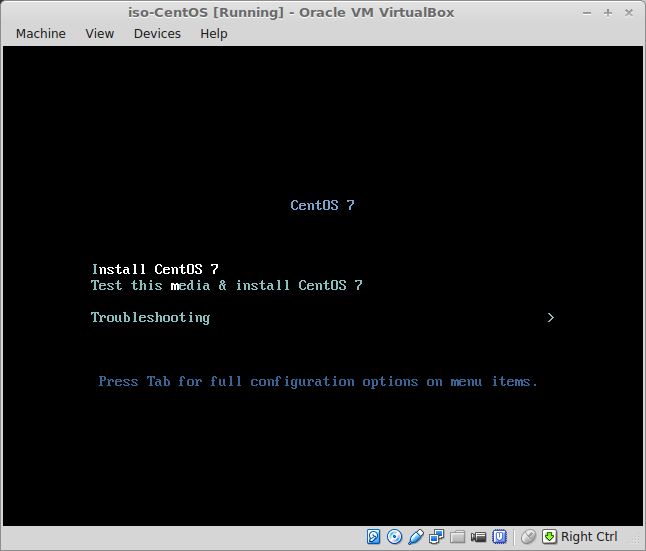

Lo primero que nos pregunta es el idioma:

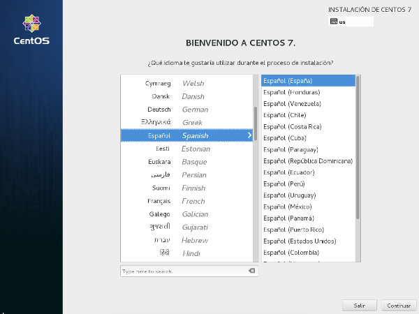

A continuación aparece un resumen de la instalación que se va a hacer. No se puede continuar hasta configurar dónde se instalará en sistema:

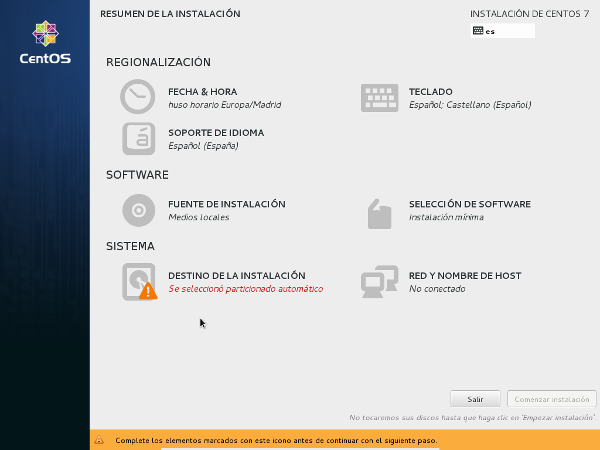

Vamos a ver algunas de las opciones que tenemos. En Selección de software escogemos los programas a instalar en función del uso que vayamos a dar a nuestro servidor:

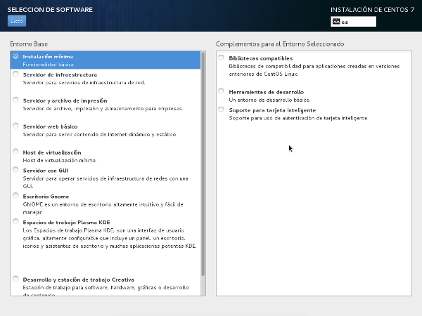

Con esta opción instalaremos un servidor sin entorno gráfico. Para que tenga entorno gráfico debemos escoger Servidor con GUI:

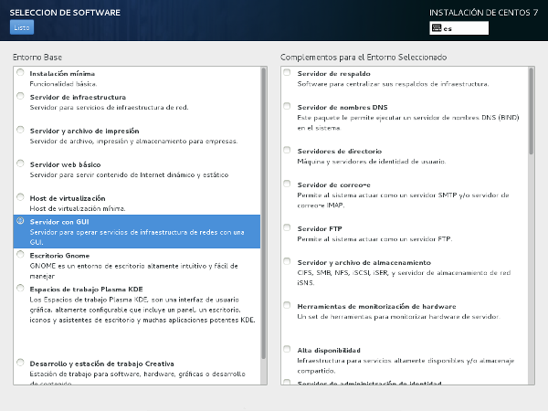

En todos los casos tengo opciones para instalar otros programas y dar más funcionalidades al servidor. Nosotros de momento no vamos a instalar nada más que el servidor sin GUI.

En cuanto a fuente de instalación lo dejaremos como está: desde el CD:

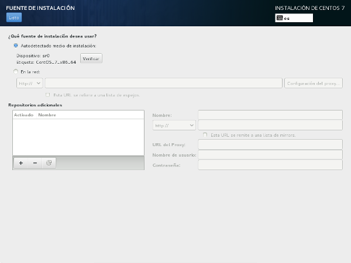

Debemos seleccionar el destino de la instalación. Marcaremos el disco en el que queremos instalar el sistema:

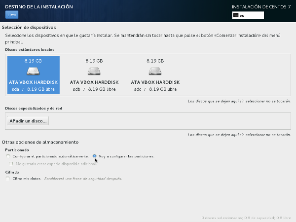

Podemos seleccionar particionado automático o manual, que es lo que yo he elegido:

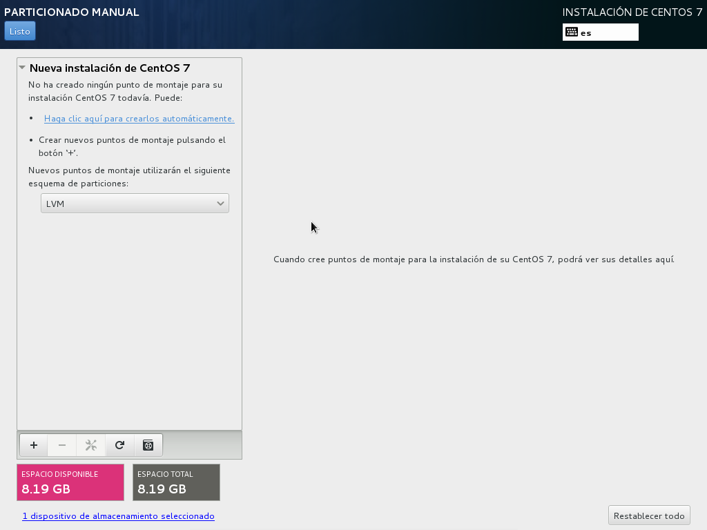

Si pinchamos la opción de que cree las particiones automáticamente las particiones que crea son:

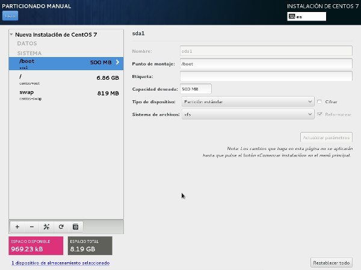

Vemos que hace una partición para la carga del sistema y otra que configura con LVM y en la que se crean dos particiones virtuales:

- la del sistema

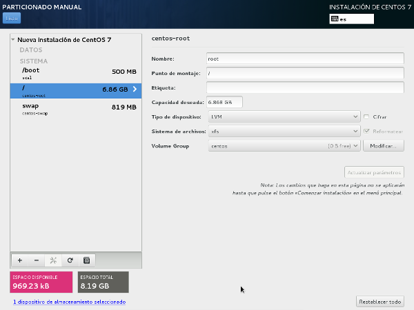

y la del swap

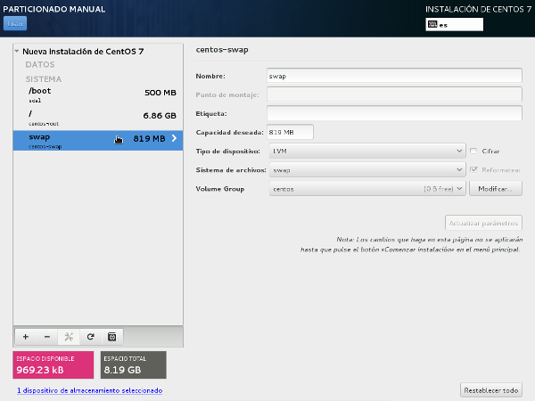

Antes de crearse las particiones nos muestra los cambios que se harán en el disco para que los confirmemos:

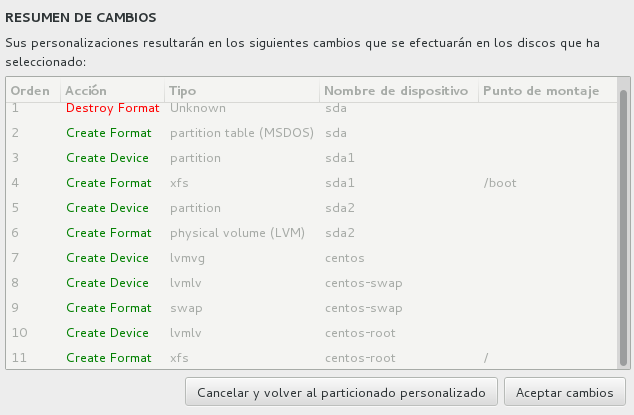

El siguiente paso es configurar el nombre de la máquina y la red. Estableceremos IPs estáticas para nuestras tarjetas de red:

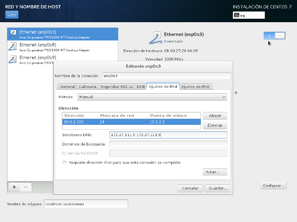

Por último nos informa de que no hemos configurado la contraseña de root ni creado usuarios. Estableceremos la contraseña de root:

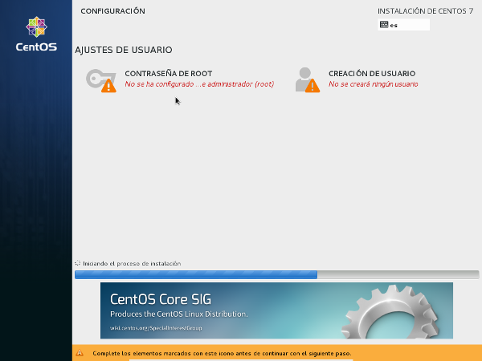

y crearemos un usuario normal al que llamaremos batoi:

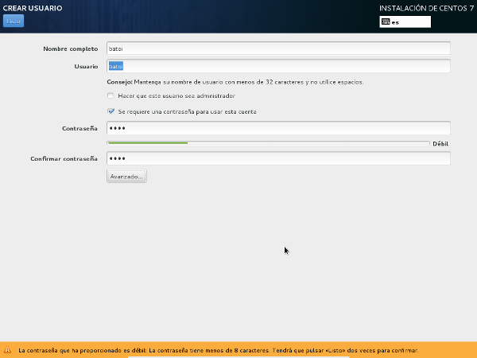

Entre las opciones que podemos configurar del nuevo usuario está cambiar su home o los grupos a que pertenece:

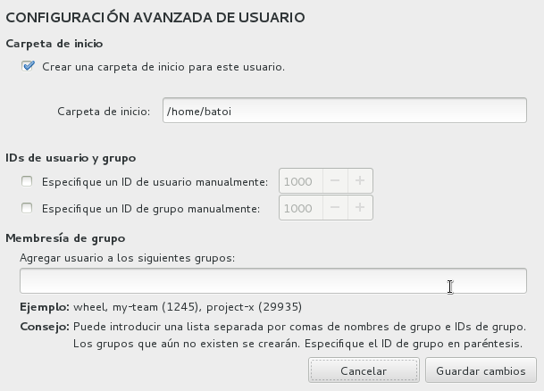

Una vez hecho procedemos con la instalación del sistema:

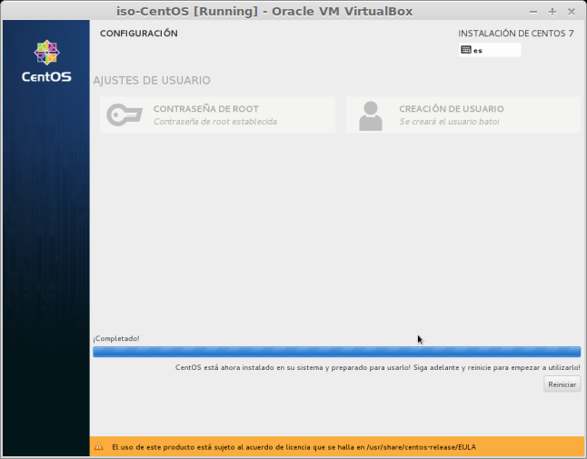

Y tras reiniciar ya tenemos nuestro sistema CentOS operativo:

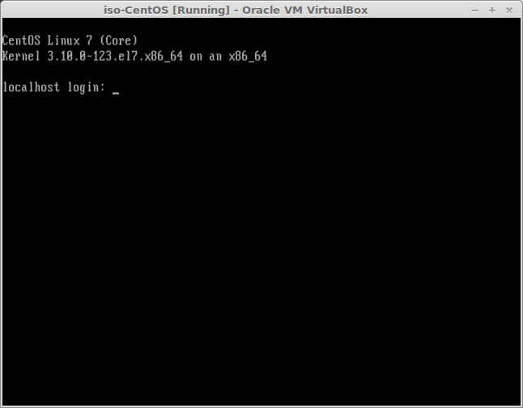