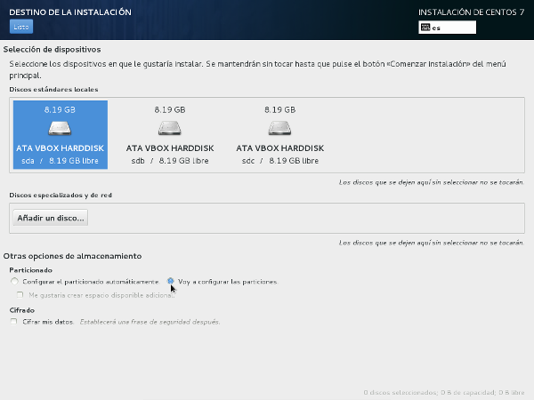
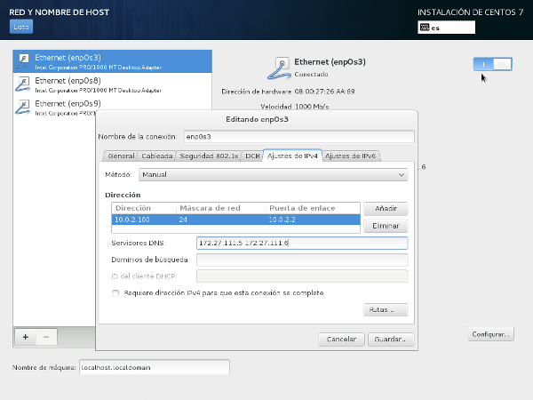
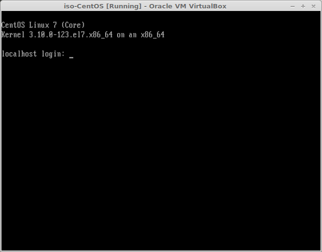

Módulo: Implantación de Sistemas Operativos
============================================

UD 11 - Instalación de un servidor con software libre
=====================================================

1º ASIR
-------
- [Módulo: Implantación de Sistemas Operativos](#módulo-implantación-de-sistemas-operativos)
- [UD 11 - Instalación de un servidor con software libre](#ud-11---instalación-de-un-servidor-con-software-libre)
  - [1º ASIR](#1º-asir)
- [Introducción a la UD 11](#introducción-a-la-ud-11)
  - [Objetivos de la unidad](#objetivos-de-la-unidad)
  - [Conceptos clave](#conceptos-clave)
  - [Conocimiento previo](#conocimiento-previo)
- [Planificación de la instalación](#planificación-de-la-instalación)
- [Sistemas de archivo y particionamiento](#sistemas-de-archivo-y-particionamiento)
- [Instalación del servidor](#instalación-del-servidor)
    - [Instalación de Debian 8 Jessie](#instalación-de-debian-8-jessie)
    - [Instalación de Ubuntu Server LTS](#instalación-de-ubuntu-server-lts)
    - [Instalación de Cent OS v.7](#instalación-de-cent-os-v7)
- [Finalización de la instalación](#finalización-de-la-instalación)
- [Configuración básica del servidor](#configuración-básica-del-servidor)
    - [Nombre del equipo](#nombre-del-equipo)
    - [Gestionar usuarios y grupos](#gestionar-usuarios-y-grupos)
    - [Otras utilidades](#otras-utilidades)
- [Servicios](#servicios)
  - [Servicios](#servicios-1)
- [Red](#red)
- [Repositorios](#repositorios)
- [Instalación de software](#instalación-de-software)
    - [Paquetes rpm](#paquetes-rpm)
- [Discos y particiones](#discos-y-particiones)
- [LVM](#lvm)
    - [Ejemplo de uso desde la consola](#ejemplo-de-uso-desde-la-consola)
      - [Como añadir una nueva partición al volumen](#como-añadir-una-nueva-partición-al-volumen)
- [ACL](#acl)
    - [Utilizando las ACL](#utilizando-las-acl)
      - [getfacl](#getfacl)
      - [setfacl](#setfacl)
- [Cuotas de disco](#cuotas-de-disco)
    - [Instalar y activar las cuotas de disco](#instalar-y-activar-las-cuotas-de-disco)
    - [Establecer las cuotas de disco](#establecer-las-cuotas-de-disco)
    - [Comprobar las cuotas de disco](#comprobar-las-cuotas-de-disco)
- [Programar tareas](#programar-tareas)
- [Acceso remoto](#acceso-remoto)
- [Retroalimentación](#retroalimentación)
    - [Elección del sistema](#elección-del-sistema)
    - [Planificación de la instalación](#planificación-de-la-instalación-1)
    - [Creación de la máquina virtual](#creación-de-la-máquina-virtual)
    - [Instalación y configuración](#instalación-y-configuración)
    - [Documentar la instalación](#documentar-la-instalación)
    - [Ejemplo de instalación y configuración de la máquina CentOS](#ejemplo-de-instalación-y-configuración-de-la-máquina-centos)
      - [Configurar la red](#configurar-la-red)
    - [Instalación de Debian/Ubuntu](#instalación-de-debianubuntu)
      - [Configuración inicial de las particiones](#configuración-inicial-de-las-particiones)
      - [Configuración de la red](#configuración-de-la-red)
      - [Creación de las particiones para datos](#creación-de-las-particiones-para-datos)
- [Bibliografía](#bibliografía)

Introducción a la UD 11
=======================

Objetivos de la unidad
----------------------

Los objetivos a alcanzar en esta unidad de trabajo son los siguientes:

-   Realizar instalaciones de diferentes sistemas operativos.
-   Aplicar técnicas de actualización y recuperación del sistema.
-   Solucionar incidencias del sistema y del proceso de inicio.
-   Elaborar documentación de soporte relativa a las instalaciones efectuadas y a las incidencias detectadas.
-   Instalar, configurar y verificar protocolos de red
-   Administrar cuentas de usuario y cuentas de equipo.
-   Utilizar máquinas virtuales para administrar dominios y verificar su funcionamiento.
-   Comparar diversos sistemas de archivos y analizado sus diferencias y ventajas de implementación.
-   Describir la estructura de directorios del sistema operativo.
-   Identificar los directorios contenedores de los archivos de configuración del sistema (binarios, órdenes y librerías).
-   Utilizar herramientas de administración de discos para crear particiones, unidades lógicas, volúmenes simples y volúmenes distribuidos.

Conceptos clave
---------------

Los conceptos más importantes de esta unidad son:

-   La red informática
-   Arquitectura cliente/servidor
-   Principales sistemas operativos de servidor

Conocimiento previo
-------------------

Antes de comenzar esta unidad de trabajo el alumno debería saber:

-   cuáles son los sistemas operativos de servidor más utilizados en la arquitectura PC
-   cómo utilizar software de virtualización para crear máquinas virtuales
-   gestionar unidades de almacenamiento y sus particiones
-   cuáles son los sistemas de archivo utilizados por los sistemas GNU/Linux
-   cómo montar particiones en sistemas GNU/Linux
-   cómo utilizar la terminal para realizar tareas básicas en una máquina

Planificación de la instalación
===============================

Al igual que vimos al hablar de los servidores en Windows, el primer paso es realizar un análisis del sistema para determinar si necesitamos montar una red de tipo cliente/servidor.

En caso afirmativo habremos de decidir qué servidor es el que mejor se adapta a nuestras necesidades, teniendo en cuenta nuestros recursos tanto económicos como humanos. De todo esto no vamos a explicar nada porque todo lo visto en la parte de Windows es también aplicable aquí (planificación, requisitos, ...).

Si nuestra elección es un servidor de software libre tenemos muchas opciones diferentes y habremos de elegir la más adecuada a nuestras circunstancias. Entre las más utilizadas se encuentran:

-   **Debian**: es uno de los sistemas más utilizados por ser de los más eficientes en la gestión de los recursos del sistema. En caso de decantarnos por esta distribución deberemos escoger qué versión instalar. Para un servidor la opción recomendada es la versión estable (en la actualidad la versión 11 llamada **Bullseye**) aunque, en función de nuestras necesidades,  también podríamos decantarnos por la versión testing (actualmente la 12 llamada **Bookworm**). 
  
  
  
-   **Ubuntu Server**: también es muy utilizada y se trata de una distribución específica para servidores (o sea, que en la imagen de la misma se incluyen paquetes que suelen usarse en servidores en vez de paquetes de clientes). En este caso es más que recomendable instalar la última versión **LTS** que tiene soporte para 5 años ya que en caso de instalar una versión "normal" deberemos estar actualizando la versión de nuestro servidor cada 6 meses. En la actualidad la versión LTS és la 20.04 de nombre (**Focal Fossa**).
-   **Cent OS**: es un fork de RHEL y desde 2014 cuenta con el apoyo de Red Hat. Se trata de una distribución muy utilizada al estar basada en la Red Hat Enterprise Linux que es muy robusta. La versión actual es la 8
-   Alguna distribución de pago, como **RHEL** o **SuSE Linux Enterprise Server**: en este caso contamos con el plus del soporte ofrecido por la empresa que mantiene el sistema. El precio de las licencias suele ser sensiblemente inferior al de Windows Server.

Una vez elegido el sistema a instalar deberemos comprobar que el equipo sobre el que vamos a instalarlo cumple holgadamente con sus requisitos técnicos. En el caso del software libre estos requisitos dependerán de muchas cosas, especialmente del entorno gráfico que instalaremos ya que los requerimientos cambian mucho de un entorno de escritorio a otro. En caso de no instalar entorno gráfico (que es lo que nosotros haremos) los requisitos del sistema serán muy inferiores.

Sistemas de archivo y particionamiento
======================================

Una de las tareas más importantes a la hora de planificar la instalación del servidor es decidir las particiones que haremos y qué sistema de archivos usaremos en cada una.

En GNU/Linux siempre usaremos una partición para swap pero, además de ella, podemos usar una única partición para datos y sistema o usar varias particiones. En este caso algunos de los directorios que podríamos montar en particiones diferentes son:

-   /home: es donde se crean las carpetas personales de los usuarios. Siempre es recomendable montarlo en una partición diferente.
-   /srv o similar: es donde se recomienda que se guarden los datos compartidos en el servidor. También debería estar en su propia partición
-   /var: en este directorio se guarda información que puede crecer rápidamente como los logs del sistema, los paquetes que se descargan, etc.
-   /usr: aquí es donde se instala la mayoría del software
-   /tmp: es donde se guardan los ficheros temporales. Aquí se crean y eliminan ficheros con mucha frecuencia

La ventaja de separar muchos directorios en su propia partición es que limitamos los problemas que pudieran haber a esa partición (si /var está en su propia partición y se llena el sistema no se colapsa) pero es difícil calcular el espacio que cada una necesitará en el futuro por lo que podríamos encontrarnos con varias particiones con mucho espacio de sobra mientras alguna se llena. Este inconveniente se puede solucionar usando particiones LVM.

Lo que sí es importante es separar los datos de la partición del sistema.

Una vez decididas las particiones que haremos hay que decidir el sistema de archivos que tendrá cada una. Podemos elegir un sistema como ReiserFS que es muy eficiente aunque lo más habitual es usar un ext, en concreto la última versión que es **ext4**. Si hay alguna partición a la que tenga que acceder un sistema Windows instalado en esta máquina el sistema de ficheros deberá ser NTFS (pero esto no es nada normal en un servidor).

Por último decidiremos si vamos a usar algún nivel de **RAID** y si usaremos o no **LVM** que es un administrador de volúmenes virtuales (similar a los discos dinámicos de Windows). Podemos encontrar más información sobre LVM en:

-   RAID: [https://es.wikipedia.org/wiki/RAID](https://es.wikipedia.org/wiki/RAID) 
-   [Software RAID](https://cipfpbatoi.github.io/materials/altres/software-raid/)
-   LVM: [http://es.wikipedia.org/wiki/Logical\_Volume\_Manager](http://es.wikipedia.org/wiki/Logical_Volume_Manager)
-   [LMV2](https://cipfpbatoi.github.io/materials/altres/lvm/)

Instalación del servidor
========================

Una vez finalizada la planificación procederemos a la instalación del sistema. Si ya tenemos las particiones hechas en la instalación elegiremos el punto de montaje de cada una. Si no las haremos al instalar.

Lo más común es instalar el servidor sin interfaz gráfica. 

### Instalación de Debian 8 Jessie

[installDebian.ogv](imgs/installDebian.ogv)

A la hora de particionar el disco elegiremos LVM pero con partición separada para /home. Las particiones que se crean son:

-   /dev/sda1 de 250 MB para arrancar el sistema, que monta en /boot
-   /dev/sda2, partición extendida con el resto de espacio (casi 15 GB). En ella crea
-   /dev/sda5, partición lógica con todo el espacio que asigna a un VG de LVM al que llama /dev/mapper/srvAulaDebian-99. En él crea los LV:
    -   /dev/mapper/srvAulaDebian-99-vg-root, de 4 GB para el sistema (se monta en /)
    -   /dev/mapper/srvAulaDebian-99-vg-swap, de 512 MB para el swap (del mismo tamaño de la RAM)
    -   /dev/mapper/srvAulaDebian-99-vg-home, de 10 GB para el las carpetas de los usuarios (se monta en /home)

Respecto a los paquetes a instalar, por defecto no aparece marcado ningún entorno de escritorio, ni lo marcaremos. Marcar SSH Server.

### Instalación de Ubuntu Server LTS

### Instalación de Cent OS v.7

Arrancamos la máquina virtual e introducimos el CD de CentOS y comenzamos la instalación:

Lo primero que nos pregunta es el idioma:

A continuación aparece un resumen de la instalación que se va a hacer. No se puede continuar hasta configurar dónde se instalará en sistema:

Vamos a ver algunas de las opciones que tenemos. En Selección de software escogemos los programas a instalar en función del uso que vayamos a dar a nuestro servidor:

Con esta opción instalaremos un servidor sin entorno gráfico. Para que tenga entorno gráfico debemos escoger Servidor con GUI:

En todos los casos tengo opciones para instalar otros programas y dar más funcionalidades al servidor. Nosotros de momento no vamos a instalar nada más que el servidor sin GUI.

En cuanto a fuente de instalación lo dejaremos como está: desde el CD:

Debemos seleccionar el destino de la instalación. Marcaremos el disco en el que queremos instalar el sistema:

Podemos seleccionar particionado automático o manual, que es lo que yo he elegido:

Si pinchamos la opción de que cree las particiones automáticamente las particiones que crea son:

Vemos que hace una partición para la carga del sistema y otra que configura con LVM y en la que se crean dos particiones virtuales:

- la del sistema

y la del swap

Antes de crearse las particiones nos muestra los cambios que se harán en el disco para que los confirmemos:

El siguiente paso es configurar el nombre de la máquina y la red. Estableceremos IPs estáticas para nuestras tarjetas de red:

Por último nos informa de que no hemos configurado la contraseña de root ni creado usuarios. Estableceremos la contraseña de root:

y crearemos un usuario normal al que llamaremos batoi:

Entre las opciones que podemos configurar del nuevo usuario está cambiar su home o los grupos a que pertenece:

Una vez hecho procedemos con la instalación del sistema:

Y tras reiniciar ya tenemos nuestro sistema CentOS operativo:

Finalización de la instalación
==============================

Una vez realizada la instalación, y antes de configurar el sistema, es conveniente hacer una serie de comprobaciones:

-   Estado de los dispositivos: comprobar que todos los dispositivos que tenemos se han detectado y funcionan correctamente.
-   Configuración de la red: es fundamental que sea correcta. Podemos comprobarlo con órdenes como **ip**, **ping** o **nslookup**.
-   Registros de eventos: mediante los logs del sistema, podemos comprobar que no haya errores o advertencias que indican que algo no funciona correctamente. Podemos ejecutar también un **dmesg | less** para visualizar la información de arranque de nuestro sistema. También podemos entrar decir del directorio de logs (*/var/log*) y comprobar los diferentes registros de nuestro sistema.
-   Particiones: también es conveniente comprobar que el sistema detecta correctamente todos los discos y las particiones hechas. Para ver todos los discos de los sistema tenemos la orden **fdisk -l** y para ver las particiones montadas el comando **df**. También podemos obtener estas informaciones con **lsblk**. Para montar una partición se hace con mount y al arrancar se montan todas las particiones indicadas en el fichero */etc/fstab*.

Una vez comprobado todo esto es conveniente reiniciar el equipo para comprobar que lo hace correctamente. A continuación deberíamos actualizar el sistema para asegurarnos de tener las últimas versiones de los paquetes y todos los parches de seguridad. Podemos hacerlo con el comando **apt-get upgrade** (nosotros no lo haremos para no sobrecargar la red).

Después convendría hacer una imagen del servidor limpio, y guardarla para poder restaurarlo en caso de problemas. También sería interesante hacer una cuando instalemos el software adicional y realizamos todas las configuraciones, pero antes de ponerlo en explotación y permitir la conexión de los clientes de nuestra red.

Configuración básica del servidor
=================================

Todas las configuraciones indicadas aquí son para equipos basados en *Debian* (como el propio Debian o Ubuntu). En otras distribuciones como *CentOS* estas pueden variar significativamente (por ejemplo CentOS y también Fedora, RedHat o Suse utilizan el sistema de paquetes .rpm en vez del .deb y cambia todo lo referido a los repositorios, instalación de software, etc).

Además haremos un repaso de los principales comandos que usaremos en la configuración de un sistema GNU/Linux, ya que hemos hecho la instalación sin entorno gráfico.

### Nombre del equipo

El comando para ver y cambiar el nombre del equipo es hostname. Este cambio sólo será efectivo hasta que reiniciamos el equipo puesto que al iniciar GNU/Linux el sistema lee el nombre del equipo del fichero ***/etc/hostname*** que es donde tenemos que cambiar el nombre del equipo para que el cambio sea permanente.

En Ubuntu 18.04 y posteriores, si existe el fichero **/etc/cloud/cloud.cfg** (si no no hay que hacer esto), tenemos que cambiar la línea *preserve\_hostname* de **false** a **true** para que se conserve el nombre puesto en **/etc/hostname** después de reiniciar:

    preserve_hostname: true

En vez de cambiar el contenido del fichero **/etc/hostname** podemos cambiarlo con el comando **hostnamectl**:

    hostnamectl set-hostname nuevo-nombre

Además, si tenemos el nombre antiguo en el fichero **/etc/hosts** lo tendríamos que cambiar por el nuevo (normalmente tendremos solo localhost así que no habrá que hacer nada).

### Gestionar usuarios y grupos

Comandos para crear usuarios useradd y adduser. La diferencia es que adduser nos preguntará la información que necesita y a useradd se la tenemos que proporcionar como parámetros del comando. Otros comandos útiles son:

-   Para cambiar una contraseña: passwd usuario
-   Comandos para crear grupos: groupadd y addgroup
-   Para añadir un usuario a un grupo: adduser usuario grupo
-   Para modificar un usuario usermod (con los mismos parámetros que useradd).

Toda la gestión de usuarios, grupos, etc se gestiona con ficheros de texto. Los más importantes son:

-   Fichero de usuarios: ***/etc/passwd***
-   Fichero de grupos: ***/etc/group***
-   Fichero de contraseñas: ***/etc/shadow***

Para ver los datos de un usuario: id usuario

Para ver sólo los grupos a que pertenece un usuario: groups usuario

### Otras utilidades

Para hacer una copia de seguridad del contenido de una carpeta podemos utilizar el comando tar. Un ejemplo de su uso es:

    tar -czf copia.tar.gz /datos

El comando tar crea un archivo con los ficheros que le indicamos. Los parámetros anteriores son:

-   -c: para crear el archivo. Para extraer los ficheros es -x
-   -z: para comprimir el archivo creado en formato gzip, así ocupará menos espacio
-   -f: para indicar que lo que vamos a archivar son ficheros
-   nombre del fichero a crear. En el ejemplo es copia.tar.gz
-   tar: extensión por defecto de los archivos creados con el comando tar
-   gz: extensión por defecto de los ficheros comprimidos con gzip
-   ficheros o directorios a archivar, aquí /datos

Posteriormente si queremos restaurar los ficheros ejecutaremos:

    tar -xzf copias.tar.gz /datos

Servicios
=========

Servicios
---------

Con el sistema de inicio SysV el comando para iniciar o parar servicios era **service**:

    service networking restart

Aunque también se podían parar, arrancar, reiniciar, ... los servicios utilizando los scripts que hay en **/etc/init.d/**:

    /etc/init.d/networking restart

Ahora, con el sistema de inicio **systemd**, el comando es **systemctl** y su funcionamiento es bastante similar.. Las principales acciones son:

-   status: muestra la inormación del servicio indicado (entre otros si está o no activo)
-   stop: para el servicio
-   start: inicia el servicio
-   restart: para el servicio y vuelve a iniciarlo
-   reload: vuelve a cargar la configuración del servicio (si hemos hecho cambios)
-   enable: para que el servicio arranco automáticamente al iniciar el sistema
-   disable: para que no arranco automáticamente (si volamos lo tendremos que arrancar manualmente)
-   mask: enmascara un servicio de forma que no se pueda iniciar ni siquiera manualmente. Para poder mascarar un servicio tiene que estar parado
-   unmask: desenmarcara un servicio para que se pueda iniciar manualmente (con start) o automàticamente (con enable)

Ejemplos: para que el bluetooth se inicie al arrancar el sistema:

    systemctl enable bluetooth.service

para reiniciarlo:

    systemctl restart bluetooth.service

si queremos pararlo:

    systemctl stop bluetooth.service

si queremos que no se pueda iniciar ni manualmente:

    systemctl mask bluetooth.service

Otras opciones útiles son:

-   systemctl list-unidos --type service --ajo

lista todos los servicios del sistema (si solo queremos ver los activos no pondremos la opción **--all**).

-   systemctl list-unido-filas --state=failed

lista todos los servicios que han fallado al iniciar el sistema.

Red
===

Puedes encontrar la información actualizada de cómo configurar la red en:

[https://cipfpbatoi.github.io/materials/altres/xarxa-linux/](https://cipfpbatoi.github.io/materials/altres/xarxa-linux/)

Repositorios
============

Un repositorio es una ubicación de un servidor de Internet desde donde el sistema descarga e instala actualizaciones y nuevos paquetes. Podemos tener tantos repositorios como deseemos. Los **estándar** contienen paquetes que han sido probados y construidos para nuestra versión del sistema operativo. Además puedo añadir otros para paquetes no incluidos en los repositorios estándar.

La lista de repositorios se configura en ***/etc/apt/sources.list*** aunque las últimas distribuciones las configuran en ficheros dentro de ***/etc/apt/sources.list.d/***.

Cada línea del fichero configura un repositorio. Su sintaxis es:

{deb | deb-src} URL\_del\_repositorio versión tipo\_de\_paquetes

-   en primer lugar indicamos si queremos bajar paquetes ya compilados (deb) o el código fuente para compilarlo (deb-src)
-   URL del repositorio
-   versíón de la cual queremos los paquetes (tiene que ser la que tengamos instalada). Para descargar actualizaciones ponemos version-updates en Ubuntu o version/updates en Debian y para parches de seguridad version-security (o version/security)
-   tipo de software que queremos (main, restricted, universe, multiverse en Ubuntu o main, contrib, non-free en Debian). Podemos poner más de un tipo separados por espacio

Ejemplo de fichero en Linux Mint (basado en Ubuntu):

Después de hacer cambios en un fichero tenemos que recargar la lista de paquetes de los repositorios con el comando

    apt-get update

También es conveniente recargar la lista antes de instalar algún paquete para asegurarnos de instalar la versión más reciente.

Para añadir un nuevo respositorio al sistema usamos el comando:

    add-apt-repository nuevo-repositorio

Instalación de software
=======================

Antes de descargar software es conveniente actualizar la lista de paquetes para asegurarnos de instalar las últimas versiones de los paquetes (**apt-get update**).

Tenemos muchas formas de instalar software en nuestro sistema.

Para instalar nuevas funcionalidades enteras podemos utilizar diferentes herramienta.

https://wiki.debian.org/es/PackageManagement/PkgTools 

Nos muestra diferentes usos que podemos darle al sistema y al marcar un se encarga de instalar todos los paquetes necesarios.

La forma más habitual para instalar un paquete es el comando **apt-get**. Ejemplo:

    apt-get install cowsay

Esta herramienta descarga el paquete del repositorio y lo instala en el equipo. Si el paquete tiene dependencias también las instalará. Si no conocemos el nombre del paquete podemos buscar en el repositorio con apt-cache search nombre\_del\_paquete. Ejemplo:

    apt-cache search sl

Para desinstalar un paquete se hace con apt-get remove nombre\_del\_paquete. Ejemplo:

    apt-get remove sl

Otra posibilidad es descargar nosotros directamente el paquete desde Internet (por ejemplo con el comando wget). Una vez descargado lo instalamos con el comando dpkg -i nombre\_del\_paquete.deb

Este comando no instala las dependencias. Si no se completa la instalación del paquete porque faltan dependencias ejecutaremos **apt-get install -f** para que se instalen automáticamente.

Resumen de comandos relacionados con el software:

-   Para instalar un paquete: apt-get install nombre\_del\_paquete
-   Para reinstalar un paquete: apt-get --reinstall install nombre\_del\_paquete
-   Para reconfigurar un paquete (sin volverlo a instalar): dpkg-reconfigure nombre\_del\_paquete
-   Para descargar el código fuente de un paquete: apt-get source nombre\_del\_paquete
-   Para desinstalar un paquete: apt-get [--purge] remove nombre\_del\_paquete
    Con la opción --purge eliminamos también todos los ficheros de configuración del paquete
-   Para actualizar todos los paquetes: apt-get upgrade
-   Para actualizar la versión instalada: apt-get dist-upgrade
-   Para buscar paquetes relacionados con algo: apt-cache search que\_busco
-   Para obtener más información sobre un paquete: apt-cache show nombre\_del\_paquete
-   Para instalar un paquete .deb que hemos descargado nosotros previamente: dpkg -y nombre\_de el\_paquete.deb
    Si tiene dependencias no resueltas fallará la instalación. Para que se instalan las dependencias no resueltas y se vuelva a intentar la instalación de un paquete que ha fallado: apt-get -f install

### Paquetes rpm

Todo lo que hemos explicado sobre la gestión de software se refiere a las distribuciones basadas en Debian (como Ubuntu, Mint, etc) que utilizan el empaquetado .deb para los paquetes de software.

Pero RedHat y las distribuciones derivadas de él como Fedora, CentOS, ... y otros como SuSE o Mandriva utilizan paquetes .rpm (RedHat Package Management). Los paquetes de software tienen extensión .rpm y, al igual que en Debian, el sistema de gestión hace el seguimiento de las dependencias de cada paquete para instalar todo el necesario.

En este caso la herramienta básica es el comando rpm (equivalente al dpkg de Debian) pero habitualmente utilizaremos la herramienta más sencilla yum (equivale a apt-get) y up2date para resolver dependencias. Desde la interfaz GUI disponemos de programas como yumex o gpk-apllication.

Desde el entorno gráfico la gestión de paquetes es muy parecida a la de Debian. Desde la línea de comandos las órdenes más comunes a utilizar son:

-   Para conocer el nombre de un paquete: yum search palabra\_que\_buscamos
-   Para instalar un paquete: yum install nombre\_del\_paquete
    Nuestro equipo contactará con el repositorio donde se encuentra el paquete, lo descargará y lo instalará automáticamente. Si este paquete necesitara tener otros instalados (tiene dependencias sin satisfacer) también se descargarán e instalarán.
-   Para actualizar un paquete: yum update nombre\_del\_paquete
-   Para desinstalar un paquete: yum remove nombre\_del\_paquete
-   Para más información podemos utilizar la ayuda de yum con: man yum

Discos y particiones
====================

En GNU/Linux todos los dispositivos se tratan como ficheros, la mayoría de los cuales se encuentran en el directorio ***/dev***. Los discos se denominan ***sdX*** (el primer disco sda, el segundo sdb, etc) y las particiones dentro de cada disco se denominan con un número del 1 al 4 para particiones primarias (y extendida) y a partir del 5 para particiones lógicas(discos MBR). 

Para ver los discos que tenemos en el sistema podemos ejecutar el comando:

    lsblk

Para poder utilizar una partición debe estar montada. Por defecto en el sistema tenemos montadas únicamente las particiones indicadas al hacer la instalación, ya que se añadieron al fichero ***/etc/fstab***. Este fichero contiene una línea por cada partición que queremos montar y cada vez que reiniciamos el equipo se lee y se montan todas las particiones incluidas en el mismo.

Para ver las particiones o carpetas montadas utilizamos el comando df o mount.

Para particionar un disco duro desde la terminal (por ejemplo /dev/sdb):

    fdisk /dev/sdb

Ahora utilizamos los comandos de fdisk (m para obtener ayuda):

-   p: mostrar las particiones
-   o: crear una nueva tabla de particiones MSDOS
-   n: crear una nueva partición (tendremos que especificar si primaria o lógica, su nº y dónde empieza y dónde acaba).
-   w: para escribir los cambios al disco

Una vez hecha la partición se formatea con mkfs (por ejemplo /dev/sdb1 con FS ext4):

    mkfs.ext4 /dev/sdb1

Para comprobar una partición: 
    
    fsck /dev/sdb1

Para montar una partición mount [-t tipo\_de\_FS] partición punto\_de\_montaje. Ejemplo: 

    mount /dev/sdb1 /datos

Para montar automáticamente una partición añadiremos una línea al fichero */etc/fstab*:

    nombre_particion_o_uuid_o_dispositivo punto_de_montaje fs opciones dump pass

NOTA: *dump* no se usa y se pone un 0, *pass* es para decir si queremos que la partición se compruebe o no al iniciar el sistema

Después de modificar el fichero para montar su contenido ejecutamos:

    mount -a

Cómo hemos visto para montar una partición podemos utilizar su nombre (/dev/sd...) o su UUID que es un identficador de la partición.

Para conocer el UUID de una partición: **blkid**

Para desmontar una partición utilzamos el comando umount punto_de_montaje. Ejemplo: 

    umount /datos

LVM
===

LVM es una implementación de un administrador de volúmenes lógicos para el kernel Linux (el equivalente a los discos dinámicos de Windows) e incluye la mayoría de características que se esperan de un administrador de volúmenes, permitiendo:

-   Redimensionado de grupos lógicos
-   Redimensionado de volúmenes lógicos
-   Instantáneas de sólo lectura (LVM2 ofrece lectura y escritura)
-   RAID0 de volúmenes lógicos.

En la imagen podemos observar como trabaja LVM:

En primer lugar escogemos los volúmenes físicos (PV, *Phisical Volums*) que utilizaremos para LVM. Podemos escoger particiones o discos enteros. A continuación los asignamos a grupos de volúmenes (VG) que serían el equivalente a discos virtuales en los que creamos volúmenes lógicos (LV) que son los que finalmente usaremos como si fueran una partición.

En la imagen hay 7 PV procedentes de 2 discos diferentes con los que se crean 2 VG: uno formado por los PV hda1, hda2, hdb1 y hdb2, y el otro formado por los PV hda3, hda4 y hdb3. En el primer VG se crea un único LV que posteriormente se monta en la carpeta /home y del segundo VG se crea también un LV que se montará en /usr.

En cualquier momento podemos añadir más volúmenes físicos a uno o más grupos de volúmenes lo que nos permitirá crear en ellos nuevos volúmenes lógicos o ampliar la medida de cualquiera de los ya existentes, todo de forma transparente para el usuario.

Algunas de las ventajas que proporciona LVM son:

-   Cuando instalamos el sistema y hacemos las particiones siempre es difícil estimar cuánto espacio será necesario para el sistema o para datos y es bastante común que nos quedemos sin espacio en alguna partición aunque sobre espacio en otra. Con LVM podemos reducir las particiones a las que les sobre espacio y añadírselo a la que lo necesite. También podemos dejar cierta cantidad de espacio de disco sin asignar para expandir un volumen cuando se necesite.
-   Los grupos de usuarios (por ejemplo administración, ventas, etc.) pueden tener sus propios volúmenes lógicos que pueden crecer lo que sea necesario.
-   Cuando un nuevo disco se añade al sistema, no es necesario mover al nuevo disco los datos de los usuarios. Simplemente se añade el nuevo disco al grupo lógico correspondiente y se expanden los volúmenes lógicos todo lo que se considere adecuado. También se pueden migrar los datos de discos antiguos a otros nuevos, de forma totalmente transparente al usuario.

Como hemos dicho antes un LVM se compone de tres partes:

-   Volúmenes físicos (PV): Son los discos o las particiones del disco duro con sistema de archivos LVM.
-   Volúmenes lógicos (LV): es el equivalente a una partición en un sistema tradicional. El LV es visible como un dispositivo estándar de bloques, por lo cual puede contener un sistema de archivos
-   Grupos de volúmenes (VG): es como el disco duro virtual del cual creamos nuestros volúmenes lógicos (LV).

Hay muchas herramientas gráficas para gestionar LVM como system-config-lvm pero nosotros utilizaremos la consola de comandos o el propio Webmin que ya tenemos instalado.

### Ejemplo de uso desde la consola

En primer lugar para utilizar lvm tenemos que instalar el paquete ***lvm2*** si todavía no lo tenemos instalado.

A continuación crearemos y configuraremos nuestros volúmenes. Primeramente crearemos los volúmenes físicos de las particiones en que vamos a utilizar LVM. Por ejemplo para utilizar la partición sda3 haremos:

    pvcreate /dev/sda3

Esto lo tenemos que repetir para cada partición a utilizar (por ejemplo sda4 y sda5). También podríamos usar un disco completo (por ejemplo sdb) con:

    pvcreate /dev/sdb

Ahora creamos el grupo de volúmenes que contendrá nuestros volúmenes lógicos finales:

    vgcreate volgroup\_01 /dev/sda3 /dev/sda4 /dev/sda5

Con el comando vgscan podemos ver los grupos creados y con pvscan los volúmenes físicos.

Por último sólo queda crear los volúmenes lógicos que utilizaremos. Por ejemplo crearemos un llamado volumen\_01 de 2 GB:

    lvcreate -L2G -n volumen\_01 volgroup\_01

Con lvscan podemos ver los volúmenes lógicos creados.

Ahora ya podemos darle formato y montarlo como cualquier otra partición:

    mkfs.ext4 /dev/volgroup\_01/volumen\_01
    mount /dev/volgroup\_01/volumen\_01 /datos

#### Como añadir una nueva partición al volumen

En primer lugar creamos un nuevo volumen físico en la partición:

    pvcreate /dev/sdb1

A continuación lo añadimos a nuestro grupo:

    vgextend volgroup\_01 /dev/sdb1

Como por ejemplo tenemos más espacio en el grupo podemos aumentar los volúmenes lógicos. Por ejemplo vamos a darle otros 3 GB al volumen\_01:

    lvextend -L +3G /dev/volgroup\_01/volumen\_01

Por último tenemos que ampliar nuestro sistema de ficheros ext4 del volumen. Tenemos que ir en cuenta porque esta operación es peligrosa y podríamos perder los datos:

    resize2fs /dev/volgroup\_01/volumen\_01 5G

Ya tendríamos 5 GB en nuestro volumen en cuenta de las 2 iniciales.

ACL
===

Las listas de control de acceso (ACL) proporcionan una manera mucho más flexible de especificar los permisos de un archivo u otro objeto que el sistema de usuario/grupo/otros (UGO) que es el estándar de Unix.

Las ACL se incluyen por defecto en el sistema de ficheros NTFS de Windows y en GNU/Linux se incluye desde la versión 2.6 del kernel. 

Posiblemente ya tengamos instalado el paquete ***acl***. Si no lo único que hay que hacer es instalarlo. Para poder usar estos permisos en una partición hay que indicarlo al montarla poniéndole las opciones ***user\_xattr y acl***. En las distribuciones modernas por defecto todas las particiones se montan con estas opciones. Podemos comprobarlo con:

    tune2fs -l /dev/sda1 | grep acl

Si no le monta así por defecto debemos configurarlo en el fichero /etc/fstab para que se monte siempre:

    /dev/sda6  /datos  ext4  acl,user\_xattr,defaults  0  0

### Utilizando las ACL

Los dos comandos básicos que utilizaremos para gestionar los permisos ACL son getfacl y setfacl para ver y cambiar los permisos respectivamente.

#### getfacl

Si un directorio o fichero tiene establecidos permisos ACL al listarlo con **ls** aparece un símbolo + que nos indica que no estamos viendo todos los permisos:

Para ver los permisos reales del directorio tenemos que utilizar el comando getfacl que muestra los permisos ACL de un fichero o directorio. Ejemplo:

Las ACL se representan por 3 campos separados por el carácter : (dos puntos) y son:

-   tipo de objeto a quien se aplicará el permiso. Puede ser **user** (o podemos poner simplemente la letra u), **group** (g), **other** (o) o **mask** (m)
-   nombre o ID (UID o GID) del objeto a quien se aplicará el permiso. Si está en blanco quiere decir que se aplicará al propietario
-   permiso a aplicar: r, w, x, o bien - (si no queremos que tenga ese permiso)

En el caso de directorios también tenemos los *Default ACL* o ACL por defecto que nos permiten indicar las ACL que tendrán los nuevos ficheros y directorios que se crean dentro de (es como establecer los permisos que heredarán los nuevos ficheros y carpetas). Si se trata de una ACL por defecto aparece un 4r campo antes de este 3 que pone “**default**:”.

Vamos a comentar algunas de las líneas con información que nos muestra:

\# file: nombre del directorio (cuina)
\# owner: usuario propietario (administrator)
\# group: grupo propietario (adm)
user::rwx: permisos para el usuario propietario puesto que no se especifica un usuario concreto
user:administrator:rwx: permisos para el usuario administrator que podrá leer, escribir y entrar
user:3000002:rwx: permisos para el usuario con ID 3000002 que podrá leer, escribir y entrar dentro de la carpeta
group::rwx: permisos para el grupo propietario puesto que no se especifica grupo
group:gsanitaria:r-x: permisos para el grupo gsanitaria. Todos sus miembros pueden leer y entrar dentro.
mask::rwx: si quitamos algún permiso de la máscara se quitaría automáticamente a todos los usuarios y grupos (excepto a los propietarios)
other:---: permisos para el resto. Ninguno
default: aquí se repiten las líneas de permisos y establece los permisos que tendrá por defecto cualquier fichero o subdirectorio que se cree dentro. En este caso serán los mismos que los de la carpeta cuina.

#### setfacl

Para asignar estos permisos utilizamos el comando setfacl. Su sintaxis es:

    setfacl [-R] [-m | -x ] [ d | default]:{u|g|o|m}:[nombre\_usuario | nombre\_grupo]:{r|w|x|-} nombre\_fichero\_o\_carpeta

Parámetros:

-   -R: recursivo
-   -m o -x: para modificar y añadir una nueva ACL (-m) o para borrar una existente (-x)
-   a quién se aplica: u (o user), g (o group) , o (u other), m (o mask). Si delante ponemos d (o default) será una ACL por defecto
-   si antes hemos indicado user o group tenemos que especificar a qué usuario o grupo se aplica. Si no ponemos nada será para el usuario o grupo propietario
-   permiso o permisos a dar, en formato rwx. Si queremos que tenga el permiso ponemos la letra y si no el guion -.
-   podemos poner más de una ACL, separadas por coma

Ejemplos:

    setacl -R -m user::rwx,user:mcastell:r-x,g::r-x,g:informatica:r-x,o::--- apuntes

En la carpeta apuntes y todo su contenido (-R) da permisos rwx para su propietario (u::rwx), r-x para el usuario mcastell (u:mcastell:r-x), r-x para el grupo propietario (g::r-x) y para el grupo informatica (g:informatica:r-x) y quita los permisos para el resto (o::---)

    setacl -R -x user:mcastell apuntes

En la carpeta apuntes y todo su contenido (-R) quita la ACL que daba permisos al usuario mcastell.

Cuotas de disco
===============

Una cuota de disco es un límite establecido por el administrador que restringe la cantidad de espacio en el disco que puede utilizar un usuario determinado.

Hay dos tipos básicos de las cuotas de disco: la **cuota de uso o de bloques** que limita la cantidad de espacio en disco que puede ser utilizado y la **cuota de archivo o de inodo** que limita el número de archivos y directorios que se pueden crear.

En GNU/Linux normalmente hay un nivel de cuota denominado cuota blanda (**soft quote**) que es el límite que tiene el usuario pero que lo puede superar temporalmente (durante un “intervalo de gracia”). Antes de finalizar el periodo de gracia el usuario tiene que borrar ficheros para no sobrepasar su cuota blanda o los borrarà el sistema. Cuando una cuota blanda es sobrepasada, el sistema envía normalmente al usuario (y en ocasiones al administrador también) algún tipo de mensaje.

Además de la cuota blanda que se puede sobrepasar temporalmente hay una cuota dura (**hard quote**) que nunca puede ser sobrepasada.
Las cuotas de disco se suelen implementar por usuario o por grupo. Si la cuota es para un grupo lo que limita es la cantidad total que pueden utilizar el conjunto de miembros del grupo.

### Instalar y activar las cuotas de disco

Para utilizar cuotas de disco tenemos que tener instalado el paquete ***quota***.

A continuación en el fichero ***/etc/fstab*** indicamos en qué sistema de archivos queremos utilizar cuotas en las opciones de ese sistema de archivo, por ejemplo para usarlo en la partición sda7 que utilizamos para datos haremos:

    /dev/sda7  /datos  ext4  defaults,usrquota,grpquota  0  0

Por último hay que volver a montar el sistema de archivos que hemos modificado.

El siguiente paso es crear los ficheros de archivos de cuota que son ***aquota.user*** y ***aquota.group*** y que crearemos con el comando quotacheck:

    quotacheck -cug /datos

La opción -c es para crear los ficheros y -u y -g para que comprueba tanto los grupos como los usuarios. SI hemos reiniciado el servidor después de activar las cuotas es posible que los ficheros de cuota ya se hayan creado y no hay que ejecutar este comando.

### Establecer las cuotas de disco

Por último establecemos las cuotas para los usuarios y para los grupos con el comando edquota, por ejemplo:

    edquota -u usuario

o bien

    edquota -g grupo

Este comando abre el fichero de cuotas del usuario o grupo especificado para indicar las cuotas a establecer. La información que incluye es:

-   Sistema de archivos: la partición para la que hemos activado las cuotas, en nuestro caso /dev/sda6
-   bloques: número de bloques que está usando el usuario en este momento
-   blan: indica el valor de la cuota blanda en número de bloques utilizados
-   durr: representa el límite llevar de bloques que podrá usar el usuario
-   inodes: indica el número de y-nodos que usa el usuario ahora
-   blan: cuota blanda de i-nodos que puede utilizar
-   llevar: cuota dura de i'-nodos que puede utilizar

Para establecer el periodo de gracia en que se puede superar una couta blanda se utiliza el comando:

    edquota -t

### Comprobar las cuotas de disco

Para comprobar las cuotas utilizamos los comandos:

    cuota -u usuario - Muestra información de las cuotas del usuario indicado
    cuota -g grupo - Muestra información de las cuotas del grupo indicado
    repquota /datos - Muestra información de las cuotas de la partición /datos

Programar tareas
================

Para programar tareas tenemos los comandos crontab y at.

El comando at permite ejecutar una orden en un determinado momento:

    at cuando\_queremos\_que\_se ejecute

A continuación (dentro de la terminal de at) escribimos los comandos a ejecutar como si estuvimos haciendo un script. Para acabar pulsamos Ctrl+D y volvemos a la consola.

Para indicar cuando queremos que se ejecute podemos poner una hora determinada o una hora de un día. También podemos indicar un intervalo a partir de ahora.

Respecto a las tareas programadas tenemos un servicio llamado ***crond*** que cada minuto ejecuta las tareas programadas para ese minuto.

Las tareas se guardan en un fichero de texto llamado ***crontab*** con información de la tarea a ejecutar y de cuando a de ejecutarse. Cada usuario crea y edita su propio fichero con el comando:

    crontab -e

En cada línea ponemos una tarea a ejecutar con el siguiente formato:

    minuto hora día\_del\_mes mes día\_semana comando

-   minuto: valor entre 0 y 59
-   hora: valor entre 0 y 23
-   día\_de el\_mes: valor entre 1 y 31
-   mes: valor entre 1 y 12
-   día\_semana: valor entre 0 y 6 (0 = domingo)

También podemos indicar rangos de valores (con -) o listas (con ,). Ejemplos:

-   1 0 \* \* \* shutdown -h now: apaga el ordenador todos los días a las 00:01 h.
-   1 0 \* \* 5 shutdown -h now: apaga el ordenador todos los viernes a las 00:01 h.
-   0,15,30,45 \* \* \* \* shutdown -h now: apaga el ordenador todas las horas de todos los días cada 15 minutos
-   /15 \* \* \* \* shutdown -h now: apaga el ordenador todas las horas de todos los días cada 15 minutos
-   0 12 \* \* 1-5 shutdown -h now: apaga el ordenador a las 12:00 h. de lunes a viernes

Los principales parámetros del comando crontab son:

-   -e: para editar el fichero y añadir o eliminar tareas
-   -l: para ver las tareas programadas
-   -r: para eliminar el fichero

Cada usuario tiene su propio fichero y las tareas programadas en él se ejecutan con los permisos de ese usuario. En ***/etc/crontab*** tenemos el fichero de root que contiene un campo más: antes del comando tenemos que indicar el usuario que ejecutará ese comando (podemos poner root o cualquier otro). Todas las tareas que necesitan permisos de root para ejecutarse las tendremos que programar en este fichero. Ejemplo:

1 0 \* \* 5 root nice -19 tar -czf /copias/homes.tar.gz /home

El usuario root ejecuta a las 00:01 de cada viernes el comando tar para hacer una copia de seguridad de todo el contenido de la carpeta /home con prioridad 19 (es decir con la menor posible)

NOTA: tened en cuenta que las tareas no se ejecutan en una terminal “normal” por lo cual no mostrarán nada por pantalla. SI queremos ver algo tenemos que redireccionar la salida de los comandos a un fichero y posteriormente ver su contenido.

Acceso remoto
=============

A a menudo los servidores no se encuentran accesibles físicamente (porque están en otro lugar, p.e. en un proveedor de housing o en nuestro CPD sin monitor ni teclado) y tenemos que acceder a ellos remotamente.

El método más sencillo es mediante ssh. Normalmente al instalar el sistema ya se instala un cliente ssh para conectarnos en otros equipos pero el que ahora necesitamos es el servidor ssh. El paquete que instalaremos es ***openssh-server***.

Una vez instalado se configura en el fichero ***/etc/ssh/sshd\_config***. Las principales opciones a configurar son:

-   ListenAddress: aquí podemos indicar la IP de nuestro equipo que aceptará conexiones por ssh. Si no ponemos nada (o 0.0.0.0) se aceptarán por todas nuestras interfaces de red
-   PermitRootLogin: si permitimos (yes) o no (no) que se conecte el usuario root. Por razones de seguridad es mejor no permitir conectarse a root sino a otro usuario que después se convertirá en root en el sistema
-   AllowUsers: aquí ponemos los nombres de los usuarios que se pueden conectar por ssh. Si no ponemos esta opción se podrán conectar todos los usuarios del sistema

Después de hacer modificaciones en el fichero tenemos que reiniciar (o recargar) el servicio ***ssh***.

Retroalimentación
=================

### Elección del sistema

Aquí las posibilidades que tenemos son casi ilimitadas.

Podríamos optar por un sistema operativo de pago como RedHat o SuSE Linux que nos ofrecen soporte pero como queremos minimizar los costes todo lo posible no vamos a escoger estas opciones.

Para poder evaluar diferentes opciones vamos a crear 3 servidores virtuales e instalar en cada uno de ellos una distribución diferente. Escogeremos un Debian (porque es la base de muchas distribuciones y una de las que mejor utiliza los recursos hardware), un Ubuntu Server (porque es una distribución muy extendida) y un CentOS (porque es una de las distribuciones más utilizadas en servidores y está basada en RHEL lo que nos aportará experiencia en este tipo de sistemas).

Ahora debemos decidir qué versión instalaremos de cada sistema:

-   Debian: instalaremos la versión **stable** (Debian 11) ya que en el servidor damos más importancia a su estabilidad que a poder usar las últimas versiones de las herramientas
-   Ubuntu: vamos a escoger la última versión LTS, en nuestro caso la 20.04. Así no nos veremos obligados a actualizar el servidor cada 6 meses y en esta versión tendremos soporte durante 5 años (aunque posiblemente al cabo de 2 años actualizaremos el sistema a la siguiente versión LTS)
-   CentOS: instalaremos la última versión.

En los 3 casos hay versiones para arquitecturas de 32 y 64 bits y nosotros escogeremos esta última.

Además podemos instalar el servidor con o sin entorno gráfico. Nosotros haremos la instalación sin entorno gráfico para así tener todos los recursos del servidor a disposición de los clientes.

Ahora hemos de ver los requisitos de cada sistema. Estos varían mucho en función sobre todo del entorno de escritorio a instalar. Como no instalaremos entorno gráfico los requisitos son realmente bajos por lo que en los 3 casos podemos instalar sin problemas la versión de 64 bits.

### Planificación de la instalación

Una vez elegido el sistema vamos a planificar cómo lo instalaremos.

En primer lugar hemos de comprobar que nuestra máquina cumpla holgadamente los requisitos del sistema y vemos que es así.

Respecto a copias de seguridad, etc no debemos preocuparnos al estar instalando el sistema en un equipo nuevo. Sí debemos comprobar que el hardware de nuestro equipo sea compatible con el sistema operativo.

Nos queda pensar en cómo organizaremos el espacio e disco. Lo ideal sería tener varios discos para separar completamente el sistema y los datos e incluso poder montar algún tipo de RAID en ellos. Pero la información que tendremos en el servidor no es vital y realizaremos copias de seguridad de los datos por lo que funcionaremos con el único disco que tenemos para no aumentar el coste. Lo que sí haremos es particiones diferentes para el sistema y para los datos. En concreto haremos las siguientes particiones:

-   /: la del sistema operativo. Le daremos 100 GB
-   /home: para los datos personales de los usuarios locales. Le daremos 100 GB
-   /home/móvil: para los datos personales de los usuarios del dominio. Le daremos 300 GB
-   /srv: para los datos que compartiremos en la red. A esta le daremos el resto del disco, 600 GB
-   y por supuesto la partición de swap. Con 2 GB tendremos suficiente

También vamos a utilizar el sistema LVM para así poder redimensionar cualquier partición que se nos quede pequeña.

NOTA: lo de separar los homes de los usuarios locales y del dominio es para facilitarnos su gestión en los clientes como veremos en la próxima unidad

### Creación de la máquina virtual

Si instaláramos sobre el ordenador que se nos propone tendríamos toda la RAM para el servidor y el TB de disco duro pero esto es una práctica que debemos hacer en una máquina virtual en nuestro PC de clase por lo que la RAM y disco duro que tendremos será mucho menor.

A cada uno de nuestros servidores (recordad que vamos a instalar 3) le asignaremos entre 512 MB y 1 GB de RAM (en función de la cantidad  de RAM que tenga nuestro PC) que es mucho más de los requerimientos de cada sistema.

Respecto al disco, ya que en VirtualBox son gratis ;-), podemos crear un disco duro de 15 GB para el sistema y los home de los usuarios locales y otro de 10 GB para datos (que repartiremos al 50% entre /home/movil y /srv). Durante la instalación indicaremos que queremos usar LVM en el disco, por lo que se creará una pequeña partición sin LVM para el arranque del sistema (que montará en /boot, ya que Linux no puede arrancar desde un volumen virtual) y el resto del disco será otra partición añadida a un grupo de volumen llamado...

En cuanto a la red tendrá 2 tarjetas de red:

-   la externa la configuraremos como NAT o Adaptador puente
    -   si la configuramos como NAT la GW será la 10.0.2.2 y su IP la 10.0.2.100
    -   si la configuramos como Adaptador puente su GW será la IP interna del servidor de clase y su IP alguna que no se esté usando en la clase (por ejemplo la acabada en 1xx o 2xx siendo xx nuestro número de ordenador de clase. En mi caso será la 192.168.221.199)
-   la interna será de tipo interna conectada a una red que llamaremos "Aula" y su IP será la 192.168.100.1. No tendrá GW
-   respecto al DNS pondremos el mismo que tenga nuestro PC de clase

### Instalación y configuración

Instalaremos cada sistema sin entorno gráfico y sin instalar ningún servicio adicional. Los instalaremos más tarde. En cuanto a los discos podemos hacer una instalación automática con LVM y posteriormente configurar el disco de datos o hacer un particionamiento manual para configurarlo todo.

En cuanto al nombre del equipo elegiremos algo como srvAulaDebian, srvAulaUbuntu, ...

A continuación vamos a configurar nuestro servidor:

-   comprobaremos si todo el hardware se a instalado correctamente y que se puede acceder a las particiones hechas durante la instalación
-   configuraremos la red con los valores indicados antes
-   configuraremos el enrutamiento para que el servidor permita salir a los clientes de la red interna
-   crearemos y configuraremos las particiones para datos con LVM ya que en la instalación no las hago
-   instalaremos Webmin en el servidor para poder configurarlo desde una máquina con entorno gráfico

### Documentar la instalación

Durante el proceso de instalación y configuración del servidor habré ido creando la documentación del mismo. Recordad que esta documentación deberemos ir adaptándola a los diferentes cambios que hagamos en nuestra máquina.

### Ejemplo de instalación y configuración de la máquina CentOS

En la teoría hemos visto cómo instalar un sistema CentOS. Nosotros lo haremos en la máquina virtual que hemos hecho con 2 tarjetas de red y 2 discos duros.

#### Configurar la red

Si no hemos configurado la red correctamente durante la instalación deberemos hacerlo ahora. Pero en las distribuciones basadas en RedHat se hace de forma diferente.

El comando para ver la configuración actual no es ifconfig sino **ip add**. Las interfaces no se llaman ethX sino enp0sX o similar.

Si no se muestran las interfaces de red o su configuración no es correcta la cambiaremos en el fichero /etc/sysconfig/network-scripts/enp0sX o como se llame nuestra tarjeta. Allí establecemos:

-   BOOTPROTO=static (para indicar que la IP será estática)
-   IPV6INIT=no (para deshabilitar IPv6)
-   IPV6\_AUTOCONF=no (para que no se autoconfigure la IPv6)
-   ONBOOT=yes (para que se habilite la tarjeta al iniciar)
-   IPADDR0=192.168.221.199 (para indicar nuestra IP)
-   PREFIX0=24 (para indicar la máscara)
-   GATEWAY0=192.168.221.1 (para nuestra puerta de enlace)
-   DNS1=172.27.111.5 (para el DNS)

Una vez hecho esto detenemos el Network Manager:

    systemctl stop NetworkManager
    systemctl disable NetworkManager

y reiniciamos el servicio de red:

    systemctl restart network.service

Ahora ya nuestra configuración debe ser la correcta.

### Instalación de Debian/Ubuntu

Como ya hemos hecho muchas instalaciones de estos sistemas no vamos a mostrarlo de nuevo. Simplemente decir que en la instalación no instalaremos ninguna funcionalidad de las que nos proponen (no queremos el Entorno de escritorio ni ningún servidor).

Respecto al particionado tendremos un disco para el sistema y otro para los datos. De momento simplemente en el primer disco instalaremos el sistema normalmente pero con la opción de LVM y crearemos una partición adicional para /home. Posteriormente crearemos volúmenes lógicos en el segundo disco para /home/movil y /srv.

Respecto a la red nuestro servidor tendrá 2 tarjetas de red (la externa y la interna del aula.

#### Configuración inicial de las particiones

Como hemos dicho durante la instalación sólo configuramos 1 disco duro y al configurarlo con LVM vemos que tendemos /dev/sda1 montado en /boot (los ficheros de arranque en una partición sin LVM) y el sistema raíz, /home y el swap montados de particiones LVM /dev/mapper/...

#### Configuración de la red

Respecto a la red el contenido del fichero /etc/network/interfaces será:

Tras eso debemos activar el enrutamiento. El comando a añadir a /etc/rc.local es:

    iptables -t nat -A POSTROUTING -s 192.168.100.0/24 -o eth0 -j SNAT --to 192.168.221.199

#### Creación de las particiones para datos

Ahora configuraremos el segundo disco duro de 10 GB que es el que utilizaremos para datos y que configuraremos con LVM.

En primer lugar lo particionamos:

    fdisk /dev/sdb

Crearemos una única partición porque todo el disco va a ir al grupo de volúmenes (el disco virtual) de LVM.

Luego formateamos la partición con ext2. No lo hacemos con ext4 porque esta partición en realidad no la vamos a utilizar sino que se va a LVM y las que usaremos son las particiones virtuales que hagamos allí y que sí formatearemos con ext4.

    mkfs.ext4  /dev/sdb1

Ahora indicamos que esa partición se usará con LVM:

    pvcreate /dev/sdb1

La añadimos a un nuevo grupo de volúmenes al que llamaremos datosLVM:

    vgcreate datosLVM /dev/sdb1

Y hacemos 2 particiones virtuales, una para datos del servidor (la llamaré datosSrv) y otra para las carpetas personales de los usuarios del dominio (la llamaré homeDominio):

    lvcreate -L4G -n datosSrv datosLVM
    lvcreate -L4G -n homeDominio datosLVM

Las formateamos con ext4:

    mkfs.ext4 datosSrv
    mkfs.ext4 homeDominio

Y las montamos (las añado a /etc/fstab para que se monten siempre):

/dev/datosLVM/datosSrv    /srv    ext4    defaults,acl    0  0
/dev/datosLVM/homeDominio /home/movil    ext4    defaults,acl    0  0

y hago un mount -a para que se monten ahora sin tener que reiniciar el servidor)

    mount -a

Bibliografía
============

Obra publicada con [Licencia Creative Commons Reconocimiento No comercial Compartir igual 4.0](http://creativecommons.org/licenses/by-nc-sa/4.0/)