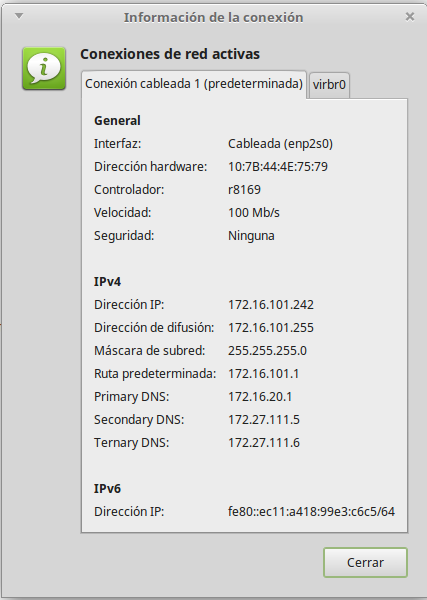

# La red en Debian GNU/Linux 
- [La red en Debian GNU/Linux](#la-red-en-debian-gnulinux)
  - [Introducción](#introducción)
    - [Nombre de las tarjetas](#nombre-de-las-tarjetas)
    - [Network Manager](#network-manager)
    - [Netplan vs ifupdown](#netplan-vs-ifupdown)
    - [Configuración con ifupdown](#configuración-con-ifupdown)
    - [Accions més comuns](#accions-més-comuns)
  - [Configurar la xarxa](#configurar-la-xarxa)
    - [Configuració de la xarxa amb Network Manager](#configuració-de-la-xarxa-amb-network-manager)
    - [Configuració de la xarxa amb ifupdown](#configuració-de-la-xarxa-amb-ifupdown)
    - [Configuració con systemd-networkd](#configuració-con-systemd-networkd)
      - [Más información](#más-información)
    - [Configuració en Virtualbox](#configuració-en-virtualbox)
    - [Detectar problemes](#detectar-problemes)
  - [Enrutament](#enrutament)
    - [Habilitar l'enrutament](#habilitar-lenrutament)
    - [Configurar NAT en sistemes amb ifupdown i nftables](#configurar-nat-en-sistemes-amb-ifupdown-i-nftables)
  - [Solucionar problemes de conectivitat](#solucionar-problemes-de-conectivitat)

## Introducción
La mayoría de sistemas GNU/Linux con entorno gráfico utilizan el servicio ***NetworkManager** para gestionar la red. Además todas tienen un servicio para gestionarla si la queremos configurarla directamente desde la terminal con los ficheros de configuración, sin utilizar el entorno gráfico.

Todas las distribuciones GNU/Linux basadas en Debian han configurado siempre la red desde la terminal con el paquete **ifupdown**. Este paquete permite configurarla con el servicio **networking** que guarda la configuración de la red en el fichero `/etc/network/interfaces` (aunque también se puede configurar desde el entorno gráfico con el servicio **NetworkManager**).


### Nombre de las tarjetas
En GNU/Linux las tarjetas de red se identifican como **ethX** (eth0, eth1, ...) si son tarjetas ethernet cableadas o **wlanX** si son tarjetas Wifi (en ocasiones se llaman athX si son wifis Atheros o con otros nombres dependiente del fabricante).

El problema es que el nombre que se le asigna depende de cuando se configura la tarjeta al arrancar (la primera será la _eth0_, la segunda la _eth1_) y esto podría cambiar entre uno reinicio y otro. Además algunas distribuciones, como Ubuntu, asignan siempre el mismo nombre de interfaz a cada MAC por el que si se estropea una tarjeta y la cambiamos la nueva ya no seria eth0 sino el siguiente nombre no usado. El mismo también pasa en las máquinas virtuales donde podemos cambiar las MAC de nuestras tarjetas.

Muchas configuraciones (firewall, enrutament, etc) dependen del nombre que tengan las tarjetas y si este cambia dejarán de funcionar correctamente. Para evitar el problema de no saber como se llamará cada interfaz de red, las distribuciones GNU/Linux utilizan **Predictable Network Interface Names** que asigna identificadores estables a las interfaces de red basándose en el tipo (local *Ethernet, *WLAN, *WWAN, etc).

El nombre que reciben las tarjetas depende del tipo (**en...** para las ethernet con cable, **wl...** para las _wireless_ o **lo** para la interfaz *loopback*). El resto del nombre depende de donde está instalada (**p** si está *"pinchada"* en un puerto PCI, USB, etc, la tarjeta se llamará **enpXsY**; **o** si está en la placa y se llamará **enoX**). En las máquinas de VirtualBox la primera suele ser la **emp0s3** y el resto a partir de la **enp0s8**, ...

### Network Manager
Si nuestra distribución es Debian o está basada en él (como Ubuntu, Linux Mint, Lliurex, ...) y tenemos entorno gráfico el servicio responsable de la red será por defecto lo **Network Manager**, aunque podemos configurar el sistema para gestionar la red sin este servicio, utilizando *netplan* o *ifupdown*. 

Para ver o cambiar la configuración podemos pulsar con el ratón sobre el icono de la red y elegir la opción de **Configuración de la red**. Esto abre el editor del Network Manager:



### Netplan vs ifupdown
Per a configurar la xarxa des de la terminal s'utilitzen diferents sistemes segons la distribució utilitzada: les distribucions _Debian_ utilitzen **ifupdown** i les _Ubuntu_ utilitzen **netplan**.

Les principals diferències entre els dos sistemes són:
* el fitxer de configuració en _ifupdown_ es de text pla (**`/etc/network/interfaces`**) i en _netplan_ és un fitxer _YAML_ que es troba dins de **`/etc/netplan/`**
* el servei que gestiona la xarxa  en _ifupdown_ és **`networking`** i en _netplan_ **`systemd-networkd`**
* per a activar o desactivar una interficie el  en _ifupdown_ s'utilitzen els comandos `ifup` i `ifdown` i en _netplan_:
```bash
    ip link set $targeta up
    ip link set $targeta down
```
* per a vore o configurar temporalment la xarxa en  en _ifupdown_ tenim el comando **`ifconfig`** i en _netplan_ s'ha substituit per **`ip`**
* en _netplan_ hi ha una nova comanda, **networkctl**, per a veure què dispositius tenim. Amb el paràmetre `status` ens dóna la configuració de cadascun:


Si li posem el nom d'una targeta ens dona la informació de la mateixa:


### Configuración con ifupdown

Para mostrar los dispositivos de red y su configuración utilizaremos:

```
$ ip addr show
$ ip link show
```


Para ver las rutas configuradas y la puerta de enlace tenemos el comando `ip route`:


Nos indica que:
* todos los paquetes con destino la red 172.16.20.0/24 saldrán por la tarjeta ***enp0s3**
* todos los paquetes con destino la red 192.168.100.0/24 saldrán por la tarjeta ***enp0s8**
* el resto de paquetes irán a la puerta de enlace (172.16.20.1) para tarjeta ***enp0s3**

Y para ver el DNS muestramos el contenido del fichero `/etc/*resolv.*conf`:


En este caso tenemos como DNS principal 127.0.0.1 (es decir esta máquina) y como secundario 8.8.8.8. No es conveniente modificar aquí los DNS porque este fichero es sobrescrito por los servicios que configuran la red.

### Accions més comuns
El comandament `ip` ens permeten canviar al nostra configuració temporalment (per a canviar-la definitivament hem de fer-ho en els fitxers de configuració):
* desactivar una interfície de xarxa:
  * ip: `ip link set enp0s3 down`
* volver-la a activar:
  * ip: `ip link set enp0s3 up`
* afegir una nova IP a una interfície:
  * ip: `ip addr add 192.168.100.5/24 dev enp0s3`
* eliminar-la IP:
  * ip: `ip addr del 192.168.100.5/24 dev enp0s3`
* canviar la porta d'enllaç (per exemple que siga la 192.168.1.1):
  * ip: `ip route add default via 192.168.1.1`


## Configurar la xarxa
Tots els canvis que fem amb el comando `ip` són temporals i es perden quan reiniciem la xarxa. El servei de xarxa (anomenat **networking** en ifupdown i **systemd-networkd** en netplan), quan s'inicia configura la xarxa amb el contingut del fitxer de configuració (`/etc/network/interfaces` en ifupdown. Per tant, per a canviar la configuració permanentment hem de canviar-la en aquest fitxer.

Ací veurem com configurar la xarxa en:
* [sistemes amb entorn gràfic, amb Network Manager](#configurtació-de-la-xarxa-amb-Network-Manager)
* [sistemes amb ifupdown](#configuraci%C3%B3-de-la-xarxa-amb-ifupdown)
* [sistemas systemd-networkd](#configuració-con-systemd-networkd)
* [Configuració prèvia de Virtualbox](#configuraci%C3%B3-en-virtualbox)

### Configuració de la xarxa amb Network Manager
Per a canviar la configuració podem prémer amb el ratolí sobre la icona de la xarxa i triar l'opció de **Editar les connexions**. AIxò obri l'editor del Network Manager (també es pot obrir des de la terminal amb `nm-connection-editor`):


Al seleccionar la connexió a configurar i prémer el botó **Editar** podem canviar la configuració. En concret anem a la pestanya de **Ajustes de IPv4**. L'opció per defecte és **Automàtica (DHCP)** que ens permet obtindre les dades de la connexió per DHCP sense haver de configurar res. Per a posar nosaltres la IP que vulguem triem el mètode **Manual**:


Ací podem configurar la IP, la màscara, la porta d'enllaç i els DNS i ja tenim la nostra targeta configurada.
 
### Configuració de la xarxa amb ifupdown
El fitxer de configuració de la xarxa és `/etc/network/interfaces`:


La informació que trobem és:
* auto: per a què la interfície s'active automàticament en arrancar l'equip sense haver de fer ifup.
* allow-hotplug: per a què la interfície s'active automàticament en detectar un esdeveniment en la interfície (com que es connecta el cable).
* inet dhcp: per a configurar aquesta interfície per DHCP
* inet static: per a configurar-la estàticament. Haurem d'indicar els seus paràmetres:
  * address: l'adreça IP
  * netmask: la màscara de xarxa
  * gateway: la porta d'enllaç
  * dns-nameservers: servidors DNS (separats per espai)

Un altre exemple amb 2 targetes de xarxa configurades estàticament:


Podem configurar cada interfície de forma:
- estàtica: `iface ethX inet static`
- per dhcp `iface ethX inet dhcp`

Si ho fem estàticament hem d'indicar la IP (_address_), la màscara (_netmask_), la porta d'enllaç si fa falta (_gateway_) i els servidors DNS (_dns-nameservers_). També es pot indicar la xarxa (_network_) i l'adreça de _broadcast_ però no és necessari perquè es pot calcular a partir de la IP i la màscara.

Després de modificar el fitxer de configuració hem de reiniciar el servei de xarxa (amb systemctl):
```bash
systemctl restart networking
```

o (amb el sistema d'inici SysV)
```bash
service networking restart
```

o directament executant l'script:
```bash
/etc/init.d/networking restart
```

En ocasions cal reiniciar la targeta que hem canviat amb `ifdown ethX` i `ifup ethX`.

Els servidors DNS es poden configurar també en el fitxer `/etc/resolv.conf` encara que se sobreescriu el seu contingut amb el que indiquem en `/etc/network/interfícies` en l'apartat _dns-nameservers_ en reiniciar el servei de xarxa pel que s'ha de configurar allí. Un exemple de fitxer és:


A més en el fitxer /etc/hosts podem posar els noms que el nostre propi ordinador ha de resoldre:


Si la nostra màquina té una IP fixa hauríem d'afegir-la ací també al costat del nom del host.

### Configuració con systemd-networkd

***systemd-networkd*** es un demonio del sistema que gestiona las configuraciones de red. Detecta y configura los dispositivos de red a medida que aparecen; también puede crear dispositivos de red virtuales.

Para usar ***systemd-networkd***, inicie/active `systemd-networkd.service`.

Todas las configuraciones se almacenan en ficheros en `/etc/systemd/network` del tipo: `.network`, `.netdev` y `.link`. Las opciones especificadas en los archivos de configuración distinguen entre mayúsculas y minúsculas.

***Adaptador cableado utilizando DHCP. /etc/systemd/network/wired.network***

``` bash
[Match]
Name=enp1s0

[Network]
DHCP=ipv4
```

***Adaptador cableado utilizando una IP estática. /etc/systemd/network/static.network***
```bash
[Match]
Name=enp1s0

[Network]
Address=10.1.10.9/24
Gateway=10.1.10.1
DNS=10.1.10.1
#DNS=8.8.8.8
```

#### Más información

- [Systemd-networkd wiki Debian](https://wiki.debian.org/SystemdNetworkd)
- [Systemd-networkd wiki Arch Linux](https://wiki.archlinux.org/title/Systemd-networkd_(Espa%C3%B1ol))

### Configuració en Virtualbox
Si volem configurar una màquina virtual que siga el servidor de una xarxa de màquines virtuals clients haurà de tindre al menys 2 targetes de xarxa: una 'externa' per a connectar-se a l'enterior i una interna per a cada xarxa interna de clients que vulga connectar. Cada targeta interna la configurarem en VirtualBox com a 'Xarxa interna' i li assignarem un nom (és com si fóra el nom del switch al que es connecta el seu cable). Per a la interfície externa Virtualbox ens ofereix 2 opcions:
* **Adaptador pont**: la màquina serà una més de la xarxa real i es podrà accedir a ella des de qualsevol equip de la xarxa. Per tant la seua IP ha de ser una IP de la xarxa. El problema és que la xarxa en l'aula i a casa són diferents per la qual cosa la configuració que funciona a casa no ho fa en l'aula.
* **NAT**: en aquest cas formen part d'una xarxa virtual que crea VirtualBox en la qual només estem nosaltres i el gateway que ens dóna eixida a l'exterior (amb la IP 10.0.2.2). L'avantatge és que aquesta configuració funciona en qualsevol lloc (perquè el 10.0.2.2 ens dóna eixida a l'ordinador real que ens trau en Internet) però des de fora d'aqueixa xarxa no es pot accedir a la nostra màquina (fins i tot no es pot accedir des de la màquina amfitrió).

### Detectar problemes
Si la xarxa no funciona podem veure els missatges d'inici relacionats amb la xarxa amb:
```bash
dmesg | grep eth
```
o si el nom de les nostrres targetes és enpXsY
```bash
dmesg | grep enp
```

## Enrutament
Si estem configurant un servidor de comunicacions que proporcione eixida a l'exterior a una xarxa haurà de tindre al menys 2 targetes de xarxa:
* la externa que li comunica amb l'exterior (el router o altre equip que fa de porta d'enllaç)
* una o més targetes internes conectades als switches on estan els equips de la xarxa que han d'eixir per ell

Una vegada totes les targetes estiguen correctament configurades com hem vist en l'apartat anterior, perquè els clients tinguen accés a Internet haurem de configurar l'enrutamient en el servidor, la qual cosa permetrà als paquets que arriben per les targetes internes eixir a través de la targeta externa. 

Si es tracta d'una màquina virtual la targeta interna la configurarem en VirtualBox com a 'Xarxa interna' i li assignarem un nom (és com si fóra el nom del switch al que es connecta el seu cable). Per a la interfície externa Virtualbox ens ofereix 2 opcions:
* Adaptador pont: la màquina serà una més de la xarxa real i es podrà accedir a ella des de qualsevol equip de la xarxa. Per tant la seua IP ha de ser una IP de la xarxa. El problema és que la xarxa en l'aula i a casa són diferents per la qual cosa la configuració que funciona a casa no ho fa en l'aula.
* NAT: en aquest cas formen part d'una xarxa virtual que crea VirtualBox en la qual només estem nosaltres i el gateway que ens dóna eixida a l'exterior (amb la IP 10.0.2.2). L'avantatge és que aquesta configuració funciona en qualsevol lloc (perquè el 10.0.2.2 ens dóna eixida a l'ordinador real que ens trau en Internet) però des de fora d'aqueixa xarxa no es pot accedir a la nostra màquina (fins i tot no es pot accedir des de la màquina amfitrió).

Per a configurar l'enrutament hem de fer 2 accions:
1. [habilitar l'enrutament](#habilitar-lenrutament), que es fa igual tant en ifupdown com en netplan
2. [configurar NAT](#configurar-nat-en-sistemes-amb-ifupdown-i-nftables)

### Habilitar l'enrutament
L'enrutament el que fa és redirigir a la targeta de xarxa externa el tràfic de la targeta interna amb destinació a altres xarxes (com Internet).

Per a habilitar l'enrutament editem el fitxer `/etc/sysctl.conf` i descomentem la línia:
```bash
net.ipv4.ip_forward=1
```

En sistemes amb netplan podem utilitzar el fitxer `/etc/ufw/sysctl.conf` que ho habilitarà quan iniciem el Firewal **ufw**. En CentOS ja està habilitat per defecte (si tinguerem que afegir opcions ho faríem en el fitxer `/etc/sysctl.d/99-sysctl.conf`)

Perquè faça efecte hem de recarregar la configuració amb:
```bash
sysctl -p
```

També podem habilitar-ho temporalment, fins que reiniciem la màquina, executant l'ordre
```bash
echo 1 > /proc/sys/net/ipv4/ip_forward
```

(si en comptes de echo 1 posem echo 0 ho deshabilitem).

Per a comprovar si està habilitat executem l'ordre
```bash
cat /proc/sys/net/ipv4/ip_forward
```

(si retorna 1 és que està habilitat i 0 és que està deshabilitat).


### Configurar NAT en sistemes amb ifupdown i nftables

Des de _Debian 10 (Buster)_  **[nftables](https://wiki.debian.org/nftables)** reemplaça a *iptables*. Podem continuar utilitzar els comandos _iptables_ ja que el nou framework és compatible però també podem utilitzar la sintaxis nova, amb el comando `nft`. Per a això hem d'instal·lar i activar _nftables_:

```bash
apt install nftables
systemctl enable nftables.service
```

Per a [crear les regles d'enrutament NAT](https://wiki.nftables.org/wiki-nftables/index.php/Performing_Network_Address_Translation_(NAT)) crearem una nova taula _nat_ on activem _prerouting_ i _postrouting_:

```bash
nft add table nat
```

Si volem borrar-la farem `nft add table nat`. Ara creem la cadena de postrouting:

```bash
nft add chain nat postrouting { type nat hook postrouting priority 100 \; }
```

I a continuació afegim les regles que vulgam:

```bash
nft add rule nat postrouting ip saddr 192.168.101.0/24 oif enp0s3 snat 10.0.2.20
nft add rule nat postrouting ip saddr 192.168.102.0/24 oif enp0s3 snat 10.0.2.20
```

Podem borrar totes les regles amb:

```bash
nft flush ruleset
```

Per a veure les regles que tenim establertes ara fem:

```bash
nft list ruleset
```

I per a tindre eixes regles actives al iniciar el servei hem de guardar-les en el fitxer de configuració de *nftables* en **/etc/nftables.conf**. Podem fer-ho amb:

```bash
nft list ruleset > /etc/nftables.conf
```

## Solucionar problemes de conectivitat
Cómo hemos visto hay muchas cosas a configurar para que un equipo pueda conectarse con internet. Por eso si no hay conexión los motivos pueden ser muy variados. 

Si tenemos un método de qué comprobar evitaremos "tocar" configuraciones que tenemos correctamente para probar cosas. Los pasos a hacer son:

1. **Ver la configuración de la red** de ese equipo para comprobar que todo es correcto (IP, máscara, puerta de enlace y DNS). Lo haremos con `networkctl status` (si es un cliente Windows con `ipconfig /all`)

2. **Hacer un `ping` a la puerta de enlace**. Si la configuración es correcta basura un *ping* a la puerta de enlace que nos ha mostrado el comando del paso anterior. Si falla puede ser:
 - *ip y fw están en redes diferentes*: recuerda que la ip tiene que estar en la misma red que la puerta de enlace.
 - *el cable*: el cable que sale de nuestro equipo tiene que llegar al mismo switch al que va lo de nuestra puerta de enlace. Si es una máquina virtual se tenemos que asegurar que el nombre de la tarjeta interna del cliente y del servidor es el mismo (es el nombre del switch virtual que se crea)
 - *el firewall*: el firewall de los Windows clientes (Windows 10, ...) NO permite el paso de los pings. Por eso no haremos ping al cliente sino desde el cliente al servidor. Si tenemos que hacer ping a un cliente Windows antes tenemos que añadir una regla a su firewall para permitir los paquetes ICMP (o deshabilitar el firewall mientras se utiliza el ping)

3. **Hacer un `ping` a un equipo de fuera de la red**. Si el ping anterior ha funcionado haremos un ping a un equipo de fuera, por ejemplo al 8.8.8.8 (si estamos en el instituto podemos hacerlo a nuestro servidor 172.16.20.1 porque el router no deja salir los pings fuera). Si falla es
 - *el enrutament*: nuestra puerta de enlace no se ha hecho el *enrutamiento* correctamente y tenemos que arreglarlo

4. **Hacer un `nslookup`** para comprobar el DNS. Lo haremos a algún servidor de internet (por ejemplo a *google.com*) y si estamos dentro de un dominio también a nuestro dominio. Si falla:
 - Si fallan los 2 `nslookup` es que no hemos puesto una dirección de DNS en nuestro equipo o la que hemos puesto no es un servidor DNS
 - Si falla el de nuestro dominio pero funciona el de google.com* es que nuestro DNS no es el DC de nuestro dominio y por tanto no sabe que hemos creado un dominio (por ejemplo hemos puesto 8.8.8.8 pero Google no sabe que tenemos un dominio propio)
 - Si funciona el del dominio pero falla el de *google.com* es que el DNS en nuestro DC no funciona correctamente o no tiene bien su *reenviador* (que tendría que ser, por ejemplo, el DNS de Google)

Si funcionan correctamente estas 4 cosas nuestra red está perfectamente configurada.