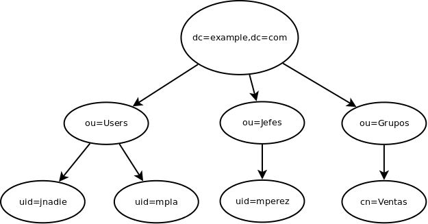
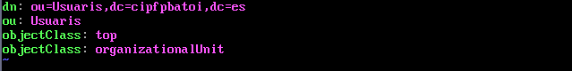
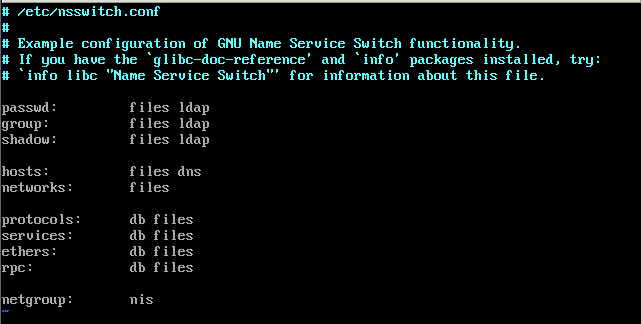
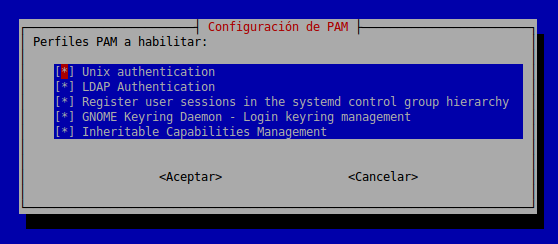
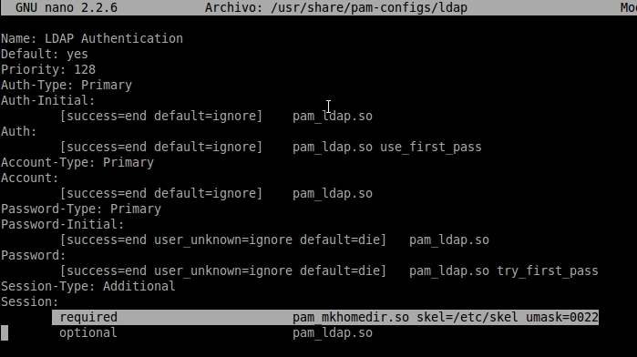
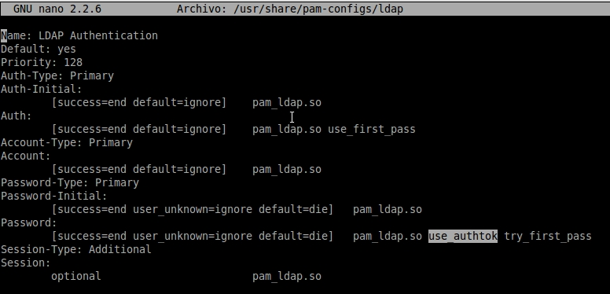

Módulo: Implantación de Sistemas Operativos
============================================

UD 12 - Centralización de la información con LDAP
--------------------------------------------------

- [Módulo: Implantación de Sistemas Operativos](#módulo-implantación-de-sistemas-operativos)
  - [UD 12 - Centralización de la información con LDAP](#ud-12---centralización-de-la-información-con-ldap)
- [Introducción a la UD 12](#introducción-a-la-ud-12)
  - [Objetivos de la unidad](#objetivos-de-la-unidad)
  - [Conceptos clave](#conceptos-clave)
  - [Conocimiento previo](#conocimiento-previo)
- [Introducción a LDAP](#introducción-a-ldap)
    - [Los objetos del directorio](#los-objetos-del-directorio)
- [Instalación y configuración](#instalación-y-configuración)
- [Configuración desde la terminal](#configuración-desde-la-terminal)
- [LDAP Account Manager](#ldap-account-manager)
- [phpldapadmin y otros](#phpldapadmin-y-otros)
    - [Otras herramientas](#otras-herramientas)
- [Configuración del cliente LDAP](#configuración-del-cliente-ldap)
- [Instalación en el cliente](#instalación-en-el-cliente)
    - [Configuración del cliente ldap](#configuración-del-cliente-ldap-1)
- [Configuración de NSS y PAM](#configuración-de-nss-y-pam)
    - [Configuración del servicio NSS](#configuración-del-servicio-nss)
    - [Configuración de PAM](#configuración-de-pam)
- [Ajustes de la configuración](#ajustes-de-la-configuración)
    - [Perfiles móviles](#perfiles-móviles)
- [Proyecto de clase](#proyecto-de-clase)
  - [Caso práctico](#caso-práctico)
- [Retroalimentación](#retroalimentación)
    - [Configurar el servidor](#configurar-el-servidor)
    - [Configurar el dominio](#configurar-el-dominio)
    - [Configurar el cliente](#configurar-el-cliente)
- [Actividades de ampliación](#actividades-de-ampliación)
  - [Actividad de ampliación 1](#actividad-de-ampliación-1)
- [Retroalimentación](#retroalimentación-1)
  - [Actividad de ampliación 2](#actividad-de-ampliación-2)
- [Retroalimentación](#retroalimentación-2)
- [Bibliografía](#bibliografía)
  - [Bibliografía](#bibliografía-1)

Introducción a la UD 12
=======================

Objetivos de la unidad
----------------------

Los objetivos a alcanzar en esta unidad de trabajo son los siguientes:

-   Implementar dominios.
-   Administrar cuentas de usuario y cuentas de equipo.
-   Centralizar la información personal de los usuarios del dominio
    mediante el uso de perfiles móviles y carpetas personales.
-   Crear y administrar grupos.
-   Organizar los objetos del dominio para facilitar su administración.
-   Utilizar máquinas virtuales para administrar dominios y verificar su
    funcionamiento.
-   Incorporar equipos al dominio.
-   Bloquear accesos no autorizados al dominio.

Conceptos clave 
---------------

Los conceptos más importantes de esta unidad son:

-   LDAP
-   Configuración de un servidor LDAP
-   Administración del directorio
-   Configuración de un cliente LDAP

Conocimiento previo 
-------------------

Antes de comenzar esta unidad de trabajo el alumno debería saber:

-   cómo utilizar software de virtualización para crear máquinas virtuales
-   cómo utilizar la terminal para realizar tareas básicas en una máquina

Introducción a LDAP 
===================

LDAP son las siglas de *Lightweight Directory Access Protocol* (Protocolo Ligero de Acceso a Directorios) y es un protocolo cliente-servidor que permite el acceso a un servicio de directorio ordenado y distribuido para buscar información en la red.

Un directorio es una base de datos especial donde las consultas son frecuentes pero las actualizaciones no tanto. Sus datos son objetos que tienen atributos y están organizados de forma jerárquica. Un ejemplo sería el directorio telefónico, que consiste en una serie de nombres (de personas y empresas) que están ordenados alfabéticamente por poblaciones, y cada nombre tiene como atributos una dirección y un número de teléfono.

El directorio se organiza como un árbol y tiene una entrada para cada objeto que almacena. Cada entrada consta de un conjunto de atributos y un atributo tiene un nombre (el tipo de atributo) y uno o más valores.

LDAP puede usarse para muchas cosas. Nosotros lo usaremos para realizar la autentidicación centralizada  de los usuarios de nuestra red (entre otras cosas almacenaremos la información de autenticación: usuario y contraseña) pero podría usarsepara gestionar libretas o calendarios compartidos, gestionar una infraestructura de clave pública (PKI), ...

Hay muchas implementaciones del protocolo LDAP, tanto libres como privativas. Algunas de las más usadas son:

-   Active Directory: es la implementación que utiliza Microsoft para sus dominios
-   openLDAP: es una implementación libre y es la más usada en sistemas GNU/Linux
-   Otras: Apache DS, Oracle Internet Directory, Novell Directory Services, etc.

### Los objetos del directorio

Un directorio es como un árbol cuya raíz es un dominio (un objeto de tipo DC) y del que cuelgan los diferentes objetos. Tenemos todo tipo de objetos pero los más comunes son:

-   **dominio**: es el objeto raíz del directorio
-   **unidades organizativas (ou)**: son contenedores de otros objetos y nos permiten organizar los objetos
-   **usuarios**: representan a personas de nuestra organización
-   **grupos**: son agrupaciones de usuarios
-   otros objetos: equipos, impresoras, ...

Un ejemplo de directorio sería:

LDAP suele usar nombres DNS para estructurar los niveles más altos de la jerarquía (DC). Por debajo aparecen entradas que representan unidades organizativas, personas, impresoras, grupos, etc.

Cada objeto tiene un identificador único llamado Nombre Distinguido (***Distinguished Name*, DN**) que consta de su **Relative Distinguished Name** (RDN) construido por el atributo identificativo del objeto, seguido del DN del objeto padre. Si lo comparamos con ficheros el RDN sería como el nombre del fichero y el DN su nombre completo, incluyendo la ruta (que sería el nombre completo del directorio que lo contiene, que es su objeto padre).

En el esquema anterior, el DN del objeto jnadie sería:

    uid=jnadie,ou=Users,dc=example,dc=com

y su RDN sería simplemente:
    
    uid=jnadie

Habitualmente se utiliza el formato LDIF para describir un objeto. En él se define el DN del objeto en la primera línea seguido del RDN y demás atributos del objeto, cada uno en una ínea:

    dn: uid=jnadie,ou=Users,dc=example,dc=com\
        uid: jnadie\
        uidNumber: 5012\
        cn: Juan Nadie\
        givenName: Juan\
        sn: Nadie\
        telephoneNumber: +34 888 555 6789\
        telephoneNumber: +34 888 555 1232\
        mail: jnadie@example.com\
        manager: uid=cperez,ou=Jefes,dc=example,dc=com\
        objectClass: inetOrgPerson\
        objectClass: organizationalPerson\
        objectClass: person\
        objectClass: top

Como veis, el DN se construye como el nombre de un fichero pero de derecha a izquierda en vez de izquierda a derecha (el elemento raíz está a la derecha y vamos descendiendo hasta el objeto en cuestión que está a
la izquierda).

En cada atributo lo que aparece antes del símbolo ":" es el nombre del atributo y después su valor. Algunos nombres de atributo son:

-   **dn**: Distinguished Name. Siempre está en la primera línea
-   **dc**: Domain Component. Es una parte del dominio. Si hay más de un nivel (lo habitual) habrá más de un atributo de. Por ejemplo www.google.es (3 niveles) se expresaría como dc=www,dc=google,dc=es
-   **cn**: Common Name (ej.: Juan Nadie)
-   **givenName**: nombre de pila (Juan)
-   **sn**: apellidos (Nadie)
-   **ou**: unidad organizativa
-   **object class**: tipo de objeto. En función de su tipo tendrá unos atributos u otros (por ejemplo un objeto persona tendrá nombre, apellidos, teléfono, ... mientras que un objeto grupo tendrá nombre, miembros, ...). Los tipos de objetos que tenemos y qué atributos tiene cada tipo viene definido por el **esquema** que estemos usando. Un objeto puede tener más de un tipo (por lo que tendrá los atributos definidos en los esquemas de todos ellos).

Instalación y configuración 
===========================

Los paquetes que tenemos que instalar en el servidor para instalar openLDAP son **slapd** y **ldap-utils**. El primero es el servicio LDAP y el segundo utilidades para gestionar el dominio. En el caso de CentOS el paquete a instalar es **openldap** (aunque a partir de la versión 8 de RHEL este paquete ya no se incluye en los repositorios y habrá que descargar el código fuente, compilarlo e instalarlo a mano como se indica en la [web de openLdap](http://www.openldap.org/doc/admin24/install.html), o bien utilizar algún repositorio alternativo).

Al instalar (o reinstalar) el servicio LDAP se nos pide la contraseña del administrador y se crea un directorio cuya raíz es **nodomain** y que incluye el cn **admin**. Para crear un nuevo directorio con nuestros datos ejecutaremos **dpkg-reconfigure slapd**.y nos pedirá la siguiente información:

-   el nombre del dominio LDAP (si no lo proporcionamos será *nodomain*)
-   el nombre de nuestra organización (es informativo y por eso puede tener espacios u otros caracteres)
-   la contraseña del administrador del dominio
-   el motor de base de datos a utilizar (se recomienda el MDB)
-   si queremos o no que se borre el directorio si desinstalamos el programa
-   si queremos mover la base de datos antigua porque no interfiera con la que se creará ahora. La antigua se moverá a /var/backups
-   si queremos que se pueda usar el protocolo LDAPv2. Sólo lo haremos si tenemos programas o equipos muy antiguos

Esto crea automáticamente el objeto raíz del directorio con el nombre de nuestro dominio y el objeto administrador del dominio (usuario **admin**) con la contraseña proporcionada. Podemos volver a ejecutarlo cuando queramos y se creará un nuevo directorio.

[installLDAP.ogv](./media/installLDAP.ogv)

Configuración desde la terminal 
===============================

Algunos comandos para trabajar con LDAP:

-   **slapcat**: muestra todo el contenido del directorio en formato LDIF
-   **ldapadd**: permite añadir nuevos nodos al directorio. Sus parámetros más importantes son:
    -   -D “dn del usuario”: para especificar las credenciales del usuario que añade el nodo. En nuestro caso será admin (pondremos -D “dn=admin,dc=nuestroDominio,dc=lan“)
    -   -W: para que nos pida la contraseña en vez de escribirla en la orden
    -   -f fichero: nombre del fichero con la información del nodo a crear en formato LDIF
-   **ldapdelete**: elimina un objeto del directorio
-   **ldapsearch**: busca objetos en el directorio
-   **ldappasswd**: cambia la contraseña de un usuario

Por ejemplo, para borrar todo nuestro directorio ejecutamos la orden:

    ldapdelete -r -D "dn administrador" -W "dc=nuestroDominio,dc.lan”

Para cambiar la contraseña de un usuario:

ldappasswd -D "dn del administrador" -W -s nueva\_contraseña "dn del usuario"

(ATENCIÓN: "*dn administrador*" quiere decir el dn de tu administrador: **cn=admin,dc=nuestroDominio,dc=lan**, o el que sea)

Ejemplo: tenemos que crear una OU denominada *Usuarios* en nuestro directorio llamado *cipfpbatoi.es*. El único atributo obligatorio de una OU es su nombre (atributo llamado *ou*) y es un objeto de las clases
*top* y *organizationalUnit*. El RDN de este tipo de objeto es su único atributo: *ou*.

Lo primero que tenemos que hacer es crear un fichero que denominaremos *ou\_usuarios.ldif* con la información de la nuestra OU:

A continuación ejecutamos la orden ldapadd para crearla:

    ldapadd -D “cn=admin,dc=cipfpbatoi,dc=se” -W -f OU\_usuarios.ldif

Con **-D** le indicamos las credenciales de quien crea el nodo (admin), con **-W** le decimos que nos pida la contraseña en vez de escribirla en el comando. Con **-f** le indicamos el fichero que contiene la
información.

Para eliminar esta ou ejecutaremos el comando ldapdelete:

    ldapdelete -D “cn=admin,dc=cipfpbatoi,dc.es” -W “OU=Usuarios,dc=cipfpbatoi,dc.es”

Cada tipo de objeto tendrá unos atributos obligatorios y otros opcionales y esto viene definido en el esquema que sigue dicho objeto (indicado por su objectClass). Un objeto puede (y suele) tener varios objectClass por lo que tiene atributos definidos en varios esquemas.

Los principales objetos con que trabajaremos son:

+--------------------+--------------------+--------------------+--------------------+
| **Objeto**         | **RDN**            | **Atributos**      | **objectClass**    |
+--------------------+--------------------+--------------------+--------------------+
| Unidad             | ou                 | ou: nombre         | organizationalUnit |
| organizativa       |                    |                    |                    |
+--------------------+--------------------+--------------------+--------------------+
| Grupo              | cn                 | cn: nombre del     | posixGroup         |
|                    |                    | grupo\             |                    |
|                    |                    | gidNumber: gid\    |                    |
|                    |                    | memberUid: uid de  |                    |
|                    |                    | los miembros,      |                    |
|                    |                    | separados por coma |                    |
+--------------------+--------------------+--------------------+--------------------+
| Usuario            | cn                 | uid: login del     | inetOrgPerson\     |
|                    |                    | usuario\           | posixAccount\      |
|                    |  o                 | uidNumber: nº id\  | shadowAccount      |
|                    |                    | gidNumber: nº      |                    |
|                    | uid                | grupo principal\   |                    |
|                    |                    | sn: apellidos, ej. |                    |
|                    |                    | Martínez Puig\     |                    |
|                    |                    | cn: nombre para    |                    |
|                    |                    | mostrar del        |                    |
|                    |                    | usuario\           |                    |
|                    |                    | homeDirectory:     |                    |
|                    |                    | ruta de su home\   |                    |
|                    |                    | loginShell: shell  |                    |
|                    |                    | del usuario        |                    |
|                    |                    | (/bin/bash o el    |                    |
|                    |                    | que sea)\          |                    |
|                    |                    | \                  |                    |
|                    |                    | Además podemos     |                    |
|                    |                    | especificar muchos |                    |
|                    |                    | más atributos      |                    |
|                    |                    | cómo:\             |                    |
|                    |                    | - givenName:       |                    |
|                    |                    | nombre, ej. Jorge\ |                    |
|                    |                    | - userPassword:    |                    |
|                    |                    | contraseña\        |                    |
|                    |                    | - displayName:     |                    |
|                    |                    | nombre para        |                    |
|                    |                    | mostrar, ej. Jorge |                    |
|                    |                    | Martínez Puig\     |                    |
|                    |                    | - mail: su e-mail\ |                    |
|                    |                    | - shadowExpire,    |                    |
|                    |                    | shadowFlag,        |                    |
|                    |                    | shadowWarning,     |                    |
|                    |                    | shadowMin,         |                    |
|                    |                    | shadowMax, …:      |                    |
|                    |                    | opciones de        |                    |
|                    |                    | password           |                    |
+--------------------+--------------------+--------------------+--------------------+

IMPORTANTE: para evitar conflictos con los usuarios y grupos locales que se numeran a partir del 1000 nosotros utilizaremos números a partir de **10000** para los uidNumber y gidNumber de usuarios y grupos del directorio.

Los esquemas que podemos utilizar son los incluidos en directorio del servidor LDAP /etc/openldap/schema. Algunos de los más comunes son:

-   /etc/openldap/schema/core.schema
-   /etc/openldap/schema/cosine.schema
-   /etc/openldap/schema/inetorgperson.schema
-   /etc/openldap/schema/nis.schema

Si además vamos a necesitar que el servidor LDAP almacene cuentas Samba tendremos que asegurarnos que LDAP conoce la estructura y los datos necesarios de una cuenta Samba mediante la inclusión del correspondiente fichero de esquema samba.schema.

LDAP Account Manager
====================

Como hemos visto la gestión del directorio desde la terminal es bastante engorrosa. Por ello existen multitud de herramientas (normalmente vía web) que nos permiten gestionar nuestro directorio gráficamente.

Para utilizar este programa instalamos el paquete **ldap-account-manager** y ya podemos abrir desde el navegador en[http://localhost/lam](http://localhost/lam.%20). En nuestro caso como no lo abriremos desde el servidor (no tenemos navegador ni entorno gráfico) sino desde otra máquina en vez de localhost habremos de poner la IP o el nombre de nuestro servidor LDAP.

La configuración inicial puede hacerse desde el entorno gráfico en la opción LAM configuration. Lo primero que deberíamos que configurar es la contraseña a utilizar en este programa que por defecto es lam.

A continuación configuraremos el acceso a nuestro servidor (su IP o nombre), el dominio, el dn del administrador y las OU que utilizar por defecto para crear nuevos usuarios, grupos y equipos. No hace falta configurar los UID y GID porque por defecto ya utiliza valores superiores a 10000.

Una vez configurado ya podríamos crear nuestros objetos:

[lam.ogv](./media/lam.ogv)

Tras crear los objetos hacemos un slapcat para comprobar que se han creado correctamente:

[slapcat.ogv](./media/slapcat.ogv)

phpldapadmin y otros
====================

Otra herramienta web muy utilizada para administrar el directorio es phpLDAPAdmin. Lo instalamos con el paquete del mismo nombre.

Lo primero a hacer es ajustar el archivo de configuración para adaptarlo a nuestras necesidades. Este archivo es /etc/phpldapadmin/config.php.

Las opciones a modificar son:

-   Modificar la base o raíz del Directorio. $servers-\>setValue('server', 'base',array('dc=cipfpbatoi,dc=es'));
-   Configurar el usuario administrador por defecto. $servers-\>setValue('login', 'bind\_id', 'cn=admin,dc=cipfpbatoi,dc=es');
-   Otro parámetro que se puede configurar en este archivo es el nombre de la base de datos $servers-\>setValue('server', 'name', 'Gestión de Usuarios del Aula');
-   También es conveniente cambiar los números de gid y uid que se darán a los objetos que se crean para evitar que puedan coincidir con grupos y usuarios locales. Nosotros utilizaremos números a partir del 5000. Para lo cual añadiremos esta línea: $servers-\>setValue('auto\_number','min',array( 'uidnumber'=\>5000, 'gidnumber'=\>5000));

Ahora podemos acceder a esta herramienta desde el navegador con http://mi\_servidor\_ldap/phpldapadmin, y después de validarse con el usuario administrador, ya podremos acceder a la información de la base de datos.

ATENCIÓN: cuando añadimos un usuario desde phpldapAdmin utiliza por defecto como RDN el cn del usuario en vez de la uid. Lo que tenemos que hacer es añadir en vez de un usuario un objeto por defecto (objeto Predeterminado o Default) y allí elegir sus objectClass (account, posixAccount y shadowAccount) y su RDN (userid, perque phpldapadmin denomina así al atributo uid).

### Otras herramientas

Existen multitud de herramientas para gestionar nuestro directorio. Una de ellas es Webmin que nos permite realizar algunas acciones pero no es tan completo ni fácil de usar como los 2 vistos anteriormente.

Otras herramientas (también de software libre como todas las que hemos visto) son GOsa o Web2ldap.

Configuración del cliente LDAP
==============================

Una vez instalado y configurado el servidor LDAP, nos queda configurar nuestros clientes de red para que utilicen el servidor para autentificar los usuarios.

De momento, configuraremos la validación de usuarios desde equipos GNU/Linux. En temas posteriores (integración de sistemas heterogéneos) ya veremos como hacerlo para clientes Windows.

En el proceso de validación de los usuarios en el cliente mediante un servidor LDAP van a participar dos servicios:

-   **NSS** (Name Service Switch): permite a las aplicaciones obtener información sobre usuarios, grupos, contraseñas, etc de diferentes fuentes. Lo habitual es obtener esta información de archivos locales (/etc/passwd, /etc/group y /etc/shadow), pero NSS permite utilizar además otras fuentes como un servidor NIS o un servidor LDAP
-   **PAM** (Pluggable Authentication Module): permite configurar en el sistema varios métodos de autenticación de usuarios. El método de autenticación por defecto es el de usuario y contraseña pero PAM permite utilizar otros métodos como un servidor LDAP, identificación biométrica (como la huella digital, la voz, etc). La mayor parte de las aplicaciones y herramientas en los sistemas GNU/Linux utilizan PAM y esto permite cambiar el método de autenticación sin hacer cambios directamente en las aplicaciones.

Instalación en el cliente
=========================

Los paquetes necesarios para configurar un equipo como cliente LDAP son:

-   **libnss-ldap**: permite al servicio NSS obtener información administrativa a través de un servidor LDAP
-   **libpam-ldap**: permite al servicio PAM utilizar un servidor LDAP para autenticar usuarios
-   **nscd**: este servicio implementa una caché para acelerar el uso de LDAP y así evitar continuas consultas al servidor por parte del cliente. Este paquete no es necesario, pero sí recomendable.

La instalación de este paquetes también nos seleccionará otros adicionales cómo: **auth-client-config,** **ldap-auth-client** y **ldap-auth-config**.

### Configuración del cliente ldap

La instalación de los paquetes finaliza con la configuración del módulo de autentificació de ldap (**ldap-auth-config**). La configuración que hacemos se almacena en el fichero **/etc/ldap.conf**. Este se utiliza
tanto por el servicio de autenticación PAM como por el servicio de nombres NSS. Si posteriormente tenemos que cambiar esta configuración podemos editar el fichero o, más fácilmente, reconfigurarlo con el comando **dpkg-reconfigure ldap-auth-config**.

La configuración de este paquete nos pide la siguiente información:

-   el nombre o IP del servidor LDAP. Nos recomienda utilizar la IP para
    evitar problemas con el DNS. (NOTA: utilizar el protocolo ldap, no ldapi)
-   El DN de nuestro dominio
-   la versión del protocolo LDAP a utilizar (la misma que configuramos en el servidor)
-   si queremos que las contraseñas se guarden en un archivo independiente al que sólo root tenga acceso (como pasa con /etc/shadow)
-   si queremos que sea obligatorio identificarse para hacer consultas al directorio
-   el DN del administrador de LDAP (el que configuramos en el servidor)
-   su contraseña

Configuración de NSS y PAM
==========================

### Configuración del servicio NSS

El siguiente paso es configurar el servicio NSS editando el fichero ***/etc/nsswitch.conf***:

En este fichero se configura dónde se debe buscar la información de los diferentes tipos de objetos, entre ellos:

-   Los nombres de usuario, especificados en el archivo de configuración con la línea que empieza por **passwd**
-   Los nombres de grupos, especificados en el archivo de configuración con la línea que empieza por **group**
-   Las contraseñas de usuario, especificadas en el archivo de configuración con la línea que empieza por **shadow**

Indicaremos que la información sobre nombres de usuario, grupos y contraseñas primero se busque en los archivos locales (files o compat) y después mediante el servicio LDAP (ldap). Este orden es importante puesto que si se busca primero en LDAP, si por algún motivo no se puede acceder al servidor LDAP para realizar la validación, no sería posible acceder al equipo.

Por lo tanto las líneas en nuestro archivo /etc/nsswitch.conf quedarían como muestra la imagen anterior.

Respecto a las máquinas (hosts) primero las busca en el fichero local (/etc/hosts) y si no las encuentra pregunta al DNS. Esto no es necesario cambiarlo.

Podemos probar que NSS está funcionando con la orden **getent** (primeramente tendremos que reiniciar el cliente porque tengan efecto los cambios hechos):

    getent passwd

Esta orden mostrará por pantalla la información de usuarios contenida en el archivo /etc/passwd. Si funciona NSS, además de la lista de usuarios locales, mostrará información de los usuarios creados en el directorio LDAP del servidor.

Podemos consultar el logs del sistema referentes a validación, **/var/log/auth.log**, para comprobar y ver posibles problemas.

### Configuración de PAM

El siguiente paso sería configurar PAM para que utilice el servicio proporcionado por LDAP. Los archivos de configuración de PAM se almacenan en el directorio **/etc/palmo.d**.

Podemos configurar PAM sin editar manualmente los archivos de configuración con el comando **pam-auth-update**:

Tenemos que asegurarnos que tenemos marcada la opción de LDAP Authentication (también la de Unix que es la autenticación por defecto). Lo normal es que esto se haya configurado automáticamente al instalar los paquetes.

Para probar que PAM funciona correctamente podemos utilizar el comando **pamtest** (se encuentra en el paquete libpam-dotfile que tendremos que instalar, pero atención que se encuentra en los repositorios universe).

Es necesario especificar 2 parámetros: el servicio para el que queremos probar la autenticación mediante PAM y el usuario que queremos validar en el servicio. Por ejemplo, para comprobar la validación del usuario batoi a través del servicio de cambio de contraseñas se ejecutaría laorden:

    pamtest passwd batoi

Podemos probar otros servicios como login o ssh. Una vez configurado el servicio.

En cualquier caso también podemos probar que el usuario se autentifica correctamente iniciando sesión con este usuario desde la terminal (desde el entorno gráfico aún no podrá iniciar sesión porque no se puede crear su perfil de usuario).

Ajustes de la configuración
===========================

Todavía quedan para hacer un par de ajustes para mejorar el funcionamiento de LDAP en el cliente.

Tendríamos que hacer que la primera vez que un usuario del directorio LDAP se valida en un equipo cliente se cree de forma automática su directorio home en el equipo con un perfil por defecto igual que sucede la primera vez que iniciamos sesión con un usuario local.

Para eso vamos a modificar el archivo de configuración de PAM **/usr/share/pam-configs/ldap** y añadiremos como primera línea del bloque “Session” la siguiente línea:

    required        pam\_mkhomedir.so skel=/etc/skel umask=0022

En ella especificamos:

-   que se cree el directorio del usuario la primera vez que inicia sesión
-   que se copie en el mismo el perfil por defecto (que se encuentra en /etc/skel. Este perfil incluye archivos ocultos (como .profile, .bash\_history, ...) y, si iniciamos sesión en el entorno gráfico, también el resto de carpetas por defecto (Descargas, Documentos, Escritorio, etc).
-   que se establezca su máscara en 0022, lo que dará permisos 755 y 644 para nuevos directorios y ficheros respectivamente en esa carpeta. Si quisiéramos por ejemplo que el resto de usuarios no tengan acceso pondríamos umask 0027

Si no hacemos esto, tendríamos que crear manualmente en todos los equipos clientes los directorios home de todos los usuarios LDAP.

Otro aspecto que es aconsejable ajustar es que la configuración por defecto no permite que un usuario LDAP puede cambiar su contraeña desde el equipo cliente con la orden passwd.

Para permitirlo tenemos que quitar el parámetro use\_authtok en la línea donde aparece en la sección Password en el mismo archivo, **/usr/share/pam-configs/ldap**:

La línea:

    [success=end user\_unknow=ignore default=die] pam\_ldap.so use\_authtoktry\_first\_pass

pasaría a:

    [success=end user\_unknow=ignore default=die] pam\_ldap.so try\_first\_pass

Para que estos cambios tengan efecto debemos volver a ejecutar el comando

    pam-auth-update

### Perfiles móviles

Lo que hemos hecho crea los home de los usuarios del dominio en el equipo en que inician la sesión. Una mejora sería que el directorio home de cada usuario no sea un directorio local del equipo cliente sino un directorio compartido en el servidor para que cuando un usuario inicia sesión en cualquier equipo de la red tenga acceso automáticamente a su directorio home creado en el servidor.

Esto es lo que haremos en la siguiente unidad.

Proyecto de clase
=================

Caso práctico 
-------------

Ya tenemos nuestro servidor (en realidad 3 servidores) instalado y configurado. Ahora es el momento de crear el dominio y los diferentes usuarios.

El primer paso será instalar y configurar el dominio. A continuación crearemos las OU, los grupos y los usuarios del mismo. Aún no serán usuarios móviles (esto lo dejaremos para la próxima Unidad).

Por último configuraremos el cliente del aula que ya tenemos hecho (en el sistema GNU/Linux) para que puedan iniciar sesión e el mismo los usuarios del dominio. Probaremos a iniciar sesión con un usuario del dominio tanto en una terminal como en el sistema gráfico.

Retroalimentación 
=================

### Configurar el servidor

Lo primero que haremos es seleccionar con qué servidor de los 3 que hemos instalado nos quedaremos. Vamos a elegir el servidor Ubuntu o el Debian (como prefiráis).

Ahora vamos a configurarlo como servidor LDAP. Recordad que el nombre del dominio  será aulaESO-xx.lan, o si queremos diferenciarlo del de Windows le podemos llamar aulaESOubuntu-xx.lan o aulaESOdebian-xx.lan.

### Configurar el dominio

A continuación crearemos las OU para nuestros objetos. Yo voy a utilizar LDAP Account Manager por comodidad y sólo voy a usar 3 OUs: Alumnos donde crearé todos mis alumnos, Profes donde crearé los profesores y Grupos donde crearé los grupos. En LAM configuraré como OU por defecto para los grupos la de Grupos y como OU por defecto para los usuarios
Profes.

Ahora vamos a crear los grupos que usaremos: gAlum1Eso, gAlum2Eso, gAlum3Eso, gAlum4Eso, gProfesInfo, gProfesEso. Recordad que queremos utilizar gid mayores de 5000 (también con los uidNumber de los usuarios).

Por último crearemos los usuarios. Crearé todos los profesores y un par de alumnos por grupo.En el home de cada alumno en vez de algo como /home/usuario pondré algo como /home/movil/usuario de forma que tenga todos los usuarios móviles en un directorio aparte y así sea sencillo en la siguiente Unidad que sus homes se almacenen en el servidor y no e el
cliente.

Como actividad de ampliación se propone hacer un script para crear los 150 alumnos automáticamente.

### Configurar el cliente

Ahora configuraremos nuestros clientes para que validen los usuarios del dominio contra el servidor LDAP. Los pasos a realizar son:

-   instalar los paquetes para usar PAM y NSS con LDAP
-   configurar ldap-auth-config
-   configurar NSS. Una vez hecho comprobaremos que funciona correctamente con getent
-   ajustamos la configuración de /usr/share/pam-configs/ldap para que los usuarios puedan cambiar su contraseña y que se cree automáticamente su home. Podremos una máscara para que nadie más que el propietario tenga acceso a su carpeta personal

Una vez hecho todo esto abriremos una terminal en el cliente e intentaremos convertirnos en un usuario del dominio. Por ejemplo para ser jsegura ejecutaremos el comando:

    su jsegura

Comprobaremos que podemos iniciar sesión, que se crea su home y que podemos cambiar su contraseña.

Por último cerramos sesión en el cliente e intentamos iniciar sesión con un usuario del dominio. Algunos gestores de ventanas (como LightDM que usa Ubuntu) no permiten por defecto escribir el nombre del usuario sino simplemente elegirlo de la lista de usuarios locales.

En ese caso deberemos cambiar el fichero de configuración para que pida el nombre del usuario en vez de elegirlo de la lista, En caso de Ubuntu es el fichero /usr/share/lightdm/lightdm.conf.d/50-unity\_greeter.conf y en la sección [SeatDefaults] debemos poner la línea:
    
    greeter-show-manual-login=true

Actividades de ampliación 
=========================

Actividad de ampliación 1 
-------------------------

Instala y configura el dominio e el servidor CentOS además de hacerlo en el servidor Ubuntu o Debian.

Retroalimentación 
=================

Pon un nombre de dominio diferente al usado en Ubuntu o Debian, como aulaESOcentos-xx.lan.

Actividad de ampliación 2 
-------------------------

Como ya sabemos nuestros usuarios serán unos 150 alumnos de la ESO.

Realiza un script que permita automatizar la creación de dichos usuarios.

Retroalimentación 
=================

Como en el caso de Windows no vamos a proporcionaros el script sino unas indicaciones de cómo hacerlo.

Posiblemente lo más sencillo sea que el script construya en fichero LDIF con los datos de todos los alumnos y posteriormente nosotros añadiremos dicho fichero al dicrecorio con el comando ldapadd.

En este caso el bucle lo construiremos con un WHILE (en Windows usamosun bucle FOR). Un ejemplo es:

while IFS=:  read  dato1 dato2 dato3 dato4 \
do\
    echo "El primer dato es " \$dato1\
    echo "El segundo dato es " \$dato2\
    echo "El tercer dato es " \$dato3\
    echo "El cuarto dato es " \$dato4\
    echo\
done \< fichero.txt

Este script coge cada línea de un fichero llamado fichero.txt que se supone que tiene 4 campos separados por el carácter ":" (IFS=:) y guarda cada campo en las variables indicadas (dato1, ..., dato4).

A continuación muestra por pantalla cada dato en una línea y añade una línea en blanco tras el 4º dato.

Recordad que el fichero LDIF debe contener para cada usuario una línea con su DN y otra para cada atributo del mismo y luego una línea en blanco entre cada usuario.

Recordad también usar uidNumber mayores de 5000.

Bibliografía 
============

Bibliografía 
------------

-   [LDAP-Linux-Como: Introducción - TLDP-ES](https://wiki.gentoo.org/wiki/Centralized_authentication_using_OpenLDAP/es)
-   [Documentation - OpenLdap.org](https://www.openldap.org/doc/)
-   [Instalar y configurar el servidor LDAP de Linux](https://likegeeks.com/es/servidor-ldap-de-linux/)
-   [Autenticación centralizada mediante OpenLDAP](https://wiki.gentoo.org/wiki/Centralized_authentication_using_OpenLDAP/es)
-   [Gentoo Linux](https://wiki.gentoo.org/wiki/Centralized_authentication_using_OpenLDAP/es)
  

Obra publicada con [Licencia Creative Commons Reconocimiento No comercial Compartir igual 4.0](http://creativecommons.org/licenses/by-nc-sa/4.0/)