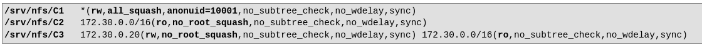
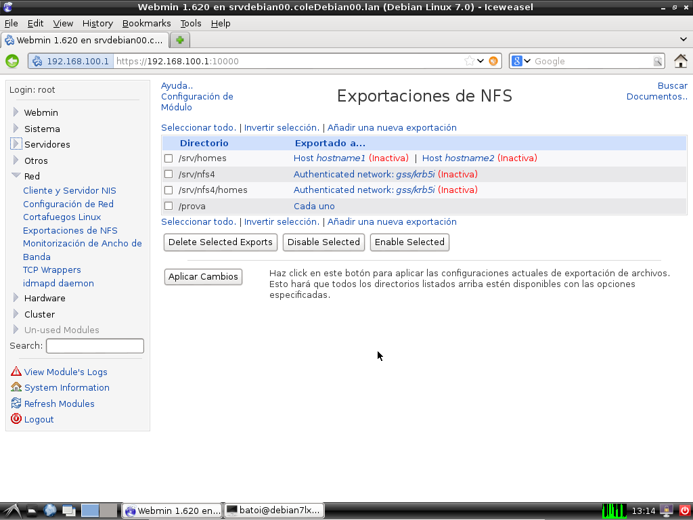
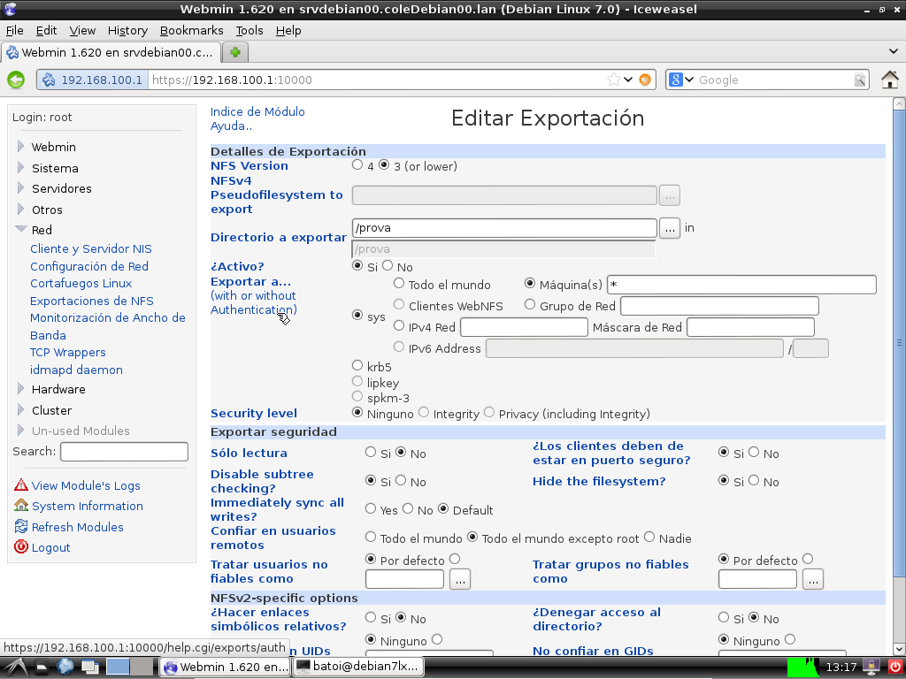

Módulo: Implantación de sistemas operativos
===========================================

UD 13 - Compartición de recursos con NFS
-----------------------------------------

* [UD 13 - Compartición de recursos con NFS](#ud-13---compartición-de-recursos-con-nfs)
* [Instalación y configuración del servidor NFS](#instalación-y-configuración-del-servidor-nfs)
* [Configuración del servidor](#configuración-del-servidor)
* [Compartir recursos](#compartir-recursos)
  * [squash](#squash)
  * [Permisos sobre las carpetas compartidas](#permisos-sobre-las-carpetas-compartidas)
  * [Compartir recursos gráficamente](#compartir-recursos-gráficamente)
  * [Perfiles móviles de usuarios LDAP](#perfiles-móviles-de-usuarios-ldap)
* [Compartición de impresoras. CUPS](#compartición-de-impresoras-cups)
  * [Instalación de CUPS](#instalación-de-cups)
  * [Acceso a una impresora desde un equipo cliente](#acceso-a-una-impresora-desde-un-equipo-cliente)
* [Proyecto](#proyecto)

## Instalación y configuración del servidor NFS


Para compartir directorios entre equipos de la red tenemos varias opciones. El protocolo **NFS** es el método utilizado como nativo en GNU/Linux. Esta opción es adecuada cuando todos los equipos que forman parte de la red utilizan el sistema GNU/Linux. Otra posibilidad es utilizar el protocolo de archivos compartidos utilizado en sistemas Microsoft llamado **SMB/CIFS** e implementado para sistemas GNU/Linux como **Samba**. La ventaja de utilizar **Samba** se que pueden acceder a los recursos compartidos con un cliente GNU/Linux o Windows.

**NFS** (*Network File System*) es un protocolo para sistemas de archivos distribuidos en una red de área local y posibilita que diferentes sistemas conectados a una misma red accedan a ficheros remotos cómo si se tratara de locales. El protocolo **NFS** está incluido por defecto en la mayoría de distribuciones Linux y también en los sistemas OSX de Apple y algunas versiones de Windows (como Windows 8 Enterprise).

El ordenador que actúa como servidor **exporta** ciertos directorios de su sistema de archivos para que los clientes tengan acceso a ellos. Para poder acceder a los archivos remotos, los clientes deben montar cada directorio exportado por el servidor en algún punto de su sistema de archivos (igual que hace con las particiones de su disco).

## Configuración del servidor

El paquete a instalar en el servidor es **nfs-kernel-server**. También se instalará el paquete **nfs-common**. El servicio **nfs-kernel-server** arranca dos demonios:

* **nfsd**: es el encargado de procesar las peticiones de los clientes para acceder a los ficheros exportados.
* **mountd**: se encarga de las peticiones de montaje de los sistemas de archivos NFS por parte de los clientes.

El fichero e que se configuran los directorios a exportar es **/etc/exports**. Sólo se pueden exportar directorios locales y que no se pueden exportar subdirectorios de un directorio exportado (a menos que se encuentran en diferentes dispositivos físicos).

## Compartir recursos

El archivo **/etc/exports** contendrá una línea por cada directorio exportado, en la cual se indicará la ruta completa al mismo seguida por ciertos parámetros que permiten especificar qué ordenadores tienen derecho a montar remotamente el directorio exportado, y con qué tipo de acceso.

Ejemplo de fichero:



dónde /srv/nfs/C1 es la ruta al directorio exportado, a continuación aparece a quien se exporta el recurso (nombres, IPs o rangos de IP -ej. 192.168.1.0/24) y entre paréntesis las opciones que especifica el tipo de acceso. Sólo se pone espacio entre un cliente y otro. Entre las diferentes opciones se pone sólo coma.

Como cliente podemos poner:

* el nombre **DNS** o la **IP** de un equipo
* comodines (\* y ?) para sustituir todo el nombre o una parte del mismo (como 192.168.221.*, 192:168.*.*o* -en este caso será accesible a todo el mundo)
* un intervalo de **IPs**, como 192.168.1.30 (las 30 primeras IP de la red 192.168.1.0)
* si tenemos un servidor **NIS** podemos poner nombre de grupos precedidos por @ (como @clientes_nfs)

Respecto a las opciones, las más comunes son (en negrita tenéis la predeterminada):

* **rw** / **ro**: modo lectura-escritura o sólo lectura
* **root_squash** / no_root_squash / all_squash: root_squash mapea los uid y gid 0 a los uid y gid anónimos (nobody o nfsnobody), es decir, que las peticiones de lectura/escritura hechos por el root cliente sobre los datos "importados" es cómo si los realizara el usuario anónimo y no el root del servidor. no_root_squash no hace esto, por lo tanto el root del cliente cuando trabaja con los datos "importados" sigue actuando como root. all_squash: mapea todos los usuarios al usuario anónimo.
* **anonuid** / **anongid**: permite establecer el uid o el gid del usuario al que realizar el mapeo de las opciones squash para que sea diferente del usuario anónimo.
* **subtree_check** / **no_subtree_check**: subtree_check comprueba los directorios superiores al compartido para verificar sus permisos. Si no se hace esa comprobación la transferencia de la lista de archivos será más rápida pero menos segura.
* **fsid=0:** significa que al montarlo en el cliente no hay que poner la ruta a la carpeta en el servidor sino que se comparte desde la raíz. Por ejemplo si queremos compartir /srv/datos/public y ponemos esta opción al montar la carpeta en el cliente pondremos que monte **servidor:/public** y no **servidor:/sv/datos/public**
* **async**: las escrituras se harán asíncronamente. lo que mejora el rendimiento pero pueden perderse datos si se corta la conexión.
* **wdelay** / **no_wdelay**: activada permite que no se escriba en disco inmediatamente para mejorar el rendimiento. Tiene que ir con la opción sync.

Otro ejemplo de fichero **/etc/exports**:

```bash
/net *.mi_empresa.com(rw) 
/srv/compartida 192.168.1.0/255.255.255.0(rw) 192.168.2.0/255.255.255.0(rw)
/prueba (ro) 
/home/jperez pc1.mi_empresa.com(rw)
/datos/ftp/public (ro)
```

En el ejemplo anterior, el servidor **NFS** exporta cinco directorios:

* **/net**: Accesible desde cualquier computadora del dominio mi_empresa.com, en modo de lectura/escritura (rw = read/write).
* **/srv/compartida**: Accesible desde cualquier computadora de las redes 192.168.1.0 y 192.168.2.0, en modo de lectura/escritura (rw = read/write).
* **/prueba**: Accesible desde cualquier equipo, en modo de sólo lectura (ro = read only)
* **/home/jperez**: Accesible sólo desde la computadora pc1.mi_empresa.com, en modo de lectura/escritura.
* **/datos/ftp/public**: Accesible desde cualquier computadora (de cualquier dominio), pero en modo de sólo lectura (ro = read only).

Después de cualquier cambio sobre el archivo **/etc/exports** tenemos que ejecutar la siguiente orden para actualizar la tabla de NFS

```bash
    exportfs -arv
```

(**-a** exporta todos los directorios, **-r** eliminará las entradas antiguas y **-v** nos mostrará el resultado en la consola)

Para reiniciar el servicio **NFS** ejecutamos la orden:

```bash
/etc/init.d/nfs-kernel-server restart
```

Podemos ver los directorios exportados por una máquina con la orden:

```bash
    showmount -e nombre_o_ip_pc
```

### squash

Los permisos que tendrá cada usuario que accede a un directorio compartido desde el cliente son los correspondientes a su **uid** en el servidor. Es decir, si el **uid** del usuario jomuoru en el equipo cliente es el 1000 tendrá sobre las carpetas compartidas en el servidor los permisos que tenga el usuario 1000 del servidor (a menos que hagamos la exportación con la opción **all_squash**).

Por ejemplo, imaginemos un directorio llamado prueba que pertenece al usuario con **uid** 1000 del servidor llamado *vperez* y al grupo con **gid** 1000 llamado profes con permisos 750. Desde el servidor veríamos algo como:

```bash
drwxr-x---  2  vperez  profes  prueba
```

Ahora exportamos este directorio y lo montamos en el cliente en una carpeta llamada prueba. En dicho cliente el usuario 1000 es juan y el grupo 1000 es alumnos. Al mirar los permisos de dicho directorio veríamos:

```bash
[drwxr-x---  2  juan  alumnos prueba]
```

Por tanto el usuario juan acaba de adquirir permisos sobre dicho directorio simplemente por tener el mismo uid que tiene el propietario del directorio en el servidor.

Todos estos problemas desaparecerán al utilizar nuestros usuarios **LDAP** ya que en ellos hemos usado valores de **UID** y **GID** superiores a 5000 y así no coincidirán con ningún usuario local del cliente ni del servidor (con **UID** y **GID** superiores a 1000 o inferiores si son usuarios o grupos del sistema).

Aunque nosotros no vamos a profundizar en las opciones de compartición de **NFS** la versión **NFSv4** sí permite la compartición en función de los usuarios utilizando diversas métodos de autentificación (kerberos con **ACLs** podría ser una).

### Permisos sobre las carpetas compartidas

Como hemos dicho las carpetas aparecerán como pertenecientes al usuario/grupo que en cada cliente coincida con el **uid/gid** del propietario en el servidor. Para evitar esto al crear la carpeta a compartir se suele cambiar su propietario a **nobody/nogroup**:

```bash
 chown nobody:nogroup /srv/compartida
```

Además si queremos que sea de lectura y escritura compartiremos la carpeta con las opciones **rw** y **all_squash** para que cualquier usuario pueda escribir en ella.

Sin embargo, si la carpeta que estamos compartiendo es para almacenar los perfiles móviles de los usuarios las opciones con las que la debemos compartir son **rw** y **no_root_squash**. Esto es porque la primera vez que el usuario inicie sesión se crea su carpeta (en este caso en el servidor) y el root del equipo cliente debe cambiar su propietario para que pertenezca al usuario que inicia la sesión para lo que debe hacer un **chown** que sólo root puede ejecutar (por lo que tiene que tener los permisos de root en el servidor que es donde se está guardando la carpeta).

### Compartir recursos gráficamente

Al igual que para **LDAP** tenemos muchas herramientas gráficas para configurar nuestro servidor **NFS**. Nosotros utilizaremos *Webmin* que ya tenemos instalado. Dentro de Red encontramos el elemento Exportaciones de **NFS**:



Desde aquí podemos modificar la configuración de los directorios exportados o exportado nuevos:



Configuración del cliente  
=========================

En el cliente el paquete a instalar es el ***nfs-common***.

Los directorios remotos se montan localmente del mismo modo que cualquier otro sistema de archivos: manualmente por medio del comando **mount**, o añadiéndolos a **/etc/fstab** para se montan automáticamente al iniciar el sistema operativo.

En los dos casos, la sintaxis para especificar un directorio remoto es la siguiente:

```bash
nombre_del_host:directorio_remoto
```

Por ejemplo, para montar manualmente el directorio */net* del equipo *srvNFS* en */usr/local* del equipo cliente, se tiene que ejecutar el siguiente comando:

```bash
mount -t nfs srvNFS:/net /usr/local
```

Si queremos que el montaje se realice automáticamente al iniciar el cliente se tiene que añadir la siguiente línea en */etc/fstab*:

```bash
srvNFS:/net /usr/local nfs rw,auto,noatime,nolock,bg,nfsvers=3,intr,actimeo=1800,rsize=8192,wsize=8192 0 0
```

Algunas opciones de mount son:

* **bg**: realiza el montaje en background. Si el servidor NFS no está disponible, el cliente reintentará montar el directorio posteriormente.
* **ro/rw**: monta los dispositivo con acceso de sólo lectura o de lectura y escritura respectivamente
* **async**: permite hacer las operaciones de escritura asíncronamente
* **auto/noauto**: para que el dispositivo se monto automáticamente al iniciar (o con mount -a) (opción auto) o que se tenga que montar explícitamente (noauto)
* **user/nouser**: permite que cualquier usuario pueda montar el dispositivo (user) o que sólo pueda hacerlo root (nouser)
* **rsize=n,wsize=n**: indica la medida de bloque para operaciones de lectura (rsize) y escritura (wsize). El valor por defecto es 1024 pero podemos mejorar el rendimiento subiéndolo a, por ejemplo, 8192
* **nfsvers=n**: versión de nfs utilizada. Por defecto es la 4 pero si usamos la 3 especificaremos nfsvers=3 (si no lo hacemos funciona igual pero aparecen de propietarios nobody y nogroup en el cliente)

**NOTA**: aunque un usuario tenga permisos para escribir en una carpeta compartida con NFS no lo podrá hacer si no los tinen también sobre la carpeta en la cual se monta.

### Perfiles móviles de usuarios LDAP

Ya tenemos configurado el directorio **LDAP** de forma que desde cualquier cliente puedo iniciar sesión con cualquier usuario del directorio. Pero su carpeta personal (que incluye su perfil y sus datos) se crea en cada máquina cliente lo cual es un problema si el usuario no tiene un único ordenador cliente asignado.

El siguiente paso es que las carpetas personales de los usuarios móviles se creen en el servidor y se montan automáticamente en los clientes. Los pasos a hacer son:

1. Crear una carpeta en el servidor donde almacenar los homes de los usuarios móviles y compartirla con **NFS** de lectura y escritura para todos los clientes. Esta carpeta podría ser /home (pero estaríamos exportando también las carpetas de los usuarios locales del servidor) pero mejor cualquier otra, por ejemplo, */home/movil*.
2. Montar automáticamente en los clientes el directorio con las carpetas personales de los usuarios móviles que hemos exportado anteriormente
3. Asegurarnos de que el **homeDirectory** de los usuarios del directorio **LDAP** es el correcto (*/home/movil/usuario*)
4. Si hemos configurado **LDAP** para que se creen automáticamente las carpetas de los usuarios la primera vez que inician sesión no será necesario hacer nada más. Si no habrá que crear dentro de */home/movil* manualmente la carpeta para cada usuario. Además tenemos que copiar dentro del perfil por defecto y ponerle el propietario y permisos adecuados:
    1. Creamos la carpeta: ***mkdir /home/movil/jsegura***
    2. Copiamos el perfil: ***cp /etc/skel/.* /hombre/movil/jsegura***
    3. Cambiamos el propietario y el grupo: ***chown 5001:5000 /home/movil/jsegura***
    4. Asignamos los permisos adecuados: ***chmod -R 750 /home/movil/jsegura***

## Compartición de impresoras. CUPS  


CUPS es el sistema de impresión común de **Unix** (Common Unix Printing System) y proporciona las tareas básicas de gestión de impresión y de colas de impresión. Está basado en el Internet Printing Protocolo (**IPP**).

### Instalación de CUPS

El paquete a instalar (aunque posiblemente ya esté instalado en la mayoría de sistemas) es ***cups*** e instala un servicio con el mismo nombre. El registro se guarda en diferentes ficheros dentro del directorio **/var/log/cups/**.

Para su administración incluye un gestor web en el puerto *631*. Por defecto cups está configurado para acceder a este gestor sólo desde el equipo local. Para poder acceder desde otros equipos (como tenemos que hacer nosotros porque en el servidor no tenemos entorno gráfico ni navegador) tenemos que cambiar la configuración en el fichero **/etc/cups/cupsd.conf**:


En la primera línea indica que podemos acceder desde cualquier equipo. Por defecto pone localhost y nosotros podríamos también poner una IP o una red (por ejemplo 192.168.100.*:631).

Las otras 2 líneas modificadas habilitan el acceso al servidor y en las páginas de administración del mismo. Aquí también podemos permitir acceder desde una IP concreta, una red o desde cualquier cliente (cómo en nuestro caso).

Ahora ya podemos acceder a *CUPS* desde nuestro cliente:


Desde esta aplicación podemos administrar y mantener el servicio de impresión. Algunas tareas requieren validarse con un usuario que tenga permisos para administrar el servicio. Por defecto los usuarios que pueden administrar el servicio de impresión tiene que pertenecer al grupo **lpadmin**.

En la pestaña "Administración" podemos acceder a todas las operaciones de gestión, por ejemplo:

* Añadir una nueva impresora
* Administrar impresoras
* Administrar clases
* Administrar trabajos de impresión

{width="768" height="294"}

En la parte derecha de la ventana de administración podemos encontrar algunas opciones importantes:

* Botón "Editar archivo de configuración". Para acceder directamente al archivo de configuración de CUPS denominado */etc/cups/cupsd.conf*.
* Botón "Ver archivo de registro de accesos". Para acceder directamente al archivo de registro de CUPS */var/log/cups/access_log*. En este archivo se guardan todas las conexiones realizadas a CUPS.
* Botón "Ver archivo de registro de errores". Botón que visualiza el archivo de registro */var/log/cups/error_log* donde se guardan todos los errores producidos en CUPS.

Por último, desde esta ventana se puede configurar algunos aspectos del funcionamiento de **CUPS** como permitir compartir impresoras, mostrar impresoras compartidas, u otra opción bastante interesante como permitir administración remota.

Para que CUPS funcione como servidor de impresión tiene que marcarse la opción "*Compartir impresoras conectadas a este sistema*".

Para añadir una nueva impresora el asistente va preguntando todo lo necesario. Lo primero que nos pregunta es como se conecta la impresora a nuestro servidor. Lo más habitual es que la impresora se detecte automáticamente, y ya tendremos las opciones correctas marcadas por defecto. Si esto no pasa (es lo que nos pasará a nosotros porque estamos instalando una impresora inventada) tendremos que contestar como se conectará nuestra impresora:

{width="768" height="542"}

* Si es una impresora local elegiremos el puerto utilizado en la parte de arriba (opciones rojas).
* Si es una impresora de red elegiremos el protocolo a utilizar en la parte de bajo (opciones azules): el protocolo nativo de CUPS es ipp (por defecto en el puerto 631) pero si nuestra impresora no soporta este protocolo elegiremos AppSocket (por defecto funciona sobre el puerto 9100).

Respecto a las clases son el equivalente a los grupo de impresoras de Windows. La principal diferencia es que aquí tenemos que instalar cada impresora del grupo por separado (pueden ser de diferente marca al contrario que en Windows) y después creamos la clase.

Para obtener más información de como instalar y configurar las impresoras podemos consultar la página oficial del CUPS en [http://www.cups.org]([http://www.cups.org])

### Acceso a una impresora desde un equipo cliente

El uso de CUPS en el servidor facilita la configuración de impresoras en los equipos cliente puesto que prácticamente no se requiere ninguna tarea de configuración.

Por defecto, la mayor parte de las distribuciones GNU/Linux de escritorio incluyen CUPS como gestor de impresión, de forma que cuando detectan un servidor de impresión a la red con impresoras compartidas, estas se hacen accesibles inmediatamente en los equipos clientes.

Tampoco tenemos que instalar ningún driver puesto que estos están centralizados en el servidor de impresión.

Además del acceso web a la configuración y administración de CUPS, también han aplicaciones integradas en los diferentes escritorios (por ejemplo system-config-printer en el escritorio GNOME o KDE Print):

{width="277" height="165"}

## Proyecto

[Proyecto de clase](./proyecto.md)

Obra publicada con [Licencia Creative Commons Reconocimiento No comercial Compartir igual 4.0](<http://creativecommons.org> licenses by-nc-sa/4.0/)
