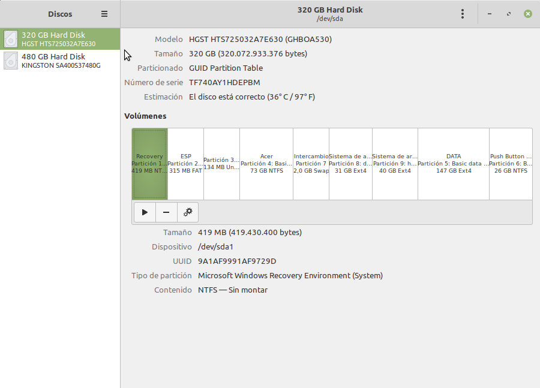
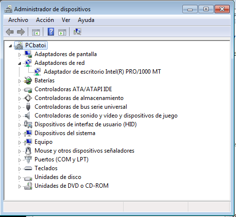
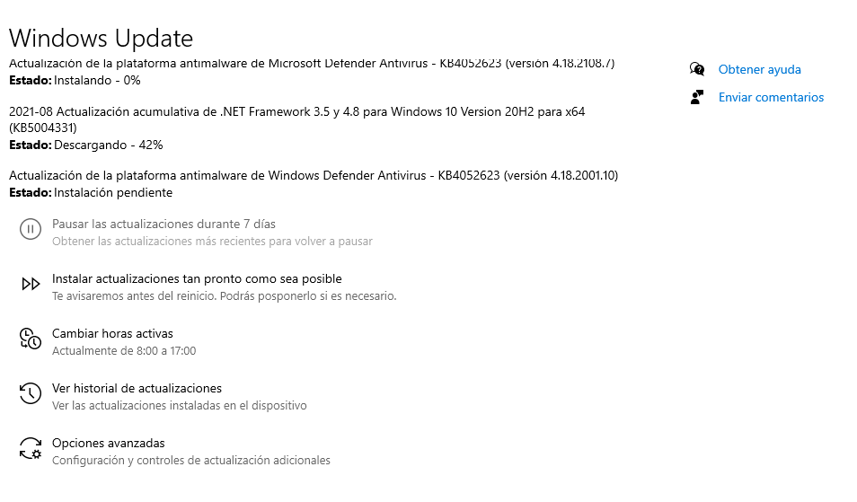
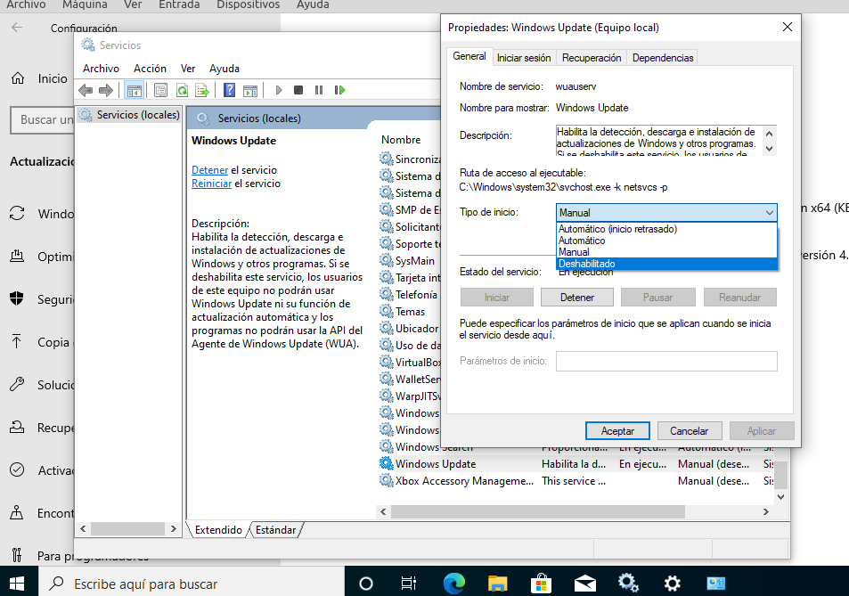
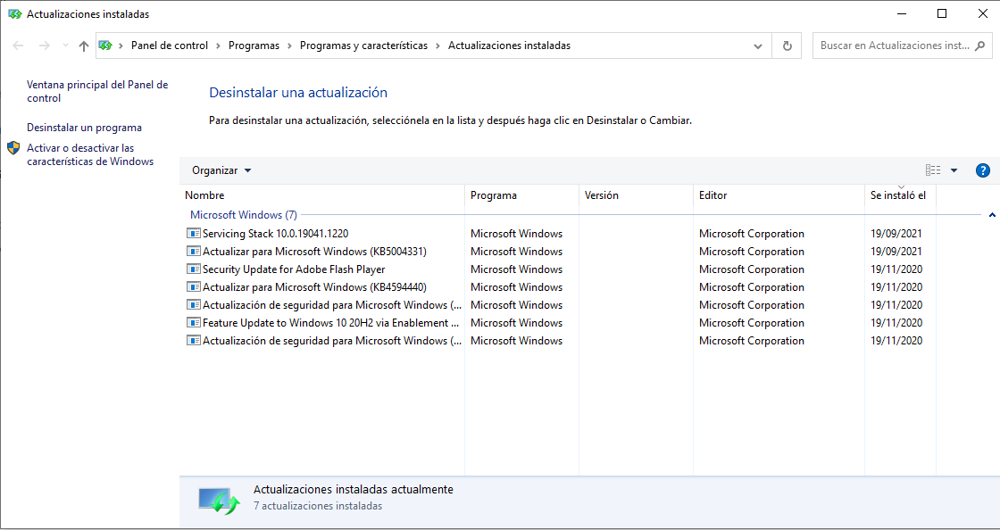
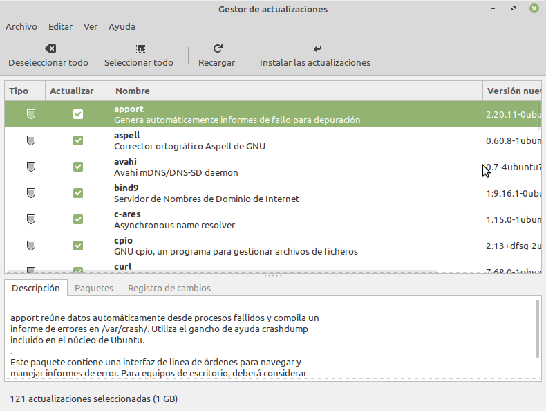

# Configuración del sistema operativo tras la instalación
- [Configuración del sistema operativo tras la instalación](#configuración-del-sistema-operativo-tras-la-instalación)
  - [Introducción](#introducción)
  - [Comprobación de las particiones](#comprobación-de-las-particiones)
  - [Controladores de dispositivos](#controladores-de-dispositivos)
  - [Actualizaciones](#actualizaciones)
    - [Actualizaciones en Windows: _Windows Update_](#actualizaciones-en-windows-windows-update)
    - [Actualizaciones instaladas](#actualizaciones-instaladas)
    - [Actualizaciones en GNU/Linux](#actualizaciones-en-gnulinux)

## Introducción
Una vez finalizada la instalación todavía tendremos que configurar algunas opciones y hacer varias comprobaciones:
- tendremos que comprobar que todas las particiones del disco están correctamente montadas y, por lo tanto, accesibles desde el sistema operativo
- también tenemos que comprobar que todos los dispositivos hardware han sido correctamente detectados e instalados sus drivers
- tenemos que comprobar que la configuración de la red es correcta si esta por DHCP o configurarla si es manual
- tenemos que actualizar el equipo para asegurarnos que el sistema operativo tiene los últimos parches de seguridad publicados (esto no lo haremos en el instituto para no saturar la red)
- tenemos que configurar las actualizaciones del sistema operativo, si queremos que sean automáticas o establecer una política de actualizaciones si tienen que hacerse manualmente
- tenemos que crear los usuarios y grupos necesarios así como carpetas y recursos compartidos y asignar permisos a los recursos del equipo
- tenemos que instalar los programas de aplicación para que el equipo sea útil y los usuarios lo puedan utilizar para realizar su trabajo (lo veremos posteriormente en esta unidad)
- finalmente y antes de pasar el equipo a producción tenemos que hacer pruebas de rendimiento del sistema, crear una imagen para recuperarlo fácilmente en caso de caída y establecer el método de restauración, programar copias de seguridad y otras tareas.

## Comprobación de las particiones
Una vez instalado el sistema operativo debemos comprobar cómo se ve nuestro disco duro y las particiones que hemos hecho en el mismo. Para ello podemos usar diferentes comandos como `fdisk` o `gparted` o las utilidades que incluye el sistema operativo.

En sistemas Windows la herramienta que se incluye es el **Administrador de discos**:

En GNU/Linux hay diferentes herramientas según la distribución. En _Ubuntu_ (y derivados como _Mint_) tenemos la utilidad **Discos**:

También podemos utilizar las herramientas en modo texto `lsblk` y `fdisk`:

## Controladores de dispositivos
Una vez instalado nuestro sistema operativo tenemos que comprobar que todo el hardware del equipo está correctamente detectado y configurado. Recordad que cada dispositivo para funcionar necesita un driver o controlador que permite al sistema operativo comunicarse con él.

En el caso de Linux lo más habitual es que al hacer la instalación del sistema todo el hardware se haya detectado y configurado correctamente porque el sistema utiliza drivers estándar para la mayor parte del hardware más común. Si tenemos algún elemento que no ha sido correctamente configurado buscaremos información en Internet de como instalar su driver pero lo más normal es que el problema sea que es hardware muy nuevo y al actualizar el sistema operativo ya lo detecte y configure.

Los sistemas Windows también auto-detectan y configuran gran parte del hardware pero es habitual que queden elementos sin configurar porque no tiene drivers adecuados para ellos. Esto pasa muchas veces con las tarjetas de red, la tarjeta gráfica (de la cual instala un driver estándar que no aprovecha todas sus capacidades) o la tarjeta de sonido. Para comprobar si todo nuestro hardware se ha detectado y configurado correctamente podemos usar el Administrador de dispositivos de Windows:

Al comprar un ordenador habitualmente viene con una versión _OEM_ de Windows instalado por lo que no tenemos ningún CD ni otro medio con el sistema operativo por si tuviéramos que reparar o volver a instalarlo. 

Si el disco está formateado con _GPT_ posiblemente guardará en una partición oculta una imagen del sistema limpio, como estaba cuando lo compramos, y al arrancar tendremos una opción para restaurar el equipo a los valores de fábrica. 

Si no tendremos que descargarnos Windows desde la página de Microsoft y los diferentes drivers desde las páginas de sus fabricantes. Si el nuestro es un ordenador "de marca" posiblemente podremos descargar un fichero con todos los drivers desde la web del fabricante. En caso contrario tendremos que ir una por una a las webs de los fabricantes de los componentes (tarjeta gráfica, de red, etc) para el descargar los drivers y para eso necesitamos conocer la marca y modelo de cada componente de nuestro ordenador. Si no lo conocemos podemos utilizar software específico que detecta todo el hardware y nos muestra un informe. Algunos de estos programas son _Everest_, _SiSoft Sandra_, _WinAudit_, _MyPcDrivers_, etc. En GNU/Linux podemos simplemente usar el comando `lshw`.

También hay programas que guardan una copia de los drivers que tenemos actualmente instalados en el sistema, lo cual es muy útil si tenemos que reinstalar el sistema operativo. Antes de formatear podemos instalar uno de estos programas y guardar los drivers detectados en un USB o CD. Después de reinstalar nuestro sistema operativo sólo tenemos que instalar los drivers guardados. Algunos ejemplos son _Driver Genius_, _Driver Easy_, _DriverMax_, etc.

En el caso de máquinas virtuales no tendremos problemas ni en GNU/Linux ni en Windows porque VirtualBox ha "elegido" un hardware para el que Windows tiene drivers por defecto.

## Actualizaciones
Todos los programas están formados por miles o, incluso, millones de líneas de código y es muy fácil que puedan tener errores. En ocasiones esos errores pueden suponer un problema de seguridad para el equipo por lo cual periódicamente se publican actualizaciones que solucionan los problemas detectados hasta entonces. A estas actualizaciones se los denomina habitualmente _parches_.

Esto es especialmente importante en el caso del sistema operativo porque es el programa que controla el ordenador. Por este motivo **NUNCA** debemos tener un sistema operativo desactualizado, tanto si utilizamos sistemas operativos privativos (como los de Microsoft o Apple) como libres (como Gnu/Linux).

En general podemos encontrar diferentes tipos de actualizaciones:
- **de seguridad**: corrigen alguna vulnerabilidad detectada en el programa. Siempre es importante instalarlas porque muchos virus y otro malware utilizan los agujeros de seguridad conocidos de sistemas y programas para introducirse en el ordenador.
- **de funcionalidad**: en este caso la actualización supone una mejora en el funcionamiento del programa o introduce alguna funcionalidad nueva en el mismo.
Estas actualizaciones podemos instalarlas nosotros manualmente, conservando en todo momento el control sobre lo que se está haciéndo, o bien configurar el sistema operativo para que se actualice automáticamente. En el caso de equipos clientes lo más habitual es la segunda opción de forma que podemos despreocuparnos del tema. El caso de servidores es más delicado porque si algo fuera mal con la actualización y nuestro sistema dejara de funcionar correctamente podemos tener un problema importante hasta que lo solucionemos. Por eso a veces en el servidor las actualizaciones las instala el administrador manualmente en algún momento en que una posible caída del servidor durante un tiempo no sea crítica para la empresa.

Si elegimos instalar las actualizaciones automáticamente podemos elegir que todo el proceso se haga automáticamente, que sólo se nos notifique cuando hay nuevas actualizaciones y nosotros decidiremos cuando descargarlas e instalarlas o que estas se descarguen pero no se instalen hasta que lo ordenemos.

### Actualizaciones en Windows: _Windows Update_
En el caso de los sistemas operativos de Microsoft todo aquello relacionado con las actualizaciones se configura desde la herramienta **Windows Update**. En Windows 10 accedemos a ella desde `Inicio -> Configuración -> Actualización y seguridad -> Windows Update` (en versiones anteriores está en el `Panel de control -> Sistema y seguridad -> Windows Update`).

Podemos cambiar la configuración para decidir cuándo queremos que se descarguen e instalen las actualizaciones pero no podemos desactivarlas desde aquí. Desde '_Ver historial de actualizaciones_' podemos ver todas las actualizaciones instaladas en el equipo e incluso desinstalar cualquiera de ellas.

Si por algún motivo queremos que nuestro equipo no se actualice (NO RECOMENDABLE a menos que sea un equipo para hacer pruebas como los que usamos en clase) debemos detener y deshabilitar el _servicio Windows Update_.

Esta forma de deshabilitar las actualizaciones automáticas no es definitiva ya que este servicio se volverá a habilitar. Para desactivarlas definitivamente debemos configurarlo en una directiva de grupo, como se explica en los apuntes de [Deshabilitar Windows Update](https://cipfpbatoi.github.io/materials/altres/sistemes-operatius/windows-update/).

### Actualizaciones instaladas
Podemos ver las actualizaciones que ha ido instalando Windows Update en el equipo. Aparecen en `Panel de control -> Programas -> Programas y características -> Actualizaciones instaladas`. También podemos pulsar “Ver historial de actualizaciones” desde la ventana de Windows Update y allá pulsar el enlace “Actualizaciones instaladas”.

En nuestro caso, nuestro equipo hace poco que está instalado y no tiene un historial grande. Si seleccionamos una actualización podremos pulsar el botón _Desinstalar_. A veces también dispondremos de un botón _Cambiar_.

Sólo desinstalaremos una actualización si ha habido problemas durante el proceso de instalación de la misma o si el equipo ha dejado de funcionar correctamente desde la misma.

### Actualizaciones en GNU/Linux
En el caso de los sistemas Gnu/Linux podemos hacerlo desde la terminal o desde el entorno gráfico para el que cada distribución tiene su gestor de actualizaciones aunque el funcionamiento es muy similar en todas ellas:

Para actualizar el sistema desde la línea de comandos tenemos las siguientes órdenes:
- `apt-get update`: vuelve a descargar la lista de paquetes de los repositorios por si hubiera alguna novedad
- `apt-get upgrade`: actualiza todos los paquetes
- `apt-get dist-upgrade`: permite actualizar a una nueva versión del sistema operativo
