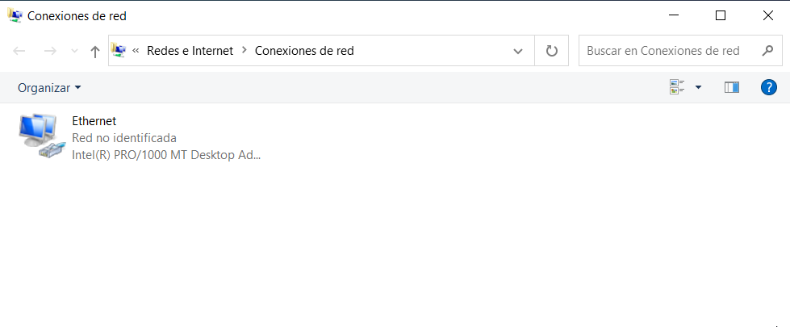
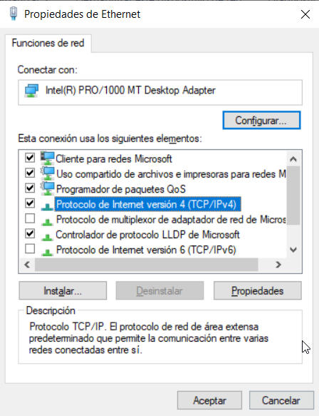
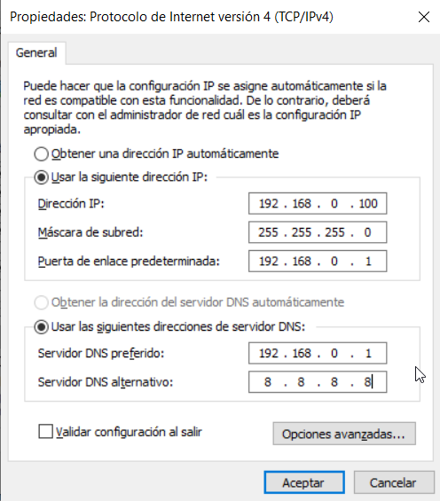

# La red
- [La red](#la-red)
  - [Introducción](#introducción)
  - [Configuración de la red en Windows](#configuración-de-la-red-en-windows)
    - [Configuración desde la consola Powershell](#configuración-desde-la-consola-powershell)
    - [Configuración desde la consola CMD](#configuración-desde-la-consola-cmd)
  - [Configuración de la red en GNU/Linux](#configuración-de-la-red-en-gnulinux)

## Introducción
Una **red** es un conjunto de dispositivos electrónicos conectados entre sí que permiten el intercambio de información entre ellos. Los dispositivos pueden ser ordenadores, impresoras, servidores, teléfonos móviles, etc. y la información puede ser de cualquier tipo: texto, imágenes, sonido, etc.

Para que un dispositivo se conecte a una red necesita una **tarjeta de red** que es un dispositivo que se encarga de enviar y recibir la información a través de un cable o de forma inalámbrica. La tarjeta de red tiene una dirección única llamada **dirección MAC** que se utiliza para identificarla en la red.

Para configurar una tarjeta de red necesitamos proporcionarle los siguientes datos:
- **Dirección IP**: es un número que identifica a un dispositivo en la red. La IP del dispositivo debe ser única (no puede haber 2 dispositivos en una red con la misma IP).
- **Máscara de red**: es un número que indica qué parte de la dirección IP es la parte de red y cuál es la parte de host. Nos sirve para saber si un dispositivo está en la misma red que otro (lo están si tienen la misma dirección de red, que se obtiene al hacer AND entre la IP y la máscara).
- **Puerta de enlace**: es la dirección IP del dispositivo que se encarga de enviar los paquetes de datos a otros dispositivos que no están en la misma red.
- **DNS**: es un servidor que se encarga de traducir los nombres de dominio a direcciones IP, que es como se comunican entre sí los dispositivos.

A la hora de configurar una tarjeta de red podemos proporcionarle estos datos de forma manual o de forma automática. Si lo hacemos de forma manual se dice que la tarjeta tiene una **_IP estática_**.

También podemos hacer que la tarjeta obtenga esos datos automáticamente de manera que no tengamos que preocuparnos de configurarla (**_IP dinámica_**). En este caso necesitamos tener en la red un **servidor DHCP** que se encargue de asignar las direcciones IP a los dispositivos de la red.

## Configuración de la red en Windows
Para configurar la red en Windows debemos ir a **`Configuración -> Ethernet -> Cambiar opciones del adaptador`** o bien pinchamos sobre `Cambiar configuración del adaptador` desde el **Centro de redes y recursos compartidos**. 



Hacemos clic con el botón derecho del ratón sobre la tarjeta de red que queremos configurar y seleccionamos la opción **Propiedades**.



En la ventana que se abre seleccionamos la opción **Protocolo de Internet versión 4 (TCP/IPv4)** y hacemos clic en el botón **Propiedades**. En la ventana que se abre podemos configurar la tarjeta de red de forma manual o automática.

Si queremos configurar la tarjeta de red de forma manual seleccionamos la opción **Usar la siguiente dirección IP** y rellenamos los campos con los datos que queremos asignar a la tarjeta. Si queremos que la tarjeta obtenga los datos automáticamente seleccionamos la opción **Obtener una dirección IP automáticamente**.



Podéis encontrar más información sobre la configuración de la red en el siguiente artículo de _SomeBooks_: [Configurar las funciones de red en Windows](https://somebooks.es/configurar-las-funciones-de-red-en-windows-server-2022-con-escritorio/).

### Configuración desde la consola Powershell
Para configurar la red desde la consola PowerShell utilizamos el siguiente comando:
```powershell
New-NetIPAddress -InterfaceAlias "Nombre de la conexión" -IPAddress DirecciónIP -PrefixLength Máscara -DefaultGateway PuertaDeEnlace
```

Para configurar la dirección IP de forma dinámica utilizamos el siguiente comando:
```powershell
Set-NetIPInterface -InterfaceAlias "Nombre de la conexión" -DHCP Enabled
```

Para liberar la dirección IP de la tarjeta de red usamos el siguiente comando:
```powershell
Remove-NetIPAddress -InterfaceAlias "Nombre de la conexión"
```

Para configurar la dirección del servidor DNS usamos el siguiente comando:
```powershell
Set-DnsClientServerAddress -InterfaceAlias "Nombre de la conexión" -ServerAddresses DirecciónDNS
```

Para ver la configuración de la red de las tarjetas de red utilizamos el siguiente comando:
```powershell
Get-NetIPAddress
```

### Configuración desde la consola CMD
También podemos configurar la red desde la línea de comandos CMD de Windows utilizando el comando `netsh`. Por ejemplo, para configurar la dirección IP de una tarjeta de red utilizamos el siguiente comando:
```cmd
netsh interface ip set address "Nombre de la conexión" static DirecciónIP Máscara PuertaDeEnlace
```

Para configurar la dirección IP de forma dinámica utilizamos el siguiente comando:
```cmd
netsh interface ip set address "Nombre de la conexión" dhcp
```

Para configurar la dirección del servidor DNS usaremos el siguiente comando:
```cmd
netsh interface ip set dns "Nombre de la conexión" static DirecciónDNS
```

Para ver la configuración de la red de las tarjetas de red utilizamos el siguiente comando:
```cmd
ipconfig /all
```

Para liberar la dirección IP de la tarjeta de red usamos el siguiente comando:
```cmd
ipconfig /release
```

y para renovar la dirección IP de la tarjeta de red usamos el siguiente comando:
```cmd
ipconfig /renew
```

## [Configuración de la red en GNU/Linux](../../../../altres/xarxa-linux/)