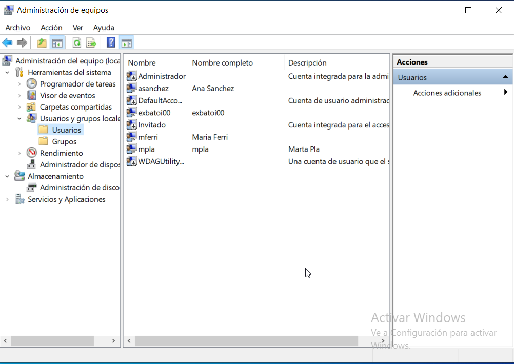
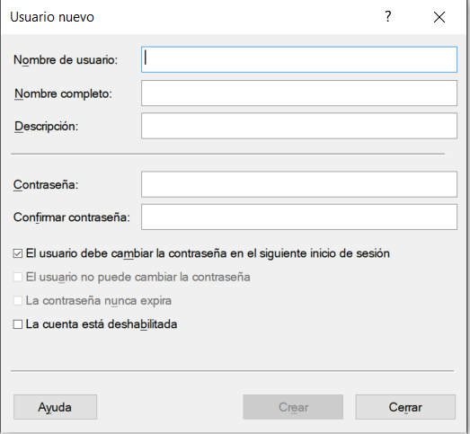

# Usuarios y grupos
- [Usuarios y grupos](#usuarios-y-grupos)
  - [Introducción](#introducción)
  - [Tipos de usuarios](#tipos-de-usuarios)
    - [Usuarios administradores](#usuarios-administradores)
    - [Usuarios estándar](#usuarios-estándar)
    - [Usuario invitado o _guest_](#usuario-invitado-o-guest)
  - [Grupos](#grupos)
  - [Usuarios y grupos en Windows](#usuarios-y-grupos-en-windows)
    - [Crear un nuevo usuario desde la configuración de Windows](#crear-un-nuevo-usuario-desde-la-configuración-de-windows)
    - [Crear un nuevo usuario usando la configuración avanzada de Windows](#crear-un-nuevo-usuario-usando-la-configuración-avanzada-de-windows)
    - [Crear usuarios y grupos desde la terminal Powershell](#crear-usuarios-y-grupos-desde-la-terminal-powershell)
  - [Usuarios y grupos en GNU/Linux](#usuarios-y-grupos-en-gnulinux)


## Introducción
Un usuario es una persona que utiliza un ordenador.
Un grupo es un conjunto de usuarios.

Para cada persona que utiliza el ordenador se tiene que crear una cuenta de usuario que sirve para:
- identificar y autentificar a esa persona para acceder al sistema
- gestionar los permisos y derechos que tendrá esa persona sobre los recursos del sistema

Cuando en un equipo se crea una cuenta de usuario, se le asigna un nombre de usuario (_login_) y un identificador único (_UID/SSID_). Con ese _login_ y el _password_ que haya establecido el usuario puede acceder al sistema y realizar las tareas para las que tiene permisos.

Además se crea una carpeta personal para el usuario en la que se guardan sus archivos y configuraciones. La carpeta personal se llama como el nombre de usuario. En Windows se encuentra dentro de la carpeta `C:\Users` y en Linux en `/home`.

También se le asigna un grupo aunque puede pertenecer a varios grupos más. Los grupos se identifican por un nombre de grupo y un identificador único (_GID/SSID_) y tendrán una serie de usuarios miembros. En Windows un grupo puede ser miembro de otro grupo mayor. 

## Tipos de usuarios
Básicamente existen 3 tipo de usuarios: administrador, estándar e invitado.

### Usuarios administradores
Tienen control total sobre todo el equipo, su configuración y sus datos. En cada sistema tiene que haber al menos uno que es quien lo configura. Es altamente recomendable que este usuario tenga una contraseña para evitar que cualquiera pueda cambiar la configuración del equipo o acceder y, si quiere, eliminar cualquier fichero del mismo.

En Windows siempre existe un usuario _administrador_ cuyo nombre es **_Administrador_**, pero por defecto está deshabilitado. Además el usuario con el cual instalamos el sistema operativo es un usuario de tipo _administrador_. Los usuarios que creamos posteriormente serán de tipo _estándar_ o _administrador_ según elijamos al crearlos. Para que un usuario sea administrador sólo tenemos que hacerlo miembro del grupo _**Administradores**_.

En GNU/Linux siempre hay un usuario administrador llamado **_root_**. Además podemos tener otros usuarios de tipo _administrador_ haciéndolos miembros del grupo _**sudo**_. El usuario con el cual instalamos Ubuntu y otras distribuciones es un usuario de tipo _administrador_. Desde la terminal un usuario administrador que no sea _root_ puede ejecutar cualquier orden como si fuera _root_ anteponiéndole el comando **`sudo`**. Por ejemplo puede cambiar el nombre del equipo y llamarlo pc01 escribiendo:

```bash
sudo hostname pc01
```

Como en Ubuntu _root_ no tiene contraseña este usuario está deshabilitado. Para poder usar esa cuenta debemos primero ponerle una contraseña con

```bash
sudo passwd root
```
o bien convertirnos en _root_ desde el usuario actual con

```bash
sudo su
```

En Debian el usuario con el cual instalamos el sistema es un usuario normal, por eso durante la instalación se nos pide también la contraseña del usuario _root_. Si queremos que cualquier otro usuario sea administrador (pueda hacer `sudo`) sólo tenemos que añadirlo al grupo _**sudo**_.

### Usuarios estándar
Son los usuarios normales del equipo. Pueden configurar su perfil de usuario y acceder a sus datos o a datos a los que alguien les dé permisos pero no pueden cambiar la configuración del equipo ni instalar nuevo software. Tienen una carpeta personal con su nombre donde guardan sus ficheros y dentro de la cual pueden hacer cualquier cosa.

Por seguridad lo más recomendable es trabajar siempre con un usuario _estándar_ y utilizar un usuario _administrador_ sólo cuando tengamos que realizar algún trabajo que así lo requiera.

### Usuario invitado o _guest_
Es un usuario especial que tienen muchos sistemas para que cualquier persona sin cuenta de usuario en el equipo pueda iniciar sesión en el mismo. Tiene los mismos privilegios que un usuario estándar pero no tiene contraseña.

Por seguridad normalmente este usuario está deshabilitado.

## Grupos
Un grupo es un conjunto de usuarios que tienen permisos comunes sobre un recurso. Por ejemplo, en un equipo de trabajo puede haber un grupo de usuarios que tengan permiso para acceder a una impresora en red o a un servidor de archivos.

La utilidad de los grupos es que no es necesario asignar permisos y derechos a cada usuario individualmente sino que podemos crear un grupo con todos los usuarios que necesitan esos permisos y asignar los permisos al grupo.

Un usuario puede pertenecer a varios grupos y tendrá los permisos que todos ellos le proporcionen. Por ejemplo, un usuario miembro del grupo _Contabilidad_ puede tener acceso a los ficheros con el sueldo de los trabajadores, pero además si es miembro de _Jefes_ puede tener permiso para modificarlos.

## Usuarios y grupos en Windows
En Windows, los usuarios se identifican por un nombre de usuario (login) y un identificador único (SSID). Al crear un nuevo usuario éste pertenecerá por defecto al grupo **Usuarios**. Si lo creamos de tipo _administrador_ pertenecerá al grupo **Administradores**.

Desde Windows 10 podemos crear 2 tipos de usuarios: con cuenta de Microsoft o sin cuenta de Microsoft. Al crear un usuario con cuenta de Microsoft nos pide un email y se crea el perfil del usuario en la nube. A partir de eso momento el usuario puede iniciar sesión con ese usuario en otros dispositivos y tendrá acceso a su configuración y sus archivos, así como a servicios de _Microsoft_ como _OneDrive_. 

Los usuarios sin cuenta de Microsoft son _usuarios locales_. Su perfil y carpeta personal se crean en ese equipo y sólo pueden inicar sesión en el dispositivo en que se han creado.

### Crear un nuevo usuario desde la configuración de Windows
Para crear un nuevo usuario en Windows vamos a _`Configuración -> Cuentas`_. Allí nos aparece información sobre nuestra cuenta y a la izquierda un menú con diferentes opciones que podemos hacer con las cuentas. 

Al añadir un nuevo usuario nos pedirá su _login_ y su contraseña. Si queremos que sea un usuario local pulsamos sobre _`No tengo la información de inicio de sesión de esta persona`_. Si queremos que sea un usuario con cuenta de Microsoft pulsamos sobre _`Iniciar sesión con una cuenta de Microsoft`_. También nos pedirá unos indicios de seguridad por si olvidamos la contraseña.

Al iniciar sesión con un usuario por primera vez se creará su perfil y su carpeta personal en `C:\Users` y se le asignarán los permisos necesarios para que pueda trabajar con ella.

Podemos cambiar el tipo de cualquier cuenta creada para hacerla de tipo _administrador_ o _estándar_. Para ello pulsamos sobre la cuenta y luego sobre _`Cambiar tipo de cuenta`_.

### Crear un nuevo usuario usando la configuración avanzada de Windows
Una forma más sencilla de crear usuarios y grupos locales es abrir la herramienta _**Administración de equipos**_ desde el menú de inicio. Allí podemos ver y gestionar todos los usuarios y grupos del sistema. 



Para crear un nuevo usuario pulsamos sobre _`Usuarios`_ con el botón derecho y seleccionamos _`Nuevo usuario...`_ y completamos sus datos:



Para hacer que un usuario sea administrador pulsamos sobre _`Grupos locales`_ y luego sobre _`Administradores`_. En la ventana que se abre pulsamos sobre _`Agregar...`_ y escribimos el nombre del usuario que queremos añadir.

### Crear usuarios y grupos desde la terminal Powershell
Para crear un nuevo usuario desde la terminal Powershell usamos el comando `New-LocalUser`. Por ejemplo, para crear un usuario llamado _pepe_ escribimos:

```powershell
New-LocalUser -Name pepe -FullName "Pepe Pérez" -Description "Usuario de prueba" -Password (ConvertTo -SecureString "1234" -AsPlainText -Force)
```

Para crear un nuevo grupo usamos el comando `New-LocalGroup`. Por ejemplo, para crear un grupo llamado _Contabilidad_ escribimos:

```powershell
New-LocalGroup -Name Contabilidad
```

Para añadir el usuario _pepe_ al grupo _Contabilidad_  usamos el comando `Add-LocalGroupMember`:

```powershell
Add-LocalGroupMember -Group Contabilidad -Member pepe
```

## Usuarios y grupos en GNU/Linux
En Linux, los usuarios se identifican por un nombre de usuario (login) y un identificador único (UID). Cada usuario pertenece a un grupo principal y puede pertenecer a varios grupos secundarios. Los grupos se identifican por un nombre de grupo (groupname) y un identificador único (GID).

Por defecto al crear un nuevo usuario se crea también un grupo con el mismo nombre que el usuario y se le asigna a éste como grupo principal.

