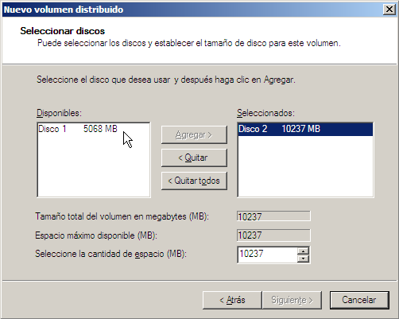

# RAID
- [RAID](#raid)
  - [Introducción](#introducción)
    - [Principales niveles de RAID](#principales-niveles-de-raid)
  - [RAID hardware (por BIOS) vs RAID software (por SO)](#raid-hardware-por-bios-vs-raid-software-por-so)
  - [RAID por software en Windows](#raid-por-software-en-windows)
    - [Administración de discos](#administración-de-discos)
    - [Creación de un volumen simple](#creación-de-un-volumen-simple)
      - [Creación de un volumen simple con Powershell](#creación-de-un-volumen-simple-con-powershell)
    - [Convertir un disco básico en dinámico](#convertir-un-disco-básico-en-dinámico)
    - [Creación de un volumen distribuido](#creación-de-un-volumen-distribuido)
    - [Creación de un volumen seccionado (RAID-0)](#creación-de-un-volumen-seccionado-raid-0)
    - [Creación de volúmenes reflejados (RAID-1)](#creación-de-volúmenes-reflejados-raid-1)
    - [Creación de volúmenes RAID 5](#creación-de-volúmenes-raid-5)
    - [Powershell](#powershell)
  - [RAID en GNU/Linux](#raid-en-gnulinux)

## Introducción
RAID (Redundant Array of Independent Disks) es una tecnología que permite combinar varios discos duros en un único dispositivo lógico. 

### Principales niveles de RAID
Existen varios niveles de RAID, cada uno con sus propias características y ventajas. Los más utilizados son:
- **RAID 0** (Data Striping, Striped Volume): se utiliza para mejorar el rendimiento de lectura y escritura. Los datos se dividen en bloques y se almacenan en varios discos. No ofrece tolerancia a fallos.

<p><a href="https://commons.wikimedia.org/wiki/File:Raid0.png#/media/Archivo:Raid0.png"></a><br>De <a href="//commons.wikimedia.org/w/index.php?title=User:JaviMZN&amp;action=edit&amp;redlink=1" class="new" title="User:JaviMZN (page does not exist)">JaviMZN</a> - <span class="int-own-work" lang="es">Trabajo propio</span>, <a href="https://creativecommons.org/licenses/by/3.0" title="Creative Commons Attribution 3.0">CC BY 3.0</a>, <a href="https://commons.wikimedia.org/w/index.php?curid=9062448">Enlace</a></p>

- **RAID 1**: se utiliza para mejorar la redundancia y la tolerancia a fallos. Los datos se duplican en dos discos. Si uno de los discos falla, los datos se pueden recuperar del otro disco.

<p><a href="https://commons.wikimedia.org/wiki/File:Raid1.png#/media/Archivo:Raid1.png"></a><br>De <a href="//commons.wikimedia.org/w/index.php?title=User:JaviMZN&amp;action=edit&amp;redlink=1" class="new" title="User:JaviMZN (page does not exist)">JaviMZN</a> - <span class="int-own-work" lang="es">Trabajo propio</span>, <a href="https://creativecommons.org/licenses/by/3.0" title="Creative Commons Attribution 3.0">CC BY 3.0</a>, <a href="https://commons.wikimedia.org/w/index.php?curid=9062568">Enlace</a></p>

- **RAID 5**: se utiliza para mejorar la redundancia y la tolerancia a fallos. Los datos se dividen en bloques y se almacenan en varios discos, junto con información de paridad que se utiliza para recuperar los datos en caso de fallo de un disco.

<p><a href="https://commons.wikimedia.org/wiki/File:Raid5.png#/media/Archivo:Raid5.png"></a><br>De <a href="//commons.wikimedia.org/w/index.php?title=User:JaviMZN&amp;action=edit&amp;redlink=1" class="new" title="User:JaviMZN (page does not exist)">JaviMZN</a> - <span class="int-own-work" lang="es">Trabajo propio</span>, <a href="https://creativecommons.org/licenses/by/3.0" title="Creative Commons Attribution 3.0">CC BY 3.0</a>, <a href="https://commons.wikimedia.org/w/index.php?curid=9062587">Enlace</a></p>

Otros niveles de RAID incluyen:
- **RAID 0+1**: se utiliza para combinar las ventajas de RAID 0 y RAID 1. Los datos se dividen en bloques y se almacenan en varios discos, y luego se duplican en otros discos. Ofrece una buena combinación de rendimiento y tolerancia a fallos y no necesita hacer cálculos de paridad.

<p><a href="https://commons.wikimedia.org/wiki/File:Raid0mas1.png#/media/Archivo:Raid0mas1.png"></a><br>De <a href="//commons.wikimedia.org/w/index.php?title=User:JaviMZN&amp;action=edit&amp;redlink=1" class="new" title="User:JaviMZN (page does not exist)">JaviMZN</a> - <span class="int-own-work" lang="es">Trabajo propio</span>, <a href="https://creativecommons.org/licenses/by/3.0" title="Creative Commons Attribution 3.0">CC BY 3.0</a>, <a href="https://commons.wikimedia.org/w/index.php?curid=9062642">Enlace</a></p>

- **RAID 1+0**: similar al anterior pero organizado al revés.
  
<p><a href="https://commons.wikimedia.org/wiki/File:Raid10.png#/media/Archivo:Raid10.png"></a><br>De <a href="//commons.wikimedia.org/w/index.php?title=User:JaviMZN&amp;action=edit&amp;redlink=1" class="new" title="User:JaviMZN (page does not exist)">JaviMZN</a> - <span class="int-own-work" lang="es">Trabajo propio</span>, <a href="https://creativecommons.org/licenses/by/3.0" title="Creative Commons Attribution 3.0">CC BY 3.0</a>, <a href="https://commons.wikimedia.org/w/index.php?curid=9062603">Enlace</a></p>

- **RAID 6**: similar a RAID 5, pero con dos discos de paridad en lugar de uno. Ofrece una mayor tolerancia a fallos que RAID 5.
  
<p><a href="https://commons.wikimedia.org/wiki/File:Raid6.png#/media/Archivo:Raid6.png"></a><br>De <a href="//commons.wikimedia.org/w/index.php?title=User:JaviMZN&amp;action=edit&amp;redlink=1" class="new" title="User:JaviMZN (page does not exist)">JaviMZN</a> - <span class="int-own-work" lang="es">Trabajo propio</span>, <a href="https://creativecommons.org/licenses/by/3.0" title="Creative Commons Attribution 3.0">CC BY 3.0</a>, <a href="https://commons.wikimedia.org/w/index.php?curid=9062593">Enlace</a></p>

- **RAID 50**: se utiliza para combinar las ventajas de RAID 0 y RAID 5. Los datos se dividen en bloques y se almacenan en varios discos, junto con información de paridad que se utiliza para recuperar los datos en caso de fallo de un disco. Luego, los datos se duplican en otros discos.
  
<p><a href="https://commons.wikimedia.org/wiki/File:RAID_50.png#/media/Archivo:RAID_50.png"></a><br>De <a href="//commons.wikimedia.org/w/index.php?title=User:Kauberry&amp;action=edit&amp;redlink=1" class="new" title="User:Kauberry (page does not exist)">Kauberry</a> - <span class="int-own-work" lang="es">Trabajo propio</span>, <a href="https://creativecommons.org/licenses/by-sa/3.0" title="Creative Commons Attribution-Share Alike 3.0">CC BY-SA 3.0</a>, <a href="https://commons.wikimedia.org/w/index.php?curid=6895750">Enlace</a></p>

- **RAID 60**: similar a RAID 50, pero con dos discos de paridad en lugar de uno. Ofrece una mayor tolerancia a fallos que RAID 50.

- **RAID 100**: se utiliza para combinar las ventajas de RAID 0 y RAID 1. Los datos se dividen en bloques y se almacenan en varios discos, y luego se duplican en otros discos. Ofrece una buena combinación de rendimiento y tolerancia a fallos.
  
<p><a href="https://commons.wikimedia.org/wiki/File:RAID_100.svg#/media/Archivo:RAID_100.svg"></a><br>De <a href="//commons.wikimedia.org/w/index.php?title=User:Kauberry&amp;action=edit&amp;redlink=1" class="new" title="User:Kauberry (page does not exist)">Kauberry</a> - <span class="int-own-work" lang="es">Trabajo propio</span>, <a href="https://creativecommons.org/licenses/by-sa/3.0" title="Creative Commons Attribution-Share Alike 3.0">CC BY-SA 3.0</a>, <a href="https://commons.wikimedia.org/w/index.php?curid=6895277">Enlace</a></p>

- Otros muchos como 3, 4, 30, 50+0, 60+0, ...

Podéis ampliar los tipos de RAID en numerosas páginas web como [Servidores
Tipos de RAID para servidores NAS](https://www.redeszone.net/tutoriales/servidores/tipos-raid-servidor-nas/) de RedesZone.net.

## RAID hardware (por BIOS) vs RAID software (por SO)
Como hemos visto utilizar RAID mejora enormemente la tolerancia a fallos del sistema por lo que es csi imprescindible en servidores.

La mejor opción es una _controladora RAID_ en la que creamos el RAID desde la BIOS de dicha controladora (o sea, antes de cargar el sistema operativo). Cuando se carga el sistema operativo éste no ve los discos reales sino el resultado del RAID, o sea, el disco virtual creado.

Si no podemos disponer de un RAID por hardware entonces lo configuraremos en el sistema operativo: éste verá todos los discos y le diremos el tipo de RAID que queremos crear y será el sistema operativo el encargado de dividir la información a escribir, calcular la paridad y gestionar la escritura en los distintos discos del RAID.

La ventaja del RAID por software es que es gratis y fácil de configurar, además de que se pueden crear volúmenes con discos de diferente tipo y velocidad. Sin embargo el rendimiento (especialmente en un RAID-0) va a ser menor y la carga de la CPU mucho mayor. 

Así que si el presupuesto lo permite siempre es aconsejable montar un RAID por hardware.

## RAID por software en Windows
En Windows tenemos dos tipos de discos:
- **Básicos**: son los discos que hemos utilizado hasta ahora. Ya vimos en en un PC podíamos usar principalmente 2 tipos de tablas de particiones para los discos:
  - **la tabla de particiones Ms-DOS (la del MBR)** donde un disco puede tener hasta 4 particiones primarias una de las cuales puede ser extendida dentro de la cual se pueden crear tantas particiones lógicas como sea necesario
  - **la tabla de particiones GUID (GPT)**, más moderna y donde sólo existen particiones primarias y pueden haber hasta 128
- **Dinámicos**: los discos no se organizan en particiones sino en volúmenes y no son accesibles desde sistemas operativos que no sean Windows (es decir, no podríamos tener un arranque dual con Linux). Su principal ventaja es la gran versatilidad que ofrecen los volúmenes frente a una partición que siempre debe ser una parte contigua de un sólo disco.

Igual que en un disco básico creamos particiones (que aquí se llaman **volúmenes simples**) en un disco dinámico se crean **volúmenes dinámicos**. En un disco (tanto GPT como MBR) se pueden crear hasta 128 volúmenes dinámicos. Un volumen puede estar formado por una o más partes de un sólo disco o puede extenderse por más de un disco. Otra ventaja importante de los volúmenes es que se pueden redimensionar sin tener que reiniciar el sistema.

Podemos crear distintos tipos de volúmenes dinámicos:
- **distribuido**: es simplemente una partición que se extiende por más de un disco. La usaremos cuando una partición se haya quedado sin espacio para aumentar su espacio disponible
- **seccionado**: es como un RAID-0 donde la información se divide para almacenarla en más de un disco, lo que aumenta la velocidad de transmisión ya que se pueden estar haciendo lecturas o escrituras en los 2 discos simultáneamente
- **reflejado**: es como un RAID-1 en que la misma información se guarda en 2 (reflejo doble) o 3 discos (reflejo triple). Proporciona tolerancia a fallos
- **RAID-5** (paridad): se necesitan al menos 3 discos y proporciona tolerancia a fallos sin desperdiciar tanto espacio de disco como los volúmenes reflejados al no duplicarse la información guardada

Tanto los discos básicos como los dinámicos se gestionan desde el **Administrador de discos**.

Podéis ampliar la información en la página de [Microsoft](https://docs.microsoft.com/es-es/windows-server/storage/storage-spaces/deploy-standalone-storage-spaces).

### Administración de discos
Para gestionar los discos utilizamos la herramienta _Administración de discos_ que encontramos dentro del _Administrador de equipos_ y es muy parecida a la de otras versiones de Windows. Algunas de las características que incorpora el Administrador de discos son:
- permite extender y reducir el tamaño de las particiones
- es muy sencillo crear volúmenes distribuidos o seccionados
- cuando agregamos más de 4 particiones en un disco MBR nos permite hacer la conversión a disco GPT

También se pueden administrar desde la línea de comandos con la herramienta **DISKPART** o con los _cmdlets_ de **Powershell**.

### Creación de un volumen simple
Windows Server no utiliza la palabra partición sino que la denomina volumen simple. Antes de poder trabajar con un disco desde la _Administración de discos_ el disco tiene que haberse inicializado (como disco MBR o GPT). Si no lo está aparece la siguiente pantalla desde la que se crea la tabla de particiones del disco:


Para crear una nueva partición en un espacio sin particionar desde el menú contextual seleccionamos `Nuevo volumen simple` y en la siguiente pantalla indicamos el tamaño de la partición a crear. A continuación le asignamos una letra a la nueva unidad o una carpeta donde se montará (Windows Server nos da la posibilidad de acceder a una unidad mediante una letra de unidad como el resto de sistemas Windows o montando la unidad en una carpeta como los sistemas UNIX y Linux):


A continuación elegimos el sistema de archivos. Podemos seleccionar el tamaño de clúster:


Por último el asistente nos muestra un resumen de las opciones elegidas y cuando pulsamos _Finalizar_ se crea la nueva partición.

Desde el menú contextual de cualquier partición ya creada podemos:
- Cambiar la letra y ruta de acceso: para asignarle una letra o ruta diferente
- Extender o reducir el volumen: para cambiar su medida
- Eliminar partición
- Agregar reflejo (si tenemos suficiente espacio sin particionar): para crear un RAID-1.

#### Creación de un volumen simple con Powershell
Para hacer esto desde _Powershell_ haremos:
```powershell
Get-Disk    
# muestra lso discos, el nuevo tendrá RAW en Partition Style
# suponemos que su Number es el 1
Initialize-Disk -Number 1 -PartitionStyle GPT
New-Partition -DiskNumber 1 -Size 200GB -AssignDriveLetter
# como no indicamos la letra que se le debe asignar se le asigna
# automáticamente, supondremos que es la E:
Format-Volume -DriveLetter E -FileSystem NTFS
```

### Convertir un disco básico en dinámico
Convertir un disco en dinámico nos da nuevas posibilidades (como utilizar RAID) pero también tiene limitaciones, sobre todo de compatibilidad, cómo hemos visto antes. Si queremos convertir un disco en dinámico desde su menú contextual (el del disco, a la izquierda, no el de las particiones) seleccionamos Convertir en disco dinámico. Aparece una pantalla donde elegir qué discos queremos convertir en dinámicos.

Para convertir un disco dinámico en básico tenemos que eliminar previamente todos los volúmenes del disco (es decir, perderemos todos los datos) y a continuación desde su menú contextual seleccionamos Convertir en disco básico.

### Creación de un volumen distribuido
En un disco básico podemos crear un volumen básico como hemos visto antes o un volumen distribuido que incluye partes de más de un disco. Se hace desde su menú contextual seleccionando Nuevo volumen distribuido:



En esta pantalla añadimos todos los discos por los que se extenderá el volumen e indicamos el espacio a coger de cada disco. El resto del proceso es igual que para un volumen básico: asignamos letra o ruta de acceso y después el sistema de archivos a crear.


### Creación de un volumen seccionado (RAID-0)
Se trata de hacer un volumen que funciona como un RAID-0, es decir, cada fichero que se guarda se reparte entre los distintos discos que forman el volumen lo que aumenta el rendimiento. Sin embargo, al igual que ocurre en un volumen distribuido, no hay ningún tipo de redundancia por lo que si falla un disco se perde toda la información del volumen. Se hace desde el menú contextual de un disco seleccionando Nuevo volumen seccionado y añadiendo todos los discos por los que se extenderá el volumen. El resto del proceso es igual que para un volumen básico: asignamos letra o ruta de acceso y después el sistema de archivos a crear.

Se pueden crear sobre volúmenes básicos o dinámicos. Necesitamos 2 o más discos con espacio sin particionar. Se crea de forma similar al volumen distribuido pero la medida del volumen tiene que ser igual en cada disco.


### Creación de volúmenes reflejados (RAID-1)
También se pueden crear sobre disco básicos pero esta operación los convertirá en dinámicos. Para reflejar un volumen desde su menú contextual seleccionamos la opción Añadir reflejo. A continuación tenemos que seleccionar otro disco donde crear el volumen reflejado (tiene que tener espacio sin particionar de a el menos la medida del volumen a reflejado):


En cualquier momento se puede deshacer un volumen reflejado desde el menú contextual seleccionando Eliminar reflejo. Al hacerlo el volumen seleccionado deja de ser parte del RAID 1 y se puede utilizar.

### Creación de volúmenes RAID 5
Podemos implementar RAID 5 sobre discos dinámicos si tenemos al menos 3 discos. RAID 5 incluye tolerancia a fallos (si falla 1 disco se puede regenerar la información que contenía a partir de los otros) y sus desventajas son que aprovecha sólo el 66% del espacio de almacenamiento (con 3 discos, pero mejora el 50% de RAID 1) y que la escritura es más lenta porque se tiene que escribir información de paridad. Para solucionar esto normalmente se implementa por hardware con controladoras RAID.

Para crear una unidad RAID 5 desde el menú contextual de un disco del volumen a crear seleccionamos Nuevo volumen RAID 5. A continuación indicamos la cantidad de espacio a utilizar en cada disco y después añadimos el resto de discos. Por último asignamos una letra y especificamos el sistema de archivos igual que hemos visto antes.

Si uno de los discos de un volumen RAID 5 presenta problemas podemos restaurar la información que contenía seleccionando la opción Regenerar paridad. Si directamente el disco no funciona tenemos que hacer:
1. Eliminamos el disco del RAID desde su menú contextual seleccionando `Quitar volumen`
2. Seleccionamos espacio no particionado en otro disco (que no forme ya parte del volumen RAID 5) y desde su menú contextual seleccionamos `Reparar volumen`

### Powershell
En la [web de Microsoft](https://docs.microsoft.com/es-es/windows-server/storage/storage-spaces/deploy-standalone-storage-spaces) o en diferentes páginas como [cómo crearlos con Powershell](https://searchstorage.techtarget.com/tip/PowerShell-tutorial-Managing-Windows-Storage-Spaces) podemos ver cómo crear volúmenes con Powershell.

También podemos ver la información sobre el comando `New-VirtualDisk` en la [web de Microsoft](https://docs.microsoft.com/en-us/powershell/module/storage/new-virtualdisk?view=windowsserver2022-ps&viewFallbackFrom=win10-ps).


## [RAID en GNU/Linux](../../../../altres/sistemes-operatius/software-raid/README.md)
