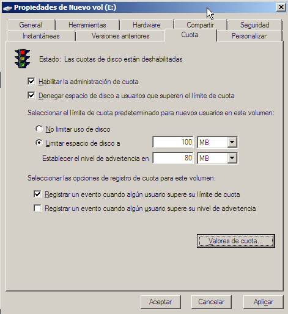
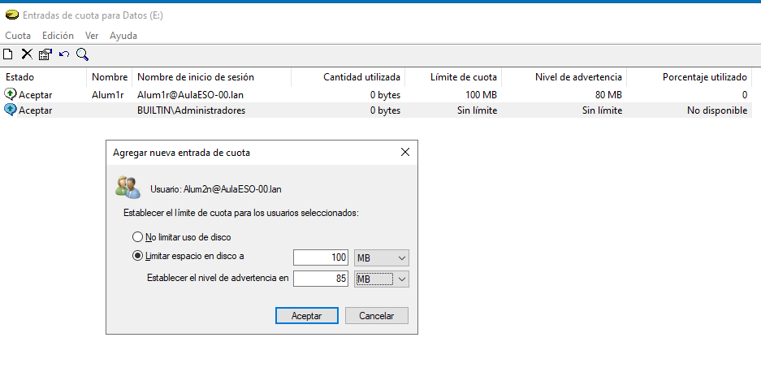

# Cuotas
- [Cuotas](#cuotas)
  - [Introducción](#introducción)
  - [Cuotas en Windows](#cuotas-en-windows)
    - [Habilitar cuotas de disco en un volumen NTFS](#habilitar-cuotas-de-disco-en-un-volumen-ntfs)
    - [Habilitar cuotas para carpetas específicas en Windows Server](#habilitar-cuotas-para-carpetas-específicas-en-windows-server)
  - [Cuotas en Linux](#cuotas-en-linux)

## Introducción
Las cuotas de disco son una forma de limitar el uso del espacio de almacenamiento por parte de los usuarios ya que permiten a los administradores asignar un límite de espacio en disco que pueden utilizar usuarios y grupos y cuando un usuario o grupo alcanza el límite de cuota ya no puede crear nuevos archivos o directorios en el sistema de archivos. 

Las cuotas de disco son útiles para garantizar que los usuarios no consuman todo el espacio en disco disponible en un sistema de archivos.

## Cuotas en Windows
En Windows, las cuotas de disco se pueden habilitar en un volumen NTFS y se pueden configurar para usuarios y grupos. Pueden establecerse  de dos maneras:
- Se pueden poner [cuotas de disco para un volumen completo](#habilitar-cuotas-de-disco-en-un-volumen-ntfs)
- En servidores Windows se pueden poner [cuotas de disco para carpetas específicas](#habilitar-cuotas-para-carpetas-específicas) lo que nos proporciona mucha más flexibilidad

### Habilitar cuotas de disco en un volumen NTFS
**NOTA**: no es conveniente establecer cuotas en la partición del sistema porque el sistema podría sobrepasar la cuota asignada durante el arranque.

Para establecer cuotas en un volumen desde su menú contextual seleccionamos `Propiedades` y vamos a la pestaña de `Cuota`:

Tenemos que activar la opción `Habilitar la administración de cuotas`. Las opciones que tenemos son:
- Denegar espacio en disco a usuarios que excedan el límite: si un usuario sobrepasa el límite asignado no puede escribir datos en el disco
- No limitar el uso de disco: por defecto no establecemos límites. Después los podemos especificar para usuarios concretos
- Limitar espacio en disco: ponemos límites por defecto para todos los usuarios. Indicaremos la cantidad de espacio a asignar por usuario y el nivel en el cual se le mostrará una advertencia
- Registrar un evento cuando un usuario supero su límite o su nivel de advertencia: se registra un evento en los casos indicados porque el administrador pueda tomar las medidas apropiadas

De este modo hemos establecido unas cuotas generales para todos los usuarios. Pero a a menudo querremos establecer cuotas sólo para determinados usuarios. Esto lo hacemos desde el botón de `Valores de cuota`. En la nueva ventana seleccionamos desde el `menú Cuota -> Nueva entrada de cuota...`, escogemos el usuario o usuarios a los cuales se aplicará la cuota que estamos creando y establecemos la cuota específica para ellos:

De este modo establecemos cuotas para una partición entera.

### Habilitar cuotas para carpetas específicas en Windows Server
Para habilitar cuotas para carpetas específicas, es necesario instalar el rol de **Administrador de Recursos del Servidor de Archivos** (_File Server Resource Manager, FSRM_). 

Veremos cómo instalar este rol y configurar cuotas para carpetas específicas en Windows Server en el [bloque 2](../../bloque2/).

## Cuotas en Linux
En Linux, las cuotas de disco se pueden habilitar en un sistema de archivos ext4 y se pueden configurar para usuarios y grupos. Para habilitar las cuotas de disco en un sistema de archivos ext4, siga estos pasos: