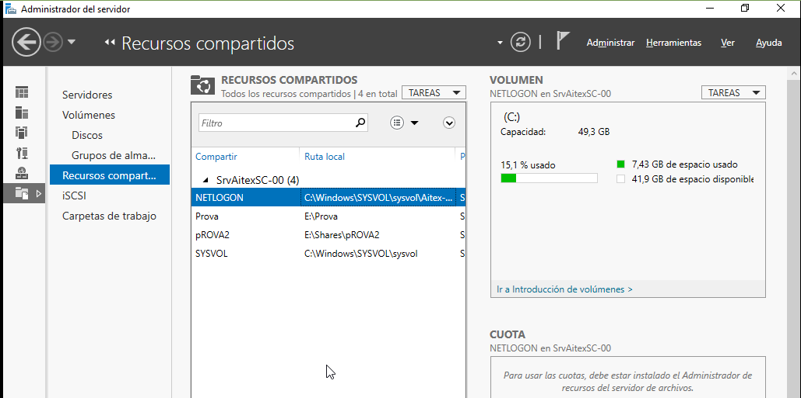

# Servicios de archivo y almacenamiento
- [Servicios de archivo y almacenamiento](#servicios-de-archivo-y-almacenamiento)
  - [Introducción](#introducción)
  - [Crear un recurso compartido](#crear-un-recurso-compartido)
    - [Compartir una carpeta desde la terminal](#compartir-una-carpeta-desde-la-terminal)
    - [Publicar una carpeta compartida](#publicar-una-carpeta-compartida)
  - [Grupos de almacenamiento](#grupos-de-almacenamiento)

## Introducción
_Servicios de archivo y almacenamiento_ es una herramienta desde la que gestionar todo el almacenamiento del servidor. Accedemos a ella desde una opción del menú de la izquierda del _Administrador del servidor_. Tiene varias opciones:
- **Servidores**: para ver todos los servidores que estamos gestionando
- **Volúmenes**: aparecen todos los volúmenes que hay creados en el servidor. También podemos filtrarlos por _Discos_ o por _Grupos de almacenamiento_. Para el volumen seleccionado muestra información de su disco y los recursos compartidos y discos virtuales iSCSI creados en él:


- **Recursos compartidos**: aquí podemos ver los recursos compartidos en cualquier volumen e información sobre ellos. En el servidor siempre tendremos al menos 2 recursos compartidos:
  - NETLOGON: se crea en los DC y se usa en el inicio de sesión de los usuarios (aquí se guardan los scripts de inicio de sesión)
  - SYSVOL: guarda secuencia de comandos de inicio de sesión



- **iSCSI**: aquí nos muestra los discos iSCSI
- **Carpetas de trabajo**: se utilizan para poder tener sincronizados los datos que se utilizan en dispositivos que a veces necesitan acceso a ellos sin estar conectados a la red de la empresa

## Crear un recurso compartido
Desde las _Tareas_ podemos gestionar los volúmenes (extender o eliminar un volumen, formatearlo, comprobar el sistema de archivos, ...) y crear un nuevo recurso compartido.

Podemos compartir recursos usando el protocolo SMB/CIFS (el nativo de Windows) o NFS (usado en GNU/Linux). Además desde la opción _Avanzado_ podemos establecer **cuotas de disco** y otras características.

Si compartimos un recurso desde a opción _Básico_ nos pregunta dónde crear la carpeta, su nombre y los permisos NTFS que tendrá. Por defecto en SMB asigna el permiso _Control total_ a _Todos_. Podemos _personalizar_ tanto los permisos NTFS como los SMB desde el asistente o después de crear el recurso, desde el `botón derecho -> Propiedades`.

[](media/Compartir-1.ogx)

Si instalamos el **_Administrador de recursos del servidor de archivos_** (_FSRM_) podemos crear un nuevo recurso compartido usando la opción _Avanzado_ que además de las opciones del _Básico_ nos permite indicar:
- el uso de esa carpeta (si es para archivos de un usuario -como su carpeta particular-, de un grupo -ficheros que usa un grupo de usuarios-, archivos de copia de seguridad o archivos de programa)
- si queremos establecer cuotas en la carpeta (lo veremos más adelante).

[](media/Compartir-2.ogx)

### Compartir una carpeta desde la terminal
Algunos comandos de utilidad para trabajar con carpetas compartidas son:
- `New-SmbShare -Name <recursocompartido> -Path <ruta a la carpeta> <Permisos> <usuario o grupo>`: compaarte una carpeta
- `Remove-SmbShare -Name <recursocompartido> -force`: quita la compartición de una carpeta
- `Get-FileShare`: muestra las carpetas compartidas que tenemos
- `Get-FileShare -name <recursocompartido> | select *`: muestra todas las propiedades de una carpeta compartida
- `Get-SmbShareAccess <recursocompartido>`: muestra los permisos SMB sobre dicho recurso compartido

Ejemplo:
`New-SMBShare -Name Datos -Path "C:\Datos" -FullAccess "Admins. del dominio" -ReadAccess "Usuarios"`: comparte el directorio C:\Datos con el nombre Datos y le asigna permisos SMB de _Control total_ al grupo _Admins. del dominio_ y permisos de _Leer_ al grupo _Usuarios_.

### Publicar una carpeta compartida
Si queremos podemos publicar la carpeta compartida desde _Usuarios y equipos de Active Directory_ para que los usuarios la puedan encontrar más fácilmente (la pueden buscar con la herramienta de _Buscar en Active Directory_).

Para ello vamos a la OU donde queramos publicarla y escogemos `Nuevo -> Carpeta compartida`. Indicamos el nombre de la carpeta compartida y su ruta y podemos añadir palabras clave que ayuden al usuario a encontrarla. 

NOTA: este proceso no crea la carpeta compartida. La debemos haber creado y compartido previamente

## Grupos de almacenamiento
Los grupos de almacenamiento (_storage pools_) permiten virtualizar el almacenamiento de manera similar a los discos LVM de Linux. Los discos físicos se agrupan para crear grupos o _pools_ de almacenamiento que se usan para crear uno o más discos virtuales llamados _espacios de almacenamiento_.

Un espacio de almacenamiento aparece en el _Administrador de discos_ como un disco normal en el que podemos crear volúmenes, formatearlos y asignarles una letra de unidad.

Los pasos a realizar son:


- Creamos un **grupo de almacenamiento** (_Storage Pool_) al que le asignamos los discos físicos que queramos, sin particionar. Posteriormente podremos añadir más discos. A la hora de añadir cada disco tenemos 3 opciones:
  - Automático: el espacio del disco forma parte del grupo y se pueden guardar cosas en él
  - Reserva activa (_Hot spare_): el espacio del disco no se suma a los demás sino que queda a la espera y entrará a formar parte del volumen si otro disco falla. Esta opción sólo tiene sentido se hemos elegido RAID1 o RAID5
  - Manual: su espacio no se suma hasta que manualmente lo asignemos
- En ese grupo creamos los **espacios de almacenamiento** o discos virtuales (_Storage Spaces_) con los que trabajaremos. Cada uno se comportará como un disco real que podremos ver desde el _Administrador de discos_. Al crearlo especificaremos:
  - Distribución de almacenamiento: nos permite elegir entre un disco _Simple_ (que realizará RAID0 entre todos los discos físicos del grupo), _Mirror_ (RAID1) o _Parity_ (RAID5)
  - Aprovisionamiento: elegimos si será _Delgado_ o _Fijo_. La primera opción es como los discos dinámicos de Virtualbox donde no se asigna al disco todo su espacio sino que se le va asignando según lo va necesitando
  - Reconocimiento de contenedor: podemos marcarlo si los discos están en diferentes chasis JBOD (_Just a Brunch Of Disks_) y en ese caso se encarga de que tengamos tolerancia a fallos a nivel de chasis
  - Tamaño: el espacio que tendrá este disco virtual (del total del grupo) 
- En el disco creado creamos un nuevo **volumen** como si se tratara de un disco real, al que se asignaremos el espacio que queramos y su sistema de ficheros (NTFS o ReFS)

Podéis consultar la [documentación oficial de Microsoft](https://learn.microsoft.com/es-es/windows-server/storage/storage-spaces/deploy-standalone-storage-spaces) para más información.

Tenemos un ejemplo de uso de grupos de almacenamiento en las páginas [Grupos de almacenamiento](https://blog.ragasys.es/grupos-de-almacenamiento-storage-pool-en-ms-windows-server-2016) y [Espacio de almacenamiento](https://blog.ragasys.es/espacio-de-almacenamiento-storage-space-tipo-parity-o-raid-5-en-ms-windows-server-2016) de RAGASYS SISTEMAS o en muchas otras páginas en internet.

Los grupos de almacenamiento nos permiten realizar en caliente:
- añadir o eliminar discos físicos de un grupo de almacenamiento (lo que cambiará su tamaño)
- redimensionar un disco virtual
- redimensionar un volumen

También permiten, si en nuestro grupo de almacenamiento tenemos discos tanto HDD como SSD, crear discos por capas que nos permita utilizar volúmenes que requieran mucha velocidad utilizando discos SSD y volúmenes que no requieran tanta velocidad utilizar los discos HDD. De manera interna al crear un disco por capas con diferente hardware (HDD y SSD) almacenará los datos que se estén utilizando con mucha frecuencia en el disco SSD para que funcionen más eficientemente y los que se usen con menos frecuencia en el disco HDD.

Podemos crear un grupo de almacenamiento con Powershell:
```powershell
$MyPhysicalDisks = Get-PhysicalDisk -CanPool $true
NewStoragePool -FriendlyName MyStoragePool1 -StorageSubsystemFriendlyName "Windows Storage*" -PhysicalDisks MyPhysicalDisks -ProvisioningTypeDefault Thin -Verbose
```

Y crearemos en él un disco virtual de 50 GB:
```powershell
New-VirtualDisk –StoragePoolFriendlyName MyStoragePool1 –FriendlyName VirtualDisk1 –Size (50GB)
```

Una vez creado ya aparece el disco virtual _VirtualDisk1_ en el _Administrador de discos_ y podemos crear volúmenes en él o bien hacerlo desde Powershell.
