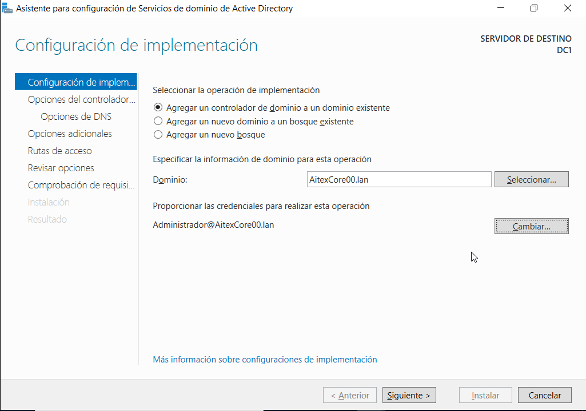
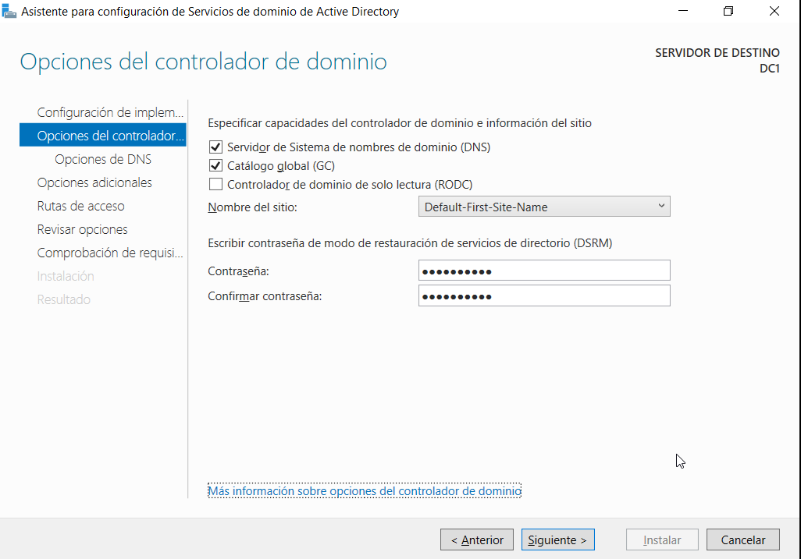
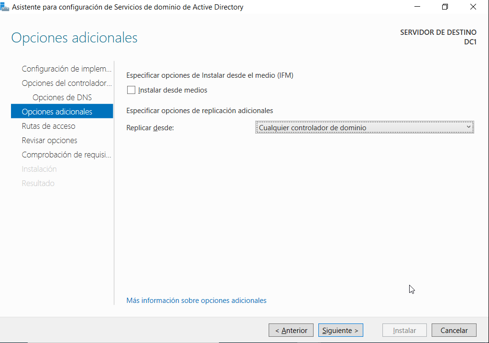
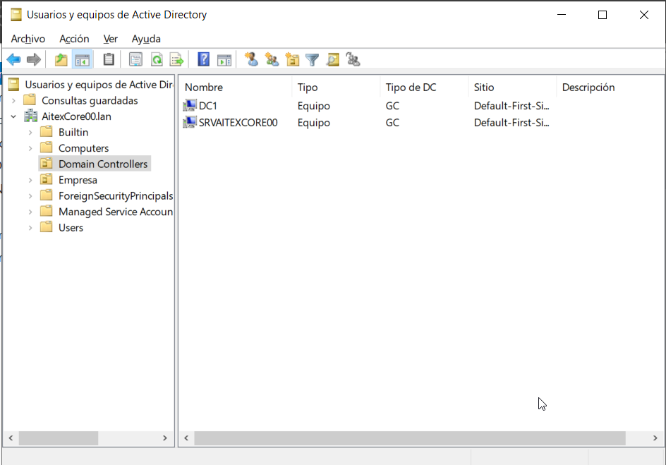

# Añadir otro DC a un dominio
- [Añadir otro DC a un dominio](#añadir-otro-dc-a-un-dominio)
  - [Introducción](#introducción)
  - [Instalación y configuración](#instalación-y-configuración)
  - [Instalación desde la terminal](#instalación-desde-la-terminal)
  - [Degradar un DC](#degradar-un-dc)

## Introducción
En cada dominio debe haber al menos un DC que lo gestione, pero en ocasiones querremos tener más de 1 DC en un mismo dominio:
- para que se repartan el trabajo entre los 2
- por fiabilidad del sistema: si cae un DC el otro continuará gestionando el dominio

Podemos obtener más información sobre promover un DC en la [web de Microsoft](https://learn.microsoft.com/es-es/windows-server/identity/ad-ds/deploy/ad-ds-installation-and-removal-wizard-page-descriptions).

También hay un artículo referido específicamente a [añadir otro DC a un dominio](https://learn.microsoft.com/es-es/windows-server/identity/ad-ds/deploy/install-a-replica-windows-server-2012-domain-controller-in-an-existing-domain--level-200-) donde profundiza en las distintas opciones e indica los comandos para hacerlo desde Powershell.

## Instalación y configuración
Para convertir un Windows Server en otro _Domain Controller_ de un dominio existente instalamos los _Servicios de dominio de Active Directory_ y al promoverlo a DC en la primera pantalla elegiremos "Agregar un DC a un dominio existente":

Pondremos el nombre del dominio y las credenciales del administrador de dicho dominio.

En la siguiente pantalla configuramos las opciones y por defecto tenemos marcadas las de DNS y Catálogo global, lo que significa que también será un DNS del dominio (se instalará este servicio) y contendrá el catálogo global con todos los objetos del dominio, exactamente igual que el primer DC.

Opcionalmente podemos marcar "Controlador de dominio de sólo lectura (RODC)" que lo convertiría en un DC que puede gestionar el dominio (validar usuarios, enviar directivas, ...) pero NO hacer cambios en el mismo (crear usuarios, grupos, ...).

A continuación en la pantalla de "Opciones adicionales" debemos configurar si se replicarán los cambios desde cualquier DC (la opción por defecto) o sólo desde un DC en concreto, en cuyo caso es en dicho DC en el que deberíamos hacer los cambios en el dominio.

El resto del proceso es similar al del primer DC y al finalizar ya tendremos 2 DC en nuestro dominio:

## Instalación desde la terminal
Vimos cómo hacerlo en la [UD 2](../ud02/roles.md#instalar-el-dominio-desde-la-terminal).

## Degradar un DC
También lo vimos en la [UD 2](../ud02/roles.md#degradar-un-controlador-de-dominio).