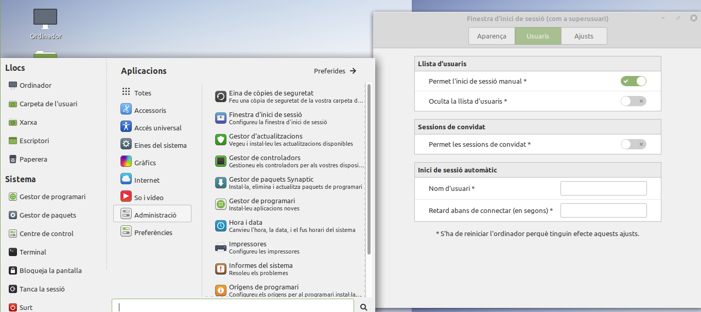
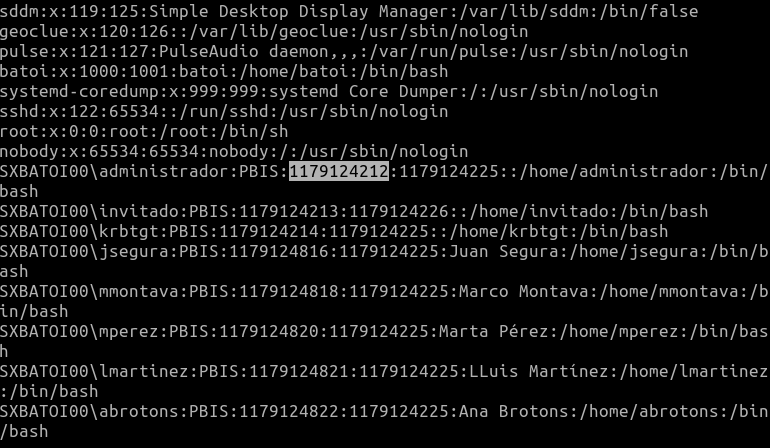
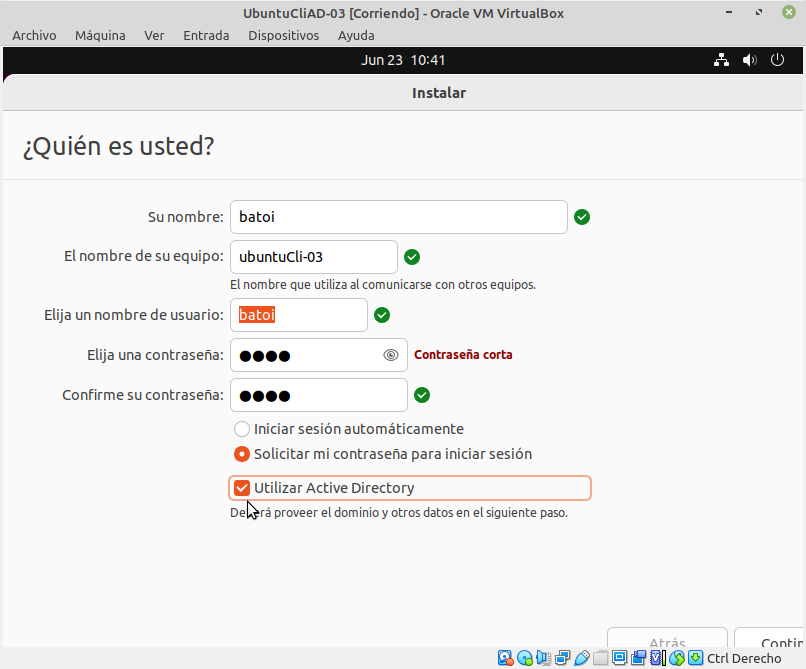
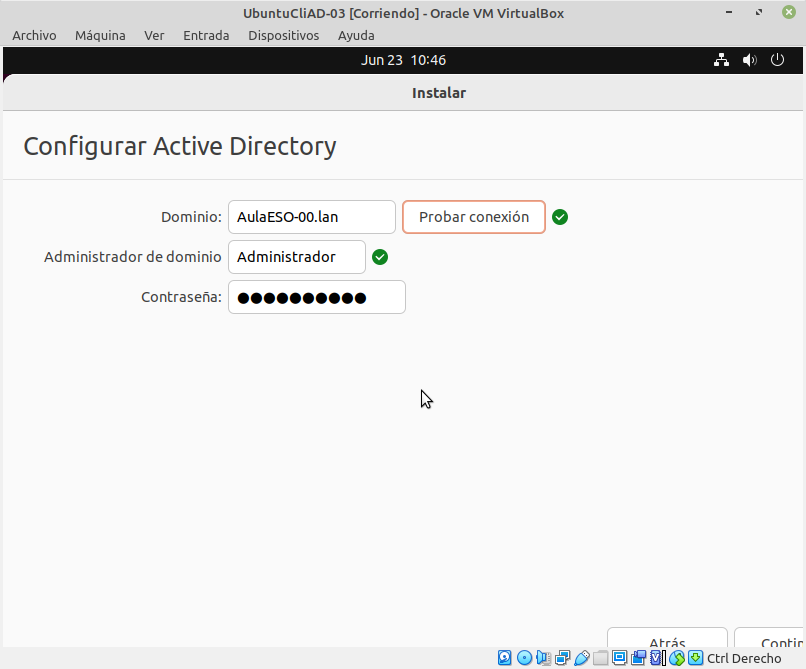

# Añadir un equipo Linux a AD
- [Añadir un equipo Linux a AD](#añadir-un-equipo-linux-a-ad)
  - [Introducción](#introducción)
  - [SSSD](#sssd)
    - [Instalación](#instalación)
    - [Configuraciones adicionales](#configuraciones-adicionales)
    - [Sincronizar la hora](#sincronizar-la-hora)
  - [pbis-open](#pbis-open)
    - [Configuraciones adicionales](#configuraciones-adicionales-1)
  - [Iniciar sesión en el dominio desde el entorno gráfico](#iniciar-sesión-en-el-dominio-desde-el-entorno-gráfico)
      - [Ligth Display Manager](#ligth-display-manager)
      - [Linux Mint](#linux-mint)
      - [Lubuntu](#lubuntu)
  - [Al instalar Ubuntu](#al-instalar-ubuntu)
  - [Canonical _ADsys_](#canonical-adsys)

## Introducción
Aunque no es lo más habitual en ocasiones debemos añadir clientes GNU/Linux al dominio. Hay diferentes formas de hacerlos:
- usando **winbind** (es el paquete que utiliza Samba)
- usando alguna herramienta de terceros como [**pbis-open**](https://github.com/BeyondTrust/pbis-open/releases) que es un script que automáticamente descarga y configura todos los paquetes necesarios (lo veremos en el último apartado)
- usando el paquete _System Security Services Daemon_ (**SSSD**) que se explica a continuación
- durante la instalación de Ubuntu 22.04 o posterior
- usando _ADsys_ en Ubuntu 22.04 y posteriores (incluido en el propio sistema)

## SSSD
El Demonio de Servicios de Seguridad del Sistema (_System Security Services Daemon, SSSD_) es un servicio que permite acceder a mecanismos de autenticación y directorios remotos como LDAP, Active Directory y reinos kerberos. Esto permite a los usuarios autentificarse en un equipo local utilizando una cuenta del servidor.

Además, al igual que hace Windows, SSSD mantiene una caché de identidades en el equipo local lo que permite a un usuario iniciar sesión aunque el servidor no esté disponible si ya lo ha iniciado antes en ese equipo.

Su archivo de configuración es `/etc/sssd/sssd.conf`.

Los programas que se utilizan son:
- **adcli**: es un paquete linux para realizar acciones en un dominio Active Directory ([manpages](https://manpages.ubuntu.com/manpages/trusty/man8/adcli.8.html))
- **kerberos**: es el método de autenticación que utiliza AD. Para utilizarlo en linux debemos tener el paquete _krb5-user_
- **realmd**: paquete con utilidades para gestionar la unión de equipos a dominios con autenticación kerberos ([manpages](https://manpages.ubuntu.com/manpages/xenial/man8/realm.8.html))
- **sssd**: incluye herramientas para gestionar la autenticación e información de usuarios y grupos para distintos orígenes de red como AD, LDAP y kerberos

### Instalación
Antes de comanzar con la instalación nos aseguraremos de la correcta configuración de la red en el cliente: debe ser capaz de resolver el nombre del dominio y del DC. También debemos cambiar el nombre del equipo poniendo su FQDN (el nombre completo del equipo, con el dominio), por ejemplo _pclinux.midominio.lan_. Es conveniente tenerlo en el fichero `/etc/hosts`.

Los paquetes que debemos instalar son _realmd, sssd-ad, sssd-tools_ y _adcli_. 

Una vez instalados comprobaremos que accede a la información del dominio con:
```bash
sudo realm -v discover midominio.lan
```

Debe mostrar el nombre del dominio y la IP del DC.

> NOTA: si eres el usuario _root_ y no encuentra la orden puede ser porque para convertirte el _root_ hayas ejecutado `su` en lugar de `su -`

Para añadir el equipo al dominio ejecutamos:
```bash
sudo realm --verbose join midominio.lan -U Administrador
```

> Si al ejecutarlo se prduce un error diciendo que deben instalarse los paquetes a pesar de estar ya instalados instalaremos el paquete _packagekit_ que resuleve este problema.

> Si se produce un error de que no tenemos permisos puede deberse a que no tengamos instalado _kerberos_ lo que solucionaremos instalando el paquete _krb5-user_. Durante la instalación nos pedirá el nombre del dominio (_realm_) y lo pondremos en MAYÚSCULAS. Puede cambiarse en la línea **_default\_realm_**_ del fichero `/etc/krb5.conf`.

Con esto ya tenemos nuestro equipo añadido al dominio y debe aparecer en la OU _Computers_ de **_Usuarios y equipos de AD_**.

Podemos comprobar la información del administrador del dominio con

```bash
id Administrador@midominio.lan
```

Podemos iniciar sesión con un usuario del dominio con
```bash
su Administrador@mydomain.lan
```

o

```bash
sudo login Administrador@mydomain.lan
```

### Configuraciones adicionales
Todavía nos quedan unas cosas por configurar para mejorar la usabilidad del sistema. En el archivo de configuración de **sssd** `/etc/sssd/sssd.conf` encontramos las líneas:

- `cache_credentials = True`: esto hace que se guarden las credenciales de un usuario cuando inicia sesión y la próxima vez es el mismo equipo el que le da acceso sin tener que contactar con un DC (Windows también lo hace)
- `use_fully_qualified_names = True`: para iniciar sesión se debe poner el FQDN del usuario (usuario@dominio) en lugar de sólo el usuario. Podemos ponerlo en _False_ si sólo trabajamos con un único dominio y no tiene relaciones de confianza con otros.

Además, la primera vez que un usuario del dominio inicia la sesión en el equipo no se crea por defecto a su _home_. Para que se cree ejecutamos el comando:
```bash
sudo pam-auth-update --enable mkhomedir
```

### Sincronizar la hora
Como sabemos la hora debe ser igual en el DC y en los clientes para poder acceder al dominio. Podemos decirle al equipo que use como servidor de hora el DC de Windows. Para ello editamos el fichero `/etc/systemd/tiemsyncd.conf` y en _[Time]_ descomentamos la línea **NTP=** y le ponemos la IP de nuestro servidor de hora (ej. `NTP=192.168.0.1`).

Si no funciona podemos instalar el paquete _ntp_ y configurarlo para que obtenga la hora del DC. Para ello en el fichero `/etc/ntp.conf` comentaremos todas las líneas de **pool** y añadiremos:
```bash
server dc1.midominio.lan
pool dc1.midominio.lan
```

Después reiniciaremos el servicio **ntp**. Podemos comprobar la sincronización con `ntpq -p`.

Fuente: [EDUCATICA!](https://www.educatica.es/informatica/anadiendo-un-sistema-gnu-linux-al-dominio/)

## pbis-open
El paquete PBIS (_PowerBroker Identity Services) es un script realizado por _Beyond Trust_ que automáticamente descarga los paquetes necesarios y configura los ficheros por nosotros. 

Para que funcione debemos tener instalado el paquete _ssh_.

Nos descargamos desde la web de [BeyondTrust](https://github.com/BeyondTrust/pbis-open/releases) el script adecuado a nuestro sistema y lo ejecutamos:
```bash
sudo sh ./pbis-open-versio_descargada.deb.sh
```

Para añadir el equipo al dominio ejecutamos:
```bash
sudo domainjoin-cli join midominio.lan Administrador@midominio.lan
```

Ya lo tenemos añadido y debe aparecer en la OU _Computers_ de _Usuarios y equipos de AD_. También podemos comprobarlo con
```bash
sudo domainjoin-cli query
```

También podemos ver información sobre PBIS y el dominio con:
```bash
pbis status
```

Para sacar un equipo Linux del dominio ejecutaremos:
```bash
sudo domainjoin-cli leave
```

Podemos ver desde la terminal la lista de todos los usuarios que pueden iniciar sesión en el sistema con:
```bash
getent passwd
```

y la lista de grupos con:
```bash
getent group
```

También podemos ver la información de usuarios y grupos desde PBIS con:
```bash
/opt/pbis/bin/enum-users
/opt/pbis/bin/enum-groups
```

Ya podemos iniciar sesión con un usuario del dominio poniendo su nombre y el dominio, por ejemplo `ACME\Administrador` o `Administrador@acme.lan`.

### Configuraciones adicionales
Vamos a ejecutar unas órdenes que nos faciliten la tarea de loguearnos con un usuario del dominio. En estas órdenes, cuado se tenga que poner el nombre del dominio pondremos el nombre NETBIOS (el que va sin extensión):
- `sudo /opt/pbis/bin/config UserDomainPrefix midominio`: para no tener que escribir nom_dominio\nom_usuario (o nom_usuario@nom_dominio) para iniciar sesión sino que baste poner el nombre del usuario
- `sudo /opt/pbis/bin/config AssumeDefaultDomain true`: por defecto asume que el usuario introducido es un usuario del dominio
- `sudo /opt/pbis/bin/config LoginShellTemplate /bin/bash`: la terminal de los usuarios será bash
- `sudo /opt/pbis/bin/config HomeDirTemplate %H/%U`: donde estará el directorio personal del usuario, por defecto _/home/usuario_
- (OPCIONAL) `sudo /opt/pbis/bin/config RequireMembershipOf "midominio\nom_grup"`: esto es por si queremos que sólo los miembros de un grupo determinado puedan iniciar sesión en esta máquina. Asegúrate de poner el nombre del grupo tal y como se ve en el comando `getent group` (por ejemplo el grupo de _Usuarios del dominio_ aparece como _usuarios^del^dominio_). ATENCIÓN: el carácter "\" es para escapar el siguiente carácter por lo que puede que tengamos que ponerlo doble "\\"

Podemos comprobar si hemos configurado bien cualquier opción con la opción `--show`, por ejemplo, para saber qué grupo puede iniciar sesión en el cliente linux escribiremos:
```bash
/opt/pbis/bin/config --show RequireMembershipOf
```

## Iniciar sesión en el dominio desde el entorno gráfico
Simplemente escribimos el nombre del usuario del dominio (con o sin **@midomnio.lan** según esté configurado) y su contraseña e iniciamos sesión. 

Sin embargo algunos gestores gráficos no permiten escribir el usuario en el login sino que sólo nos da la opción de elegir uno de la lista. Si nuestro gestor gráfico es uno de esos hay que ver la forma de habilitar la posibilidad de escribir el usuario.

En primer lugar tenemos que identificar qué _display-manager_ se está usando con:
```bash
systemctl status display-manager
```

#### Ligth Display Manager
En el caso de Ubuntu antiguos y otras distribuciones que usan _ligthdm_, tenemos que cambiar la configuración añadiendo al final del archivo de configuración `/usr/share/lightdm/lightdm.conf.d/50-unity-greeter.conf` las líneas:
```bash
allow-guest=false
greeter-show-manual-login=true
```

y reiniciamos el equipo.

#### Linux Mint
Si se trata de Linux Mint con escritorio _Mate_, en el entorno gráfico hay que habilitar la opción '_Permitir el inicio de sesión manual_' que esta en `Administración -> Pantalla de inicio de sesión -> Usuarios`:



#### Lubuntu
Si es un Lubuntu anterior al 20.04 no hay que hacer nada porque automáticamente pide escribir el nombre del usuario.

Lubuntu 20.04 utiliza como _Display Manager_ _SDDM_ que no da opción para escribir el nombre del usuario. Lo que podemos hacer es que aparezcan los usuarios del dominio igual que aparecen los locales. Para ello en primer lugar tenemos que saber qué UID tienen los usuarios del dominio con
```bash
getent passwd
```

para ver que sus UID son:



Ahora entramos en el fichero `/etc/sddm.conf` para añadir una sección _[Users]_ donde indicar qué UID tienen que aparecer (por defecto sólo aparecen los locales a partir del UID 1000). Como los nuestros tienen UID muy grandes (1179124212 i més) ponemos en ese fichero:
```ini
[Autologin]
Session=Lubuntu
[Users]
MinimumUid=1000
MaximumUid=9999999999
RememberLastUser=true
```

## Al instalar Ubuntu
El instalador de _Ubuntu Desktop_ incluye una opción para añadir el equipo que estamos instalando en el dominio en el proceso de instalación del sistema operativo:



Si marcamos esta opción en la siguiente pantalla nos pide el nombre del dominio y una cuenta para añadir el equipo al dominio (normalmente el del Administrador):



## Canonical _ADsys_
**NOTA**: esta librería sólo está disponible para suscriptores de [Ubuntu Advantage](https://ubuntu.com/advantage).

Desde Ubuntu Desktop 22.04 se incluye en el sistema esta librería que es un cliente de AD y que proporciona muchas más funcionalidades que las que teníamos sólo con SSSD (autenticación y unas pocas GPO), aunque también puede instalarse en la versión 20.04.

ADsys consta de un demonio (_adsysd_), que implementa la autenticación (con Samba y Kerberos) y las GPO, y una CLI (_adsysctl_) que nos permite controlar dicho demonio.

Este paquete complementa a _SSSD_ y _PAM_ proporcionando:
- soporte nativo de GPO, tanto de _Equipo_ como de _Usuario_
- gestión de privilegios pudiendo otorgar o revocar privilegios para el usuario local o cualquier usuario o grupo de AD
- ejecución de scripts al inicio o fin de sesión o de arranque de la máquina

Para usar GPO debemos importar en AD las [plantillas adml o admx](https://github.com/ubuntu/adsys/tree/main/policies).

Al igual que en Windows hay GPO tanto de _Equipo_ como de _Usuario_ que se aplican al cargar e sistema (_equipo_) o al iniciar la sesión (_usuario_).
