# Monitorización de un sistema Windows
- [Monitorización de un sistema Windows](#monitorización-de-un-sistema-windows)
  - [Introducción](#introducción)
    - [Tareas del administrador del sistema](#tareas-del-administrador-del-sistema)
    - [Conceptos relacionados con la supervisión](#conceptos-relacionados-con-la-supervisión)
    - [Parámetros Clave a Supervisar](#parámetros-clave-a-supervisar)
    - [Escenarios Comunes de Problemas](#escenarios-comunes-de-problemas)
  - [Herramientas y programas de monitorización](#herramientas-y-programas-de-monitorización)
  - [Administrador del servidor](#administrador-del-servidor)
  - [Administrador de tareas](#administrador-de-tareas)
    - [Servicios](#servicios)
  - [Monitor de recursos](#monitor-de-recursos)
  - [Visor de eventos](#visor-de-eventos)
  - [Monitor de confiabilidad](#monitor-de-confiabilidad)
  - [Monitor de rendimiento](#monitor-de-rendimiento)
  - [Windows Update](#windows-update)
  - [Windows Admin Center (WAC)](#windows-admin-center-wac)

## Introducción

Es imprescindible conocer lo que está sucediendo en el sistema tanto para resolver problemas como para mejorar el rendimiento del mismo. Para ello comprobaremos el rendimiento del sistema antes de ponerlo en producción y lo volveremos a comprobar si a lo largo de la vida del equipo hay problemas o si llega un momento en el que no responde con la suficiente rapidez a su carga de trabajo. Esto nos permitirá conocer qué elemento es el cuello de botella que debemos mejorar para mejorar el funcionamiento general del equipo.

### Tareas del administrador del sistema
Las tareas del administrador de un sistema informático incluyen:
- Es el responsable de la instalación del equipamiento necesario, tanto de hardware como de software: estudia las necesidades de la empresa y decide en cada caso el equipamiento a adquirir y cómo hacerlo
- Instala y configura el equipamiento: prepara los equipos, instala y configura el sistema operativo, los distintos drivers necesarios y los diferentes programas que necesita el usuario
- Instala (y/o configura para que se instalen) las actualizaciones del sistema, de drivers y de firmwares: siempre deben instalarse las actualizaciones de seguridad; las otras si aportan alguna mejora
- Gestiona el sistema: cuentas de usuarios, recursos del sistema, ...
- Es el responsable del correcto funcionamiento del sistema y de su buen rendimiento: realiza mantenimientos preventivos, monitoriza el funcionamiento del sistema, actualiza equipos y/o programas cuando es necesario, ...
- Resuelve las incidencias que se produzcan, tanto de hardware como de software
- Diseña e implementa la política de copias de seguridad de los datos
- Diseña e implementa la política de respuesta ante fallos en cualquier elemento del sistema: imágenes de discos, equipos de respaldo, ...
- Es el responsable de la seguridad del sistema: impide accesos no autorizados (tanto externos como internos), evita las fugas de información, ...
- Gestiona la documentación técnica, manuales y políticas de TI

Dependiendo del tamaño de la empresa tendrá un equipo que le ayude a la realización de estas tareas pero él es el responsable de que todo funcione correctamente.

Para realizar este trabajo es necesario que conozca qué está pasando en el sistema en cada momento, así como que recoja información del mismo para poder consultarla cuando se detecte algún problema. Por tanto debe monitorizar:
- el funcionamiento de los distintos equipos y su rendimiento
- el estado de la red
- el estado de los diferentes servicios y procesos
- el almacenamiento
- etc

Por tanto la rutina diaria del administrador de sistemas incluye el monitoreo del sistema y la solución de problemas.

### Conceptos relacionados con la supervisión
Algunas definiciones de conceptos relacionados con el rendimiento del sistema son:
- **Evaluación del rendimiento de un sistema informático**: es una medida de la calidad en el uso del hardware respecto a un conjunto de programas denominado "carga del sistema" donde puede existir interacción con usuarios.
- **Carga del sistema**: conjunto de programas que se ejecutan en el sistema para satisfacer las necesidades de los usuarios. Suele ser un conjunto complejo y variable en el tiempo.
- **Benchmark** (en castellano, comparativa o análisis): programa informático o un conjunto de programas que tienen como objetivo estimar el rendimiento de un elemento concreto o la totalidad del sistema y ​​poder comparar los resultados con máquinas similares.
- **Cuello de botella**: situación que se da cuando un dispositivo del sistema informático recibe muchas peticiones y está muy saturado de trabajo, mientras que el resto de dispositivos están ociosos esperando su respuesta. Se trata de encontrar el dispositivo en el que se encuentra el cuello de botella porque mejorando su rendimiento mejorará el de todo el sistema.

¿Cuándo debemos realizar una evaluación del rendimiento? Puede ser útil evaluar el rendimiento de un equipo cuando:
- se desea diseñar un sistema informático nuevo
- se desea seleccionar un sistema informático entre varias alternativas
- se desea planificar la capacidad de un sistema informático
- se desea ajustar un sistema informático (operaciones de mantenimiento)
- se va a poner en producción un nuevo equipo
- hay problemas con un equipo o no ofrece un buen rendimiento

### Parámetros Clave a Supervisar
Lo más importante a supervisar en un sistema informático son:
- CPU:
  - Uso promedio y picos.
  - Identificar procesos que sobrecargan el procesador.
- Memoria (RAM):
  - Uso total y disponible.
  - Problemas de fuga de memoria (leak).
- Disco:
  - Velocidad de lectura/escritura.
  - Fragmentación.
- Red:
  - Uso de ancho de banda.
  - Conexiones activas.
- Servicios y aplicaciones críticas:
  - Estado y rendimiento.

### Escenarios Comunes de Problemas
Algunos de los problemas más comunes que pueden surgir en un sistema informático son:
- Problemas de rendimiento:
  - Ejemplo: El sistema va lento debido a un proceso que consume mucha CPU.
  - Solución: Identificar y cerrar el proceso.
- Errores de hardware:
  - Ejemplo: El disco duro está a punto de fallar.
  - Solución: Identificar errores en el visor de eventos y realizar backups.
- Ataques de seguridad:
  - Ejemplo: Intentos de inicio de sesión no autorizados.
  - Solución: Revisar el registro de seguridad y reforzar políticas.

## Herramientas y programas de monitorización
Windows incluye varias herramientas que nos permiten monitorizar el sistema:
- **Administrador de tareas**: nos permite ver los procesos que se están ejecutando en el sistema, el rendimiento del sistema, la utilización de la red, ...
- **Monitor de recursos**: nos permite ver el uso de CPU, memoria, disco y red
- **Registro de eventos**: nos permite ver los eventos que se han producido en el sistema
- **Monitor de rendimiento**: nos permite monitorizar el rendimiento del sistema y crear informes
- Otras herramientas, como el _Monitor de confiabilidad_, el _Administrador del servidor_, ...

Además, podemos instalar otras herramientas, tanto de Microsoft como de terceros, que nos permiten monitorizar el sistema, por ejemplo:
- **Sysmon**: herramienta de Microsoft que monitoriza el sistema y crea informes
- **Process Hacker**: herramienta que nos permite ver los procesos que se están ejecutando en el sistema y su rendimiento
- **System Informer**: herramienta que nos permite ver información del sistema
- **Wireshark**: herramienta que nos permite ver el tráfico de red
- ...

Para gestionar las actualizaciones dispone del servicio **Windows Update** y su herramienta gráfica de configuración.

## Administrador del servidor
Desde aquí tenemos un completo resumen del estado general de cada servidor que nos permite determinar su estado actual así como detectar eventos registrados que puedan afectar a su funcionamiento.

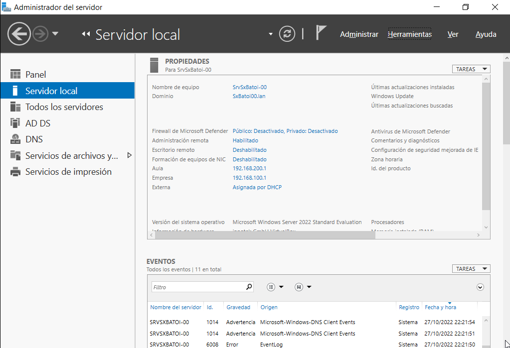

## Administrador de tareas
En sistemas Windows podemos obtener importante información del `Administrador de tareas de Windows`, que nos muestra los programas, procesos y servicios que están en ejecución. 

Sus funciones principales son:
- Supervisión del uso de recursos.
- Control de procesos y servicios en ejecución.
- Análisis del rendimiento del sistema.

Podemos acceder a él rápidamente pulsando:
- `Ctrl + Alt + Supr` y seleccionando _Administrador de tareas_ 
- `Ctrl + Shift + Esc`
- `Win + X` y seleccionando _Administrador de tareas_ 
-  o bien con el comando `taskmgr`.
-  
Tiene varias pestañas con información sobre:
- **Procesos**: podemos ver los programas que se están ejecutando, tanto los abiertos por nosotros (_aplicaciones_) como los que están en segundo plano y los de Windows. De cada proceso vemos su nombre, el porcentaje de CPU está consumiendo ahora y la memoria que ocupa. Desde ahí podemos finalizar cualquier proceso.

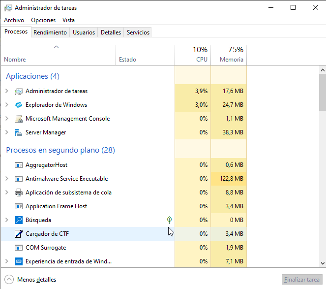

- **Rendimiento**: vemos los datos de uso de CPU, memoria y red así como sus gráficos. Desde aquí podemos abrir el Monitor de recursos.

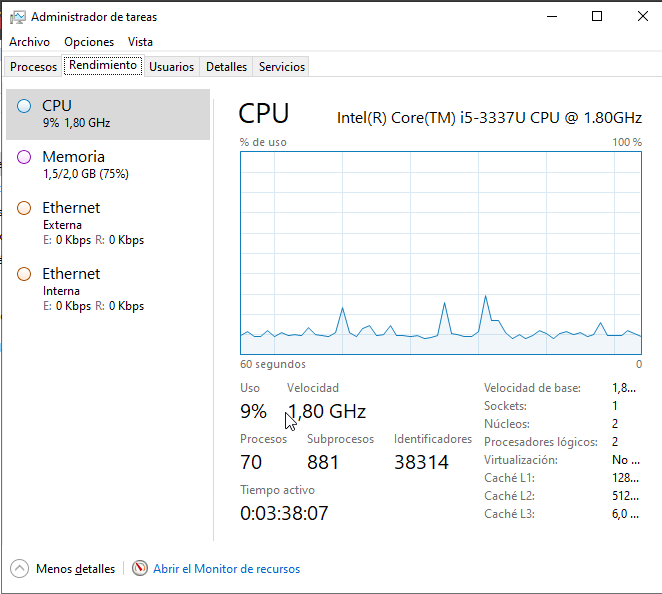

- **Usuarios**: nos muestra todos los procesos agrupados según el usuario que los haya abierto. Desde aquí podemos desconectar un usuario del sistema.
- **Detalles**: nos muestra todos los procesos con más información de cada uno (PID, estado, ...)

- **Servicios**: muestra todos los servicios de Windows, y de los arrancados nos muestra también su PID

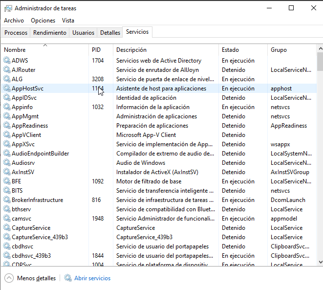

### Servicios
Al abrir la herramienta **Servicios** podemos ver todos los servicios del sistema con más información sobre los mismos.

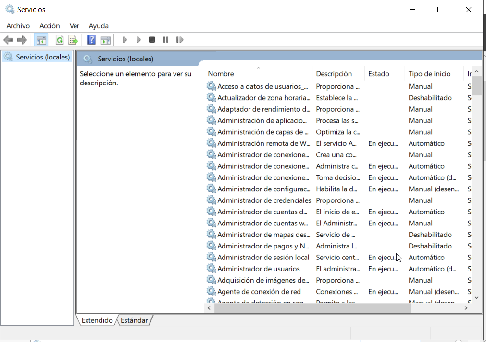

Si abrimos un servicio podemos pararlo, arrancarlo, ... y establecer cómo será su inicio

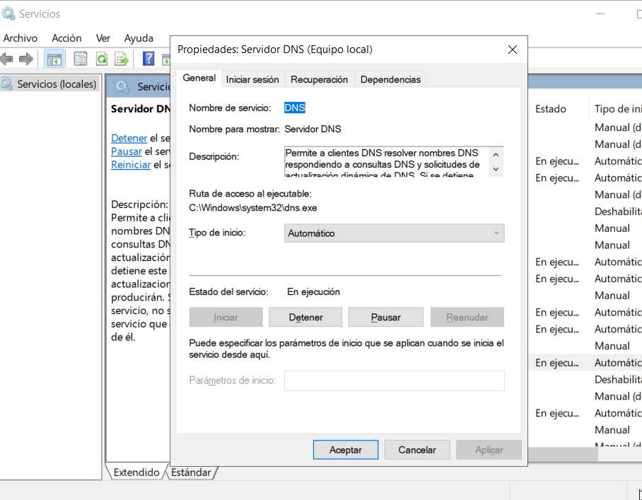

## Monitor de recursos
Es similar a la pestaña de _Rendimiento_ del _Administrador de tareas_ pero nos proporciona mucha más información sobre el uso de CPU, Disco, Red y Memoria por parte de los diferentes procesos en ejecución.

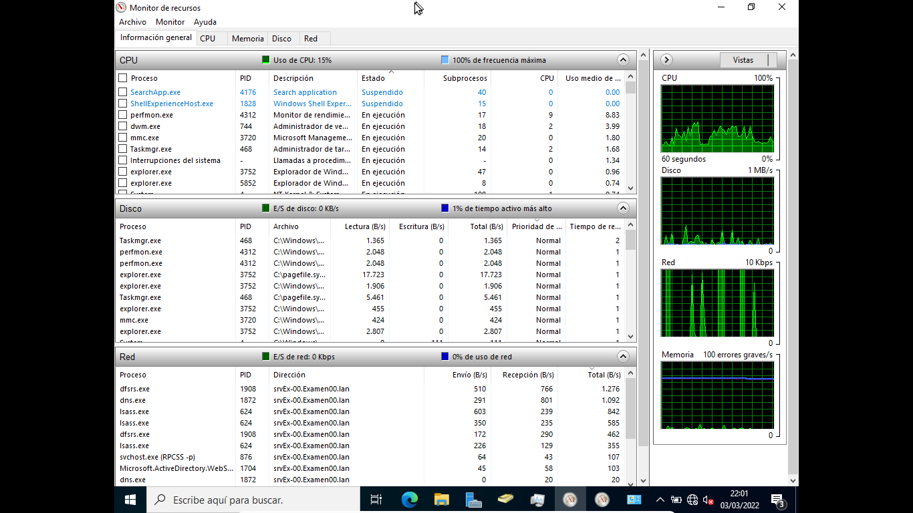

## Visor de eventos
Todos los sistemas Windows disponen de registros de eventos donde se almacenan todos los sucesos importantes del equipo. Podemos consultar estos registros con el _Visor de eventos_. Existen 2 tipos de registros:
- Registros de aplicaciones y servicios: aquí se recogen los eventos que afectan a una sola aplicación
- Registros de Windows: recogen eventos que afectan a todo el sistema. Son:
  - Eventos de aplicaciones: son los generados por las aplicaciones
  - Eventos de seguridad: registran cosas como inicios de sesión, etc
  - Eventos de instalación: los producidos al instalar el sistema o algún componente
  - Eventos del sistema: los que más consultaremos, producidos por los diferentes servicios
  - Eventos reenviados: producidos en otros equipos que los reenvían aquí

Según su gravedad pueden ser:
- crítico: error graves que no pueden recuperarse
- error: error importante
- advertencia: puede ser un problema
- información: sólo se registra un suceso

Ampliaremos esta información en el apartado de [logs del sistema](logs-win.md). 

## Monitor de confiabilidad
Muestra en un gráfico la confiabilidad del equipo, entre 1 (mínima) y 10 (máxima) en función de los problemas y cambios detectados a lo largo del tiempo.

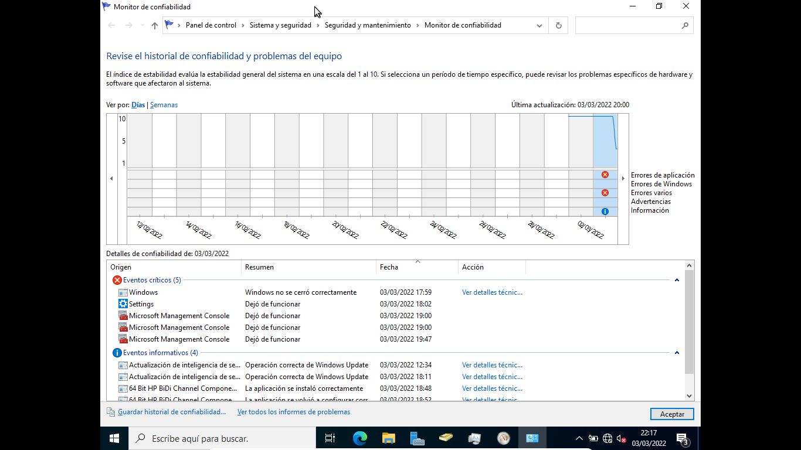

En la parte inferior muestra información sobre los eventos producidos y podemos hacer click sobre cualquiera para obtener más información del mismo.

Desde _Ver todos los informes de problemas_ obtenemos un listado de todos ellos y haciendo click sobre cualquiera obtenemos toda la información.

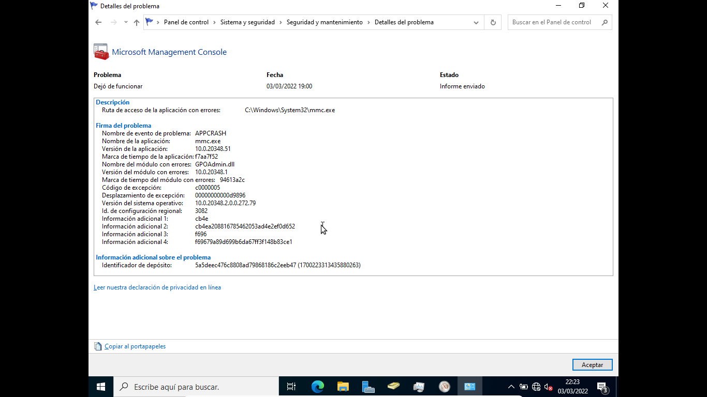

## Monitor de rendimiento
El Monitor de Rendimiento nos permite visualizar datos sobre el rendimiento tanto en tiempo real como desde recopilando datos de registro. Permite:
- Reunir datos de rendimiento en tiempo real del equipo local o de cualquier otro
- Ver los datos unificados en un registro de **contadores de rendimiento**
- Presentar los datos en un gráfico, histograma o informe
- Exportar los datos a aplicaciones de Microsoft Office
- Crear una página HTML a partir de las vistas de rendimiento.

La información que recoge se reúne en **Conjuntos de Recopiladores de datos** que recogen los datos de los equipos y crean informes de rendimiento. Estos conjuntos usan los siguientes tipos de recopiladores de datos:
- Contadores de rendimiento: son mediciones del estado o de la actividad del sistema
- Datos de seguimiento de eventos: se recopilan de componentes del sistema operativo o de aplicaciones que informan de acciones o eventos
- Información de configuración del sistema: valores de las claves del Registro de Windows
- Alerta de contador de rendimiento: permite definir unos contadores de rendimiento y lanzar una alerta si se supera alguno de los límites que se definan para dichos contadores.

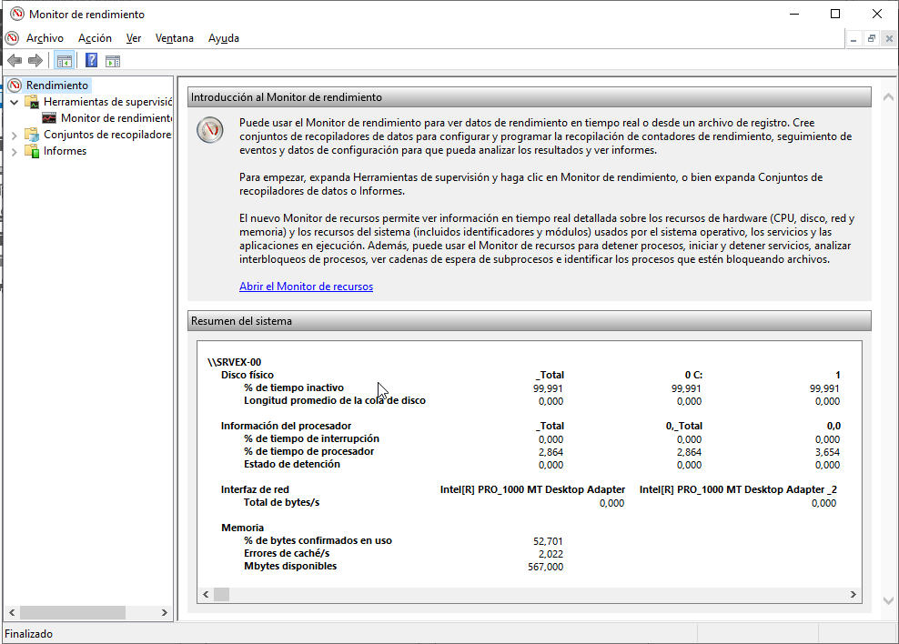

## Windows Update
Esta herramienta gestiona las actualizaciones del sistema y permite configurar:
- cuándo se descargarán las actualizaciones (se puede programar la hora o ponerlo en manual)
- si se instalan automáticamente o debe ser el administrador quien las instale. En un servidor debe ser el administrador quien decida cuándo instalar cada actualización ya que algunas pueden requerir el reinicio del sistema o incluso podrían acer que algo deje de funcionar correctamente
- opciones de reinicio: cuándo reinicar el equipo tras instalar una actualización que lo requiera: inmediatamente, manualmente por el administrador o a la hora programada aquí
- opciones avanzadas: permite indicar si descargar sólo actualizaciones de seguridad o también de características así como descargar también actualizaciones de otros programas de Microsoft

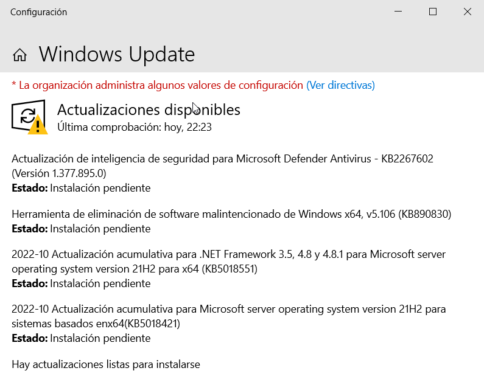

El servicio que gestiona esta herramienta se llama _Windows Update_ (**_wuausrv_**) y deberíamos tenerlo siempre activo.

También pueden configurarse las actualizaciones mediante una GPO que encontramos en **_'Configuración de equipo -> Plantillas adminitrativas -> Componentes de Windows -> Windows Update'_**, lo que nos permite configurar las actualizaciones de todos los equipos del sistema automáticamente.

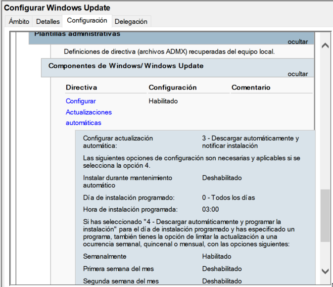

## Windows Admin Center (WAC)
El _Centro de Administración de Windows_ es una herramienta para administrar cualquier sistema Windows y que se ejecuta desde un navegador web. Cada vez que iniciamos el _Administrador del servidor_ nos aparece un mensaje animándonos a usar esta herramienta.

Para poder utilizarlo primero se tiene que instalar en la máquina desde la que vamos a administrar los servidores. Tenemos las instrucciones en la [documentación de Microsoft](https://docs.microsoft.com/es-es/windows-server/manage/windows-admin-center/deploy/install).

Por defecto utiliza el puerto 6516 pero podemos elegir cualquier otro. Al abrirlo por primera vez nos pregunta qué certificado usar: seleccionaremos _Windows Admin Cliente_. A continuación tenemos que **Agregar** los servidores que queramos administrar.

Al entrar a una máquina podemos ver información de la misma, parecido a como lo muestra el _Administrador del servidor_:

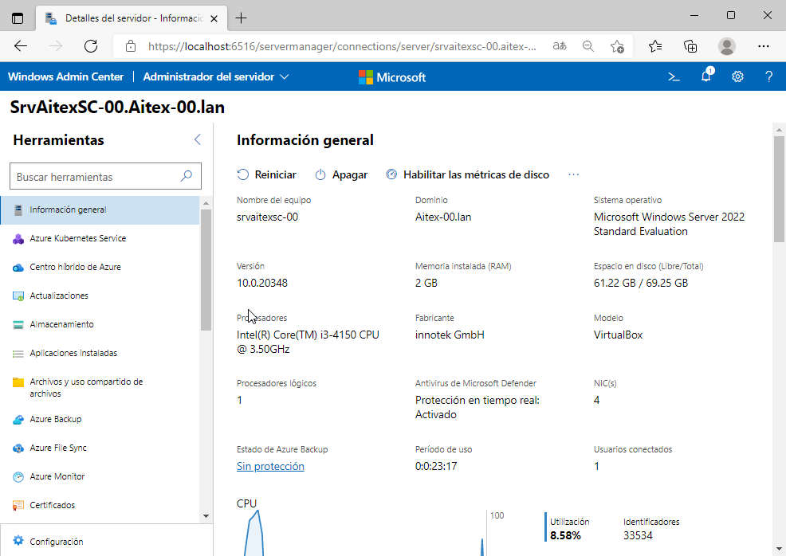

En la parte izquierda tenemos el menú. Algunas opciones importantes son:
- **Almacenamiento**: muestra los discos y volúmenes del equipo
- **Archivos y uso compartido**: tenemos un explorador de archivos y una pestaña para ver, crear y configurar recursos compartidos
- **Dispositivos**: similar al '_Administrador de dispositivos_
- **Eventos**: muestra la información del _Visor de eventos_
- **Roles y características**: para instalar o desinstalar roles en el equipo
- **Firewall**, **Powershell**, **Redes**, **Servicios**, **Tareas programadas**, ...

Podemos configurar más coses instalando extensiones como **Active directory** (para gestionar un dominio AD), **DHCP**, **DNS**, ...

Se hace desde `Configuración -> Extensiones`. Algunas necesitan también instalar alguna herramienta de RSAT pero nos lo dice al abrirla y se instala desde allí.

Podéis ampliar la información en:
- [Microsoft Windows Admin Center](https://docs.microsoft.com/es-es/windows-server/manage/windows-admin-center/overview)
- [Managing Windows Server - with Windows Admin Center (PDF)](https://www.thomas-krenn.com/redx/tools/mb_download.php/mid.y8757d34c910d1ce3/ebook_WindowsServer_AdminCenter_16_19_engl_verlinkt.pdf)

