# Bl4. UD1 - Monitorización del rendimiento en Windows Server
- [Bl4. UD1 - Monitorización del rendimiento en Windows Server](#bl4-ud1---monitorización-del-rendimiento-en-windows-server)
  - [1. Introducción a la monitorización del rendimiento](#1-introducción-a-la-monitorización-del-rendimiento)
  - [2. Herramientas de monitorización en Windows Server](#2-herramientas-de-monitorización-en-windows-server)
    - [2.1 Administrador de Tareas (`taskmgr.exe`)](#21-administrador-de-tareas-taskmgrexe)
    - [2.2 Monitor de Recursos (`resmon.exe`)](#22-monitor-de-recursos-resmonexe)
    - [2.3 Monitor de Rendimiento (`perfmon.exe`)](#23-monitor-de-rendimiento-perfmonexe)
      - [Contadores de rendimiento](#contadores-de-rendimiento)
      - [Umbrales de alerta orientativos](#umbrales-de-alerta-orientativos)
      - [Conjuntos de recopiladores de datos (Data Collector Sets)](#conjuntos-de-recopiladores-de-datos-data-collector-sets)
      - [Informes del sistema](#informes-del-sistema)
    - [2.4 Monitor de confiabilidad](#24-monitor-de-confiabilidad)
    - [2.5 Visor de eventos (`eventvwr.msc`)](#25-visor-de-eventos-eventvwrmsc)
      - [Propiedades de un evento](#propiedades-de-un-evento)
      - [Propiedades del archivo de registro](#propiedades-del-archivo-de-registro)
      - [Creación de Alertas con el Visor de Eventos](#creación-de-alertas-con-el-visor-de-eventos)
    - [2.5 Herramientas de línea de comandos](#25-herramientas-de-línea-de-comandos)
  - [3. Análisis de cuellos de botella y propuesta de soluciones](#3-análisis-de-cuellos-de-botella-y-propuesta-de-soluciones)
  - [4. Documentación del procedimiento](#4-documentación-del-procedimiento)
  - [5. Práctica propuesta — RA6](#5-práctica-propuesta--ra6)
    - [Práctica 6.1: Monitorización con perfmon y diagnóstico de cuellos de botella](#práctica-61-monitorización-con-perfmon-y-diagnóstico-de-cuellos-de-botella)

## 1. Introducción a la monitorización del rendimiento

La monitorización del rendimiento consiste en observar y registrar de forma continua el estado de los recursos del sistema (CPU, memoria, disco, red) para detectar situaciones anómalas, anticipar problemas y garantizar que el servidor funciona de manera eficiente.

Un administrador de sistemas no debería actuar solo de forma reactiva (cuando ya hay un problema visible), sino de manera **proactiva**: establecer umbrales de alerta, revisar registros periódicamente y actuar antes de que los problemas afecten a los usuarios.

Los principales indicadores de rendimiento que hay que vigilar son:

- **CPU (procesador):** porcentaje de uso total, tiempo en modo kernel y en modo usuario, colas de procesos esperando CPU.
- **Memoria RAM:** memoria disponible, fallos de página, uso de memoria virtual (archivo de paginación).
- **Disco:** lecturas/escrituras por segundo, tiempo medio de acceso, cola de disco, espacio libre.
- **Red:** bytes enviados y recibidos por segundo, errores de interfaz, colisiones.

---

## 2. Herramientas de monitorización en Windows Server

### 2.1 Administrador de Tareas (`taskmgr.exe`)

Es la herramienta más inmediata para obtener una visión rápida del estado del sistema. Se abre con `Ctrl + Shift + Esc` o desde el menú contextual de la barra de tareas.

**Limitación:** el Administrador de Tareas solo muestra el estado actual, no permite registrar datos en el tiempo ni generar informes.

Sus pestañas más relevantes para el rendimiento son:

- **Procesos:** lista todos los procesos activos con su consumo de CPU, memoria, disco y red. Permite finalizar procesos bloqueados o identificar cuál está consumiendo recursos en exceso.

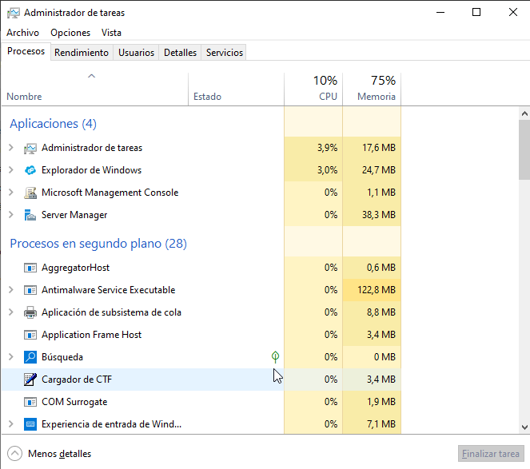

- **Rendimiento:** muestra gráficas en tiempo real de CPU, memoria, disco y red. Es especialmente útil para detectar picos puntuales.

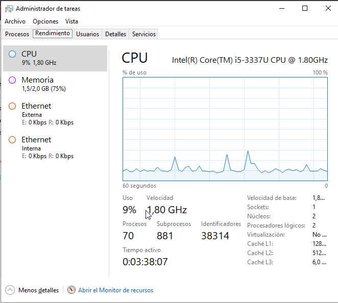

- **Detalles:** versión más detallada de la pestaña Procesos, con PID, estado y prioridad de cada proceso.

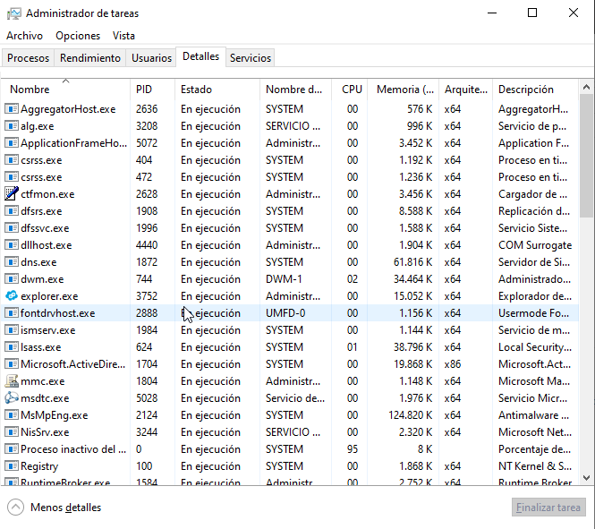

- **Servicios:** lista los servicios del sistema con su estado (en ejecución / detenido).

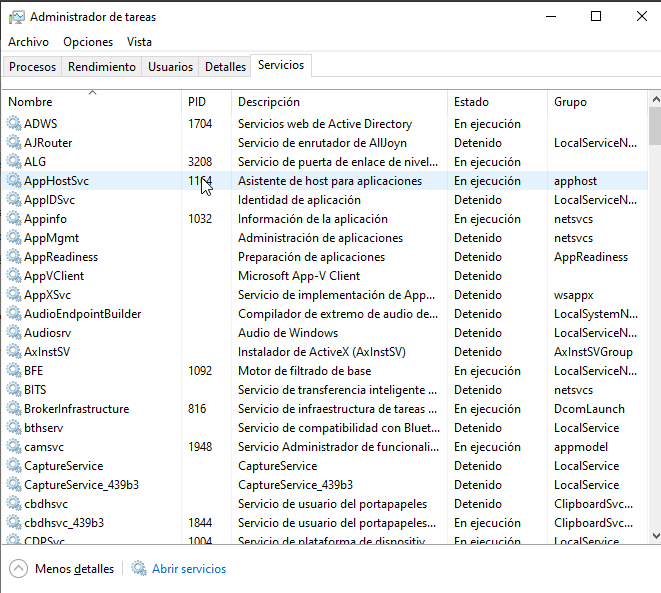

Aunque el Administrador de Tareas es útil para detectar si un servicio está consumiendo recursos excesivos, para gestionar los servicios es más recomendable usar la herramienta `services.msc`:

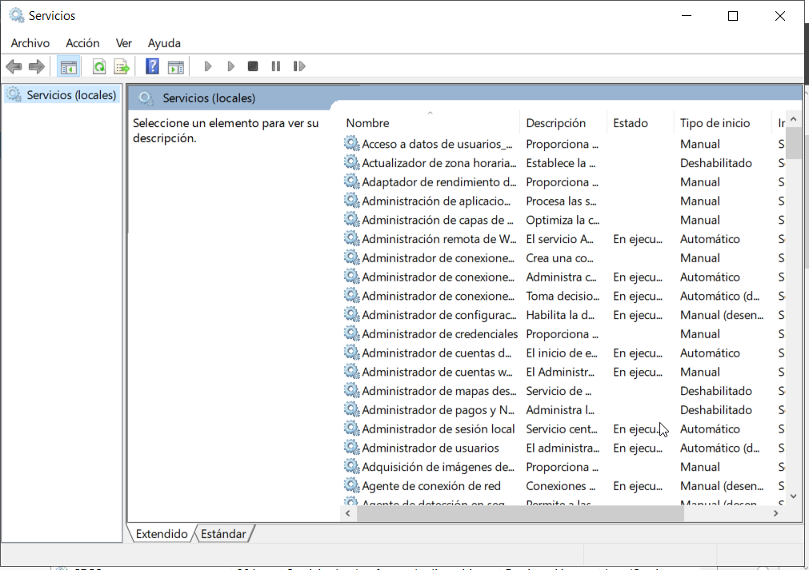

Si abrimos un servicio podemos pararlo, arrancarlo, … y establecer cómo será su inicio (automático, manual o deshabilitado). Esto es fundamental para optimizar el rendimiento, ya que muchos servicios no son necesarios en todos los servidores y pueden consumir recursos innecesariamente.


---

### 2.2 Monitor de Recursos (`resmon.exe`)

El Monitor de Recursos ofrece una visión más detallada que el Administrador de Tareas. Se accede desde la pestaña Rendimiento del Administrador de Tareas (botón "Abrir Monitor de recursos") o ejecutando `resmon` en el cuadro Ejecutar.

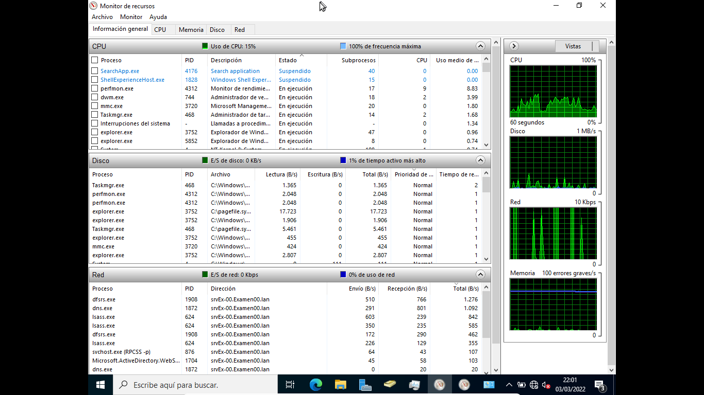

Está organizado en cuatro secciones:

- **CPU:** muestra los procesos activos y los servicios asociados a cada uno, así como el historial de uso por núcleo.
- **Memoria:** muestra en tiempo real la memoria en uso, la memoria en espera (caché) y la libre. Es muy útil para detectar fugas de memoria.
- **Disco:** muestra qué procesos están leyendo o escribiendo en disco, con la ruta del archivo accedido y la velocidad de transferencia.
- **Red:** muestra las conexiones de red activas por proceso, con la dirección remota y el volumen de datos transferidos.

**Ventaja sobre el Administrador de Tareas:** permite ver con precisión qué proceso concreto está causando un uso elevado de disco o red.

---

### 2.3 Monitor de Rendimiento (`perfmon.exe`)

El Monitor de Rendimiento es la herramienta más potente para monitorización avanzada en Windows Server. Se abre ejecutando `perfmon` o desde las Herramientas administrativas del Administrador del servidor.

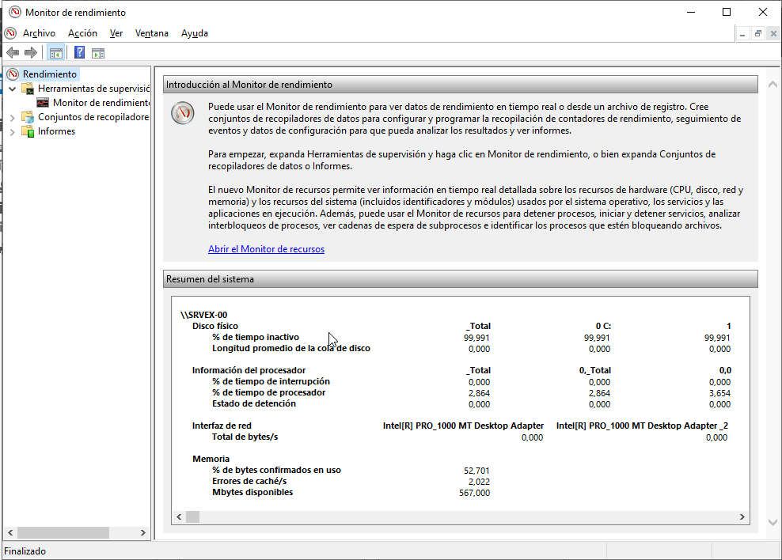

#### Contadores de rendimiento

Un **contador de rendimiento** es una métrica específica que el sistema puede medir y registrar. Están organizados en **objetos** (por ejemplo, el objeto `Processor` agrupa todos los contadores relacionados con el procesador).

Los contadores más importantes a conocer son:

| Objeto | Contador | Descripción |
|--------|----------|-------------|
| Processor | % Processor Time | Porcentaje de tiempo que la CPU está activa |
| Processor | % Privileged Time | Tiempo en modo kernel (sistema operativo) |
| Memory | Available MBytes | Memoria RAM libre disponible |
| Memory | Pages/sec | Páginas de memoria intercambiadas por segundo con el disco |
| PhysicalDisk | % Disk Time | Porcentaje de tiempo que el disco está ocupado |
| PhysicalDisk | Avg. Disk Queue Length | Número medio de operaciones esperando acceso al disco |
| Network Interface | Bytes Total/sec | Tráfico de red total por segundo |
| System | Processor Queue Length | Número de hilos esperando tiempo de CPU |

#### Umbrales de alerta orientativos

| Recurso | Indicador de problema |
|---------|-----------------------|
| CPU | `% Processor Time` sostenido por encima del 85% durante varios minutos |
| Memoria | `Available MBytes` por debajo de 100 MB de forma continuada |
| Memoria | `Pages/sec` de forma constante por encima de 20 |
| Disco | `Avg. Disk Queue Length` superior a 2 de forma sostenida |
| Red | Utilización de la interfaz por encima del 80% de su capacidad |

#### Conjuntos de recopiladores de datos (Data Collector Sets)

Los **conjuntos de recopiladores de datos** permiten automatizar la recogida de contadores a lo largo del tiempo y guardar los resultados para su análisis posterior. Son imprescindibles para detectar problemas que no se manifiestan de forma constante (por ejemplo, un cuello de botella que aparece solo en horas punta).

Para crear uno:

1. Abrir `perfmon` → expandir "Conjuntos de recopiladores de datos" → "Definido por el usuario".
2. Hacer clic derecho → "Nuevo" → "Conjunto de recopiladores de datos".
3. Seleccionar "Crear manualmente (avanzado)".
4. Añadir los contadores deseados y configurar el intervalo de muestreo (por ejemplo, cada 15 segundos).
5. Establecer una duración o una hora de parada programada.
6. Los datos se guardan como archivos `.blg` que pueden visualizarse desde el propio `perfmon`.

#### Informes del sistema

El Monitor de Rendimiento incluye informes predefinidos en "Conjuntos de recopiladores de datos" → "Sistema":

- **System Diagnostics:** genera un informe completo del hardware, software, servicios y contadores de rendimiento. Muy útil como diagnóstico inicial.
- **System Performance:** recoge datos de rendimiento durante 60 segundos y genera un informe con los cuellos de botella detectados.

---

### 2.4 Monitor de confiabilidad

Muestra en un gráfico la confiabilidad del equipo, entre 1 (mínima) y 10 (máxima) en función de los problemas y cambios detectados a lo largo del tiempo.

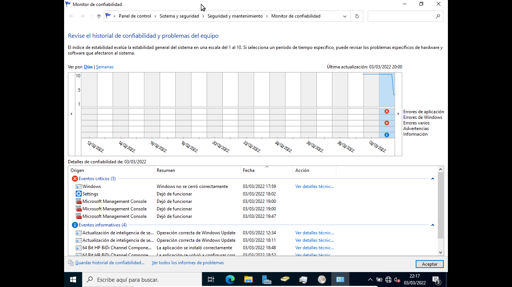

En la parte inferior muestra información sobre los eventos producidos y podemos hacer click sobre cualquiera para obtener más información del mismo.

Desde Ver todos los informes de problemas obtenemos un listado de todos ellos y haciendo click sobre cualquiera obtenemos toda la información.

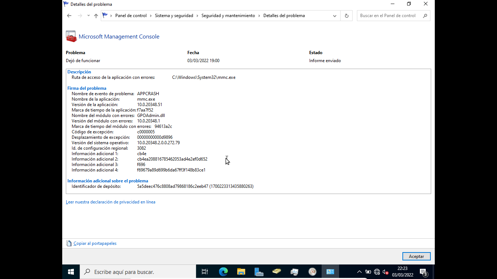

### 2.5 Visor de eventos (`eventvwr.msc`)

El Visor de eventos registra todos los sucesos relevantes del sistema operativo, las aplicaciones y los servicios de seguridad. Es una fuente de información fundamental tanto para la monitorización como para la auditoría.

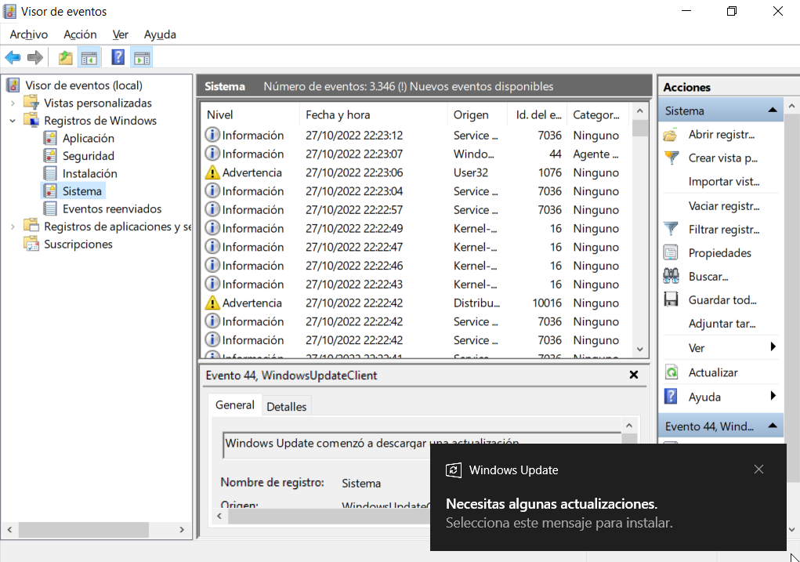

La estructura principal de registros es:

- **Registros de Windows:**
  - **Sistema:** eventos generados por los componentes del sistema operativo y los controladores (errores de hardware, fallos de servicios, reinicios inesperados...).
  - **Aplicación:** eventos generados por las aplicaciones instaladas.
  - **Seguridad:** eventos de auditoría (inicios de sesión, accesos a objetos...). Solo visible para administradores.
  - **Instalación:** eventos relacionados con la instalación de roles y características.
- **Registros de aplicaciones y servicios:** eventos específicos de componentes como Active Directory, DNS, Hyper-V, etc.

Los eventos se clasifican por nivel de gravedad:

| Nivel | Descripción |
|-------|-------------|
| Crítico | Error grave, posiblemente requiere reinicio |
| Error | Fallo que impide el funcionamiento correcto de un componente |
| Advertencia | Situación anómala que no impide el funcionamiento pero puede derivar en un error |
| Información | Evento rutinario (inicio de servicio, inicio de sesión correcto...) |
| Detallado (Verbose) | Información de diagnóstico avanzado |

**Filtrar eventos:** el Visor de eventos permite filtrar por nivel, fecha, origen y código de evento. Esto es esencial para no perderse entre los cientos de entradas que puede generar un servidor activo.

**Suscripciones de eventos:** en entornos con varios servidores, es posible configurar suscripciones para centralizar los eventos de múltiples equipos en un único visor, lo que facilita la administración.

#### Propiedades de un evento

Al hacer doble clic sobre un evento podemos ver toda la información del mismo, que incluye:

    Event ID: identificador único del evento
    Source (origen): qué aplicación / servicio / componente lo ha generado.
    Fecha y hora del evento
    Nivel (Level): tipo (Information, Warning, Error, Critical, etc.) según severidad
    Usuario (si aplica): qué usuario generó el evento (p. ej. login, permisos).
    Descripción / Mensaje: detalle de qué ha sucedido, con información concreta, códigos de error, paths, etc.

Incluye un enlace de ayuda que envía la información del evento en Microsoft y nos abra el explorador de Internet con información sobre el evento de la web de Microsoft.

#### Propiedades del archivo de registro

Si seleccionamos un registro en el Visor de eventos y desde su menú contextual elegimos Propiedades nos aparece toda la información del registro:

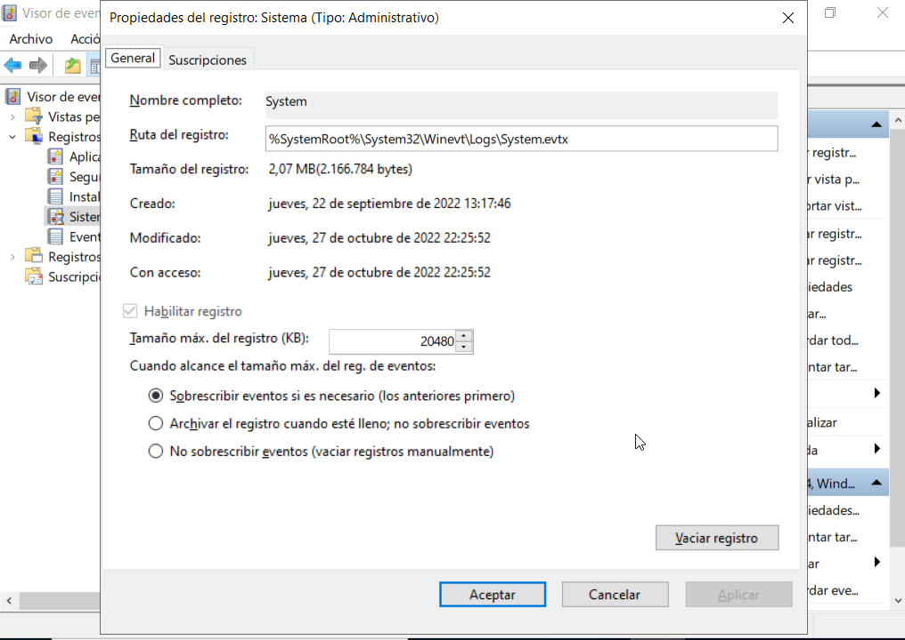

Desde aquí podemos ver donde se guarda el archivo y su tamaño e indicamos qué hacer cuando llego a su tamaño máxima, si queremos sobrescribir los eventos más antiguos o guardar una copia del registro.

También desde su menú contextual tenemos la opción de vaciar registro que nos permite guardar una copia del registro antes de vaciarlo o simplemente borrar todo su contenido. La opción de Guardar eventos guarda una copia del registro pero sin vaciarlo posteriormente.

#### Creación de Alertas con el Visor de Eventos

Windows permite crear alertas cuando se detectan eventos críticos.

Ejemplo: Notificación de intentos de acceso fallidos (ID 4625)

    Win + R → eventvwr
    Registros de Windows → Seguridad
    Buscar eventos con ID 4625 (inicio de sesión fallido).
    Clic derecho → Adjuntar tarea a este evento.
    Configurar una acción (enviar correo, ejecutar un script, mostrar mensaje).

Casos de uso:

    Detectar intentos de acceso no autorizados.
    Supervisar cambios en cuentas de usuario.
    Alertar sobre errores críticos del sistema.

---

### 2.5 Herramientas de línea de comandos

Aunque las herramientas gráficas son las más habituales en clase, un administrador profesional también debe conocer las alternativas en línea de comandos, especialmente útiles para scripting y administración remota.

`typeperf` permite recoger contadores de rendimiento desde la consola. Por ejemplo:

```
typeperf "\Processor(_Total)\% Processor Time" -sc 10
```

Esto muestra el uso de CPU cada segundo durante 10 muestras.

`wmic` (Windows Management Instrumentation Command-line) permite consultar información del sistema:

```
wmic cpu get loadpercentage
wmic OS get FreePhysicalMemory,TotalVisibleMemorySize
```

`Get-Counter` en PowerShell es la alternativa moderna a `typeperf`:

```powershell
Get-Counter "\Processor(_Total)\% Processor Time" -SampleInterval 2 -MaxSamples 5
```

---

## 3. Análisis de cuellos de botella y propuesta de soluciones

Cuando se detecta un problema de rendimiento, el proceso de diagnóstico debe ser sistemático. Lo más habitual es seguir este orden:

**Cuello de botella en CPU:** si el porcentaje de uso de procesador es sistemáticamente alto, primero hay que identificar qué proceso lo consume (Administrador de Tareas → Detalles). Si es un proceso legítimo, las soluciones posibles son añadir más núcleos/procesadores, optimizar la aplicación, o distribuir la carga entre varios servidores.

**Cuello de botella en memoria:** si la memoria disponible es baja y `Pages/sec` es elevado, el sistema está usando el disco como memoria virtual, lo que degrada enormemente el rendimiento. La solución principal es añadir más RAM. Como medida temporal, se puede aumentar el tamaño del archivo de paginación (aunque esto no resuelve el problema de fondo).

**Cuello de botella en disco:** una cola de disco elevada indica que los procesos esperan para acceder al almacenamiento. Las soluciones pasan por sustituir discos HDD por SSD, usar RAID para distribuir lecturas/escrituras, o separar los datos del sistema operativo en discos distintos.

**Cuello de botella en red:** una interfaz de red saturada puede resolverse aumentando el ancho de banda (cambiando a 10 Gbps, por ejemplo), optimizando la aplicación para reducir el tráfico, o usando balanceo de carga.

---

## 4. Documentación del procedimiento

Toda tarea de monitorización debe quedar documentada. Un informe de monitorización debe incluir como mínimo:

- Fecha, hora y duración del periodo de observación.
- Herramienta utilizada y contadores recogidos.
- Valores obtenidos y comparación con los umbrales de referencia.
- Identificación de anomalías detectadas.
- Diagnóstico: recurso afectado y posible causa.
- Propuesta de acción correctiva.

---

## 5. Práctica propuesta — RA6

### Práctica 6.1: Monitorización con perfmon y diagnóstico de cuellos de botella

**Objetivo:** usar las herramientas de Windows para monitorizar el sistema, detectar un cuello de botella artificial y proponer una solución.

**Desarrollo:**

1. Abrir el Monitor de Rendimiento (`perfmon`) y crear un conjunto de recopiladores de datos con los siguientes contadores: `% Processor Time`, `Available MBytes`, `Pages/sec`, `% Disk Time`, `Avg. Disk Queue Length`.
2. Configurar un intervalo de muestreo de 15 segundos y una duración de 5 minutos.
3. Mientras se recopilan datos, provocar carga artificial en el sistema: abrir varias máquinas virtuales simultáneamente, copiar archivos grandes o ejecutar `stress-ng` desde PowerShell si está disponible.
4. Detener el recopilador y analizar el informe en perfmon.
5. Identificar qué recurso sufrió mayor presión.
6. Ejecutar el informe "System Diagnostics" y revisarlo.
7. Redactar un informe de monitorización con los resultados y proponer mejoras.

**Entrega:** capturas de pantalla del Monitor de Rendimiento con los datos recogidos + informe escrito con el diagnóstico y las propuestas de mejora.

---
