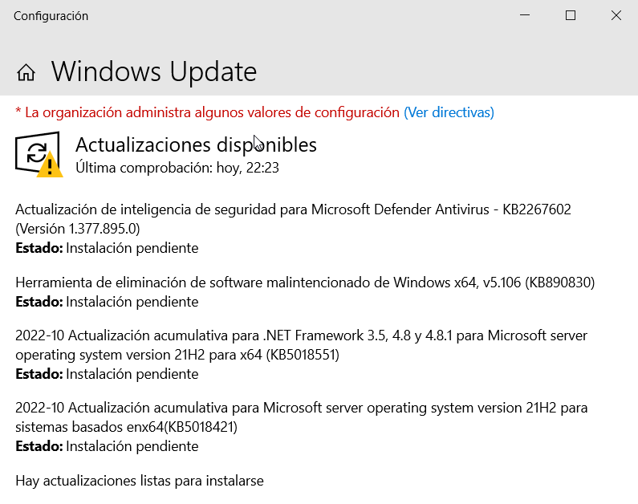
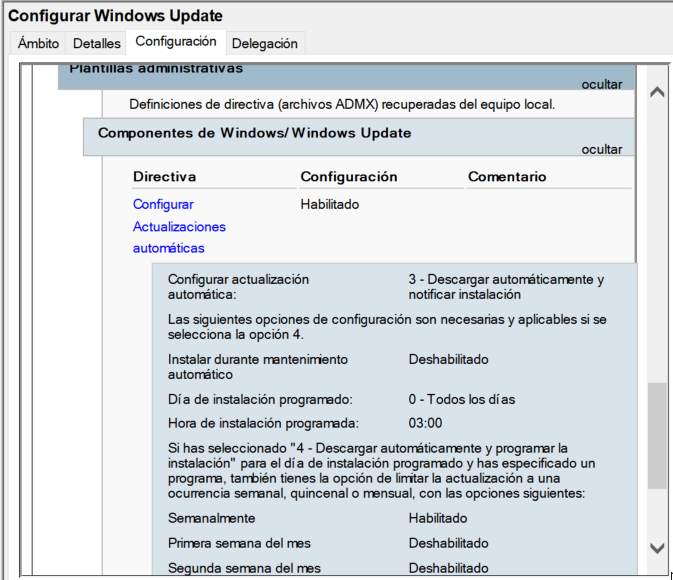

# Bl4. UD3: Sistemas de actualización y gestión de incidencias
- [Bl4. UD3: Sistemas de actualización y gestión de incidencias](#bl4-ud3-sistemas-de-actualización-y-gestión-de-incidencias)
- [Windows Update](#windows-update)
  - [Windows Server Update Services (WSUS)](#windows-server-update-services-wsus)
- [Diagnóstico y resolución de incidencias en Windows](#diagnóstico-y-resolución-de-incidencias-en-windows)
  - [Herramientas de información del sistema](#herramientas-de-información-del-sistema)
    - [Información del sistema (`msinfo32`)](#información-del-sistema-msinfo32)
    - [Administrador de dispositivos (`devmgmt.msc`)](#administrador-de-dispositivos-devmgmtmsc)
    - [Comprobador de archivos del sistema (`sfc /scannow`)](#comprobador-de-archivos-del-sistema-sfc-scannow)
    - [Administración y mantenimiento de imágenes de implementación (`DISM`)](#administración-y-mantenimiento-de-imágenes-de-implementación-dism)
    - [Comprobación de disco (`chkdsk`)](#comprobación-de-disco-chkdsk)
    - [Monitor de confiabilidad](#monitor-de-confiabilidad)
    - [Herramientas de diagnóstico de memoria (`mdsched.exe`)](#herramientas-de-diagnóstico-de-memoria-mdschedexe)
    - [Herramientas de red para diagnóstico](#herramientas-de-red-para-diagnóstico)
    - [Herramientas de administración remota](#herramientas-de-administración-remota)
      - [Escritorio Remoto (RDP / `mstsc.exe`)](#escritorio-remoto-rdp--mstscexe)
      - [Asistencia remota de Windows (`msra.exe`)](#asistencia-remota-de-windows-msraexe)
      - [Herramientas de administración remota del servidor (RSAT)](#herramientas-de-administración-remota-del-servidor-rsat)
      - [Windows Admin Center (WAC)](#windows-admin-center-wac)
      - [PowerShell Remoting (`Enter-PSSession` / `Invoke-Command`)](#powershell-remoting-enter-pssession--invoke-command)
  - [Resumen: qué herramienta usar según el síntoma](#resumen-qué-herramienta-usar-según-el-síntoma)
  - [Práctica propuesta](#práctica-propuesta)
- [Introducción al inventario TI](#introducción-al-inventario-ti)
  - [Herramientas nativas de Windows para inventario](#herramientas-nativas-de-windows-para-inventario)
    - [WMIC (Windows Management Instrumentation Command-line)](#wmic-windows-management-instrumentation-command-line)
    - [PowerShell para inventario](#powershell-para-inventario)
    - [Registro de Windows](#registro-de-windows)
  - [OCS Inventory NG](#ocs-inventory-ng)
  - [Gestión de licencias de software](#gestión-de-licencias-de-software)
    - [Tipos de licencias en entornos Windows](#tipos-de-licencias-en-entornos-windows)
    - [KMS (Key Management Service)](#kms-key-management-service)
    - [Inventario de licencias con PowerShell](#inventario-de-licencias-con-powershell)
  - [Práctica propuesta: Inventario con PowerShell y OCS Inventory](#práctica-propuesta-inventario-con-powershell-y-ocs-inventory)
- [Documentación de procedimientos e incidencias](#documentación-de-procedimientos-e-incidencias)
  - [Importancia de la documentación](#importancia-de-la-documentación)
  - [Registro de incidencias (tickets)](#registro-de-incidencias-tickets)
  - [Herramientas de gestión de tickets](#herramientas-de-gestión-de-tickets)
    - [GLPI (Gestionnaire Libre de Parc Informatique)](#glpi-gestionnaire-libre-de-parc-informatique)
    - [Alternativas](#alternativas)
  - [Procedimientos operativos estándar (SOP)](#procedimientos-operativos-estándar-sop)
  - [Práctica propuesta: Registro de incidencias con GLPI](#práctica-propuesta-registro-de-incidencias-con-glpi)
- [Elaboración de manuales de procedimientos e incidencias](#elaboración-de-manuales-de-procedimientos-e-incidencias)
  - [Tipos de documentación técnica](#tipos-de-documentación-técnica)
  - [Principios de una buena documentación técnica](#principios-de-una-buena-documentación-técnica)
  - [Estructura de un manual de incidencias frecuentes](#estructura-de-un-manual-de-incidencias-frecuentes)
  - [Ejemplo de entrada en un manual de incidencias](#ejemplo-de-entrada-en-un-manual-de-incidencias)
    - [Incidencia: El usuario no puede iniciar sesión — "El nombre de usuario o la contraseña son incorrectos"](#incidencia-el-usuario-no-puede-iniciar-sesión--el-nombre-de-usuario-o-la-contraseña-son-incorrectos)
  - [Práctica propuesta: Elaboración de un manual de procedimientos e incidencias](#práctica-propuesta-elaboración-de-un-manual-de-procedimientos-e-incidencias)
  - [Recursos y herramientas para documentar](#recursos-y-herramientas-para-documentar)
- [Referencias y recursos adicionales](#referencias-y-recursos-adicionales)


---

# Windows Update
Es la herramienta que gestiona las actualizaciones del sistema y permite configurar:
- cuándo se descargarán las actualizaciones (se puede programar la hora o ponerlo en manual)
- si se instalan automáticamente o debe ser el administrador quien las instale. En un servidor debe ser el administrador quien decida cuándo instalar cada actualización ya que algunas pueden requerir el reinicio del sistema o incluso podrían acer que algo deje de funcionar correctamente
- opciones de reinicio: cuándo reinicar el equipo tras instalar una actualización que lo requiera: inmediatamente, manualmente por el administrador o a la hora programada aquí
- opciones avanzadas: permite indicar si descargar sólo actualizaciones de seguridad o también de características así como descargar también actualizaciones de otros programas de Microsoft



El servicio que gestiona esta herramienta se llama _Windows Update_ (**_wuausrv_**) y deberíamos tenerlo siempre activo.

También pueden configurarse las actualizaciones mediante una GPO que encontramos en **_'Configuración de equipo -> Plantillas adminitrativas -> Componentes de Windows -> Windows Update'_**, lo que nos permite configurar las actualizaciones de todos los equipos del sistema automáticamente.



## Windows Server Update Services (WSUS)
WSUS es una solución de gestión de actualizaciones de Microsoft que permite a los administradores controlar y distribuir actualizaciones del sistema operativo y otros productos de Microsoft a través de una red local, mejorando la eficiencia y el control sobre las actualizaciones en entornos empresariales.

Vimos cómo se configura en la [UD 6 del bloque 2](../../bloque2/ud06/wsus.md).

# Diagnóstico y resolución de incidencias en Windows

Ante cualquier incidencia en un sistema Windows, el primer paso siempre es **recopilar información** antes de actuar. Actuar sin diagnóstico previo suele agravar el problema o generar nuevas incidencias. El proceso lógico es:

1. Identificar los síntomas (qué falla, desde cuándo, en qué equipos).
2. Recopilar información con herramientas de diagnóstico.
3. Analizar la información y formular una hipótesis.
4. Aplicar la solución.
5. Verificar que el problema está resuelto.
6. Documentar todo el proceso.

---

## Herramientas de información del sistema

### Información del sistema (`msinfo32`)

`msinfo32` genera un informe completo del hardware y software del equipo. Se ejecuta desde el cuadro Ejecutar (`Win + R`) o desde el menú Inicio.

Proporciona información organizada en tres grandes bloques:

- **Recursos del sistema:** resumen del hardware (procesador, BIOS, RAM, pantalla), sistema operativo y configuración básica.
- **Componentes:** dispositivos de hardware instalados (almacenamiento, red, puertos, sonido...) con su estado y controlador asociado.
- **Entorno de software:** programas de inicio automático, controladores instalados, variables de entorno, tareas programadas, servicios en ejecución.

Es especialmente útil para detectar dispositivos con problemas, conocer la versión exacta del sistema operativo y exportar un informe completo del equipo antes de intervenir.

Para exportar el informe: menú Archivo → Guardar como → formato `.nfo` o `.txt`.

---

### Administrador de dispositivos (`devmgmt.msc`)

Permite ver todos los dispositivos de hardware instalados y su estado. Los dispositivos con problemas aparecen marcados con una exclamación amarilla (problema con el controlador o conflicto de recursos) o una X roja (dispositivo deshabilitado).

Desde el Administrador de dispositivos se puede:

- Ver el controlador instalado y su versión.
- Actualizar o revertir un controlador.
- Deshabilitar o habilitar un dispositivo.
- Buscar cambios de hardware (detectar dispositivos nuevos sin reiniciar).
- Ver los recursos asignados (IRQ, puertos de E/S) para detectar conflictos.

---

### Comprobador de archivos del sistema (`sfc /scannow`)

`sfc` (System File Checker) analiza todos los archivos protegidos del sistema operativo y reemplaza automáticamente los que estén dañados o modificados por versiones incorrectas, utilizando una copia almacenada en caché del sistema.

Se ejecuta desde una consola con privilegios de administrador:

```
sfc /scannow
```

El proceso puede tardar varios minutos. Al terminar informa de si se encontraron y repararon archivos dañados, si se encontraron pero no se pudieron reparar, o si todo está correcto. El log detallado se guarda en:

```
%windir%\Logs\CBS\CBS.log
```

---

### Administración y mantenimiento de imágenes de implementación (`DISM`)

`DISM` (Deployment Image Servicing and Management) permite reparar la imagen de Windows cuando `sfc` no puede hacerlo porque la propia caché del sistema está dañada. Descarga los archivos de reparación directamente desde Windows Update (o desde una imagen ISO si no hay conexión a Internet).

Secuencia de uso recomendada:

```
# Paso 1: comprobar el estado de la imagen
DISM /Online /Cleanup-Image /CheckHealth

# Paso 2: escanear en busca de daños
DISM /Online /Cleanup-Image /ScanHealth

# Paso 3: reparar (descarga los archivos necesarios de Windows Update)
DISM /Online /Cleanup-Image /RestoreHealth
```

Después de ejecutar `DISM /RestoreHealth` con éxito, se recomienda volver a ejecutar `sfc /scannow` para que repare los archivos del sistema con la imagen ya restaurada.

---

### Comprobación de disco (`chkdsk`)

`chkdsk` analiza el sistema de archivos y los sectores físicos de un volumen en busca de errores. Puede ejecutarse en modo solo lectura (sin parámetros) o en modo reparación:

```
# Solo lectura (no requiere reinicio, no repara)
chkdsk C:

# Reparación de errores del sistema de archivos (requiere reinicio si el volumen está en uso)
chkdsk C: /f

# Reparación + análisis y recuperación de sectores defectuosos
chkdsk C: /f /r
```

> **Importante:** `chkdsk /r` puede tardar horas en discos grandes. Se recomienda ejecutarlo antes de una intervención programada, no en producción en directo.

---

### Monitor de confiabilidad

El Monitor de confiabilidad muestra un historial visual de la estabilidad del sistema a lo largo del tiempo, con todos los eventos que han afectado al funcionamiento: instalaciones, desinstalaciones, actualizaciones, errores de aplicación, fallos del sistema y reinicios.

Se accede desde: Panel de control → Sistema y seguridad → Herramientas administrativas → Monitor de confiabilidad, o ejecutando `perfmon /rel`.

El gráfico muestra una puntuación de estabilidad del 1 al 10. Haciendo clic en cualquier día se ven los eventos concretos de esa jornada. Es muy útil para correlacionar cuándo empezó un problema con qué cambio se hizo ese día en el sistema.

---

### Herramientas de diagnóstico de memoria (`mdsched.exe`)

El Diagnóstico de memoria de Windows permite detectar errores en los módulos RAM. Se ejecuta con `mdsched.exe` y ofrece dos opciones: reiniciar ahora y comprobar, o comprobar en el próximo reinicio.

Durante el análisis se ejecutan una serie de pruebas (básicas, estándar o extendidas). Si detecta errores, lo indica al volver a Windows mediante una notificación en el Visor de Eventos (buscar el evento con origen `MemoryDiagnostics-Results` en el registro Sistema).

---

### Herramientas de red para diagnóstico

Un bloque importante de incidencias está relacionado con la conectividad de red. Las herramientas integradas más útiles son:

| Comando | Función |
|---------|---------|
| `ipconfig /all` | Muestra la configuración completa de red de todas las interfaces |
| `ipconfig /release` y `/renew` | Libera y renueva la dirección IP obtenida por DHCP |
| `ipconfig /flushdns` | Vacía la caché de resolución DNS local |
| `ping <destino>` | Comprueba conectividad básica y latencia |
| `tracert <destino>` | Traza la ruta de paquetes hasta el destino, mostrando cada salto |
| `nslookup <nombre>` | Consulta la resolución DNS de un nombre de dominio |
| `netstat -ano` | Muestra conexiones activas, puertos en escucha y el PID del proceso asociado |
| `pathping <destino>` | Combina ping y tracert, calculando estadísticas de pérdida en cada salto |
| `arp -a` | Muestra la tabla ARP (relación IP → MAC de equipos conocidos) |
| `netsh winsock reset` | Reinicia la pila TCP/IP (útil ante problemas de conectividad persistentes) |

---

### Herramientas de administración remota

En entornos profesionales, la mayor parte de las incidencias se resuelven de forma remota sin desplazarse físicamente al equipo. Windows ofrece varias opciones:

#### Escritorio Remoto (RDP / `mstsc.exe`)

El Escritorio Remoto permite tomar el control completo de un equipo remoto como si se estuviera sentado frente a él. Usa el protocolo RDP (Remote Desktop Protocol) y escucha por defecto en el puerto TCP 3389.

Para habilitarlo en Windows Server:

1. Administrador del servidor → Servidor local → Escritorio remoto: hacer clic en "Deshabilitado" para habilitarlo.
2. Alternativamente: `sysdm.cpl` → pestaña "Acceso remoto" → activar "Permitir conexiones remotas a este equipo".
3. Asegurarse de que el Firewall de Windows permite el tráfico en el puerto 3389.
4. Añadir al usuario que necesita conectarse al grupo **Usuarios de escritorio remoto** (si no es administrador).

Para conectarse desde el cliente: ejecutar `mstsc`, introducir el nombre o IP del equipo remoto y las credenciales.

> **Nota de seguridad:** se recomienda activar la opción "Permitir conexiones solo desde equipos que ejecuten Escritorio Remoto con Autenticación a nivel de red (NLA)". Esto evita que equipos no autenticados siquiera inicien la negociación de sesión.

#### Asistencia remota de Windows (`msra.exe`)

La Asistencia Remota permite a un técnico ver y controlar el equipo de un usuario que ha solicitado ayuda, con el consentimiento explícito del usuario. A diferencia del Escritorio Remoto, el usuario permanece en sesión y ve todo lo que hace el técnico.

Se genera una invitación (archivo `.msrcincident` o por correo electrónico) que el técnico abre para conectarse.

#### Herramientas de administración remota del servidor (RSAT)

RSAT (Remote Server Administration Tools) es un conjunto de herramientas de administración que se instalan en un cliente Windows (Windows 10/11) y permiten gestionar roles y características de Windows Server de forma remota: Active Directory, DNS, DHCP, GPO, etc., sin necesitar conectarse por Escritorio Remoto.

Se instala en Windows 10/11 desde: Configuración → Aplicaciones → Funciones opcionales → Agregar una función → buscar "RSAT".

#### Windows Admin Center (WAC)
El _Centro de Administración de Windows_ es una herramienta para administrar cualquier sistema Windows y que se ejecuta desde un navegador web. Cada vez que iniciamos el _Administrador del servidor_ nos aparece un mensaje animándonos a usar esta herramienta.

Para poder utilizarlo primero se tiene que instalar en la máquina desde la que vamos a administrar los servidores. Tenemos las instrucciones en la [documentación de Microsoft](https://docs.microsoft.com/es-es/windows-server/manage/windows-admin-center/deploy/install).

Por defecto utiliza el puerto 6516 pero podemos elegir cualquier otro. Al abrirlo por primera vez nos pregunta qué certificado usar: seleccionaremos _Windows Admin Cliente_. A continuación tenemos que **Agregar** los servidores que queramos administrar.

Al entrar a una máquina podemos ver información de la misma, parecido a como lo muestra el _Administrador del servidor_:


En la parte izquierda tenemos el menú. Algunas opciones importantes son:
- **Almacenamiento**: muestra los discos y volúmenes del equipo
- **Archivos y uso compartido**: tenemos un explorador de archivos y una pestaña para ver, crear y configurar recursos compartidos
- **Dispositivos**: similar al '_Administrador de dispositivos_
- **Eventos**: muestra la información del _Visor de eventos_
- **Roles y características**: para instalar o desinstalar roles en el equipo
- **Firewall**, **Powershell**, **Redes**, **Servicios**, **Tareas programadas**, ...

Podemos configurar más coses instalando extensiones como **Active directory** (para gestionar un dominio AD), **DHCP**, **DNS**, ...

Se hace desde `Configuración -> Extensiones`. Algunas necesitan también instalar alguna herramienta de RSAT pero nos lo dice al abrirla y se instala desde allí.

Podéis ampliar la información en:
- [Microsoft Windows Admin Center](https://docs.microsoft.com/es-es/windows-server/manage/windows-admin-center/overview)
- [Managing Windows Server - with Windows Admin Center (PDF)](https://www.thomas-krenn.com/redx/tools/mb_download.php/mid.y8757d34c910d1ce3/ebook_WindowsServer_AdminCenter_16_19_engl_verlinkt.pdf)


#### PowerShell Remoting (`Enter-PSSession` / `Invoke-Command`)

PowerShell Remoting permite ejecutar comandos en equipos remotos a través de WinRM (Windows Remote Management). Es la opción más potente para automatizar tareas de diagnóstico y resolución en múltiples equipos simultáneamente.

```powershell
# Abrir una sesión interactiva en un equipo remoto
Enter-PSSession -ComputerName SRV-DOMINIO01

# Ejecutar un comando en varios equipos a la vez
Invoke-Command -ComputerName SRV01, SRV02, PC-AULA03 -ScriptBlock {
    Get-Service | Where-Object {$_.Status -eq 'Stopped'}
}
```

Para que funcione, WinRM debe estar habilitado en los equipos destino. En Windows Server suele estar habilitado por defecto; en clientes Windows se activa con:

```powershell
Enable-PSRemoting -Force
```

---

## Resumen: qué herramienta usar según el síntoma

| Síntoma | Herramienta recomendada |
|---------|------------------------|
| El sistema es lento o inestable | Monitor de confiabilidad, `msinfo32`, Monitor de Rendimiento |
| Dispositivo de hardware no reconocido | Administrador de dispositivos |
| Archivos del sistema dañados / errores al arrancar | `sfc /scannow`, `DISM /RestoreHealth` |
| Posibles errores en el disco duro | `chkdsk /f /r` |
| Posible RAM defectuosa | `mdsched.exe` |
| Sin conexión de red | `ipconfig`, `ping`, `tracert`, `nslookup` |
| Quiero ver qué ocurrió en el sistema en una fecha concreta | Visor de eventos, Monitor de confiabilidad |
| Necesito intervenir en un equipo remoto con interfaz gráfica | Escritorio Remoto (`mstsc`) |
| Necesito ejecutar comandos en varios equipos a la vez | PowerShell Remoting (`Invoke-Command`) |
| Necesito administrar roles de AD/DNS/DHCP desde mi PC | RSAT |

---

## Práctica propuesta
Diagnóstico y reparación de un sistema Windows dañado

**Objetivo:** usar las herramientas nativas de diagnóstico para identificar y reparar problemas en un sistema Windows.

**Desarrollo:**

1. En una máquina virtual con Windows Server (o Windows 10/11), abrir `msinfo32` y exportar el informe del sistema a un fichero de texto. Identificar: versión del SO, modelo de procesador, RAM total, y si hay algún dispositivo con problema.

2. Simular un daño en archivos del sistema: con PowerShell y permisos de administrador, renombrar un fichero en `C:\Windows\System32` (p.ej. cambiar la extensión de un fichero `.dll` no crítico). A continuación ejecutar `sfc /scannow` y observar si lo detecta y repara. Revisar el log en `C:\Windows\Logs\CBS\CBS.log`.

3. Ejecutar la secuencia completa de DISM:
   - `DISM /Online /Cleanup-Image /CheckHealth`
   - `DISM /Online /Cleanup-Image /ScanHealth`
   - Documentar los resultados de cada paso.

4. Abrir el Monitor de confiabilidad y localizar el evento correspondiente a la modificación del fichero del paso 2. Capturar pantalla.

5. Desde otro equipo de la red, conectarse por Escritorio Remoto al equipo de la práctica. Verificar que el acceso funciona correctamente. Documentar los pasos realizados para habilitarlo (capturas de la configuración del servidor y del cliente).


**Entrega:** informe con capturas de pantalla de cada paso, los resultados obtenidos y las conclusiones.

---

# Introducción al inventario TI

El **inventario de software y hardware** es el registro sistemático de todos los recursos tecnológicos de una organización: qué equipos hay, qué sistema operativo tienen, qué software está instalado, qué versiones y qué licencias hay contratadas.

Un inventario bien mantenido es imprescindible para:

- Conocer el parque de equipos y planificar renovaciones.
- Controlar el cumplimiento de las licencias de software (auditorías de licencias).
- Detectar software no autorizado o malicioso instalado por los usuarios.
- Agilizar la resolución de incidencias (saber exactamente qué tiene instalado un equipo sin desplazarse).
- Planificar actualizaciones y despliegues de software.

---

## Herramientas nativas de Windows para inventario

### WMIC (Windows Management Instrumentation Command-line)

`WMIC` es una interfaz de línea de comandos para consultar prácticamente cualquier aspecto del sistema a través de WMI (Windows Management Instrumentation). Aunque en las versiones más recientes de Windows está siendo reemplazado por equivalentes en PowerShell, sigue siendo ampliamente usado y aparece en exámenes y entornos reales.

Consultas de inventario más habituales:

```
# Información del sistema operativo
wmic os get Caption, Version, BuildNumber, OSArchitecture

# Información del procesador
wmic cpu get Name, NumberOfCores, MaxClockSpeed

# Memoria RAM total
wmic computersystem get TotalPhysicalMemory

# Información de los discos
wmic diskdrive get Model, Size, Status

# Software instalado (nombre, versión, fecha de instalación)
wmic product get Name, Version, InstallDate

# Número de serie del equipo (útil para inventario de hardware)
wmic bios get SerialNumber

# Últimos usuarios que iniciaron sesión
wmic netlogin get Name, LastLogon
```

> **Limitación:** `wmic product` solo lista el software instalado mediante Windows Installer (MSI). Las aplicaciones instaladas de otras formas (portables, Store apps, scripts de setup) no aparecen aquí.

### PowerShell para inventario

PowerShell ofrece alternativas más modernas y potentes a WMIC, y además permite exportar los resultados directamente a CSV, HTML o JSON para su posterior análisis.

```powershell
# Software instalado (más completo que wmic product)
Get-ItemProperty HKLM:\Software\Microsoft\Windows\CurrentVersion\Uninstall\* |
    Select-Object DisplayName, DisplayVersion, Publisher, InstallDate |
    Where-Object {$_.DisplayName -ne $null} |
    Sort-Object DisplayName |
    Export-Csv -Path "C:\Inventario\software.csv" -NoTypeInformation -Encoding UTF8

# Servicios en ejecución
Get-Service | Where-Object {$_.Status -eq 'Running'} |
    Select-Object Name, DisplayName, StartType

# Procesos activos con uso de CPU y memoria
Get-Process | Sort-Object CPU -Descending | Select-Object -First 20 Name, Id, CPU, WorkingSet

# Información de red (adaptadores y sus IPs)
Get-NetIPAddress | Select-Object InterfaceAlias, AddressFamily, IPAddress, PrefixLength

# Inventario de varios equipos remotos a la vez
$equipos = @("PC-AULA01", "PC-AULA02", "PC-AULA03")
Invoke-Command -ComputerName $equipos -ScriptBlock {
    Get-ItemProperty HKLM:\Software\Microsoft\Windows\CurrentVersion\Uninstall\* |
        Select-Object DisplayName, DisplayVersion
} | Export-Csv "C:\Inventario\inventario_red.csv" -NoTypeInformation
```

### Registro de Windows

Gran parte de la información de software instalado está en el Registro de Windows. Las rutas más relevantes para inventario son:

- `HKLM\Software\Microsoft\Windows\CurrentVersion\Uninstall\` — software instalado para todos los usuarios (32 bits en sistemas 64 bits: `HKLM\Software\WOW6432Node\Microsoft\Windows\CurrentVersion\Uninstall\`).
- `HKCU\Software\Microsoft\Windows\CurrentVersion\Uninstall\` — software instalado solo para el usuario actual.
- `HKLM\Software\Microsoft\Windows NT\CurrentVersion\` — información del sistema operativo (ProductName, BuildLabEx...).

---

## OCS Inventory NG

**OCS Inventory NG** (Open Computers and Software Inventory Next Generation) es una herramienta de código abierto para el inventario automático y centralizado de hardware y software en toda la red. Es la herramienta estándar en muchos departamentos de TI de tamaño mediano.

Sigue una arquitectura cliente-servidor:

- **Agente OCS** (cliente): se instala en cada equipo a inventariar. Recoge información del hardware y software del equipo y la envía al servidor de forma periódica (configurable). Disponible para Windows, Linux y macOS.
- **Servidor OCS**: recibe y almacena los datos de todos los agentes. Dispone de una interfaz web para consultar y gestionar el inventario. Usa una base de datos MySQL/MariaDB como backend.

El agente recopila información detallada de cada equipo, incluyendo:
- del hardware: procesador, RAM, discos, tarjetas de red (con MAC e IP), tarjeta gráfica, pantallas, puertos USB, dispositivos conectados.
- del software: todo el software instalado (incluyendo parches y actualizaciones de Windows), con nombre, versión, editor y fecha de instalación.

Sus funcionalidades principales son:

- **Inventario centralizado:** toda la información de todos los equipos de la red en un único panel web, con búsqueda y filtrado.
- **Histórico de cambios:** registra qué software o hardware ha cambiado en cada equipo entre dos inventarios consecutivos, lo que permite detectar instalaciones no autorizadas.
- **Control de licencias:** permite comparar el número de instalaciones detectadas de cada aplicación con el número de licencias contratadas, generando alertas cuando se superan.
- **Despliegue remoto de software:** permite enviar paquetes de instalación (MSI, EXE, scripts) a grupos de equipos para que el agente los ejecute automáticamente.
- **Integración con GLPI:** GLPI es una aplicación web de gestión de activos TI y helpdesk. La integración OCS + GLPI es una combinación muy potente: OCS alimenta el inventario de GLPI automáticamente, y GLPI añade gestión de tickets de incidencias, contratos, garantías y documentación.

El agente se descarga desde [ocsinventory-ng.org](https://ocsinventory-ng.org). La instalación es un asistente gráfico estándar. Durante la instalación se configura la URL del servidor OCS y el intervalo de inventariado.

Para instalaciones masivas en entornos de dominio, el agente puede desplegarse mediante GPO como paquete MSI.

---

## Gestión de licencias de software

El control de licencias es una responsabilidad legal y económica del administrador de sistemas. Tener más instalaciones que licencias contratadas expone a la empresa a sanciones en auditorías de software.

### Tipos de licencias en entornos Windows

- **OEM:** vinculada al hardware original. No puede transferirse a otro equipo.
- **Retail (FPP):** vinculada al usuario, puede reinstalarse en otro equipo.
- **Volumen (VL):** para organizaciones que compran múltiples licencias. Se gestionan desde el Centro de servicios de licencias por volumen (VLSC) de Microsoft. Los principales tipos son OA (original), MAK (clave de activación múltiple) y KMS (servidor de gestión de claves).
- **Suscripción:** modelo moderno (Microsoft 365, Intune...). El acceso está ligado a la cuenta y a la vigencia de la suscripción.

### KMS (Key Management Service)

En entornos de dominio con licencias de volumen, el servidor KMS gestiona la activación de todos los clientes Windows y Office de la organización sin que cada equipo necesite conectarse a Internet para activarse. Los clientes contactan con el servidor KMS cada 180 días para renovar su activación.

```
# Ver el estado de activación de un cliente
slmgr /dlv

# Configurar manualmente el servidor KMS en un cliente
slmgr /skms servidor-kms:1688
slmgr /ato
```

### Inventario de licencias con PowerShell

```powershell
# Ver la clave de producto instalada (últimos 5 caracteres)
Get-WmiObject -Query "SELECT * FROM SoftwareLicensingProduct WHERE PartialProductKey IS NOT NULL" |
    Select-Object Name, PartialProductKey, LicenseStatus

# Ver el estado de activación de Windows
(Get-WmiObject -Class SoftwareLicensingProduct -Filter "Name LIKE 'Windows%'" |
    Where-Object {$_.PartialProductKey}).LicenseStatus
# 1 = Activado, 0 = No activado
```

---

## Práctica propuesta: Inventario con PowerShell y OCS Inventory

**Parte A — Inventario con PowerShell:**

1. En un equipo cliente Windows del dominio, ejecutar el siguiente script PowerShell para generar un inventario completo del software instalado y exportarlo a CSV:

```powershell
$ruta = "C:\Inventario"
New-Item -ItemType Directory -Path $ruta -Force

# Software instalado
Get-ItemProperty "HKLM:\Software\Microsoft\Windows\CurrentVersion\Uninstall\*",
                 "HKLM:\Software\WOW6432Node\Microsoft\Windows\CurrentVersion\Uninstall\*" |
    Select-Object DisplayName, DisplayVersion, Publisher, InstallDate |
    Where-Object {$_.DisplayName -ne $null} |
    Sort-Object DisplayName |
    Export-Csv "$ruta\software_$(hostname).csv" -NoTypeInformation -Encoding UTF8

# Hardware básico
$hw = [PSCustomObject]@{
    Equipo       = $env:COMPUTERNAME
    SO           = (Get-WmiObject Win32_OperatingSystem).Caption
    CPU          = (Get-WmiObject Win32_Processor).Name
    RAM_GB       = [math]::Round((Get-WmiObject Win32_ComputerSystem).TotalPhysicalMemory / 1GB, 2)
    DiskC_GB     = [math]::Round((Get-WmiObject Win32_LogicalDisk -Filter "DeviceID='C:'").Size / 1GB, 2)
    IP           = (Get-NetIPAddress -AddressFamily IPv4 | Where-Object {$_.PrefixOrigin -ne 'WellKnown'}).IPAddress -join ", "
    NumSerie     = (Get-WmiObject Win32_BIOS).SerialNumber
}
$hw | Export-Csv "$ruta\hardware_$(hostname).csv" -NoTypeInformation -Encoding UTF8

Write-Host "Inventario guardado en $ruta"
```

2. Abrir el CSV de software con Excel. Filtrar por editor "Microsoft" y listar todas las aplicaciones Microsoft instaladas.

3. Identificar si hay algún software instalado que no debería estar en un equipo de empresa (juegos, software de uso personal, software pirata...).

**Parte B — OCS Inventory:**

1. Instalar el agente OCS Inventory en 3 equipos cliente del taller. Configurar la URL del servidor OCS del aula.
2. Forzar un inventario inmediato desde la línea de comandos: `"C:\Program Files\OCS Inventory Agent\OCSInventory.exe" /np /debug /server:IP-SERVIDOR`.
3. Acceder a la interfaz web del servidor OCS. Verificar que los tres equipos aparecen inventariados.
4. Buscar en OCS qué equipos tienen instalada una aplicación concreta (por ejemplo, "7-Zip" o "VLC").
5. Generar un informe de licencias: comparar el número de instalaciones de una aplicación con las licencias que hay contratadas (simular que hay 3 licencias pero se detectan 5 instalaciones). Documentar cómo se gestionaría esta situación.

**Entrega:** los ficheros CSV generados + capturas de la interfaz de OCS con el inventario + informe de conclusiones sobre licencias.

---

# Documentación de procedimientos e incidencias

## Importancia de la documentación

La documentación técnica es tan importante como la resolución técnica en sí misma. Un administrador que resuelve incidencias pero no las documenta:

- Obliga a repetir el diagnóstico la próxima vez que ocurra el mismo problema.
- Dificulta la transferencia de conocimiento cuando entra un nuevo técnico.
- No puede demostrar su trabajo en auditorías o revisiones de servicio.
- No puede identificar patrones: si el mismo problema ocurre 5 veces al mes, quizás hay una causa raíz que resolver.

---

## Registro de incidencias (tickets)

Un **ticket de incidencia** es el registro formal de una incidencia: quién la reporta, cuándo, qué describe, cómo se diagnoticó, qué se hizo para resolverla y cuándo se cerró.

Los campos mínimos de un ticket de incidencia son:

| Campo | Descripción |
|-------|-------------|
| ID | Identificador único del ticket |
| Fecha y hora de apertura | Cuándo se notificó la incidencia |
| Usuario / equipo afectado | Quién o qué está afectado |
| Descripción del problema | Qué ocurre exactamente, síntomas observados |
| Prioridad | Crítica / Alta / Media / Baja (según impacto y urgencia) |
| Técnico asignado | Quién se encarga de resolverlo |
| Diagnóstico | Causa identificada tras la investigación |
| Acciones realizadas | Pasos seguidos para resolver la incidencia |
| Resultado | Si se resolvió, cómo quedó el sistema |
| Fecha y hora de cierre | Cuándo se consideró resuelto |
| Solución aplicada | Descripción de la solución para uso futuro |

---

## Herramientas de gestión de tickets

### GLPI (Gestionnaire Libre de Parc Informatique)

GLPI es la herramienta de helpdesk y gestión de activos TI más usada en entornos de FP y en muchas empresas medianas. Es software libre, gratuita y tiene una interfaz web completa en español.

Sus módulos principales son:

- **Helpdesk:** creación, asignación, seguimiento y cierre de tickets de incidencias y solicitudes.
- **Activos:** inventario de equipos, software, redes, consumibles, etc. Se integra con OCS Inventory para poblarlo automáticamente.
- **Gestión:** contratos, presupuestos, proveedores, documentos.
- **Base de conocimientos:** repositorio de soluciones documentadas para que cualquier técnico pueda consultarlas.

El ciclo de vida de una incidencia en GLPI es: **Nuevo → En curso (asignado) → En curso (planificado) → En espera → Resuelto → Cerrado**.

### Alternativas

- **osTicket:** sistema de tickets muy ligero y fácil de instalar, adecuado para equipos pequeños.
- **Zammad:** moderno, basado en web, con interfaz muy cuidada.
- **Microsoft Intune / SCCM:** soluciones enterprise de Microsoft para grandes organizaciones (se mencionan a nivel teórico en ASIR).

---

## Procedimientos operativos estándar (SOP)

Un **procedimiento operativo estándar** (Standard Operating Procedure, SOP) es un documento que describe paso a paso cómo realizar una tarea técnica concreta, de forma que cualquier técnico pueda ejecutarla obteniendo el mismo resultado.

Un SOP bien redactado incluye:

- **Título y versión:** nombre descriptivo del procedimiento y número de versión (para control de cambios).
- **Objetivo:** qué tarea describe y cuándo se aplica.
- **Alcance:** a qué sistemas, equipos o situaciones aplica.
- **Requisitos previos:** qué debe tenerse antes de ejecutar el procedimiento (herramientas, permisos, estado del sistema).
- **Pasos numerados:** descripción detallada de cada acción, con capturas de pantalla si es necesario.
- **Verificación:** cómo comprobar que el procedimiento se ejecutó correctamente.
- **Rollback:** qué hacer si algo sale mal (cómo volver al estado anterior).
- **Autor y fecha de revisión.**

---

## Práctica propuesta: Registro de incidencias con GLPI

**Objetivo:** gestionar el ciclo completo de una incidencia usando una herramienta de helpdesk.

**Desarrollo:**

1. Acceder a la instancia de GLPI del taller (o instalar GLPI en una VM: es una aplicación web PHP/MySQL).
2. Crear 3 incidencias ficticias basadas en los problemas trabajados en prácticas anteriores:
   - Incidencia 1: "El equipo PC-AULA03 no arranca correctamente. Aparece un mensaje de error al inicio."
   - Incidencia 2: "El usuario jgarcia no puede acceder a la carpeta compartida \\SRV-FICHEROS\RRHH."
   - Incidencia 3: "Se han detectado 5 instalaciones de Microsoft Office pero solo hay 3 licencias."
3. Para cada incidencia:
   - Asignar prioridad y técnico.
   - Añadir notas de diagnóstico (qué herramientas se usaron y qué se encontró).
   - Describir la solución aplicada.
   - Cerrar el ticket.
4. Generar el informe de tickets cerrados del mes desde GLPI y exportarlo a PDF.
5. Añadir a la base de conocimientos de GLPI la solución de uno de los tickets como artículo reutilizable.

**Entrega:** capturas del flujo completo en GLPI (apertura, diagnóstico, resolución y cierre de cada ticket) + el informe mensual exportado.

---

# Elaboración de manuales de procedimientos e incidencias

## Tipos de documentación técnica

En un departamento de TI se producen varios tipos de documentos técnicos:

- **Manual de instalación:** describe cómo instalar y configurar un sistema o aplicación desde cero.
- **Manual de administración:** describe las tareas habituales de mantenimiento y administración del sistema.
- **Manual de usuario:** dirigido a usuarios finales, explica cómo usar el sistema sin entrar en tecnicismos.
- **Manual de incidencias / troubleshooting:** recoge los problemas más frecuentes y sus soluciones.
- **SOP (procedimiento operativo estándar):** instrucciones paso a paso para una tarea específica.
- **Registro de cambios (changelog):** historial de modificaciones realizadas en un sistema.

---

## Principios de una buena documentación técnica

Una documentación técnica bien redactada debe cumplir estas características:

**Claridad:** el lector objetivo (otro técnico del equipo, no necesariamente el autor) debe entender qué hacer sin ambigüedad. Evitar términos vagos como "configurar correctamente" sin explicar qué es "correcto".

**Completitud:** todos los pasos necesarios deben estar presentes. No asumir que el lector ya sabe pasos intermedios obvios.

**Precisión:** nombres exactos de menús, rutas exactas, comandos exactos. Un manual que dice "ir a configuración" en lugar de "Inicio → Configuración → Sistema → Pantalla" obliga al lector a buscar lo que debería estar en el propio manual.

**Actualización:** la documentación desactualizada es peor que no tener documentación (genera confianza en información incorrecta). Debe indicarse la versión del software a la que aplica y la fecha de la última revisión.

**Capturas de pantalla:** en manuales de procedimientos, las capturas bien anotadas (con flechas o recuadros que señalen exactamente dónde hacer clic) reducen enormemente el tiempo de lectura y los errores.

**Estructura lógica:** usar numeración, encabezados y tablas. Evitar bloques de texto denso sin estructura.

---

## Estructura de un manual de incidencias frecuentes

Un manual de incidencias frecuentes (o FAQ técnica) es una referencia rápida para el técnico ante los problemas más habituales. Su estructura típica es:

```
# Manual de Incidencias Frecuentes — [Sistema/Servicio]
Versión: X.X — Fecha: DD/MM/AAAA — Autor: [nombre]

## Índice
1. Descripción del sistema
2. Contactos y escalado
3. Incidencias frecuentes
   3.1 [Título del problema 1]
   3.2 [Título del problema 2]
   ...
4. Procedimientos de mantenimiento habitual
5. Historial de cambios
```

Cada sección de incidencia frecuente debe contener:

- **Síntoma:** cómo se manifiesta el problema (mensaje de error, comportamiento anómalo...).
- **Causa probable:** qué suele provocarlo.
- **Diagnóstico:** qué herramienta o paso usar para confirmarlo.
- **Solución:** pasos exactos para resolverlo.
- **Prevención:** si hay algo que hacer para evitar que vuelva a ocurrir.

---

## Ejemplo de entrada en un manual de incidencias

---

### Incidencia: El usuario no puede iniciar sesión — "El nombre de usuario o la contraseña son incorrectos"

**Síntoma:** al introducir las credenciales en el equipo cliente Windows, aparece el mensaje "El nombre de usuario o la contraseña son incorrectos" aunque el usuario jura que la contraseña es correcta.

**Causas probables:**
- La contraseña ha caducado.
- La cuenta está bloqueada (demasiados intentos fallidos).
- La cuenta está deshabilitada.
- El equipo no puede contactar con el controlador de dominio.

**Diagnóstico:**

1. En el controlador de dominio, abrir "Usuarios y equipos de Active Directory" (`dsa.msc`).
2. Buscar la cuenta del usuario.
3. Hacer doble clic → pestaña "Cuenta":
   - Si aparece el candado cerrado junto al nombre: **cuenta bloqueada**.
   - Si la casilla "La cuenta está deshabilitada" está marcada: **cuenta deshabilitada**.
   - Verificar la fecha de caducidad de la contraseña.
4. Alternativamente, desde PowerShell:

```powershell
Get-ADUser -Identity jgarcia -Properties LockedOut, Enabled, PasswordExpired, PasswordLastSet |
    Select-Object Name, LockedOut, Enabled, PasswordExpired, PasswordLastSet
```

**Solución:**

- Si la cuenta está bloqueada: clic derecho sobre el usuario → "Desbloquear cuenta". O con PowerShell:
  ```powershell
  Unlock-ADAccount -Identity jgarcia
  ```
- Si la contraseña ha caducado: clic derecho → "Restablecer contraseña". Marcar "El usuario debe cambiar la contraseña en el siguiente inicio de sesión".
- Si la cuenta está deshabilitada: clic derecho → "Habilitar cuenta". Verificar con el responsable si la deshabilitación fue intencionada.
- Si ninguna de las anteriores: comprobar que el equipo cliente puede contactar con el DC: `ping nombre-dc` y `nltest /sc_query:nombre-dominio`.

**Prevención:** configurar la directiva de contraseñas para evitar bloqueos por un solo intento fallido. Revisar periódicamente las cuentas con caducidad próxima.

---

## Práctica propuesta: Elaboración de un manual de procedimientos e incidencias

**Objetivo:** redactar un manual técnico completo que recoja un procedimiento de administración y las incidencias más frecuentes asociadas a él.

**Desarrollo:**

Elegir uno de los siguientes escenarios (o el que indique el profesor):

**Escenario A — Manual de administración de usuarios en Active Directory:**
El manual debe cubrir: cómo crear un usuario nuevo, cómo asignarlo a grupos, cómo restablecer su contraseña, cómo deshabilitar/eliminar una cuenta, y al menos 3 incidencias frecuentes relacionadas (cuenta bloqueada, usuario que no puede acceder a recurso compartido, usuario que no recibe las GPO correctas).

**Escenario B — Manual de copias de seguridad con Windows Server Backup:**
El manual debe cubrir: cómo configurar un plan de copia de seguridad programado, cómo verificar que la copia se ha realizado correctamente, cómo restaurar un fichero concreto, y al menos 3 incidencias frecuentes (copia fallida por espacio insuficiente, restauración de versión incorrecta, disco de destino no reconocido).

**Escenario C — Manual de administración del Escritorio Remoto:**
El manual debe cubrir: cómo habilitar RDP en un servidor, cómo añadir usuarios al grupo de escritorio remoto, cómo conectarse desde un cliente, y al menos 3 incidencias frecuentes (no se puede conectar por RDP, error de certificado, sesión RDP se desconecta sola).

**Requisitos del manual:**
- Mínimo 4 páginas (en formato Markdown).
- Portada con título, versión, fecha y autor.
- Índice.
- Todos los procedimientos con pasos numerados.
- Capturas de pantalla en los procedimientos más relevantes.
- Al menos 3 incidencias documentadas con la estructura: síntoma / causa / diagnóstico / solución / prevención.
- Historial de cambios (aunque solo tenga la versión inicial).

**Criterios de evaluación del manual:**
- Claridad y precisión de los procedimientos.
- Completitud (¿podría otro técnico ejecutar el procedimiento sin preguntar nada?).
- Calidad de las capturas y su integración con el texto.
- Estructura y presentación.
- Utilidad real del manual de incidencias.

---

## Recursos y herramientas para documentar

- **Markdown + VSCode:** ideal para documentación técnica versionable con Git. Puede convertirse a HTML o PDF con pandoc.
- **Confluence / Notion:** wikis colaborativas muy usadas en empresas.
- **GLPI Base de conocimientos:** para documentación accesible directamente desde el sistema de tickets.
- **SharePoint / OneDrive:** para organizaciones Microsoft, permite compartir y versionar documentos fácilmente.
- **Capturas de pantalla anotadas:** herramientas como Greenshot (gratuita), ShareX (gratuita y muy completa) o la propia herramienta de recorte de Windows (`Win + Shift + S`) con posterior edición en Paint o PowerPoint.

---

# Referencias y recursos adicionales

- **Microsoft Learn — Herramientas de diagnóstico de Windows:**
  https://learn.microsoft.com/es-es/windows-server/administration/windows-commands/

- **Microsoft Learn — RSAT (Remote Server Administration Tools):**
  https://learn.microsoft.com/es-es/troubleshoot/windows-server/system-management-components/remote-server-administration-tools

- **OCS Inventory NG — Documentación oficial:**
  https://wiki.ocsinventory-ng.org/

- **GLPI — Documentación oficial:**
  https://glpi-project.org/es/

- **Repositorio ASIR-ISO GitHub (UD12 — Resolución de incidencias):**
  https://github.com/aberlanas/ASIR-ISO

- **ZeppelinuX — Prácticas y tutoriales ASIR:**
  https://www.zeppelinux.es/category/asir/
