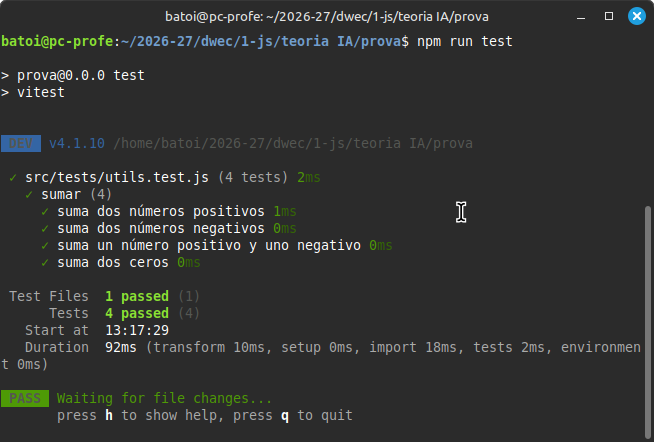
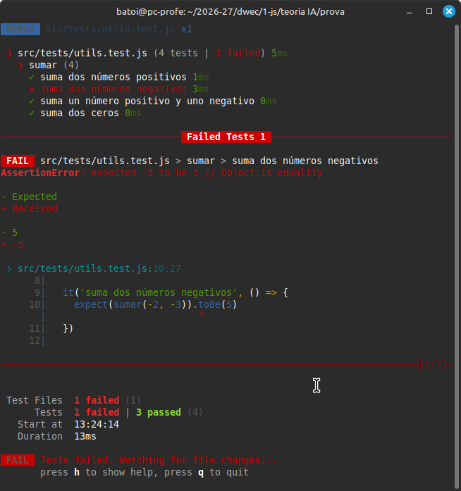

# Tests en Javascript
- [Tests en Javascript](#tests-en-javascript)
  - [¿Por qué escribir tests?](#por-qué-escribir-tests)
  - [¿Qué es Jest?](#qué-es-jest)
    - [¿Qué es Vitest?](#qué-es-vitest)
  - [Instalar Vitest](#instalar-vitest)
  - [Escribir nuestro primer test](#escribir-nuestro-primer-test)
  - [Estructura de un test](#estructura-de-un-test)
  - [Matchers más útiles](#matchers-más-útiles)
  - [Cómo organizar los tests](#cómo-organizar-los-tests)
  - [Tests y la IA](#tests-y-la-ia)
  - [Resumen del flujo de trabajo](#resumen-del-flujo-de-trabajo)

## ¿Por qué escribir tests?

Cuando escribimos código, normalmente lo probamos a mano: abrimos el navegador, hacemos clic, miramos si funciona. Eso tiene un problema: cada vez que cambiamos algo tenemos que volver a probarlo todo manualmente, y es fácil que algo se rompa sin que nos demos cuenta.

Los **tests automáticos** son código que comprueba que nuestro código funciona correctamente. Los escribimos una vez y los ejecutamos tantas veces como queramos, en segundos.

En este módulo usaremos los tests como una herramienta de trabajo desde el principio. Cada vez que escribamos una función, escribiremos también un test que compruebe que hace lo que se supone que debe hacer.

Además, los tests son una forma muy precisa de decirle a la IA qué queremos que haga nuestro código. En lugar de describir el problema con palabras, le damos los tests y le pedimos que escriba el código que los pase.

## ¿Qué es Jest?

**Jest** es la librería de tests más usada en el ecosistema JavaScript. Nos permite:

- Describir qué debe hacer una función
- Comprobar que el resultado es el esperado
- Ejecutar todos los tests de un proyecto con un solo comando

### ¿Qué es Vitest?

**Vitest** es una alternativa a Jest que funciona muy bien con Vite. Es más rápida y ligera, pero tiene menos funcionalidades. Es lo que usaremos en este módulo.

## Instalar Vitest

Una vez creado nuestro proyecto con Vite, instalamos vitest:

```bash
npm install -D vitest @vitest/expect
```

A continuación configuramos Vitest en el `package.json`. Añadimos un script `test` y la configuración básica:

```json
{
  "scripts": {
    ...
    "test": "vitest",
  },
}
```

Crearemos los tests en una carpeta llamada `/test` y en ella crearemos los diferentes ficheros cuya extensión será `.spec.js` o `.test.js`. Cada vez que queramos pasar los tests ejecutaremos
```bash
npm run test
```

Podéis obtener más información en infinidad de páginas de internet, como el [Curso DWEC de Jose Castillo](https://xxjcaxx.github.io/libro_dwec/tests.html#instalacion-de-vitest), y en la [web oficial de vite](https://es.vitejs.dev/guide/).

## Escribir nuestro primer test

Supongamos que tenemos este fichero con una función:

```js
// fichero utils.js
export function sumar(a, b) {
  return a + b
}
```

Para testearla creamos un fichero con el mismo nombre pero terminado en `.test.js`:

```js
// fichero utils.test.js
import { describe, it, expect } from 'vitest'
import { sumar } from './utils.js'

describe('sumar', () => {
  it('suma dos números positivos', () => {
    expect(sumar(2, 3)).toBe(5)
  })

  it('suma dos números negativos', () => {
    expect(sumar(-2, -3)).toBe(-5)
  })

  it('suma un número positivo y uno negativo', () => {
    expect(sumar(10, -3)).toBe(7)
  })

  it('suma dos ceros', () => {
    expect(sumar(0, 0)).toBe(0)
  })
})
```

Al ejecutar `npm test`, Jest encuentra todos los ficheros `.test.js` del proyecto y los ejecuta. Si todos los tests pasan, vemos algo así:



Si alguno falla, Jest nos muestra exactamente qué valor esperábamos y qué valor obtuvimos. Por ejemplo si cambiamos el test de los números negativos a `expect(sumar(-2, -3)).toBe(5)`, veremos algo así:



Nos muestra en rojo que falla el test `suma dos números negativos`, y debajo en el detalle del test nos dice que esperaba recibir `5` (en verde) pero recibió `-5` (en rojo) y marca el _matcher_ que ha fallado ( el `.toBe` de la línea 10).

Es MUY IMPORTANTE entender qué significa cada mensaje de error. Si no lo entendemos, no podremos arreglar el código que falla.

## Estructura de un test

Un test tiene siempre esta estructura:

```js
describe('nombre del grupo de tests', () => {
  it('descripción de lo que debe hacer', () => {
    // Aquí va la comprobación
    expect(valorObtenido).toBe(valorEsperado)
  })
})
```

- `describe` agrupa tests relacionados bajo un nombre común (normalmente el nombre de la función o clase que estamos testando)
- `it` (o `test`, son equivalentes) describe un caso concreto en lenguaje natural
- `expect` recibe el valor que ha producido nuestro código
- `toBe` (u otro *matcher*) indica qué valor esperamos

La descripción del `it` debe leerse como una frase: *"sumar suma dos números positivos"*, *"el carrito añade productos"*, etc.

## Matchers más útiles

Los *matchers* son los métodos que usamos después de `expect` para hacer la comprobación:

| Matcher | Uso |
|---|---|
| `toBe(valor)` | Comprueba igualdad estricta (`===`). Para números, strings y booleanos |
| `toEqual(valor)` | Comprueba igualdad profunda. Para objetos y arrays |
| `toBeTruthy()` | Comprueba que el valor es verdadero (`true`, número distinto de 0, string no vacío...) |
| `toBeFalsy()` | Comprueba que el valor es falso (`false`, `0`, `null`, `undefined`, `''`...) |
| `toBeNull()` | Comprueba que el valor es `null` |
| `toBeUndefined()` | Comprueba que el valor es `undefined` |
| `toContain(elemento)` | Comprueba que un array contiene ese elemento |
| `toHaveLength(n)` | Comprueba la longitud de un array o string |
| `toThrow()` | Comprueba que una función lanza un error |

Ejemplos:

```js
// Comparar objetos: usamos toEqual, no toBe
expect({ nombre: 'Ana' }).toEqual({ nombre: 'Ana' })

// Comparar arrays
expect([1, 2, 3]).toContain(2)
expect([1, 2, 3]).toHaveLength(3)

// Comprobar que lanza un error
expect(() => dividir(10, 0)).toThrow()

// Negar una comprobación con .not
expect(sumar(2, 2)).not.toBe(5)
```

**¿Cuándo usar `toBe` y cuándo `toEqual`?**

`toBe` compara por referencia, igual que `===`. Para objetos y arrays eso significa que solo son iguales si son exactamente el mismo objeto en memoria. `toEqual` compara el contenido, que es lo que normalmente queremos al comparar objetos o arrays.

```js
// INCORRECTO para objetos
expect({ a: 1 }).toBe({ a: 1 })    // falla aunque parezcan iguales

// CORRECTO para objetos
expect({ a: 1 }).toEqual({ a: 1 }) // pasa
```

## Cómo organizar los tests

La convención más habitual es crear una carpeta separada `tests/` o `__tests__/` con todos los ficheros de test, aunque también pueden crearse junto al código que testean:

```
src/
├── utils.js
├── utils.test.js
├── Carrito.js
└── Carrito.test.js
```

Jest encuentra los ficheros de test en cualquiera de las dos ubicaciones.

## Tests y la IA

Los tests son una herramienta muy poderosa cuando trabajamos con la IA. En lugar de describir vagamente lo que queremos, podemos escribir los tests primero y pedirle a la IA que escriba el código que los haga pasar.

Por ejemplo, le damos esto a la IA:

```js
// Necesito que implementes la función calcularDescuento.
// Debe pasar estos tests:

describe('calcularDescuento', () => {
  it('aplica un 10% de descuento', () => {
    expect(calcularDescuento(100, 10)).toBe(90)
  })

  it('devuelve el precio original si el descuento es 0', () => {
    expect(calcularDescuento(50, 0)).toBe(50)
  })

  it('lanza un error si el descuento es mayor que 100', () => {
    expect(() => calcularDescuento(100, 150)).toThrow()
  })
})
```

Con esto la IA sabe exactamente qué debe hacer la función y nosotros podemos verificar de forma objetiva si el código generado es correcto ejecutando los tests.

## Resumen del flujo de trabajo

1. Escribimos (o pedimos a la IA que escriba) los tests que describen el comportamiento que queremos
2. Ejecutamos `npm test` → los tests fallan porque todavía no hay código
3. Escribimos (o pedimos a la IA que escriba) el código que hace pasar los tests
4. Ejecutamos `npm test` de nuevo → los tests pasan
5. Cada vez que cambiamos algo, ejecutamos los tests para asegurarnos de que no hemos roto nada

Este flujo se llama **TDD** (Test Driven Development) y es una práctica muy extendida en la industria.
