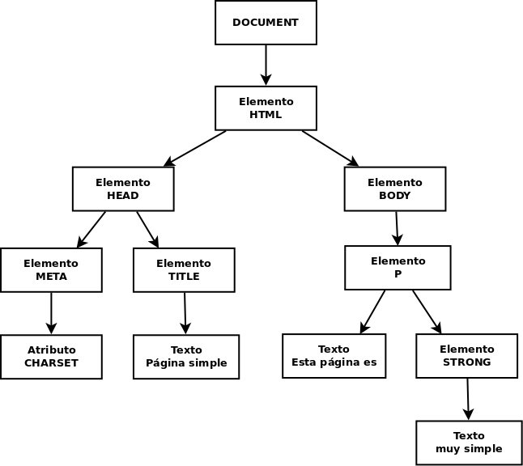
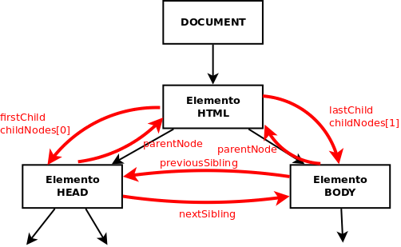

# Document Object Model (DOM)
- [Document Object Model (DOM)](#document-object-model-dom)
  - [Introducción](#introducción)
  - [Acceso a los nodos](#acceso-a-los-nodos)
  - [Acceso a nodos a partir de otros](#acceso-a-nodos-a-partir-de-otros)
    - [Propiedades de un nodo](#propiedades-de-un-nodo)
  - [Manipular el árbol DOM](#manipular-el-árbol-dom)
    - [Añadir nuevos nodos con _innerHTML_](#añadir-nuevos-nodos-con-innerhtml)
  - [Atributos de los nodos](#atributos-de-los-nodos)
    - [Estilos de los nodos](#estilos-de-los-nodos)
    - [Atributos de clase](#atributos-de-clase)
    - [Atributos de datos](#atributos-de-datos)

## Introducción
La mayoría de las veces que programamos con Javascript es para que se ejecute en una página web mostrada por el navegador. En este contexto tenemos acceso a ciertos objetos que nos permiten interactuar con la página (DOM) y con el navegador (Browser Object Model, BOM).

El **DOM** es una estructura en árbol que representa todos los elementos HTML de la página y sus atributos. Todo lo que contiene la página se representa como nodos del árbol y mediante el DOM podemos acceder a cada nodo, modificarlo, eliminarlo o añadir nuevos nodos de forma que cambiamos dinámicamente la página mostrada al usuario.

La raíz del árbol DOM es **document** y de este nodo cuelgan el resto de elementos HTML. Cada uno constituye su propio nodo y tiene subnodos con sus _atributos_, _estilos_ y elementos HTML que contiene. 

Por ejemplo, la página HTML:
```html
<!DOCTYPE html>
<html>
<head>
  <meta charset="utf-8">
  <title>Página simple</title>
</head>
<body>
  <p>Esta página es <strong>muy simple</strong></p>
</body>
</html>
```
se convierte en el siguiente árbol DOM:



Cada etiqueta HTML suele originar 2 nodos:
* Element: correspondiente a la etiqueta
* Text: correspondiente a su contenido (lo que hay entre la etiqueta y su par de cierre)

Cada nodo es un objeto con sus propiedades y métodos.

El ejemplo anterior está simplificado porque sólo aparecen los nodos de tipo _**elemento**_ pero en realidad también generan nodos los saltos de línea, tabuladores, espacios, comentarios, etc. En el siguiente ejemplo podemos ver TODOS los nodos que realmente se generan. La página:
```html
<!DOCTYPE html>
<html>
<head>
  <title>My Document</title>
</head>
<body>
  <h1>Header</h1>
  <p>
    Paragraph
  </p>
</body>
</html>

```
se convierte en el siguiente árbol DOM:

<a title="L. David Baron [CC BY-SA 3.0 (https://creativecommons.org/licenses/by-sa/3.0)], via Wikimedia Commons" href="https://commons.wikimedia.org/wiki/File:Dom_tree.png"></a>

## Acceso a los nodos
Los principales métodos para acceder a los diferentes nodos son:
* **.getElementById(id)**: devuelve el nodo con la _id_ pasada. Ej.:
```javascript
let nodo = document.getElementById('main');   // nodo contendrá el nodo cuya id es _main_
```
* **.getElementsByClassName(clase)**: devuelve una colección (similar a un array) con todos los nodos de la _clase_ indicada. Ej.:
```javascript
let nodos = document.getElementsByClassName('error');   // nodos contendrá todos los nodos cuya clase es _error_
```
NOTA: las colecciones son similares a arrays (se accede a sus elementos con _\[indice]_) pero no se les pueden aplicar sus métodos _filter_, _map_, ... a menos que se conviertan a arrays con _Array.from()_
* **.getElementsByTagName(etiqueta)**: devuelve una colección con todos los nodos de la _etiqueta_ HTML indicada. Ej.:
```javascript
let nodos = document.getElementsByTagName('p');   // nodos contendrá todos los nodos de tipo  _<p>_
```
* **.getElementsByName(name)**: devuelve una colección con todos los nodos que contengan un atributo `name` con el valor indicado. Ej.:
```javascript
let radiosSexo = document.getElementsByName('sexo');   // radiosSexo contendrá todos los nodos con ese atributo (seguramente radiobuttons con name="sexo")
```
* **.querySelector(selector)**: devuelve el primer nodo seleccionad por el _selector_ CSS indicado. Ej.:
```javascript
let nodo = document.querySelector('p.error');   // nodo contendrá el primer párrafo de clase _error_
```
* **.querySelectorAll(selector)**: devuelve una colección con todos los nodos seleccionados por el _selector_ CSS indicado. Ej.:
```javascript
let nodos = document.querySelectorAll('p.error');   // nodos contendrá todos los párrafos de clase _error_
```
NOTA: al aplicar estos métodos sobre _document_ se seleccionará sobre la página pero podrían también aplicarse a cualquier nodo y en ese caso la búsqueda se realizaría sólo entre los descendientes de dicho nodo.

También tenemos 'atajos' para obtener algunos elementos comunes:
* `document.documentElement`: devuelve el nodo del elemento _\<html>_
* `document.head`: devuelve el nodo del elemento _\<head>_
* `document.body`: devuelve el nodo del elemento _\<body>_
* `document.title`: devuelve el nodo del elemento _\<title>_
* `document.link`: devuelve una colección con todos los hiperenlaces del documento
* `document.anchor`: devuelve una colección con todas las anclas del documento
* `document.forms`: devuelve una colección con todos los formularios del documento
* `document.images`: devuelve una colección con todas las imágenes del documento
* `document.scripts`: devuelve una colección con todos los scripts del documento

> EJERCICIO: Para hacer los ejercicios de este tema descárgate [esta página de ejemplo](./ejercicios/ejemplos/ejemploDOM.html) y ábrela en tu navegador. Obtén por consola, al menos de 2 formas diferentes:
> - El elemento con id 'input2'
> - La colección de párrafos
> - Lo mismo pero sólo de los párrafos que hay dentro del div 'lipsum'
> - El formulario (ojo, no la colección con el formulario sino sólo el formulario)
> - Todos los inputs
> - Sólo los inputs con nombre 'sexo'
> - Los items de lista de la clase 'important' (sólo los LI)

## Acceso a nodos a partir de otros
En muchas ocasiones queremos acceder a cierto nodo a partir de uno dado. Para ello tenemos los siguientes métodos que se aplican sobre un elemento del árbol DOM:
* `elemento.parentElement`: devuelve el elemento padre de _elemento_
* `elemento.children`: devuelve la colección con todos los elementos hijo de _elemento_ (sólo elementos HTML, no comentarios ni nodos de tipo texto)
* `elemento.childNodes`: devuelve la colección con todos los hijos de _elemento_, incluyendo comentarios y nodos de tipo texto por lo que no suele utilizarse
* `elemento.firstElementChild`: devuelve el elemento HTML que es el primer hijo de _elemento_ 
* `elemento.firstChild`: devuelve el nodo que es el primer hijo de _elemento_ (incluyendo nodos de tipo texto o comentarios)
* `elemento.lastElementChild`, `elemento.lastChild`: igual pero con el último hijo
* `elemento.nextElementSibling`: devuelve el elemento HTML que es el siguiente hermano de _elemento_ 
* `elemento.nextSibling`: devuelve el nodo que es el siguiente hermano de _elemento_ (incluyendo nodos de tipo texto o comentarios)
* `elemento.previousElementSibling`, `elemento.previousSibling`: igual pero con el hermano anterior
* `elemento.hasChildNodes`: indica si _elemento_ tiene o no nodos hijos
* `elemento.childElementCount`: devuelve el nº de nodos hijo de  _elemento_
* `elemento.closest(selector)`: devuelve el ancestro más cercano que coincide con el selector. Por ejemplo si el elemento es un \<td> de una tabla entonces `elemento.closest('table')` devolverá la tabla a la que pertenece

**IMPORTANTE**: a menos que me interesen comentarios, saltos de página, etc **siempre** debo usar los métodos que sólo devuelven elementos HTML, no todos los nodos.



> EJERCICIO: Siguiento con la [página de ejemplo](./ejercicios/ejemplos/ejemploDOM.html) obtén desde la consola, al menos de 2 formas diferentes:
> - El primér párrafo que hay dentro del div 'lipsum'
> - El segundo párrafo de 'lipsum'
> - El último item de la lista
> - La label de 'Escoge sexo'

### Propiedades de un nodo
Las principales propiedades de un nodo son:
* `elemento.innerHTML`: todo lo que hay entre la etiqueta que abre _elemento_ y la que lo cierra, incluyendo otras etiquetas HTML. Por ejemplo si _elemento_ es el nodo `<p>Esta página es <strong>muy simple</strong></p>`
```javascript
let contenido = elemento.innerHTML;   // contenido='Esta página es <strong>muy simple</strong>'
```
* `elemento.textContent`: todo lo que hay entre la etiqueta que abre _elemento_ y la que lo cierra, pero ignorando otras etiquetas HTML. Siguiendo con el ejemplo anterior:
```javascript
let contenido = elemento.textContent;   // contenido='Esta página es muy simple'
```
* `elemento.value`: devuelve la propiedad 'value' de un \<input> (en el caso de un \<input> de tipo text devuelve lo que hay escrito en él). Como los \<inputs> no tienen etiqueta de cierre (\</input>) no podemos usar _.innerHTML_ ni _.textContent_.  Por ejemplo si _elem1_ es el nodo `<input name="nombre">` y _elem2_ es el nodo `<input tipe="radio" value="H">Hombre`
```javascript
let cont1 = elem1.value;   // cont1 valdría lo que haya escrito en el <input> en ese momento
let cont2 = elem2.value;   // cont2="H"
```

Otras propiedades:
* `elemento.innerText`: igual que _textContent_
* `elemento.focus`: da el foco a _elemento_ (para inputs, etc). Para quitarle el foco `elemento.blur`
* `elemento.clientHeight` / `elemento.clientWidth`: devuelve el alto / ancho visible del _elemento_
* `elemento.offsetHeight` / `elemento.offsetWidth`: devuelve el alto / ancho total del _elemento_
* `elemento.clientLeft` / `elemento.clientTop`: devuelve la distancia de _elemento_ al borde izquierdo / superior
* `elemento.offsetLeft` / `elemento.offsetTop`: devuelve los píxels que hemos desplazado _elemento_ a la izquierda / abajo

> EJERCICIO: Obtén desde la consola, al menos de 2 formas:
> - El innerHTML de la etiqueta de 'Escoge sexo'
> - El textContent de esa etiqueta
> - El valor del primer input de sexo 
> - El valor del sexo que esté seleccionado (difícil, búscalo por Internet)

## Manipular el árbol DOM
Vamos a ver qué métodos nos permiten cambiar el árbol DOM, y por tanto modificar la página:
* `document.createElement('etiqueta')`: crea un nuevo elemento HTML con la etiqueta indicada, pero aún no se añade a la página. Ej.:
```javascript
let nuevoLi = document.createElement('li');
```
* `elemento.append(elementos o texto)`: añade al DOM los parámetros pasados como últimos hijos de _elemento_. Se le puede pasar tanto un nodo DOM como una cadena de texto (para la que se creará su nodo de texto correspondiente) y que se le pueden pasar varios parámetros para crear varios nodos. Ej.:
```javascript
nuevoLi.append('Nuevo elemento de lista');     // añade el texto pasado al elemento LI creado
let miPrimeraLista = document.getElementsByTagName('ul')[0];  // selecciona el 1º UL de la página
miPrimeraLista.append(nuevoLi);    // añade LI como último hijo de UL, es decir al final de la lista
```
* `elemento.prepend(elementos o texto)`: como el anterior pero en lugar de añadirlos como últimos hijos los añade antes del primer hijo.   
```javascript
const primerLi = document.createElement('li');
primerLi.append('Primer elemento de lista'); 
let miPrimeraLista = document.getElementsByTagName('ul')[0]; 
miPrimeraLista.prepend(nuevoLi);
```
* `elemento.after(elementos o texto)`: como _append_ pero en lugar de añadirlos como últimos hijos los añade como los siguientes hermanos de _elemento_.   
```javascript
const otroLi = document.createElement('li');
otroLi.append('Segundo elemento de lista'); 
primerLi.after(otroLi);
```
* `elemento.before(elementos o texto)`: como el anterior pero los añade como los anteriores hermanos de _elemento_.   
* `elemento.remove()`: borra el nodo _elemento_ del documento.   
* `elemento.replaceWith(nuevoNodo)`: reemplaza el nodo _elemento_ con el _nuevoNodo_ pasado
```javascript
let primerElementoDeLista = document.getElementsByTagName('ul')[0].firstChild;  // selecciona el 1º LI de miPrimeraLista
primerElementoDeLista.replaceChild(nuevoLi);    // reemplaza el 1º elemento de la lista con nuevoLi
```
* `elementoAClonar.cloneNode(boolean)`: devuelve un clon de _elementoAClonar_ o de _elementoAClonar_ con todos sus descendientes según le pasemos como parámetro _false_ o _true_. Luego podremos insertarlo donde queramos.

Otros métodos menos usados son:
* `document.createTextNode('texto')`: crea un nuevo nodo de texto con el texto indicado, que luego tendremos que añadir a un nodo HTML. Normalmente no se usa porque _append_ y el resto de métodos anteriores ya lo crean automáticamente. Ej.:
```javascript
let textoLi = document.createTextNode('Nuevo elemento de lista');
```
* `elemento.appendChild(nuevoNodo)`: añade _nuevoNodo_ como último hijo de _elemento_ y lo devuelve. Se diferencia con _append_ en que sólo permite un parámetro y éste debe ser un nodo, no puede ser texto. Por eso no suele usarse. Ejemplo:
```javascript
nuevoLi.appendChild(textoLi);     // añade el texto creado al elemento LI creado
let miPrimeraLista = document.getElementsByTagName('ul')[0];  // selecciona el 1º UL de la página
miPrimeraLista.appendChild(nuevoLi);    // añade LI como último hijo de UL, es decir al final de la lista
```
* `elemento.insertBefore(nuevoNodo, nodo)`: añade _nuevoNodo_ como hijo de _elemento_ antes del hijo _nodo_. Ej.:
```javascript
let miPrimeraLista = document.getElementsByTagName('ul')[0];                // selecciona el 1º UL de la página
let primerElementoDeLista = miPrimeraLista.getElementsByTagName('li')[0];   // selecciona el 1º LI de miPrimeraLista
miPrimeraLista.insertBefore(nuevoLi, primerElementoDeLista);                // añade LI al principio de la lista
```
* `elemento.removeChild(nodo)`: borra _nodo_ de _elemento_ y por tanto se elimina de la página. Ej.:
```javascript
let miPrimeraLista = document.getElementsByTagName('ul')[0];  // selecciona el 1º UL de la página
let primerElementoDeLista = miPrimeraLista.getElementsByTagName('li')[0];  // selecciona el 1º LI de miPrimeraLista
miPrimeraLista.removeChild(primerElementoDeLista);    // borra el primer elemento de la lista
// También podríamos haberlo borrado sin tener el padre con:
primerElementoDeLista.parentElement.removeChild(primerElementoDeLista);
```
* `elemento.replaceChild(nuevoNodo, viejoNodo)`: reemplaza _viejoNodo_ con _nuevoNodo_ como hijo de _elemento_. Ej.:
```javascript
let miPrimeraLista = document.getElementsByTagName('ul')[0];  // selecciona el 1º UL de la página
let primerElementoDeLista = miPrimeraLista.getElementsByTagName('li')[0];  // selecciona el 1º LI de miPrimeraLista
miPrimeraLista.replaceChild(nuevoLi, primerElementoDeLista);    // reemplaza el 1º elemento de la lista con nuevoLi
```

**OJO**: Si añado con el método `append` o `appendChild` un nodo que estaba en otro sitio **se elimina de donde estaba** para añadirse a su nueva posición. Si quiero que esté en los 2 sitios deberé clonar el nodo y luego añadir el clon y no el nodo original.

### Añadir nuevos nodos con _innerHTML_
Supongamos que tenemos un DIV cuya _id_ es _myDiv_ al que queremos añadir al final dos párrafos, el último de ellos con un texto en negrita. El código podría ser:

```javascript
let miDiv = document.getElementById('myDiv');
let nuevoParrafo = document.createElement('p');
nuevoParrafo.textContent = 'Párrafo añadido al final';
let ultimoParrafo = document.createElement('p');
const textoNegrita = document.createElement('strong');
textoNegrita.textContent = 'con texto en negrita';
ultimoParrafo.append('Último párrafo ', textoNegrita);
miDiv.append(nuevoParrafo, ultimoParrafo);
```

Si utilizamos la propiedad **innerHTML** el código a usar es mucho más simple:

```javascript
let miDiv = document.getElementById('myDiv');
miDiv.innerHTML += '<p>Párrafo añadido al final</p><p>Último párrafo <strong>con texto en negrita</strong></p>';
```

**OJO**: La forma de añadir el último párrafo (línea #3: `miDiv.innerHTML+='<p>Párrafo añadido al final</p>';`) aunque es válida no es muy eficiente ya que obliga al navegador a volver a pintar TODO el contenido de miDIV.

Podemos ver más ejemplos de creación y eliminación de nodos en [W3Schools](http://www.w3schools.com/js/js_htmldom_nodes.asp).

> EJERCICIO: Añade a la página:
> - Un nuevo párrafo al final del DIV _'lipsum'_ con el texto "Nuevo párrafo **añadido** por javascript" (fíjate que una palabra está en negrita)
> - Un nuevo elemento al formulario tras el _'Dato 1'_ con la etiqueta _'Dato 1 bis'_ y el INPUT con id _'input1bis'_ que al cargar la página tendrá escrito "Hola" 

## Atributos de los nodos
Podemos ver y modificar los valores de los atributos de cada elemento HTML y también añadir o eliminar atributos:
* `elemento.attributes`: devuelve un array con todos los atributos de _elemento_
* `elemento.hasAttribute('nombreAtributo')`: indica si _elemento_ tiene o no definido el atributo _nombreAtributo_
* `elemento.getAttribute('nombreAtributo')`: devuelve el valor del atributo _nombreAtributo_ de _elemento_. Para muchos elementos este valor puede directamente con `elemento.atributo`. 
* `elemento.setAttribute('nombreAtributo', 'valor')`: establece _valor_ como nuevo valor del atributo _nombreAtributo_ de _elemento_. También puede cambiarse el valor directamente con `elemento.atributo=valor`.
* `elemento.removeAttribute('nombreAtributo')`: elimina el atributo _nombreAtributo_ de _elemento_

A algunos atributos comunes como `id`, `title` o `className` (para el atributo **class**) se puede acceder y cambiar como si fueran una propiedad del elemento (`elemento.atributo`). Ejemplos:
```javascript
elemento.id = 'primera-lista';
// es equivalente ha hacer:
elemento.setAttribute('id', 'primera-lista');
```

### Estilos de los nodos
Los estilos están accesibles como el atributo **style**. Cualquier estilo es una propiedad de dicho atributo pero con la sintaxis _camelCase_ en vez de _kebab-case_. Por ejemplo para cambiar el color de fondo (propiedad background-color) y ponerle el color _rojo_ al elemento _miPrimeraLista_ haremos:
```javascript
miPrimeraLista.style.backgroundColor = 'red';
```

De todas formas normalmente **NO CAMBIAREMOS ESTILOS** a los elementos sino que les pondremos o quitaremos clases que harán que se le apliquen o no los estilos definidos para ellas en el CSS.

### Atributos de clase
Ya sabemos que el aspecto de la página debe configurarse en el CSS por lo que no debemos aplicar atributos _style_ al HTML. En lugar de ello les ponemos clases a los elementos que harán que se les aplique el estilo definido para dicha clase.

Como es algo muy común en lugar de utilizar las instrucciones de `elemento.setAttribute('className', 'destacado')` o directamente `elemento.className='destacado'` podemos usar la propiedad **_[classList](https://developer.mozilla.org/es/docs/Web/API/Element/classList)_** que devuelve la colección de todas las clases que tiene el elemento. Por ejemplo si _elemento_ es `<p class="destacado direccion">...`: 
```javascript
let clases=elemento.classList;   // clases=['destacado', 'direccion'], OJO es una colección, no un Array
```

Además dispone de los métodos:
* **.add(clase)**: añade al elemento la clase pasada (si ya la tiene no hace nada). Ej.:
```javascript
elemento.classList.add('primero');   // ahora elemento será <p class="destacado direccion primero">...
```
* **.remove(clase)**: elimina del elemento la clase pasada (si no la tiene no hace nada). Ej.:
```javascript
elemento.classList.remove('direccion');   // ahora elemento será <p class="destacado primero">...
```
* **.toogle(clase)**: añade la clase pasada si no la tiene o la elimina si la tiene ya. Ej.:
```javascript
elemento.classList.toogle('destacado');   // ahora elemento será <p class="primero">...
elemento.classList.toogle('direccion');   // ahora elemento será <p class="primero direccion">...
```
* **.contains(clase)**: dice si el elemento tiene o no la clase pasada. Ej.:
```javascript
elemento.classList.contains('direccion');   // devuelve true
```
* **.replace(oldClase, newClase)**: reemplaza del elemento una clase existente por una nueva. Ej.:
```javascript
elemento.classList.replace('primero', 'ultimo');   // ahora elemento será <p class="ultimo direccion">...
```

Tened en cuenta que NO todos los navegadores soportan _classList_ por lo que si queremos añadir o quitar clases en navegadores que no lo soportan debemos hacerlo con los métodos estándar, por ejemplo para añadir la clase 'rojo':
```javascript
let clases = elemento.className.split(" ");
if (clases.indexOf('rojo') == -1) {
  elemento.className += ' ' + 'rojo';
}
```

### Atributos de datos
HTML5 permite agregar atributos personalizados no visuales a las etiquetas utilizando `data-*`. Estos atributos pueden ser accesibles a través de JavaScript usando `dataset`.

```html
<article
    id="electriccars"
    data-columns="3"
    data-index-number="12314"
    data-parent="cars">
    ...
</article>
``` 

```javascript
let article = document.getElementById('electriccars');
console.log(article.dataset.columns); // 3
console.log(article.dataset.indexNumber); // 12314
```

Fuente: [Curso DWEC de José Castillo](https://xxjcaxx.github.io/libro_dwec/dom.html#atributos-de-datos)