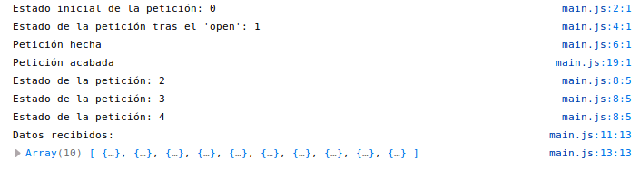

<!-- START doctoc generated TOC please keep comment here to allow auto update -->
<!-- DON'T EDIT THIS SECTION, INSTEAD RE-RUN doctoc TO UPDATE -->
**Table of Contents**  *generated with [DocToc](https://github.com/thlorenz/doctoc)*

- [Ajax](#ajax)
  - [Introducción](#introducci%C3%B3n)
  - [Métodos HTTP](#m%C3%A9todos-http)
  - [Realizar peticiones Ajax con XMLHttpRequest](#realizar-peticiones-ajax)
  - [Eventos de XMLHttpRequest](#eventos-de-xmlhttprequest)
  - [Ejemplos de envío de datos](#ejemplos-de-env%C3%ADo-de-datos)
    - [Enviar datos al servidor en formato JSON](#enviar-datos-al-servidor-en-formato-json)
    - [Enviar datos al servidor en formato URIEncoded](#enviar-datos-al-servidor-en-formato-uriencoded)
    - [Enviar ficheros al servidor con FormData](#enviar-ficheros-al-servidor-con-formdata)
  - [Single Page Application](#single-page-application)
  - [Promesas](#promesas)
  - [Ajax con fetch()](#ajax-con-fetch)
- [Otras llamadas asíncornas](#otras-llamadas-as%C3%ADncronas)

<!-- END doctoc generated TOC please keep comment here to allow auto update -->

# Ajax

## Introducción
AJAX es el acrónimo de **_Asynchronous Javascript And XML_** (Javascript asíncrono y XML) y es lo que usamos para hacer peticiones asíncronas al servidor desde Javascript. Cuando hacemos una petición al servidor no nos responde inmediatamente (la petición tiene que llegar al servidor, procesarse allí y enviarse la respuesta que llegará al cliente). 

Lo que significa **asíncrono** es que la página no permanecerá bloqueada esperando esa respuesta sino que continuará ejecutando su código e interactuando con el usuario, y en el momento en que llegue la respuesta del servidor se ejecutará la función que indicamos al hacer la llamada Ajax. Respecto a **XML**, es el formato en que se intercambia la información entre el servidor y el cliente, aunque actualmente el formato más usado es **JSON** que es más simple y legible.

Básicamente Ajax nos permite poder mostrar nuevos datos enviados por el servidor sin tener que recargar la página, que continuará disponible mientras se reciben y procesan los datos enviados por el servidor en segundo plano.

<a title="By DanielSHaischt, via Wikimedia Commons [CC BY-SA 3.0 
 (https://creativecommons.org/licenses/by-sa/3.0
)], via Wikimedia Commons" href="https://commons.wikimedia.org/wiki/File:Ajax-vergleich-en.svg"></a>

Sin Ajax cada vez que necesitamos nuevos datos del servidor la página deja de estar disponible para el usuario hasta que se recarga con lo que envía el servidor. Con Ajax la página está siempre disponible para el usuarioy simplemente se modifica (cambiando el DOM) cuando llegan los datos del servidor:


_Fuente Uniwebsidad_

## Métodos HTTP
Las peticiones Ajax usan el protocolo HTTP (el mismo que utiliza el navegador para cargar una página). Este protocolo envía al servidor unas cabeceras HTTP (con información como el _userAgent_ del navegador, el idioma, etc), el tipo de petición y, opcionalmente, datos o parámetros (por ejemplo en la petición que procesa un formulario se envían los datos del mismo).

Hay diferentes tipos de petición que podemos hacer:
* **GET**: suele usarse para obtener datos sin modificar nada (equivale a un SELECT en SQL). Si enviamos datos (ej. la ID del registro a obtener) suelen ir en la url de la petición (formato URIEncoded). Ej.: locahost/users/3 o www.google.es?search=js
* **POST**: suele usarse para añadir un dato en el servidor (equivalente a un INSERT). Los datos enviados van en el cuerpo de la petición HTTP (igual que sucede al enviar desde el navegador un formulario por POST)
* **PUT**: es similar al _POST_ pero suele usarse para actualizar datos del servidor (como un UPDATE de SQL). Los datos se envían en el cuerpo de la petición (como en el POST) y la información para identificar el objeto a modificar en la url (como en el GET)
* **DELETE**: se usa para eliminar un dato del servidor (como un DELETE de SQL). La información para identificar el objeto a eliminar se envía en la url (como en el GET)
* existen otros tipos que no veremos aquí (como _HEAD_, etc)

## Realizar peticiones Ajax
Para hacer una petición debemos crear una instancia del objeto **XMLHttpRequest** que es el que controlará todo el proceso. Los pasos a seguir son:
1. Creamos la instancia del objeto: `let peticion=new XMLHttpRequest()`
1. Para establecer la comunicación con el servidor ejecutamos el método **.open()** al que se le pasa como parámetro el tipo de petición (GET, POST, ...) y la URL del servidor: `peticion.open('GET', 'https://jsonplaceholder.typicode.com/users')`
1. OPCIONAL: Si queremos añadir cabeceras a la petición HTTP llamaremos al método **.setRequestHeader()**. Por ejemplo si enviamos datos con POST hay que añadir la cabecera _Content-type_ que le indica al servidor en qué formato van los datos: `peticion.setRequestHeader('Content-type', 'application/x-www-form-urlencoded)`
1. Enviamos la petición al servidor con el método **.send()**. A este método se le pasa como parámetro los datos a enviar al servidor (o nada si no se envían datos, por ejemplo, en una petición GET): `peticion.send('dato1='+encodeURIComponent(dato1)+'&dato2='+encodeURIComponent(dato2))`
1. Escuchamos los enventos que se producen nuestro objeto _peticion_ para saber cuándo está disponible la respuesta del servidor

## Eventos de XMLHttpRequest
El evento más importante para gestionar la petición Ajax es **readystatechange** que se produce cada vez que cambia el estado de la petición. Cuando hay un cambio en el estado cambia el valor de la propiedad **readyState**. Sus valores posibles son:
  * 0: petición no iniciada
  * 1: establecida conexión con el servidor
  * 2: petición recibida por el servidor
  * 3: se está procesando la petición
  * 4: petición finalizada y respuesta lista 
A nosotros sólo nos interesa cuando su valor sea 4 que significa que ya están los datos. En ese momento la propiedad **status** contiene el estado de la petición HTTP (200: Ok, 404: Not found, 500: Server error, ...) que ha devuelto el servidor. Cuando _readyState_ vale 4 y _status_ vale 200 tenemos los datos en la propiedad **responseText** (o **responseXML** si el servidor los envía en formato XML). Ejemplo:
```javascript
let peticion=new XMLHttpRequest();
console.log("Estado inicial de la petición: "+peticion.readyState);
peticion.open('GET', 'https://jsonplaceholder.typicode.com/users');
console.log("Estado de la petición tras el 'open': "+peticion.readyState);
peticion.send();
console.log("Petición hecha");
peticion.addEventListener('readystatechange', function() {
    console.log("Estado de la petición: "+peticion.readyState);
    if (peticion.readyState===4) {
        if (peticion.status===200) {
            console.log("Datos recibidos:");
            let usuarios=JSON.parse(peticion.responseText);  // Convertirmos los datos JSON a un objeto
            console.log(usuarios);
        } else {
            console.log("Error "+peticion.status+" ("+peticion.statusText+") en la petición");
        }
    }
})
console.log("Petición acabada");
```
El resultado de ejecutar ese código es el siguiente:



Fijaos cuándo cambia de estado (_readyState_) la petición:
* vale 0 al crear el objeto XMLHttpRequest
* vale 1 cuando abrimos la conexión con el servidor
* luego se envía al servidor y es éste el que va informando al cliente de cuándo cambia su estado

Además notad que la última línea ('Petición acabada') se ejecuta antes que las de 'Estado de la petición' porque es una petición asíncrona y la ejecución del programa continúa sin esperar a que responda el servidor.

Hay otros eventos que nos pueden ser de utilidad:
* **load**: se produce cuando se recibe la respuesta del servidor. Equivale a _readyState===4_. En _status_ tendremos el estado de la respuesta
* **error**: se produce si sucede algún error al procesar la petición (de red, de servidor, ...)
* **timeout**: si ha transcurrido el tiempo indicado y no se ha recibido respuesta del servidor. Podemos cambiar el tiempo por defecto modificando la propiedad **timeout** antes de enviar la petición
* **abort**: si se cancela la petición (se hace llamando al método **.abort()** de la petición)
* **loadend**: se produce siempre que termina la petición, independiantemente de si se recibe respuesta o sucede algún error (incluyendo un _timeout_ o un _abort_)

Ejemplo:
```javascript
let peticion=new XMLHttpRequest();
peticion.open('GET', 'https://jsonplaceholder.typicode.com/users');
peticion.send();
peticion.addEventListener('load', function() {
    if (peticion.status===200) {
        let usuarios=JSON.parse(peticion.responseText);  // Convertirmos los datos JSON a un objeto
        // procesamos los datos que tenemos en usuarios
    } else {
        muestraError();
    }
})
peticion.addEventListener('error', muestraError);
peticion.addEventListener('abort', muestraError);
peticion.addEventListener('timeout', muestraError);

function muestraError() {
    if (this.status) {
        console.log("Error "+this.status+" ("+this.statusText+") en la petición");
    } else {
        console.log("Ocurrió un error o se abortó la conexión");
    }
}
```

## Ejemplos de envío de datos
Vamos a ver algunos ejemplos de envío de datos al servidor con POST. Supondremos que tenemos una página con un formulario para dar de alta nuevos productos:
```html
<form id="addProduct">
    <label for="name">Nombre: </label><input type="text" name="name" id="name" required><br>
    <label for="descrip">Descripción: </label><input type="text" name="descrip" id="descrip" required><br>

    <button type="submit">Añadir</button>
</form>
```
### Enviar datos al servidor en formato JSON
```javascript
...
// esta sería la función manejadora del 'submit' de 'addProduct'
let newProduct={
    name: document.getElementById("name").value,
    descrip: document.getElementById("descrip").value,
}    
let peticion=new XMLHttpRequest();
peticion.open('GET', 'https://localhost/products');
peticion.setRequestHeader('Content-type', 'application/json');
peticion.send(JSON.stringify(newProduct));
peticion.addEventListener('load', function() {
...
```
Para enviar el objeto hay que convertirlo a una cadena JSON con la función **JSON.stringify()** (es la opuesta a **JSON.parse()**). Y siempre que enviamos datos al servidor debemos decirle el formato que tienen en la cabecera de _Content-type_:
```javascript
peticion.setRequestHeader('Content-type', 'application/json');
```

### Enviar datos al servidor en formato URIEncoded
```javascript
...
// esta sería la función manejadora del 'submit' de 'addProduct'
let name=document.getElementById("name").value;
let descrip=document.getElementById("descrip").value;

let peticion=new XMLHttpRequest();
peticion.open('GET', 'https://localhost/products');
peticion.setRequestHeader('Content-type', 'application/x-www-form-urlencoded');
peticion.send('name='+encodeURIComponent(name)+'&descrip='+encodeURIComponent(descrip));
peticion.addEventListener('load', function() {
...
```
En este caso los datos se envían como hace el navegador por defecto en un formulario. Recordad siempre codificar lo que introduce el usuario para evitar problemas con caracteres no estándar y **ataques _SQL Injection_**.

### Enviar ficheros al servidor con FormData
Vamos a añadir al formulario un campo donde el usuario pueda subir la foto del producto:
```html
<form id="addProduct">
    <label for="name">Nombre: </label><input type="text" name="name" id="name" required><br>
    <label for="descrip">Descripción: </label><input type="text" name="descrip" id="descrip" required><br>
    <label for="photo">Fotografía: </label><input type="file" name="photo" id="photo" required><br>

    <button type="submit">Añadir</button>
</form>
```

Podemos enviar al servidor todo el contenido del formulario:
```javascript
...
// esta sería la función manejadora del 'submit' de 'addProduct'
let peticion=new XMLHttpRequest();
peticion.open('GET', 'https://localhost/products');
peticion.send(new FormData(document.getElementById("addProduct")));
peticion.addEventListener('load', function() {
...
```
O añadir manualmente los campos que queramos enviar:
```javascript
...
// esta sería la función manejadora del 'submit' de 'addProduct'
let formData=new FormData();
formData.append("name", document.getElementById("name").value);
formData.append("descrip", document.getElementById("descrip").value);
formData.append("photo", document.getElementById("photo").fles[0]);

let peticion=new XMLHttpRequest();
peticion.open('GET', 'https://localhost/products');
peticion.send(formData);
peticion.addEventListener('load', function() {
...
```

## Single Page Application
Ajax es la base para construir SPAs que permiten al usuario interactuar con una aplicación web como si se tratara de una aplicación de escritorio (sin 'esperas' con la página en blanco mientras se recarga desde el servidor).

En una SPA sólo se carga la página de inicio (es la única página que existe) que se va modificando y cambiando sus datos como respuesta a la interacción del usuario. Para obtener los nuevos datos se realizan peticiones al servidor (normalmente Ajax). La respuesta son trozos de HTML que se cargan en determinadas partes o datos (JSON, XML, …) que modifican la página mostrada.

Un buen lugar para obtener más información de Ajax o ver ejemplos más complejos es la página del [IES San Clemente](https://manuais.iessanclemente.net/index.php/MediaWiki:Libros/Introduccion-Ajax).

## Promesas
Son una forma más limpia de resolver una función asíncrona. Dentro de la función que devuelve la promesa se hace la llamada a la función asíncorna. Cuando esta se resuelva satisfactoriamente se llama a una función **_resolve()_** y los datos estarán disponibles para quien llamó a la promesa. Si se produce algún error se rechaza la promesa llamando a su función **_reject()_** y quien la llamó tendrá la informaciónde que ha fallado la llamada y por qué.

Desde donde llamamos a la promesa nos suscribimos a ella usando sus métodos:
* **_.then(datos)_**: se ejecuta al resolverse la promesa. Recibe como parámetro lo que se pase al llamar al _resolve_ de la promesa (normalmente los datos devueltos por la función asíncrona a la que se ha llamado)
* **_.catch(error)_**: se produce si se rechaza la promesa llamando al _reject_ de la misma

Básicamente lo que nos van a proporcionar las promesas es un código más claro y mantenible ya que el código a ejecutar cuando se obtengan los datos asíncronamente estará donde se pide esos datos y no en una función escuchadora como sucede ahora. 

Vamos a ver esto con un ejemplo de una llamada a Ajax (asíncorna). Vamos a hacer una página que muestre en una tabla los posts del usuario indicado en un input. En resumen lo que hacemos es:
1. El usuario de nuestra aplicación introduce el código del usuario del que queremos ver sus posts
1. Tenemos un escuchador para que al introducir un código de un usuario llamamos a una función _getPosts()_ que:
  1. Se encarga de hacer la petición Ajax al servidor
  1. Cuando recibe los datos se encarga de pintarlos en la tabla
  1. Si se produce un error se encarga de informar al usuario de nuestra aplicación
  
Por tanto todo el código, no sólo de la petición Ajax sino también de qué ahcer con los datos cuando llegan, se encuentra en la función que pide los datos al servidor. Aquí tenéis cómo podría quedar código de esta página:

<script async src="//jsfiddle.net/juansegura/y8xdk1t4/embed/js,html,result/"></script>

Utilizando promesas vamos a conseguir que la función _getPosts()_ se encargue sólo de obtener los datos y cuando los tenga los devuelve a quien la llamó que será el encargado de pintar los datos en la tabla o informar si hay un error:
1. El usuario de nuestra aplicación introduce el código del usuario del que queremos ver sus posts
1. Tenemos un escuchador para que al introducir un código de un usuario llamamos a una función _getPosts()_ que:
  1. Se encarga de hacer la petición Ajax al servidor y devuelve una promesa
1. Cuando se resuelve la promesa:
  1. Si se reciben los datos se encarga de pintarlos en la tabla
  1. Si se produce un error se encarga de informar al usuario de nuestra aplicación

El código usando promesas sería el siguiente:

<script async src="//jsfiddle.net/juansegura/t4o8vq10/embed/js,html,result/"></script>

Podéis consultar aprender más en [MDN web docs](https://developer.mozilla.org/es/docs/Web/JavaScript/Guide/Usar_promesas).

## Ajax con fetch
La [API Fetch](https://developer.mozilla.org/es/docs/Web/API/Fetch_API/Utilizando_Fetch) proporciona una interfaz para realizar peticiones Ajax mediante el protocolo HTTP, que devuelve como promesas. Ej.:
```javascript
fetch('http://example.com/movies.json')
  .then(response => response.json())
  .then(myJson => console.log(myJson));
```

El código anterior hace una petición al servidor 'http://example.com/movies.json'. Cuando se resuelva devolverá una promesa con el resultado, que obtenemos en el objeto response. Dicha promesa tiene unas propiedades (_status_, _statusText_, _ok_, ...) y unos métodos como _json()_. Este método devuelve una promesa que cuando se resuelve contiene los datos JSON de la respuesta pasada.

### Propiedades y métodos de la respuesta
La respuesta devuelta por _fetch()_ tiene las siguientes propiedades y métodos:
- **status**, **statusText**: el código y el texto del estado devuelto por el servidor (200/Ok, 404/Not found, ...)
- **ok**: booleano que vale _true_ si el status está entre 200 y 299 y _false_ en caso contrario
- **json()**: devuelve una promesa que se resolverá con los datos JSON de la respuesta convertidos a un objeto (les hace automáticamente un _JSON.parse()_) 
- otros métodos de obtener los datos: **text()**, **blob()**, **formData()**, ... Todos devuelven una promesa con los datos convertidos a distintos formatos.

### Cabeceras de la petición
El método _fetch()_ admite como segundo parámetro un objeto con la información a enviar en la petición HTTP. Ej.:
```javascript
fetch(url, {
  method: 'POST', // o 'PUT', 'GET', 'DELETE'
  body: JSON.stringify(data), // los datos que enviamos al servidor en el 'send'
  headers:{
    'Content-Type': 'application/json'
  }
}).then
```

Ejemplo de petición comprobando el estado:
```javascript
fetch(url, {
  method: 'POST', 
  body: JSON.stringify(data), // los datos que enviamos al servidor en el 'send'
  headers:{
    'Content-Type': 'application/json'
  }
})
.then(response => {
  if (response.ok) {
    response.json().then(datos => datosServidor=datos)
  } else {
    console.log('Error en la petición HTTP: '+response.status+' ('+response.statusText+')');
  }
})
.catch(err => {
  console.log('Error en la petición HTTP: '+err.message);
})
```
Podéis ver mś ejemplos en [MDN web docs](https://developer.mozilla.org/es/docs/Web/API/Fetch_API/Utilizando_Fetch#Enviando_datos_JSON) y otras páginas.

# Otras llamadas asíncronas
Una llamada Ajax es un tipo de llamada asíncrona fácil de entender que podemos hacer en Javascript aunque hay muchos más, como un setTimeout(). Para la gestión de las llamadas asíncronas tenemos varios métodos y los más comunes son:
- funciones _callback_
- _promesas_
- _async / await_

Cuando se produce una llamada asíncrona el orden de ejecución del código no es el que vemos en el programa ya que el código de respuesta de la llamada no se ejecutará hasta completarse esta. Podemos ver [un ejemplo](https://repl.it/DhKt/1) de esto extraído de **todoJS** usando **funciones _callback_**.

Además, si hacemos varias llamadas tampoco sabemos el qué orden se ejecutarán sus respuestas ya que depende de cuándo finalice cada una como podemos ver en [este otro ejemplo](https://repl.it/DhLA/0).

Si necesitamos que cada función no se ejecute hasta que haya terminado la anterior debemos llamarla en la respuesta a la función anterior lo que provoca un tipo de código difícil de leer llamado [_callback hell_](https://repl.it/DhLN/0).

Para evitar esto surgieron las **_promesas_** que permiten evitar las funciones _callback_ tan difíciles de leer. Podemos ver [el primer ejemplo](https://repl.it/DhMA/1) usando promesas. Y si neceitamos ejecutar secuencialmente las funciones evitaremos la pirámide de llamadas _callback_ como vemos en [este ejemplo](https://repl.it/DhMK/0).

Aún así el código no es muy limpio. Para mejorarlo, el futuro de las llamadas asíncronas lo constituyen **_async_ y _await_** como vemos en [este ejemplo](https://repl.it/DhMa/0). Estas funciones forman parte del estándard ES2017 por lo que sólo están soportadaspor los últimos navegadores (aunque siempre podemos transpilar con _Babel_).

Fuente: [todoJs: Controlar la ejecución asíncrona](https://www.todojs.com/controlar-la-ejecucion-asincrona/)
