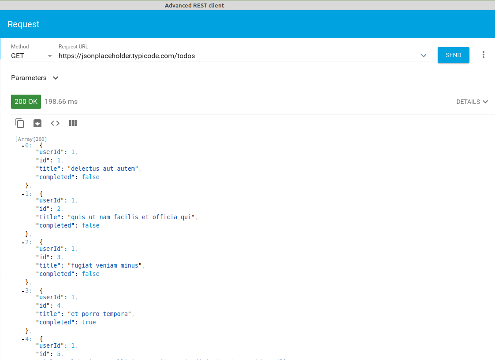
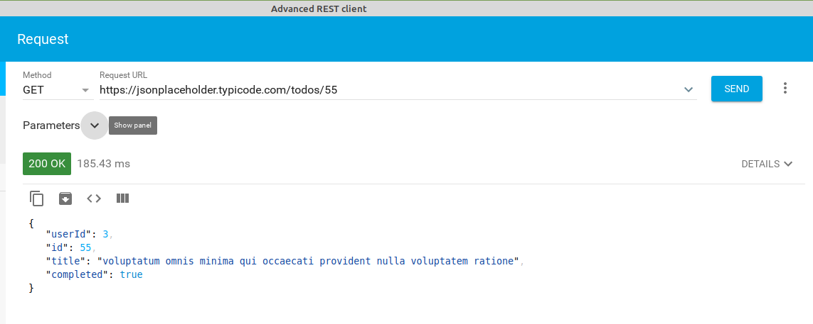
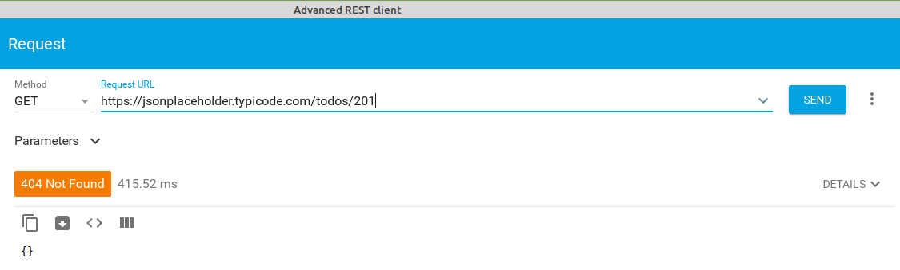
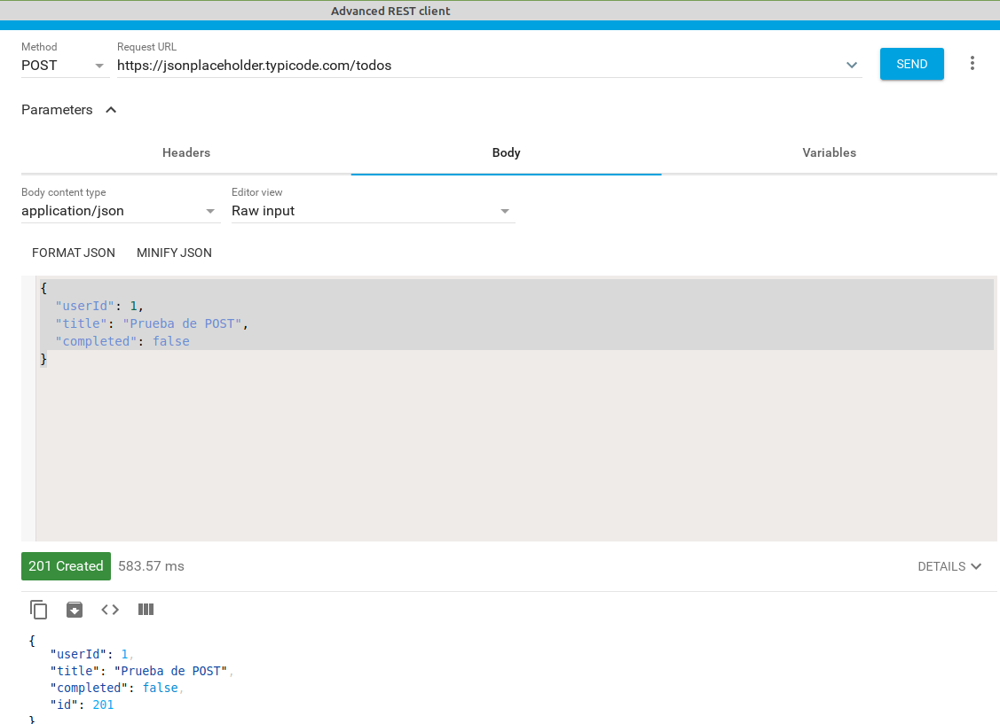
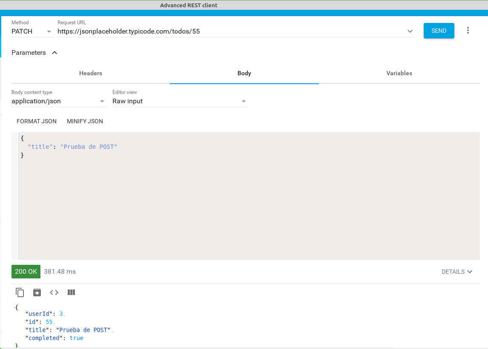
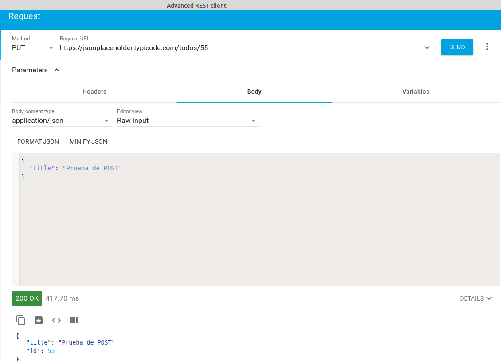
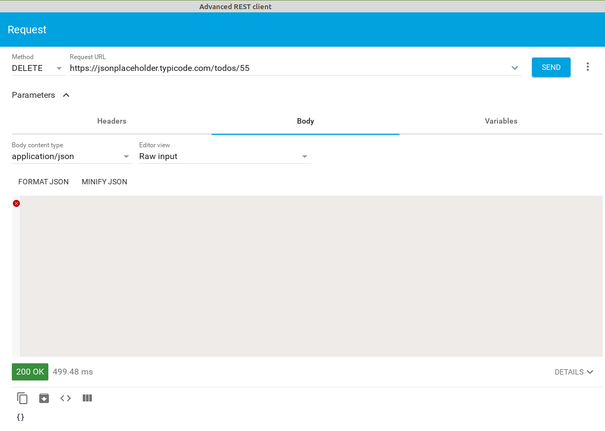

# Ajax
- [Ajax](#ajax)
  - [Introducción](#introducción)
    - [Métodos HTTP](#métodos-http)
    - [Json Server](#json-server)
    - [REST client](#rest-client)
  - [Realizar peticiones Ajax](#realizar-peticiones-ajax)
  - [Eventos de XMLHttpRequest](#eventos-de-xmlhttprequest)
  - [Ejemplos de envío de datos](#ejemplos-de-envío-de-datos)
    - [Enviar datos al servidor en formato JSON](#enviar-datos-al-servidor-en-formato-json)
    - [Enviar datos al servidor en formato URIEncoded](#enviar-datos-al-servidor-en-formato-uriencoded)
    - [Enviar ficheros al servidor con FormData](#enviar-ficheros-al-servidor-con-formdata)
  - [Ejemplo de petición Ajax](#ejemplo-de-petición-ajax)
    - [Funciones _callback_](#funciones-callback)
    - [Promesas](#promesas)
    - [_fetch_](#fetch)
      - [Propiedades y métodos de la respuesta](#propiedades-y-métodos-de-la-respuesta)
      - [Gestión de errores con _fetch_](#gestión-de-errores-con-fetch)
      - [Otros métodos de petición](#otros-métodos-de-petición)
    - [_async / await_](#async--await)
      - [Gestión de errores en _async/await_](#gestión-de-errores-en-asyncawait)
    - [Hacer varias peticiones simultáneamente. Promise.all](#hacer-varias-peticiones-simultáneamente-promiseall)
  - [Single Page Application](#single-page-application)
  - [Resumen de llamadas asíncronas](#resumen-de-llamadas-asíncronas)
  - [CORS](#cors)

## Introducción
AJAX es el acrónimo de **_Asynchronous Javascript And XML_** (Javascript asíncrono y XML) y es lo que usamos para hacer peticiones asíncronas al servidor desde Javascript. Cuando hacemos una petición al servidor no nos responde inmediatamente (la petición tiene que llegar al servidor, procesarse allí y enviarse la respuesta que llegará al cliente). 

Lo que significa **asíncrono** es que la página no permanecerá bloqueada esperando esa respuesta sino que continuará ejecutando su código e interactuando con el usuario, y en el momento en que llegue la respuesta del servidor se ejecutará la función que indicamos al hacer la llamada Ajax. Respecto a **XML**, es el formato en que se intercambia la información entre el servidor y el cliente, aunque actualmente el formato más usado es **JSON** que es más simple y legible.

Básicamente Ajax nos permite poder mostrar nuevos datos enviados por el servidor sin tener que recargar la página, que continuará disponible mientras se reciben y procesan los datos enviados por el servidor en segundo plano.

<a title="By DanielSHaischt, via Wikimedia Commons [CC BY-SA 3.0 
 (https://creativecommons.org/licenses/by-sa/3.0
)], via Wikimedia Commons" href="https://commons.wikimedia.org/wiki/File:Ajax-vergleich-en.svg"></a>

Sin Ajax cada vez que necesitamos nuevos datos del servidor la página deja de estar disponible para el usuario hasta que se recarga con lo que envía el servidor. Con Ajax la página está siempre disponible para el usuario y simplemente se modifica (cambiando el DOM) cuando llegan los datos del servidor:


_Fuente Uniwebsidad_

### Métodos HTTP
Las peticiones Ajax usan el protocolo HTTP (el mismo que utiliza el navegador para cargar una página). Este protocolo envía al servidor unas cabeceras HTTP (con información como el _userAgent_ del navegador, el idioma, etc), el tipo de petición y, opcionalmente, datos o parámetros (por ejemplo en la petición que procesa un formulario se envían los datos del mismo).

Hay diferentes tipos de petición que podemos hacer:
* **GET**: suele usarse para obtener datos sin modificar nada (equivale a un SELECT en SQL). Si enviamos datos (ej. la ID del registro a obtener) suelen ir en la url de la petición (formato URIEncoded). Ej.: locahost/users/3, [https://jsonplaceholder.typicode.com/users](https://jsonplaceholder.typicode.com/users) o [www.google.es?search=js](www.google.es?search=js)
* **POST**: suele usarse para añadir un dato en el servidor (equivalente a un INSERT). Los datos enviados van en el cuerpo de la petición HTTP (igual que sucede al enviar desde el navegador un formulario por POST)
* **PUT**: es similar al _POST_ pero suele usarse para actualizar datos del servidor (como un UPDATE de SQL). Los datos se envían en el cuerpo de la petición (como en el POST) y la información para identificar el objeto a modificar en la url (como en el GET). El servidor hará un UPDATE sustituyendo el objeto actual por el que se le pasa como parámetro
* **PATCH**: es similar al PUT pero la diferencia es que en el PUT hay que pasar todos los campos del objeto a modificar (los campos no pasados se eliminan del objeto) mientras que en el PATCH sólo se pasan los campos que se quieren cambiar y en resto permanecen como están 
* **DELETE**: se usa para eliminar un dato del servidor (como un DELETE de SQL). La información para identificar el objeto a eliminar se envía en la url (como en el GET)
* existen otros tipos que no veremos aquí (como _HEAD_, _PATCH_, etc)

El servidor acepta la petición, la procesa y le envía una respuesta al cliente con el recurso solicitado y además unas cabeceras de respuesta (con el tipo de contenido enviado, el idioma, etc) y el código de estado. Los códigos de estado más comunes son:
- 2xx: son peticiones procesadas correctamente. Las más usuales son 200 (_ok_) o 201 (_created_, como respuesta a una petición POST satisfactoria)
- 3xx: son códigos de redirección que indican que la petición se redirecciona a otro recurso del servidor, como 301 (el recurso se ha movido permanentemente a otra URL) o 304 (el recurso no ha cambiado desde la última petición por lo que se puede recuperar desde la caché)
- 4xx: indican un error por parte del cliente, como 404 (_Not found_, no existe el recurso solicitado) o 401 (_Not authorized_, el cliente no está autorizado a acceder al recurso solicitado)
- 5xx: indican un error por parte del servidor, como 500 (error interno del servidor) o 504 (_timeout_, el servidor no responde).

En cuanto a la información enviada por el servidor al cliente normalmente serán datos en formato **JSON** o XML (cada vez menos usado) que el cliente procesará y mostrará en la página al usuario. También podría ser HTML, texto plano, ...

El formato _JSON_ es una forma de convertir un objeto Javascript en una cadena de texto para poderla enviar, por ejemplo el objeto
```javascript
let alumno = {
  id: 5,
  nombre: Marta,
  apellidos: Pérez Rodríguez
}
```

se transformaría en la cadena de texto
```javascript
{ "id": 5, "nombre": "Marta", "apellidos": "Pérez Rodríguez" }
```

y el array
```javascript
let alumnos = [
  {
    id: 5,
    nombre: "Marta",
    apellidos: "Pérez Rodríguez"
  },
  {
    id: 7,
    nombre: "Joan",
    apellidos: "Reig Peris"
  },
]
```

en la cadena:
```javascript
[{ "id": 5, "nombre": Marta, "apellidos": Pérez Rodríguez }, { "id": 7, "nombre": "Joan", "apellidos": "Reig Peris" }]
```

Para convertir objetos en cadenas de texto _JSON_ y viceversa Javascript proporciona 2 funciones:
- **JSON.stringify(_objeto_)**: recibe un objeto JS y devuelve la cadena de texto correspondiente. Ej.: `const cadenaAlumnos = JSON.stringify(alumnos)`
- **JSON.parse(_cadena_)**: realiza el proceso inverso, convirtiendo una cadena de texto en un objeto. Ej.: `const alumnos = JSON.parse(cadenaAlumnos)`

> EJERCICIO: Vamos a realizar diferentes peticions HTTP a la API [https://jsonplaceholder.typicode.com](https://jsonplaceholder.typicode.com), en concreto trabajaremos contra la tabla **todos** con tareas para hacer. Las peticiones GET podríamos hacerlas directamente desde el navegador pero para el resto debemos instalar alguna de las extensiones de cliente REST en nuestro navegador. Por tanto instalaremos dicha extensión (por ejemplo [_Advanced Rest Client_](https://chrome.google.com/webstore/detail/advanced-rest-client/hgmloofddffdnphfgcellkdfbfbjeloo?hl=es) para Chrome o [_RestClient_](https://addons.mozilla.org/es/firefox/addon/restclient/) para Firefox y haremos todas las peticiones desde allí (incluyendo los GET) lo que nos permitirá ver los códigos de estado devueltos, las cabeceras, etc. 
> 
> Lo que queremos hacer en este ejercicio es:
> - obtener todas las tareas (devuelve un array con todas las tareas y el código devuelto será 200 - Ok)
> 
> 
> - obtener la tarea con id 55 (devuelve el objeto de la tarea 55 y el código devuelto será 200 - Ok)
> 
> 
> - obtener la tarea con id 201 (como no existe devolverá un objeto vacío y como código de error 404 - Not found)
> 
> 
> - crear una nueva tarea. En el cuerpo de la petición le pasaremos sus datos: userID: 1, title: Prueba de POST y completed: false. No se le pasa la id (de eso se encarga la BBDD). La respuesta debe ser un código 201 (created) y el nuevo registro creado con todos sus datos incluyendo la id. Como es una API de prueba en realidad no lo está añadiendo a la BBDD por lo que si luego hacemos una petición buscando esa id nos dirá que no existe.
> 
> - modificar con un PATCH la tarea con id 55 para que su title sea 'Prueba de POST'. Devolverá el nuevo registro con un código 200. Como veis al hacer un PATCH los campos que no se pasan se mantienen como estaban
> 
> - modificar con un PUT la tarea con id 55 para que su title sea 'Prueba de POST'. Devolverá el nuevo registro con un código 200. Como veis en esta API los campos que no se pasan se eliminan; en otras los campos no pasados se mantienen como estaban
> 
> - eliminar la tarea con id 55. Como veis esta API devuelve un objeto vacío al eliminar; otras devuelven el objeto eliminado
> 

### Json Server
Las peticiones Ajax se hacen a un servidor que proporcione una API. Como ahora no tenemos ninguno podemos utilizar Json Server que es un servidor API-REST que funciona bajo Node.js (que ya tenemos instalado para usar NPM) y que utiliza un fichero JSON como contenedor de los datos en lugar de una base de datos.

Para instalarlo en nuestra máquina (lo instalaremos global para poderlo usar en todas nuestras prácticas) ejecutamos:
```bash
npm install -g json-server
```

Para que sirva un fichero datos.json:
```bash
json-server datos.json 
```

Le podemos poner la opción _`--watch`_ ( o `-w`) para que actualice los datos si se modifica el fichero _.json_ externamente (si lo editamos).

El fichero _datos.json_ será un fichero que contenga un objeto JSON con una propiedad para cada "_tabla_" de nuestra BBDD. Por ejemplo, si queremos simular una BBDD con las tablas _users_ y _posts_ vacías el contenido del fichero será:
```json
{
  "users": [],
  "posts": []
}
```

La API escucha en el puerto 3000 y servirá los diferentes objetos definidos en el fichero _.json_. Por ejemplo:
* http://localhost:3000/users: devuelve un array con todos los elementos de la tabla _users_ del fichero _.json_
* http://localhost:3000/users/5: devuelve un objeto con el elemento de la tabla _users_ cuya propiedad _id_ valga 5

También pueden hacerse peticiones más complejas como:
* http://localhost:3000/users?rol=3: devuelve un array con todos los elementos de _users_ cuya propiedad _rol_ valga 3

Para más información: [https://github.com/typicode/json-server](https://github.com/typicode/json-server).

Si queremos acceder a la API desde otro equipo (no desde _localhost_) tenemos que indicar la IP de la máquina que ejecuta _json-server_ y que se usará para acceder, por ejemplo si vamos a ejecutarlo en la máquina 192.168.0.10 pondremos:
```[bash]
json-server --host 192.168.0.10 datos.json 
```

Y la ruta para acceder a la API será `http://192.168.0.10:3000`.

> EJERCICIO: instalar json-server en tu máquina. Ejecútalo indicando un nombre de fichero que no existe: como verás crea un fichero json de prueba con 3 tablas: _posts_, _comments_ y _profiles_. Ábrelo en tu navegador para ver los datos

### REST client
Para probar las peticiones GET podemos poner la URL en la barra de direcciones del navegador pero para probar el resto de peticiones debemos instalar en nuestro navegador una extensión que nos permita realizar las peticiones indicando el método a usar, las cabeceras a enviar y los datos que enviaremos a servidor, además de la URL.

Existen multitud de aplicaciones para realizar peticiones HTTP, como [Advanced REST client](https://install.advancedrestclient.com/install). Cada navegador tiene sus propias extensiones para hacer esto, como [_Advanced Rest Client_](https://chrome.google.com/webstore/detail/advanced-rest-client/hgmloofddffdnphfgcellkdfbfbjeloo?hl=es) para Chrome o [_RestClient_](https://addons.mozilla.org/es/firefox/addon/restclient/) para Firefox.

## Realizar peticiones Ajax
Hasta ahora hemos hecho un repaso a lo que es el protocolo HTTP. Ahora que lo tenemos claro y hemos instalado un servidor que nos proporciona una API (json-server) vamos a realizar peticiones HTTP en nuestro código javascript usando Ajax.

Para hacer una petición debemos crear una instancia del objeto **XMLHttpRequest** que es el que controlará todo el proceso. Los pasos a seguir son:
1. Creamos la instancia del objeto: `const peticion=new XMLHttpRequest()`
1. Para establecer la comunicación con el servidor ejecutamos el método **.open()** al que se le pasa como parámetro el tipo de petición (GET, POST, ...) y la URL del servidor: `peticion.open('GET', 'https://jsonplaceholder.typicode.com/users')`
1. OPCIONAL: Si queremos añadir cabeceras a la petición HTTP llamaremos al método **.setRequestHeader()**. Por ejemplo si enviamos datos con POST hay que añadir la cabecera _Content-type_ que le indica al servidor en qué formato van los datos: `peticion.setRequestHeader('Content-type', 'application/x-www-form-urlencoded)`
1. Enviamos la petición al servidor con el método **.send()**. A este método se le pasa como parámetro los datos a enviar al servidor en el cuerpo de la petición (si es un POST, PUT o PATCH le pasaremos una cadena de texto con los datos a enviar: `peticion.send('dato1='+encodeURIComponent(dato1)+'&dato2='+encodeURIComponent(dato2))`). Si es una petición GET o DELETE no le pasaremos datos (`peticion.send()`)
1. Ponemos un escuchador al objeto _peticion_ para saber cuándo está disponible la respuesta del servidor

## Eventos de XMLHttpRequest
Tenemos diferentes eventos que el servidor envía para informarnos del estado de nuestra petición y que nosotros podemos capturar. El evento **readystatechange** se produce cada vez que el servidor cambia el estado de la petición. Cuando hay un cambio en el estado cambia el valor de la propiedad **readyState** de la petición. Sus valores posibles son:
  * 0: petición no iniciada (se ha creado el objeto XMLHttpRequest)
  * 1: establecida conexión con el servidor (se ha hecho el _open_)
  * 2: petición recibida por el servidor (se ha hecho el _send_)
  * 3: se está procesando la petición
  * 4: petición finalizada y respuesta lista (este es el evento que nos interesa porque ahora tenemos la respuesta disponible)
A nosotros sólo nos interesa cuando su valor sea 4 que significa que ya están los datos. En ese momento la propiedad **status** contiene el estado de la petición HTTP (200: _Ok_, 404: _Not found_, 500: _Server error_, ...) que ha devuelto el servidor. Cuando _readyState_ vale 4 y _status_ vale 200 tenemos los datos en la propiedad **responseText** (o **responseXML** si el servidor los envía en formato XML). Ejemplo:

```javascript
const peticion = new XMLHttpRequest();
console.log("Estado inicial de la petición: " + peticion.readyState);
peticion.open('GET', 'https://jsonplaceholder.typicode.com/users');
console.log("Estado de la petición tras el 'open': " + peticion.readyState);
peticion.send();
console.log("Petición hecha");
peticion.addEventListener('readystatechange', function() {
    console.log("Estado de la petición: " + peticion.readyState);
    if (peticion.readyState === 4) {
        if (peticion.status === 200) {
            console.log("Datos recibidos:");
            let usuarios = JSON.parse(peticion.responseText);  // Convertirmos los datos JSON a un objeto
            console.log(usuarios);
        } else {
            console.log("Error " + peticion.status + " (" + peticion.statusText + ") en la petición");
        }
    }
})
console.log("Petición acabada");
```
El resultado de ejecutar ese código es el siguiente:


Fijaos cuándo cambia de estado (_readyState_) la petición:
* vale 0 al crear el objeto XMLHttpRequest
* vale 1 cuando abrimos la conexión con el servidor
* luego se envía al servidor y es éste el que va informando al cliente de cuándo cambia su estado

**MUY IMPORTANTE**: notad que la última línea ('Petición acabada') se ejecuta antes que las de 'Estado de la petición'. Recordad que es una **petición asíncrona** y la ejecución del programa continúa sin esperar a que responda el servidor.

Como normalmente no nos interesa cada cambio en el estado de la petición sino que sólo queremos saber cuándo ha terminado de procesarse tenemos otros eventos que nos pueden ser de utilidad:
* **load**: se produce cuando se recibe la respuesta del servidor. Equivale a _readyState===4_. En _status_ tendremos el estado de la respuesta
* **error**: se produce si sucede algún error al procesar la petición (de red, de servidor, ...)
* **timeout**: si ha transcurrido el tiempo indicado y no se ha recibido respuesta del servidor. Podemos cambiar el tiempo por defecto modificando la propiedad _timeout_ antes de enviar la petición
* **abort**: si se cancela la petición (se hace llamando al método **.abort()** de la petición)
* **loadend**: se produce siempre que termina la petición, independientemente de si se recibe respuesta o sucede algún error (incluyendo un _timeout_ o un _abort_)

Ejemplo de código que sí usaremos:
```javascript
const peticion=new XMLHttpRequest();
peticion.open('GET', 'https://jsonplaceholder.typicode.com/users');
peticion.send();
peticion.addEventListener('load', function() {
    if (peticion.status===200) {
        let usuarios=JSON.parse(peticion.responseText);
        // procesamos los datos que tenemos en usuarios
    } else {
        muestraError(peticion);
    }
})
peticion.addEventListener('error', muestraError);
peticion.addEventListener('abort', muestraError);
peticion.addEventListener('timeout', muestraError);

function muestraError(peticion) {
    if (peticion.status) {
        console.log("Error "+peticion.status+" ("+peticion.statusText+") en la petición");
    } else {
        console.log("Ocurrió un error o se abortó la conexión");
    }
}
```

Recuerda que tratamos con peticiones asíncronas por lo que tras la línea
```javascript
peticion.addEventListener('load', function() {
```

no se ejecuta la línea siguiente
```javascript
    if (peticion.status===200) {
```

sino la de
```javascript
peticion.addEventListener('error', muestraError);
```

Una petición asíncrona es como pedir una pizza: tras llamar por teléfono lo siguiente no es ir a la puerta a recogerla sino que seguimos haciendo cosas por casa y cuando suena el timbre de casa entonces vamos a la puerta a por ella.

## Ejemplos de envío de datos
Vamos a ver algunos ejemplos de envío de datos al servidor con POST. Supondremos que tenemos una página con un formulario para dar de alta nuevos productos:
```html
<form id="addProduct">
    <label for="name">Nombre: </label><input type="text" name="name" id="name" required><br>
    <label for="descrip">Descripción: </label><input type="text" name="descrip" id="descrip" required><br>

    <button type="submit">Añadir</button>
</form>
```
### Enviar datos al servidor en formato JSON
```javascript
document.getElementById('addProduct').addEEventListener('submit', (event) => {
  ...
  const newProduct={
      name: document.getElementById("name").value,
      descrip: document.getElementById("descrip").value,
  }    
  const peticion=new XMLHttpRequest();
  peticion.open('POST', 'https://localhost/products');
  peticion.setRequestHeader('Content-type', 'application/json');  // Siempre tiene que estar esta línea si se envían datos
  peticion.send(JSON.stringify(newProduct));              // Hay que convertir el objeto a una cadena de texto JSON para enviarlo
  peticion.addEventListener('load', function() {
    // procesamos los datos
    ...
  })
})
```

Para enviar el objeto hay que convertirlo a una cadena JSON con la función **JSON.stringify()** (es la opuesta a **JSON.parse()**). Y siempre que enviamos datos al servidor debemos decirle el formato que tienen en la cabecera de _Content-type_:
```javascript
peticion.setRequestHeader('Content-type', 'application/json');
```

### Enviar datos al servidor en formato URIEncoded
```javascript
document.getElementById('addProduct').addEEventListener('submit', (event) => {
  ...
  const name=document.getElementById("name").value;
  const descrip=document.getElementById("descrip").value;

  const peticion=new XMLHttpRequest();
  peticion.open('GET', 'https://localhost/products');
  peticion.setRequestHeader('Content-type', 'application/x-www-form-urlencoded');
  peticion.send('name='+encodeURIComponent(name)+'&descrip='+encodeURIComponent(descrip));
  peticion.addEventListener('load', function() {
    ...
  })
})
```

En este caso los datos se envían como hace el navegador por defecto en un formulario. Recordad siempre codificar lo que introduce el usuario para evitar problemas con caracteres no estándar y **ataques _SQL Injection_**.

### Enviar ficheros al servidor con FormData
[FormData](https://developer.mozilla.org/es/docs/Web/API/XMLHttpRequest/FormData) es una interfaz de XMLHttpRequest que permite construir fácilmente pares de `clave=valor` para enviar los datos de un formulario. Se envían en el mismo formato en que se enviarían directamente desde un formulario ("multipart/form-data") por lo que no hay que poner encabezado de 'Content-type'.

Vamos a añadir al formulario un campo donde el usuario pueda subir la foto del producto:
```html
<form id="addProduct">
    <label for="name">Nombre: </label><input type="text" name="name" id="name" required><br>
    <label for="descrip">Descripción: </label><input type="text" name="descrip" id="descrip" required><br>
    <label for="photo">Fotografía: </label><input type="file" name="photo" id="photo" required><br>

    <button type="submit">Añadir</button>
</form>
```

Podemos enviar al servidor todo el contenido del formulario:
```javascript
document.getElementById('addProduct').addEventListener('submit', (event) => {
  ...
  const peticion=new XMLHttpRequest();
  const datosForm = new FormData(document.getElementById('addProduct'));
  // Automáticamente ha añadido todos los inputs, incluyendo tipo 'file', blob, ...
  // Si quisiéramos añadir algún dato más haríamos:
  formData.append('otrodato', 12345);
  // Y lo enviamos
  peticion.open('POST', 'https://localhost/products');
  peticion.send(datosForm);
  peticion.addEventListener('load', function() {
    ...
  })
})
```

También podemos enviar sólo los campos que queramos:
```javascript
document.getElementById('addProduct').addEEventListener('submit', (event) => {
  ...
  const formData=new FormData();  // creamos un formData vacío
  formData.append('name', document.getElementById('name').value);
  formData.append('descrip', document.getElementById('descrip').value);
  formData.append('photo', document.getElementById('photo').files[0]);

  const peticion=new XMLHttpRequest();
  peticion.open('POST', 'https://localhost/products');
  peticion.send(formData);
  peticion.addEventListener('load', function() {
    ...
  })
})
```

Podéis ver más información de cómo usar formData en [MDN web docs](https://developer.mozilla.org/es/docs/Web/Guide/Usando_Objetos_FormData).

## Ejemplo de petición Ajax
Vamos a ver un ejemplo de una llamada a Ajax. Vamos a hacer una página que muestre en una tabla los posts del usuario indicado en un input. En resumen lo que hacemos es:
1. El usuario de nuestra aplicación introduce el código del usuario del que queremos ver sus posts
1. Tenemos un escuchador para que al introducir un código de un usuario llamamos a una función _getPosts()_ que:
  - Se encarga de hacer la petición Ajax al servidor
  - Si se produce un error se encarga de informar al usuario de nuestra aplicación
1. Cuando se reciben deben pintarse en la tabla

Si Ajax no fuera una petición asíncrona el código de todo esto será algo como el siguiente (ATENCIÓN, este código **NO FUNCIONA**):

<script async src="https://jsfiddle.net/juansegura/b0znLwkt/embed/js,html,result/"></script>

Pero esto no funciona porque el valor de `posts` siempre es _undefined_. Esto es porque cuando se llama a `getPosts` esta función no devuelve nada (por eso _posts_ es undefined) sino que devuelve tiempo después, cuando el servidor contesta, pero entonces ya no hay nadie escuchando.

La solución es que todo el código, no sólo de la petición Ajax sino también el de qué hacer con los datos cuando llegan, se encuentre en la función que pide los datos al servidor:

<script async src="https://jsfiddle.net/juansegura/y8xdk1t4/embed/js,html,result/"></script>

Este código sí que funcionaría pero tiene una pega: tenemos que tratar los datos (en este caso pintarlos en la tabla) en la función que gestiona la petición porque es la que sabe cuándo están disponibles esos datos. Por tanto nuestro código es poco claro.

### Funciones _callback_
Esto se podría mejorar usando una función **_callback_**. La idea es que creamos una función que procese los datos (`renderPosts`) y se la pasamos a `getPosts` para que la llame cuando tenga los datos:

<script async src="//jsfiddle.net/juansegura/cob8m3zx/embed/js,html,result/"></script>

Hemos creado una función que se ocupa de renderizar los datos y se la pasamos a la función que gestiona la petición para que la llame cuando los datos están disponibles. Utilizando la función _callback_ hemos conseguido que _getPosts()_ se encargue sólo de obtener los datos y cuando los tenga los pasa a la encargada de pintarlos en la tabla.

### Promesas
Sin embargo hay una forma más limpia de resolver una función asíncrona y que el código se parezca al primero que hicimos que no funcionaba, donde la función `getPosts()` sólo debía ocuparse de obtener los datos y devolverlos a quien se los pidió:
```javascript
    ...
    let idUser = document.getElementById('id-usuario').value;
    if (isNaN(idUser) || idUser == '') {
      alert('Debes introducir un número');
    } else {
      const posts = getPosts(idUser);
      // y aquí usamos los datos recibidos, en este caso para pintar los posts
    }
    ...
```

Esta forma es convirtiendo a `getPosts()` e una **_promesa_**. Cuando se realiza una llamada a una promesa quien la llama puede usar métodos que NO SE EJECUTARÁN hasta que la promesa se haya resuelto (es decir, hasta que el servidor haya contestado):
- **.then(_function(datos) { ... }_)**: se ejecuta si la promesa se ha resuelto satisfactoriamente. Su parámetro es una que recibe como parámetro los datos que haya devuelto la promesa (que serán los datos pedidos al servidor)
- **.catch(_function(datos) { ... }_)**: se ejecuta si se ha rechazado la promesa (normalmente porque se ha recibido una respuesta errónea del servidor). Esta función recibe como parámetro la información pasada por la promesa al ser rechazada (que será información sobre el error producido).

De esta manera nuestro código quedaría:
```javascript
    ...
    let idUser = document.getElementById('id-usuario').value;
    if (isNaN(idUser) || idUser == '') {
      alert('Debes introducir un número');
    } else {
      getPosts(idUser)
          // en el .then() estará el código a ejecutar cuando tengamos los datos
        .then((posts) => {
          tbody.innerHTML = ''; // borramos el contenido de la tabla
          posts.forEach((post) => {
            const newPost = document.createElement('tr');
            newPost.innerHTML = `
                <td>${post.userId}</td>
                <td>${post.id}</td>
                <td>${post.title}</td>
                <td>${post.body}</td>`;
            tbody.appendChild(newPost);
          })
          document.getElementById('num-posts').textContent = posts.length;
        })
          // en el .catch() está el tratamiento de errores
        .catch((error) => console.error(error))
    }
```

Para convertir a _`getPosts()`_ en una promesa sólo tenemos que "envolverla" en una instrucción
```javascript
  return new Promise((resolve, reject) => {
    // Aquí el contenido de GetPosts()
  }
```

Esto hace que devuelva un objeto de tipo _Promise_ (`return new Promise()`) cuyo parámetro es una función que recibe 2 parámetros:
- **_resolve_**: función _callback_ a la que se llamará cuando se resuelva la promesa satisfactoriamente
- **_reject_**: función _callback_ a la que se llamará si se resuelve la promesa con errores

El funcionamiento es:
- cuando la promesa se resuelva satisfactoriamente _getPosts_ llama a la función **_`resolve()`_** y le pasa los datos recibidos por el servidor. Esto hace que se ejecute el método **_then_** de la llamada a la promesa que recibirá como parámetro esos datos
- si se produce algún error se rechaza la promesa llamando a la función **_`reject()`_** y pasando como parámetro la información del fallo producido y esto hará que se ejecute el **_.catch_** en la función que llamó a la promesa
 
Por tanto nuestra función _getPosts_ ahora quedará así:
```javascript
function getPosts(idUser) {
  return new Promise((resolve, reject) => {
    const peticion = new XMLHttpRequest();
    peticion.open('GET', SERVER + '/posts?userId=' + idUser);
    peticion.send();
    peticion.addEventListener('load', () => {
      if (peticion.status === 200) {
        resolve(JSON.parse(peticion.responseText));
      } else {
        reject("Error " + peticion.status + " (" + peticion.statusText + ") en la petición");
      }
    })
    peticion.addEventListener('error', () => reject('Error en la petición HTTP'));
  })
}
```

Fijaos que el único cambio es la primera línea donde convertimos nuestra función en una promesa, y que luego para "devolver" los datos a quien llama a _getPosts_ en lugar de hacer un _return_, que ya hemos visto que no funciona, se hace un _resolve_ si todo ha ido bien o un _reject_ si ha fallado.

Desde donde llamamos a la promesa nos suscribimos a ella usando los métodos **_.then()_** y * **_.catch()_** que hemos visto anteriormente.

Básicamente lo que nos van a proporcionar las promesas es un código más claro y mantenible ya que el código a ejecutar cuando se obtengan los datos asíncronamente estará donde se piden esos datos y no en una función escuchadora o en una función _callback_. 

Utilizando promesas vamos a conseguir que la función que pide los datos sea quien los obtiene y los trate o quien informa si hay un error.

El código del ejemplo de los posts usando promesas sería el siguiente:

<script async src="//jsfiddle.net/juansegura/t4o8vq10/embed/js,html,result/"></script>

**NOTA**: Fijaos que los errores del servidor SIEMPRE llegan a la consola. En el ejemplo anterior me aparecerán 2 veces: la primera que es el error original y la segunda donde lo pinto yo con el `console.error`.

Podéis consultar aprender más en [MDN web docs](https://developer.mozilla.org/es/docs/Web/JavaScript/Guide/Usar_promesas).

### _fetch_
Como el código a escribir para hacer una petición Ajax es largo y repetitivo, la [API Fetch](https://developer.mozilla.org/es/docs/Web/API/Fetch_API/Utilizando_Fetch) permite realizar una petición Ajax genérica que directamente devuelve en forma de **promesa**. 

Básicamente lo que hace es encapsular en una función todo el código que se repite siempre en una petición AJAX (crear la petición, hacer el _open_, el _send_, escuchar los eventos, ...). La función _fetch_ se similar a la función _getPosts_ que hemos creado antes pero genérica para que sirva para cualquier petición pasándole la URL. Su código es algo similar a:
```javascript
function fetch(url) {
  return new Promise((resolve, reject) => {
    const peticion = new XMLHttpRequest();
    peticion.open('GET', url);
    peticion.send();
    peticion.addEventListener('load', () => {
        resolve(peticion.responseText);
    })
    peticion.addEventListener('error', () => reject('Network Error'));
  })
}
```

Fijaos en 2 cosas que cambian respecto a nuestra función _`getPosts()`_:
1. _fetch_ devuelve los datos "en crudo" por lo que si la respuesta está en formato JSON habrá con convertirlos. Para ello dispone de un método (**_.json()_**) que hace el `JSON.parse`. Este método devuelve una nueva promesa a la que nos suscribimos con un nuevo _.then_. Ejemplo.:
```javascript
fetch('https://jsonplaceholder.typicode.com/posts?userId=' + idUser)
  .then(response => response.json())    // los datos son una cadena JSON
  .then(myData => {      // ya tenemos los datos en _myData_ como un objeto o array
     // Aquí procesamos los datos (en nuestro ejemplo los pintaríamos en la tabla)
     console.log(myData)
  }) 
  .catch(err => console.error(err));
```
2. _fetch_ llama a _resolve_ siempre que el servidor conteste, sin coprobar si la respuesta es de éxito (200, 201, ...) o de error (4xx, 5xx). Por tanto siempre se ejecutará el _then_ excepto si se trata de un error de red y el servidor no responde

#### Propiedades y métodos de la respuesta
La respuesta devuelta por _fetch()_ tiene las siguientes propiedades y métodos:
- **status**: el código de estado devuelto por el servidor (200, 404, ...)
- **statusText**: el texto correspondiente a ese código (Ok, Not found, ...)
- **ok**: booleano que vale _true_ si el status está entre 200 y 299 y _false_ en caso contrario
- **json()**: devuelve una promesa que se resolverá con los datos de la respuesta convertidos a un objeto (les hace un _JSON.parse()_) 
- otros métodos para convertir los datos según el formato que tengan: **text()**, **blob()**, **formData()**, ... Todos devuelven una promesa con los datos de distintos formatos convertidos.

El ejemplo que hemos visto con las promesas, usando _fetch_ quedaría:

<script async src="//jsfiddle.net/juansegura/wr5ah769/embed/js,html,result/"></script>

Pero este ejemplo fallaría si hubiéramos puesto mal la url ya que contestaría con un 404 pero se ejecutaría el _then_ intentando pintar unos posts que no tenemos.

#### Gestión de errores con _fetch_
Según [MDN](https://developer.mozilla.org/es/docs/Web/API/Fetch_API) la promesa devuelta por la _API fetch_ sólo es rechazada en el caso de un error de red, es decir, el _.catch_ sólo saltará si no hemos recibido respuesta del servidor; en caso contrario la promesa siempre es resuelta.

Por tanto para saber si se ha resuelto satisfactoriamente o no debemos comprobar la propiedad **_.ok_** de la respuesta. El código correcto del ejemplo anterior gestionando los posibles errores del servidor sería:

```javascript
fetch('https://jsonplaceholder.typicode.com/posts?userId=' + idUser)
  .then(response => {
    if (!response.ok) {     // lanzamos un error que interceptará el .catch()
      throw `Error ${response.status} de la BBDD: ${response.statusText}`
    } 
    return response.json()  // devolvermos la promesa que hará el JSON.parse          
  })
  .then(myData => {      // ya tenemos los datos en _myData_ 
     // Aquí procesamos los datos (en nuestro ejemplo los pintaríamos en la tabla)
     console.log(myData)
  }) 
  .catch(err => console.error(err));
```

En este caso si la respuesta del servidor no es _ok_ lanzamos un error que es interceptado por nuestro propio _catch_

#### Otros métodos de petición
Los ejemplos anteriores hacen peticiones GET al servidor. Para peticiones que no sean GET la función _fetch()_ admite un segundo parámetro con un objeto con la información a enviar en la petición HTTP. Ej.:
```javascript
fetch(url, {
  method: 'POST', // o 'PUT', 'GET', 'DELETE'
  body: JSON.stringify(data), // los datos que enviamos al servidor en el 'send'
  headers:{
    'Content-Type': 'application/json'
  }
}).then
```

Ejemplo de una petición para añadir datos:
```javascript
fetch(url, {
  method: 'POST', 
  body: JSON.stringify(data), // los datos que enviamos al servidor en el 'send'
  headers:{
    'Content-Type': 'application/json'
  }
})
.then(response => {
  if (!response.ok) {
    throw `Error ${response.status} de la BBDD: ${response.statusText}`
  } 
  return response.json()
})
.then(datos => {
  alert('Datos recibidos')
  console.log(datos)
})
.catch(err => {
  alert('Error en la petición HTTP: '+err.message);
})
```

Podéis ver mś ejemplos en [MDN web docs](https://developer.mozilla.org/es/docs/Web/API/Fetch_API/Utilizando_Fetch#Enviando_datos_JSON) y otras páginas.

### _async / await_
Estas nuevas instrucciones introducidas en ES2017 nos permiten escribir el código de peticiones asíncronas como si fueran síncronas lo que facilita su comprensión. Tened en cuenta que NO están soportadas por navegadores antiguos.

Usando esto sí funcionaría el primer ejemplo que hicimos.

Se puede llamar a cualquier función asíncrona (por ejemplo una promesa como _fetch_) anteponiendo la palabra **await** a la llamada. Esto provocará que la ejecución se "espere" a que se resuelva la promesa devuelta por esa función. Así nuestro código se asemeja a código síncrono ya que no continuan ejecutándose las instrucciones que hay después de un _await_ hasta que esa petición se ha resuelto.

Cualquier función que realice un _await_ pasa a ser asíncrona ya que no se ejecuta en ese momento sino que se espera un tiempo. Y para indicarlo debemos anteponer la palabra **async** a su declaración _`function`_. Al hacerlo automáticamente se "envuelve" esa función en una promesa (o sea que esa función pasa a devolver una promesa, a la que podríamos ponerle un `await` o un `.then()`).

Siguiendo con el ejemplo anterior:
```javascript
async function pideDatos() {
  const response = await fetch('https://jsonplaceholder.typicode.com/posts?userId=' + idUser);
  if (!response.ok) {
    throw `Error ${response.status} de la BBDD: ${response.statusText}`
  }
  const myData = await response.json(); // recordad que .json() tb es una promesa
  return myData;
}
...
// Y llamaremos a esa función con
const myData = await pideDatos();
```

Fijaos en la diferencia: si hago
```javascript
  const response = fetch('https://jsonplaceholder.typicode.com/posts?userId=' + idUser);
```

estaré obteniendo en _response_ una promesa y para obtener el valor debería hacer `response.then()`, pero si hago
```javascript
  const response = await fetch('https://jsonplaceholder.typicode.com/posts?userId=' + idUser);
```

lo que obtengo en _response_ es ya el valor devuelto por la promesa cuando se resuelve.

Con esto conseguimos que llamadas asíncronas se comporten como instrucciones síncronas lo que aporta claridad al código.

Podéis ver algunos ejemplos del uso de _async / await_ en la [página de MDN](https://developer.mozilla.org/es/docs/Web/JavaScript/Referencia/Sentencias/funcion_asincrona).

El ejemplo de los posts quedaría:

<script async src="//jsfiddle.net/juansegura/zghq5dt6/embed/js,html,result/"></script>

#### Gestión de errores en _async/await_
En este código no estamos tratando los posibles errores que se pueden producir. Con _async / await_ los errores se tratan como en las excepciones, con _try ... catch_:

<script async src="//jsfiddle.net/juansegura/sojvq7r0/embed/js,html,result/"></script>

También podemos tratarlos sin usar _try...catch_ porque como una función asíncrona devuelve una promesa podemos suscribirnos directamente a su _.catch_

### Hacer varias peticiones simultáneamente. Promise.all
En ocasiones necesitamos hacer más de una petición al servidor. Por ejemplo para obtener los productos y sus categorías podríamos hacer:
```javascript
function getTable(table) {
  return new Promise((resolve, reject) => {
    fetch(SERVER + table)
      .then(response => {
        if (!response.ok) {
          throw `Error ${response.status} de la BBDD: ${response.statusText}`
        } 
        return response.json()
      })
      .then((data) => resolve(data))
      .catch((error) => reject(error))
  })
}

function getData() {
  getTable('/categories')
    .then((categories) => categories.forEach((category) => renderCategory(category)))
    .catch((error) => renderErrorMessage(error))
  getTable('/products')
    .then((products) => products.forEach((product) => renderProduct(product)))
    .catch((error) => renderErrorMessage(error))
}
```

Pero si para renderizar los productos necesitamos tener las categorías este código no nos lo garantiza ya que el servidor podría devolver antes los productos aunque los pedimos después.

Una solución sería no pedir los productos hasta tener las categorías:
```javascript
function getData() {
  getTable('/categories')
    .then((categories) => {
      categories.forEach((category) => renderCategory(category))
      getTable('/products')
        .then((products) => products.forEach((product) => renderProduct(product)))
        .catch((error) => renderErrorMessage(error))
    })
    .catch((error) => renderErrorMessage(error))
}
```

pero esto hará más lento nuestro código al no hacer las 2 peticiones simultáneamente. La solución es usar el método `Promise.all()` al que se le pasa un array de promesas a hacer y devuelve una promesa que:
- se resuelve en el momento en que todas las promesas se han resuelto satisfactoriamente o
- se rechaza en el momento en que alguna de las promesas es rechazada

El código anterior de forma correcta sería:
```javascript
function getData() {
  Promise.all([
    getTable('/categories')
    getTable('/products')
  ])
  .then(([categories, products]) => {
    categories.forEach((category) => renderCategory(category))
    products.forEach((product) => renderProduct(product))
  })
  .catch((error) => renderErrorMessage(error))
}
```

Lo mismo pasa si en vez de promesas usamos _async/await_. Si hacemos:
```javascript
async function getTable(table) {
    const response = await fetch(SERVER + table)
    if (!response.ok) {
      throw `Error ${response.status} de la BBDD: ${response.statusText}`
    }
    const data = await response.json()
    return data
}

async function getData() {
  const responseCategories = await getTable('/categories');
  const responseProducts = await getTable('/products');
  categories.forEach((category) => renderCategory(category))
  products.forEach((product) => renderProduct(product))
}
```

tenemos el problema de que no comienza la petición de los productos hasta que se reciben las categorías. La solución con `Promise.all()` sería:
```javascript
async function getData() {
  const [categories, products] = await Promise.all([
    getTable('/categories')
    getTable('/products')
  ])
  categories.forEach((category) => renderCategory(category))
  products.forEach((product) => renderProduct(product))
}
```

## Single Page Application
Ajax es la base para construir SPAs que permiten al usuario interactuar con una aplicación web como si se tratara de una aplicación de escritorio (sin "esperas" que dejen la página en blanco o no funcional mientras se recarga desde el servidor).

En una SPA sólo se carga la página de inicio (es la única página que existe) que se va modificando y cambiando sus datos como respuesta a la interacción del usuario. Para obtener los nuevos datos se realizan peticiones al servidor (normalmente Ajax). La respuesta son datos (JSON, XML, …) que se muestran al usuario modificando mediante DOM la página mostrada (o podrían ser trozos de HTML que se cargan en determinadas partes de la página, o ...).

## Resumen de llamadas asíncronas
Una llamada Ajax es un tipo de llamada asíncrona que podemos hacer en Javascript aunque hay muchas más, como un `setTimeout()` o las funciones manejadoras de eventos. Como hemos visto, para la gestión de las llamadas asíncronas tenemos varios métodos y los más comunes son:
- funciones _callback_
- _promesas_
- _async / await_

Cuando se produce una llamada asíncrona el orden de ejecución del código no es el que vemos en el programa ya que el código de respuesta de la llamada no se ejecutará hasta completarse esta. Podemos ver [un ejemplo](https://repl.it/DhKt/1) de esto extraído de **todoJS** usando **funciones _callback_**.

Además, si hacemos varias llamadas tampoco sabemos el qué orden se ejecutarán sus respuestas ya que depende de cuándo finalice cada una como podemos ver en [este otro ejemplo](https://repl.it/DhLA/0).

Si usamos funciones _callback_ y necesitamos que cada función no se ejecute hasta que haya terminado la anterior debemos llamarla en la respuesta a la función anterior lo que provoca un tipo de código difícil de leer llamado [_callback hell_](https://repl.it/DhLN/0).

Para evitar esto surgieron las **_promesas_** que permiten evitar las funciones _callback_ tan difíciles de leer. Podemos ver [el primer ejemplo](https://repl.it/DhMA/1) usando promesas. Y si necesitamos ejecutar secuencialmente las funciones evitaremos la pirámide de llamadas _callback_ como vemos en [este ejemplo](https://repl.it/DhMK/0).

Aún así el código no es muy claro. Para mejorarlo tenemos **_async_ y _await_** como vemos en [este ejemplo](https://repl.it/DhMa/0). Estas funciones forman parte del estándar ES2017 por lo que no están soportadas por navegadores muy antiguos (aunque siempre podemos transpilar con _Babel_).

Fuente: [todoJs: Controlar la ejecución asíncrona](https://www.todojs.com/controlar-la-ejecucion-asincrona/)

## CORS
_Cross-Origin Resource Sharing_ (CORS) es un mecanismo de seguridad que incluyen los navegadores y que por defecto impiden que se pueden realizar peticiones Ajax desde un navegador a un servidor con un dominio diferente al de la página cargada originalmente. 

Si necesitamos hacer este tipo de peticiones necesitamos que el servidor  al que hacemos la petición añada en su respuesta la cabecera _Access-Control-Allow-Origin_ donde indiquemos el dominio desde el que se pueden hacer peticiones (o __*__ para permitirlas desde cualquier dominio).

El navegador comprobará las cabeceras de respuesta y si el dominio indicado por ella coincide con el dominio desde el que se hizo la petición, esta se permitirá.

Como en desarrollo normalmente no estamos en el dominio de producción (para el que se permitirán las peticiones) podemos instalar en el navegador la extensión _allow CORS_ que al activarla deshabilita la seguridad CORS en el navegador.

Podéis ampliar la información en numerosaas páginas web como ["Entendiendo CORS y aplicando soluciones"](https://www.enmilocalfunciona.io/entendiendo-cors-y-aplicando-soluciones/).