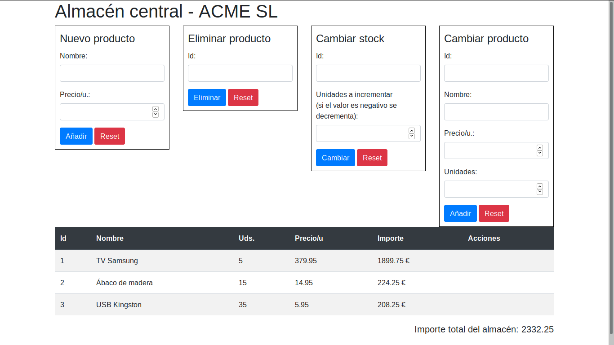

# Bloc 1: Javascript. Práctica 4.1 - DOM
Siguiendo con la práctica de POO vamos a mostrar en una tabla los productos de nuestro almacén. Cada fila corresponderá a un producto y se mostrará su código, nombre, unidades, precio por unidad e importe. En el fichero index.html tenemos una tabla vacía con id almacen donde pintaremos ese almacén. Dicha tabla usa **_bootstrap_** para mejorar la presentación. Debajo de la misma mostraremos el importe total del almacén.

Ya tenemos creadas las clases por lo que la lógica de negocio de nuestra aplicación la tenemos ya hecha. Ahora nos falta crear funciones con las que interactuará el usuario y que se encargarán de modificar los datos usando las clases ya creadas y reflejar los cambios hechos en la página para que los vea el usuario. Necesitaremos funciones para:
* Añadir productos al almacén: deberemos pasarle el nombre del producto y su precio por unidad. Como código tomará automáticamente el siguiente al mayor del almacén (como si fuera un campo autonumérico)
* Eliminar productos del almacén: debemos pasarle el código del producto a eliminar. Deberá pedir confirmación (mostraremos al usuario su código y su nombre) y, si el producto tiene unidades, volverá a pedirla indicando las unidades que tenemos del mismo
* Cambiar stock: recibe un código de producto y el nº de unidades (positivo o negativo) a modificar

Para introducir estos datos tenemos unos formularios vacíos sobre la tabla que deberemos completar (sólo tenemos el título). Para mejorar su presentación usaremos también _bootstrap_ por lo que cada input del formulario tendrá la siguiente estructura básica:
```html
<div class="form-group">
  <label for="new-name">Nombre:</label>
  <input type="text" class="form-control" id="new-name">
</div>
```

Respecto a los botones de cada formulario tendrán el siguiente aspecto:
```html
<button type="submit" class="btn btn-default btn-primary">Añadir</button>
<button type="reset" class="btn btn-secondary">Reset</button>
```


Debajo de la tabla crearemos otros 2 formularios nuevos:
* Listado del almacén: hemos de indicar si lo queremos alfabético o por nº descendente de unidades
* Productos bajo stock: indicamos el número de unidades y si lo queremos ordenado alfabéticamente o por nº ascendente de unidades

Debajo de ellos crearemos una zona en la que mostraremos el resultado de estos listados en una lista desordenada. Los datos a mostrar de cada producto son su nombre, sus unidades entre paréntesis, su precio y el importe total, como en el siguiente ejemplo:
```
 * TV Samsung MP45 (5): 235,95 €/u => 1179.75 €
```

NOTA: es importante no mezclar la lógica del negocio (el modelo) con la presentación (la vista). Nuestras clases deben ocuparse de los datos pero NO de cómo los vamos a presentar en la pantalla. De eso se ocuparan otras funciones de manera que si decidimos que la información se vea de otra forma eso no debe afectar al modelo.
