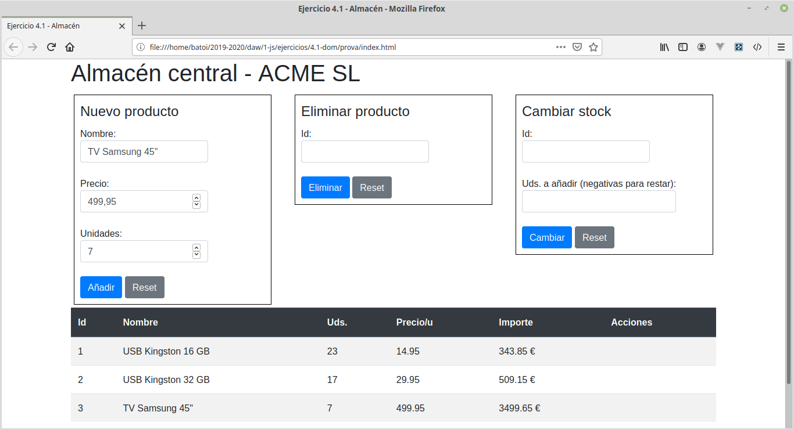

# Bloc 1: Javascript. Práctica 4.1 - DOM
Siguiendo con la práctica de POO vamos a mostrar en una tabla los productos de nuestro almacén. Cada fila corresponderá a un producto y se mostrará su código, nombre, unidades, precio por unidad e importe. En el fichero index.html tenemos una tabla vacía con id almacen donde pintaremos ese almacén. Dicha tabla usa **_bootstrap_** para mejorar la presentación. Debajo de la misma mostraremos el importe total del almacén.

Ya tenemos creadas las clases por lo que la lógica de negocio de nuestra aplicación la tenemos ya hecha. Ahora nos falta crear funciones con las que interactuará el usuario y que se encargarán de modificar los datos usando las clases ya creadas y reflejar los cambios hechos en la página para que los vea el usuario. Necesitaremos funciones para:
* Añadir productos al almacén: deberemos pasarle el nombre del producto y su precio por unidad. Opcionalmente podemos pasarle un nº inicial de unidades
* Eliminar productos del almacén: debemos pasarle el código del producto a eliminar. Deberá pedir confirmación (mostraremos al usuario la id del producto a eliminar y su nombre) y, si el producto tiene unidades, volverá a pedirla indicando las unidades que aún tenemos del mismo y que desaparecerán
* Cambiar stock: recibe una id de producto y el nº de unidades (positivo o negativo) a modificar
* Cambiar producto: recibe un objeto con la id del producto a modificar y las propiedades que deseamos modificar (las no incluidas permanecerán inalteradas)

Para introducir estos datos crearemos unos formularios vacíos sobre la tabla que deberemos completar (sólo tenemos el título). Para mejorar su presentación usaremos también _bootstrap_ por lo que cada input del formulario tendrá la siguiente estructura básica (añadiremos estas 4 líneas de código al _index.html_ para cada input que queramos poner:
```html
<div class="form-group">
  <label for="new-name">
    <span>Nombre: </span>
    <input type="text" class="form-control" id="new-name">
  </label>
</div>
```

Respecto a los botones de cada formulario tendrán el siguiente aspecto:
```html
<button type="submit" class="btn btn-default btn-primary">Añadir</button>
<button type="reset" class="btn btn-secondary">Reset</button>
```


ATENCIÓN: En la etiqueta de cada formulario hemos puesto un atributo, _onsubmit_, que hará que se ejecute la función indicada en dicho atributo cuando se envíe el formulario. Por tanto deberemos crear esa función en nuestro código, quien se encargará de obtener los datos del formulario, validarlos y llamar a las funciones correspondientes.

Podéis modificar lo que necesitéis del _index.html_. De hecho como mínimo tenemos que añadir los inputs de los formularios existentes.

NOTA: es importante no mezclar la lógica del negocio (el modelo) con la presentación (la vista). Las clases que tenemos creadas deben ocuparse de los datos pero NO de cómo los vamos a presentar en la pantalla. De eso se ocuparan otras funciones de manera que si decidimos que la información se vea de otra forma eso no debe afectar al modelo. Lo ideal sería usar el patrón MVC (con o sin clases para el controlador y la vista, como prefiráis).
