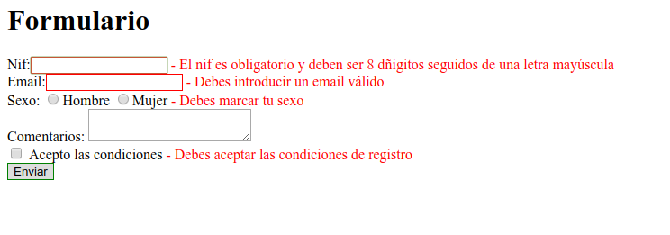

# Bloc 1: Javascript. Práctica 7.2 - Validación de formularios

Haz una página para dar de alta productos de un almacén. El formulario tendrá los siguientes campos:
* código: 3 letras mayúsculas, un guión y 4 números (ej. INF-0013 o VID-1234)
* name: entre 5 y 25 caracteres
* units: entre 0 y 100, sin decimales
* min-stock: entre 0 y 10, sin decimales
* price: entre 0 y 999.99 con un step de 0.01
* categoría: menos de 25 caracteres
* almacén: radiobutton de 3 opciones (Alcoi, València, Alacant)
* comprobado: checkbox que debemos marcar

Todos los campos son obligatorios. Queremos que muestre al usuario los siguientes mensajes de error:
* valueMissing: El campo es obligatorio
* patternMismatch: El valor introducido no cumple con lo pedido
* rangeUnderflow: El valor mínimo es X
* rangeOverflow: El valor máximo es X
* tooShort: Debes introducir al menos X caracteres
* tooLong: Debes introducir como máximo X caracteres

Debes validar el formulario para que **si no hay errores** se envíen todos los campos a la página _verForm.php_. Si hay errores se mostrará junto a cada campo erróneo un mensaje (en el _span_ que hay junto a él). Deben verse TODOS los errores que hay y se situará el cursor en el 1º elemento erróneo:

Lo que debemos validar es:
* todos los _inputs_ son obligatorios (no el _textarea_)
* el nif debe ser 8 números seguidos de 1 letra mayúscula, sin nada más
* el e-mail debe “parecer” un e-mail
* el sexo es obligatorio y no se puede marcar un sexo por defecto
* se deben aceptar las condiciones

También destacaremos en el CSS de alguna manera los campos erróneos.
