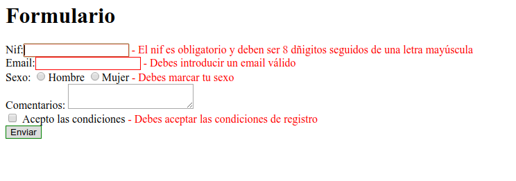

# Bloc 1: Javascript. Ejercicio 8.2 - Validación de formularios

Vamos a validar el formulario de registro que hicimos en el ejercicio de repaso de HTML. Recuerda que el formulario tenía los campos:
- nombre y apellidos
- email
- sexo (radio)
- fecha de nacimiento
- código postal
- qué ciclo está estudiando (a elegir entre DAW, DAM y ASIX)
- qué frameworks conoce (checkbox múltiple con varios frameworks como Angular, Vue, Simfony, Laravel, ...)
- checkbox donde acepta las condiciones del servicio y nuestra política de privacidad

Lo que deberemos validar es:
- nombre y apellidos: obligatorio. Entre 15 y 80 caracteres
- email: obligatorio. Debe ser un email
- sexo (radiobutton): obligatorio
- fecha de nacimiento: obligatoria. Debe tener al menos 18 años
- código postal: obligatorio. Deben ser 5 números (puede empezar por 0)
- qué ciclo está estudiando (a elegir entre DAW, DAM y ASIX): obligatorio
- qué frameworks conoce (checkbox múltiple con varios frameworks como Angular, Vue, Simfony, Laravel, ...): debe marcar entre 1 y 3 opciones
- checkbox donde acepta las condiciones del servicio y nuestra política de privacidad: obligatorio

No es necesario que el formulario tengo "buen aspecto". Puede ser algo como:
```html
 <form  id="registro" method="POST" action="verForm.php"> 
	<label for="reg-nombre">Nombre:</label><input id="reg-nombre" name="reg-nombre" type="text"> <span id="err-nombre"></span><br> 
	<label for="reg-email">Email:</label><input id="reg-email" name="reg-email" type="text"> <span id="err-email"></span><br> 
	<label id="reg-sexo">Sexo: 
		<input type="radio" name="reg-sexo" value="hombre"/>Hombre 
		<input type="radio" name="reg-sexo"  value="mujer" />Mujer</label> <span id="err-sexo"></span><br /> 
	...
	<input id="reg-acept" name="reg-acept" type="checkbox">
	<label for="reg-acept">Acepto las condiciones</label><span id="err-acept"></span><br> 
	
	 <input value="Enviar" type="submit"> 
	 <input value="Reset" type="reset"> 
</form>
```

Debes validar el formulario para que **si no hay errores** se envíen todos los campos a la página _verForm.php_. Si hay errores se mostrará junto a cada campo erróneo un mensaje (en el _span_ que hay junto a él). Deben verse TODOS los errores que hay y se situará el cursor en el 1º elemento erróneo:



También destacaremos en el CSS de alguna manera los campos erróneos.
