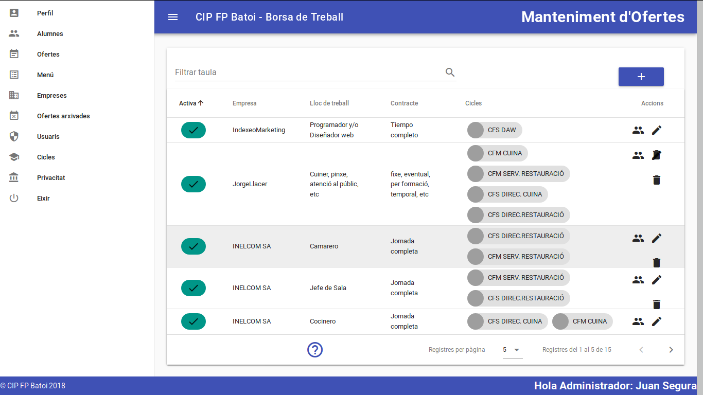

# Componentes en Vue
- [Componentes en Vue](#componentes-en-vue)
  - [Introducción a los componentes](#introducción-a-los-componentes)
  - [Aplicación de ejemplo](#aplicación-de-ejemplo)
    - [App.vue](#appvue)
      - [App.vue en _Options API_](#appvue-en-options-api)
    - [DelAll.vue](#delallvue)
    - [AddItem.vue](#additemvue)
    - [TodoList.vue](#todolistvue)
    - [TodoItem.vue](#todoitemvue)
    - [Ejercicio](#ejercicio)

## Introducción a los componentes
El sistema de componentes es un concepto importante en Vue y en cualquier framework moderno. En lugar de separar nuestra aplicación en ficheros según el tipo de información que contienen (ficheros html, css o js) es más lógico separarla según su funcionalidad. Una página web muestra una UI donde se pueden distinguir diferentes partes. En el siguiente ejemplo tenemos:



- un menú que es una lista que contiene
  - (repetido) un elemento de menú, cada uno formado por un logo y un texto
- una barra de título, con un icono y 2 textos
- una tabla con la información a mostrar, formada por
  - un elemento para filtrar la información formado por un input y un botón de buscar
  - un botón para añadir nuevos elementos a la tabla
  - una cabecera con los nombres de cada campo
  - (repetido) una fila para mostrar cada elemento de información, con botones para realizar diferentes acciones
  - un pie de tabla con información sobre los datos mostrados
- un pie de página

Pues estos elementos podrían constituir diferentes componentes: nuestras aplicaciones estarán compuestas de pequeños componentes independientes y reusables en diferentes partes de nuestra aplicación o en otras aplicaciones (podemos usar el elemento de buscar en otras páginas de nuestra aplicación o incluso en otras aplicaciones). También es habitual que un componente contenga otros subcomponentes, estableciéndose relaciones padre-hijo (por ejemplo el componente tabla tiene como subcomponentes el buscador y cada una de las filas, y el componente fila tendrá un subcomponente por cada botón que queramos poner en ella).

Para saber qué debe ser un componente y que no, podemos considerar un componente como un elemento que tiene entidad propia, tanto a nivel funcional como visual, es decir, que puede ponerse en el lugar que queramos de la aplicación y se verá y funcionará correctamente. Además es algo que es muy posible que pueda aparecer en más de un lugar de la aplicación. En definitiva un componente es un objeto Javascript que:
- es una parte visual de la aplicación (debe tener HTML asociado)
- tiene su propia funcionalidad (incluye código JS)
- puede reutilizarse y combinarse con otros componentes para formar componentes mayores

El componente es un objeto con una parte de **HTML** donde definimos su estructura y una parte **JS** que le da su funcionalidad. Cuando trabajemos con _Single File Components (SFC)_ también se incluirá una parte **CSS** para establecer su apariencia.

Separar nuestra aplicación en componentes nos va a ofrecer muchas ventajas:
* encapsulamos el código de la aplicación en elementos más sencillos
* facilita la reutilización de código
* evita tener código repetido

Aunque también tiene sus inconvenientes: habrá que geationar la comunicación entre componentes.

El primer paso a la hora de hacer una aplicación debe ser analizar qué componentes tendrá. Para ello podemos hacer un _mockup_ de la aplicación donde se vean los diferentes elementos que la componen y cómo se relacionan entre ellos. A partir de ahí podemos ir creando los componentes necesarios.

En definitiva nuestra aplicación será como un árbol de componentes con la instancia principal de Vue como raíz.


## Aplicación de ejemplo
Para empezar a ver el uso de componentes vamos a seguir con la aplicación de la lista de cosas que hacer pero dividiéndola en componentes. Además vamos a quitar el _checkbox_ que muestra si la tarea está o no hecha y lo cambiaremos por un botón para marcarla como 'Hecha' o 'No hecha'.


La decisión de qué componentes crear es subjetiva pero en principio cuanto más descompongamos más posibilidades tendremos de reutilizar componentes. Nosotros haremos los siguientes componentes:
* **TodoList.vue**: componente que muestra la lista de tareas. Cada item de la lista será un componente _todo-item_
* **TodoItem.vue**: componente que representa cada tarea individual
* **DelAll.vue**: componente con un botón para borrar todas las tareas
* **AddItem.vue**: componente con un formulario para añadir nuevas tareas (el input y el botón)

En el siguiente diagrama podemos ver esta estructura de componentes:

```plaintext
App.vue
 ├── TodoList.vue
 |    └── TodoItem.vue
 ├── AddItem.vue
 └── DelAll.vue
```

El \<template> del componente principal **App.vue** simplemente mostrará el título y mostrará cada uno de los componentes indicados (_todo-list_, _todo-add_ y _todo-del-all_).

**NOTA**: Nuestra aplicación ya tiene una estructura básica formada por varios componentes pero no funciona porque los datos que se declaran en un componenete son locales al mismo y no son accesibles desde otros componentes. Para solucionar esto necesitamos un sistema de comunicación entre componentes, lo que veremos en el siguiente capítulo de [comunicación entre componentes](./comunicacar-componentes).

Vamos a ver la solución. Puedes descargarla desde el [repositorio de Github](https://github.com/juanseguravasco/vue-todo-list/tree/3-componentes).

### App.vue
```vue
<script setup>
import DelAll from "./components/delAll.vue";
import AddItem from "./components/addItem.vue";
import TodoList from "./components/todoList.vue";
</script>

<template>
  <div>
    <h2>Cosas a hacer este año:</h2>
    <todo-list />
    <add-item />
    <del-all />
  </div>
</template>
```

Su template es muy sencillo: sólo muestra el título y los 3 componentes que hemos creado.

#### App.vue en _Options API_
Para usar un componente en la sintaxis de _Options API_ tenemos que importarlo en el _script_ y luego declararlo en la opción `components` del objeto exportado. El ejemplo anterior sería:

```vue
<script>
import DelAll from "./components/delAll.vue";
import AddItem from "./components/addItem.vue";
import TodoList from "./components/todoList.vue";

export default {
  components: {
    DelAll,
    AddItem,
    TodoList,
  },
};
</script>

<template>
  <div>
    <h2>Cosas a hacer este año:</h2>
    <todo-list />
    <add-item />
    <del-all />
  </div>
</template>
```

### DelAll.vue
```vue
<script setup>
const delTodos = () => {
  todos.value = [];
};
</script>

<template>
  <button @click="delTodos">Borrar toda la lista</button>
</template>
```

Es sólo el botón para borrar toda la lista. De momento el método no funciona porque no tiene acceso al array de tareas.

### AddItem.vue
```vue
<script setup>
import { ref } from 'vue';

const newTodo = ref("");

const addTodo = () => {
  if (newTodo.value.trim()) {
    todos.value.push({ title: newTodo.value.trim(), done: false });
    newTodo.value = "";
  }
};
</script>
<template>
  <div>
    <input v-model="newTodo" placeholder="Add new item" />
    <button @click="addTodo">Add</button>
  </div>
</template>
```

Este componente es el formulario para añadir una nueva tarea. De momento el método no funciona porque no tiene acceso al array de tareas.

### TodoList.vue
```vue
<script setup>
import { ref } from "vue";
import TodoItem from "./todoItem.vue";

const todos = ref([
  { id: 1, title: "Learn JavaScript", done: false  },
  { id: 2, title: "Learn Vue", done: false  },
  { id: 3, title: "Play around in JSFiddle", done: true  },
  { id: 4, title: "Build something awesome", done: true  },
]);
</script>

<template>
  <ul v-if="todos.length">
    <todo-item v-for="todo in todos" :key="todo.id" :item="todo" />
  </ul>
  <p v-else>No hay tareas que mostrar</p>
</template>
```

Este componente muestra la lista de tareas por lo que es aquí donde se declara el array de tareas. Cada tarea se muestra con el subcomponente _todo-item_, al que hay que pasarle la tarea a mostrar.

Para pasar un parámetro a un subcomponente simplemente se pone como un atributo del mismo. En este caso estamos pasándole una variable llamada _item_ que contiene la tarea a mostrar.

### TodoItem.vue
```vue
<script setup>
import { defineProps } from "vue";

const props = defineProps({
  item: Object,
});

const delTodo = () => {
  todos.value.splice(index, 1);
};
const toogleDone = () => {
  props.item.done = !props.item.done;
};
</script>
<template>
  <li>
    <label>
      <del v-if="item.done">
        { { item.title }}
      </del>
      <span v-else>
        { { item.title }}
      </span>
    </label>
    <button @click="toogleDone()">
      { { item.done ? "No Hecha" : "Hecha" }}
    </button>
    <button @click="delTodo()">Borrar</button>
  </li>
</template>
```

En primer lugar, para recibir el parámetro usamos la función `defineProps()` que nos devuelve un objeto con las propiedades recibidas. En este caso sólo tenemos una llamada _item_ que es un objeto. Dichas propiedades las guardamos en una constante llamada _props_ para poder acceder a ellas desde el _script_. Desde el _template_ podemos acceder a ellas directamente como se ve.

A continuación tenemos el método para borrar la tarea que ya teníamos y un nuevo método para marcarla como hecha o no hecha ya que hemos quitado el _checkbox_ que lo hacía.

Como veis el método para borrar la tarea no funciona porque no tenemos acceso al array de tareas, pero sí que funciona el de marcarla como hecha o no hecha ya que actúa sobre la tarea que sí tenemos. Sin embargo esta no es una buena forma de hacerlo ya que estamos modificando una variable que nos pasan como parámetro y eso nunca es adecuado. Veremos cómo hacerlo correctamente en el siguiente apartado.

### Ejercicio
Con lo que sabemos hasta ahora podemos hacer que la aplicación funcione, aunque no de la manera más correcta. Intenta hacerlo tú mismo antes de ver la mejor forma de hacerlo en el siguiente apartado sobre [comunicación entre componentes](./comunicacion-componentes).
