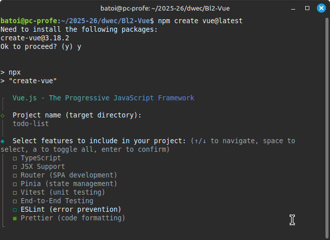
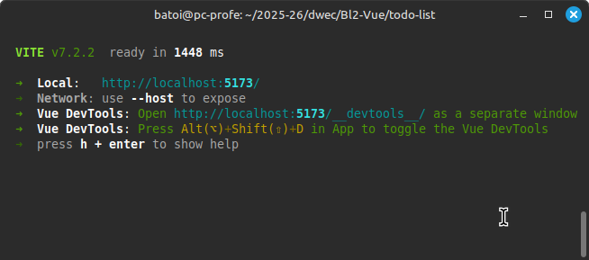
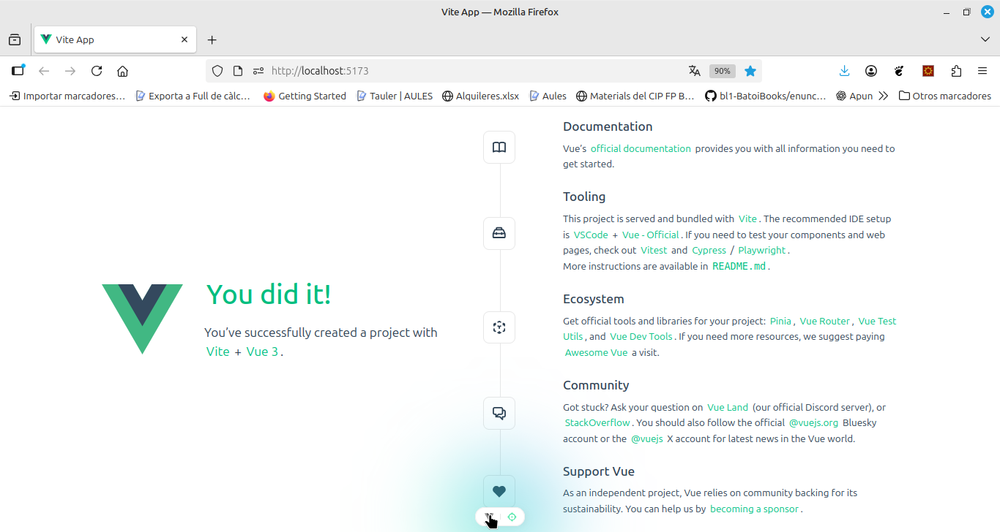
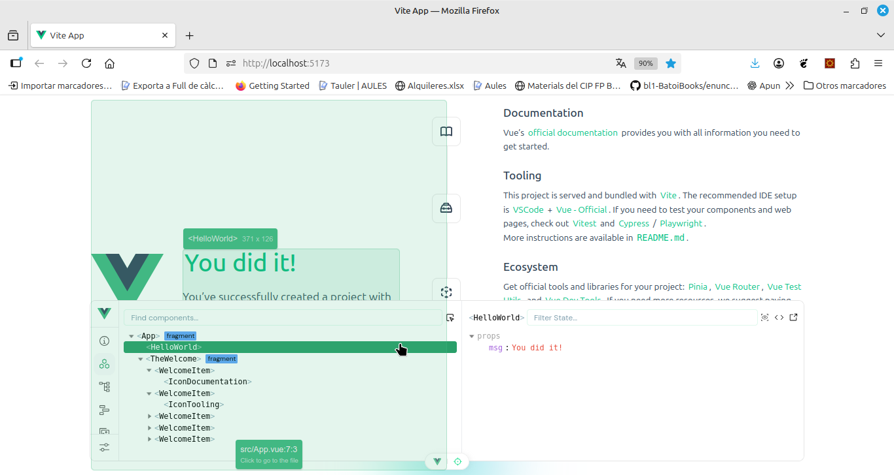

# Proyectos Vue. SFC
- [Proyectos Vue. SFC](#proyectos-vue-sfc)
  - [Crear un proyecto Vue](#crear-un-proyecto-vue)
    - [_Scaffolding_ creado](#scaffolding-creado)
      - [package.json](#packagejson)
      - [index.html](#indexhtml)
      - [main.js](#mainjs)
  - [Los ficheros SFC (_Single File Component_)](#los-ficheros-sfc-single-file-component)
    - [\<template\>](#template)
    - [\<script\>](#script)
    - [\<style\>](#style)
    - [Custom blocks](#custom-blocks)
    - [SFC creados en el nuevo proyecto](#sfc-creados-en-el-nuevo-proyecto)
      - [App.vue](#appvue)
        - [Sección **_template_**](#sección-template)
        - [Sección **_script_**](#sección-script)
        - [Sección **_style_**](#sección-style)
      - [components/HelloWorld.vue](#componentshelloworldvue)
        - [Sección **_script_**](#sección-script-1)
        - [Sección **_template_**](#sección-template-1)
        - [Sección **_style_**](#sección-style-1)
  - [_Build and Deploy_ de nuestra aplicación](#build-and-deploy-de-nuestra-aplicación)
  - [Añadir nuevos paquetes y plugins](#añadir-nuevos-paquetes-y-plugins)
    - [Bootstrap](#bootstrap)
    - [Iconos](#iconos)
  - [Crear un nuevo componente](#crear-un-nuevo-componente)
  - [Depurar el código en la consola](#depurar-el-código-en-la-consola)
  - [Aplicación de ejemplo](#aplicación-de-ejemplo)

## Crear un proyecto Vue
Aunque como hemos visto, se puede usar Vue enlazando la librería directamente en el HTML, lo más habitual es crear una aplicación Vue completa usando un _build tool_ como **Vite** (recomendado) o **Vue CLI**. Las ventajas de hacerlo así son muchas:
* Crea automáticamente el _scaffolding_ básico de nuestro proyecto basándose en una serie de plantillas predefinidas
* Facilita el trabajo con componentes, permitiendo que cada uno de ellos esté en su propio fichero (**SFC**, _Single File Components_)
* Incluye utilidades y herramientas como Babel, Uglify, ... que permiten
  * gestionar las dependencias de nuestro código
  * empaquetar todos los ficheros _.vue_ y librerías en un único fichero JS y CSS
  * traspilar el código ES2015/2016, SCSS, etc a ES5 y CSS3 estándar
  * minimizar el código generado
* Incluye herramientas que facilitan el desarrollo

Para crear un nuevo proyecto Vue usaremos la herramienta [Vite](https://vitejs.dev/) igual que hicimos en Javascript, que es un _build tool_ moderno y muy rápido. Vite permite crear proyectos con diferentes frameworks (Vue, React, Svelte, ...).

Podríamos crearlo con el comando `npm create vite@latest` y eligiendo el framework _Vue_ cuando nos pregunta pero lo haremos con el comando:

```bash
npm create vue@latest
```

Al ejecutar este comando se nos pregunta el nombre del proyecto a crear y nos muestra una serie de herramientas que podemos integrar ya en el proyecto. De momento no marcaremos ninguna.



Más adelante veremos qué proporciona cada una. Ahora aceptamos las opciones por defecto y se crea el directorio con el scaffolding básico para un proyecto Vue con un proyecto de ejemplo.

Lo primero que haremos es entrar al directorio del proyecto e instalar las dependencias (`npm install`) y a continuación ejecutar:
```bash
npm run dev
```

Este script de _Vite_ funciona como ya vimos en el bloque de Javascript: compila el código, muestra si hay errores, lanza un servidor web en el puerto 5173 y carga el proyecto en el navegador (http://localhost:5173). Si cambiamos cualquier fichero del directorio _src_ recompila y recarga la página automáticamente. 

Además nos va a permitir acceder a una página desde donde explorar los componentes de nuestra aplicación y ver su código, propiedades, etc. igual que podemos hacer desde la consola si hemos instalado las **Vue DevTools**.



La página generada es por el proyecto es:



### _Scaffolding_ creado
Se ha creado la carpeta con el nombre del proyecto y dentro el scaffolding para nuestro proyecto:


Los principales ficheros y directorios creados son:
* `package.json`: configuración del proyecto (nombre, autor, ...), scripts y dependencias
* `vite.config.js`: configuración de Vite
* `index.html`: html con un div donde se cargará la app
* `node_modules`: librerías de las dependencias
* `public`: lugar donde dejar elementos estáticos que no pasarán por _vite_. Podemos poner imágenes, CSS, etc y lo referenciaremos de forma ABSOLUTA como si estuviera en `/`
* `src`: todo nuestro código
    * `assets/`: nuestros CSS, imágenes, etc. Elementos que _vite_ procesará y optimizará
    * `components/`: carpeta que contendrá los ficheros .vue de los diferentes componentes
        * `HelloWorld.vue`: componente de ejemplo usado por App.vue
    * `router/`: carpeta con los ficheros del router si usamos _vue-_router_ para crear aplicaciones SPA
    * `store/`: carpeta con los ficheros del store si usamos un _Store pattern_ como _pinia_
    * `views`: si usamos _vue-router_ aquí pondremos los componentes que constituyen una vista de la aplicación
    * `App.vue`: es el componente principal y constituye nuestra página de inicio del proyecto. Aquí cargaremos la cabecera, el menú,... y los diferentes componentes
    * `main.js`: JS principal que crea la instancia de Vue que carga el componente principal llamado _App.vue_ y lo renderiza en _#app_

#### package.json
Aquí se configura nuestra aplicación:
* **name, version, author, license**, ...: configuración general de la aplicación
* **scripts**: ejecutan entornos de configuración para webpack:
  * **dev**: lanza el servidor web de vite y configura vue para el entorno de desarrollo
  * **build**: crea los ficheros JS y CSS dentro de **/dist** con todo el código de la aplicación
  * **preview**: lanza un servidor web para previsualizar la aplicación ya construida para producción
* **dependences**: se incluyen las librerías y plugins que utiliza nuestra aplicación en producción (vue, etc). Todas las dependencias se instalan dentro de **/node-modules**.  Para instalar una nueva dependencia de desarrollo ejecutaremos `npm install nombre-del-paquete -S` (la opción -S la añade a package.json como dependencia de producción).
* **devDependencies**: igual pero son paquetes que sólo se usan en desarrollo (vite, etc). También se instalan dentro de node-modules pero no estarán cuando se genere el código para producción. Para instalar una nueva dependencia de desarrollo ejecutaremos `npm install nombre-del-paquete -D` (la opción -D la añade a package.json pero como dependencia de desarrollo).

#### index.html
Simplemente tiene el \<div> _app_ que es el que contendrá la aplicación.

#### main.js
```javascript
import './assets/main.css'
import { createApp } from 'vue'
import App from './App.vue'

createApp(App).mount('#app')
```

Es el fichero JS principal. Importa la utilidad _createApp_ de la librería _Vue_ y el componente _App.vue_. Crea la instancia de Vue con el componente definido en _App.vue_ y lo renderiza en el elemento _#app_ del _index.html_.

## Los ficheros SFC (_Single File Component_)
Lo normal es separar el código de nuestra aplicación en diferentes componentes y que cada uno de ellos pueda guardarse en su propio fichero y así no tenemos un fichero con demasiado código. A estos ficheros que contienen un componente se les llama _Single File Components (SFC)_ y tienen extensión **.vue**. 

Estos ficheros contienen 3 secciones diferentes:
* \<template>: contiene todo el HTML del componente
* \<script>: con el JS del mismo
* \<style>: donde pondremos el CSS del componente
  
Aunque esto va contra la norma de tener el HTML, JS y CSS en ficheros separados en realidad sí están separados en diferentes secciones y tenemos la ventaja de tener en un único fichero todo lo que necesita el componente.

La mayoría de editores soportan estos ficheros instalándoles algún plugin, (como _Vue-Oficial_ para Visual Studio Code) por lo que el resaltado de las diferentes partes es correcto. Además **Vite** nos permite usar ES2015 o posterior y los preprocesadores más comunes (SASS, Pug/Jade, Stylus, ...) y ya se se traducirá automáticamente el código a ES5, HTML5 y CSS3.

Veamos en detalle cada una de las secciones del SFC.

### \<template>
Aquí incluiremos el HTML que sustituirá a la etiqueta del componente. Recuerda que en las versiones anteriores a Vue3 dentro sólo puede haber un único elemento HTML (si queremos poner más de uno los incluiremos en otro que los englobe).

```html
<template>
  <div class="greetings">
    <h1 class="green">{ { msg }}</h1>
    <h3>
      You’ve successfully created a project with
      <a href="https://vitejs.dev/">Vite</a> +
      <a href="https://vuejs.org/">Vue 3</a>.
    </h3>
  </div>
</template>
```

Si el código HTML a incluir en el template es muy largo podemos ponerlo en un fichero externo y vincularlo en el template, así nuestro SFC queda más pequeño y legible:
```vue
<template src="./myComp.html">
</template>
```

Respecto al lenguaje, podemos usar HTML (la opción por defecto) o [PUG](https://pugjs.org/api/getting-started.html) que es una forma sencilla de escribir HTML. Lo indicamos como atributo de \<template>:
```html
<template lang="pug">
div.greetings
  h1.green { { msg }}
  h3
    | You’ve successfully created a project with 
    a(href="https://vitejs.dev/") Vite
    |  +
    a(href="https://vuejs.org/") Vue 3

```

### \<script>
Aquí definimos y exportamos el componente-. Si estamos usando la sintaxis de Options API el componente será un objeto con diferentes propiedades, entre otras:
- **name**: el nombre del componente. Es recomendable ponerlo, aunque sólo es obligatorio en caso de componentes recursivos. Es el nombre con el que se referenciará al componente en la consola del navegador usando las _Dev tools_.
- **components**: aquí registramos componentes hijos que queramos usar en el _template_ de este componente (debemos haber importado previamente los ficheros _.vue_ que los contienen). En el _template_ usaremos como etiqueta el nombre con que lo registramos aquí
- **props**: donde registramos los parámetros que nos pasa el componente padre como atributos de la etiqueta que renderiza este componente
- **data()**: función que devuelve un objeto con todas las variables locales del componente
- **methods**: objeto con los métodos del componente
- **computed**: aquí pondremos las variables calculadas del componente. Lo veremos en detalle en la [unidad 6](https://cipfpbatoi.github.io/materials/daw/dwc/02-vue/06-profundizando.html#computed)
- **created()**, **mounted()**, ...: funciones _hook_ que se ejecutan al crearse el componente, al montarse, ... Aquí pondremos el código que queremos que se ejecute al cargar un componente, como pedir a la BBDD los datos que necesita. Veremos los diferentes _hooks_ en la [unidad 6](https://cipfpbatoi.github.io/materials/daw/dwc/02-vue/06-profundizando.html#ciclo-de-vida-del-componente)
- **watch**: si queremos observar manualmente cambios en alguna variable y ejecutar código como respuesta a ellos (recuerda que Vue ya se encarga de actualizar la vista al cambiar las variables y viceversa). Lo veremos en detalle en la [unidad 6](https://cipfpbatoi.github.io/materials/daw/dwc/02-vue/06-profundizando.html#watchers)
- ...

### \<style>
Aquí pondremos estilos CSS que se aplicarán al componente. Podemos usar CSS, SASS o [PostCSS](https://postcss.org/). Si queremos importar ficheros de estilo con `@import` deberíamos guardarlos dentro de la carpeta _assets_ de nuestra aplicación.

Si la etiqueta incluye el atributo _**scoped**_ estos estilos se aplicarán únicamente a este componente (y sus descendientes) y no a todos los componentes de nuestra aplicación. Si tenemos estilos que queremos que se apliquen a toda la aplicación y otros que son sólo para el componente y sus descendientes pondremos 2 etiquetas \<style>, una sin el atributo _scoped_ y otra con él.

Igual que vimos en la etiqueta \<template>, si el código de los estilos es demasiado largo podemos ponerlo en un fichero externo que vinculamos a la etiqueta con el atributo _src_.

### Custom blocks
Además de estos 3 bloques un SFC puede tener otros bloques definidos por el programador para, por ejemplo, incluir la documentación del componente o sus test unitarios:
```vue
<custom1 src="./unit-test.js">
    Aquí podríamos incluir los test unitarios del proyecto
</custom1>
```

### SFC creados en el nuevo proyecto
En el _scaffolding_ creado por _Vite_ tenemos varios SFC:

#### App.vue
Es el componente raíz de la aplicación, el que contiene el _layout_ de la página. Se trata de un _SFC (Single File Component)_ y lo que contiene dentro de la etiqueta _\<template>_ es lo que se renderizará en el div _app_ que hay en _index.html_. Si contiene algún otro componente se indica aquí dónde renderizarlo (en este caso \<HelloWorld> y \<TheWelcome>).

Veamos qué contiene cada sección:

##### Sección **_template_**

```html
<template>
  <header>
    

    <div class="wrapper">
      <HelloWorld msg="You did it!" />
    </div>
  </header>

  <main>
    <TheWelcome />
  </main>
</template>
```

Muestra la imagen del logo de Vue (las imágenes y otros ficheros como ficheros .css se guardan en **/public** o dentro de **/src/assets/** -como el de Vue-) y carga en su _header_ el componente _HelloWorld_ y en su _main_ el componente _TheWelcome_.

##### Sección **_script_**

```javascript
<script setup>
import HelloWorld from './components/HelloWorld.vue'
import TheWelcome from './components/TheWelcome.vue'
</script>
```

Lo que hace es importar los componentes que se utilizan en el template. Esta es la sintaxis de _Composition API_. En sintaxis de _Options API_ sería:

```javascript
<script>
import HelloWorld from './components/HelloWorld.vue'
import TheWelcome from './components/TheWelcome.vue'

export default {
  components: {
    HelloWorld,
    TheWelcome
  }
}
</script>
```

En esta sintaxis siempre se exporta un objeto con las opciones del componente, en este caso la opción _components_ donde se registran los componentes que hemos importado.

##### Sección **_style_**

Aquí se definen los estilos de este componente. Como la etiqueta SÍ tiene el atributo _scoped_ (`<style scoped>`) significa que los estilos aquí definidos se aplicarán SÓLO a este componente, y a sus subcomponentes.

#### components/HelloWorld.vue
Es el componente que muestra el texto que aparece bajo la imagen. Recibe como parámetro el título a mostrar. Veamos qué contiene cada sección:

##### Sección **_script_**

```javascript
<script setup>
defineProps({
  msg: {
    type: String,
    required: true,
  },
})
</script>
```

Con `defineProps` declara que recibe el parámetro _msg_, que es de tipo String y obligatorio. 

En sintaxis **_Options API_** sería:

```javascript
<script>
export default {
  props: {
    msg: {
      type: String,
      required: true,
    },
  }
}
</script>
```

##### Sección **_template_**

```html
<template>
  <div class="greetings">
    <h1 class="green">{ { msg }}</h1>
    <h3>
      You’ve successfully created a project with
      <a href="https://vite.dev/" target="_blank" rel="noopener">Vite</a> +
      <a href="https://vuejs.org/" target="_blank" rel="noopener">Vue 3</a>.
    </h3>
  </div>
</template>
```

Muestra el _msg_ recibido como parámetro. 

##### Sección **_style_**

También tiene el atributo _scoped_ (`<style scoped>`) por lo que los estilos aquí definidos se aplicarán sólo a este componente.

## _Build and Deploy_ de nuestra aplicación
Normalmente trabajaremos con algún gestor de versiones como _git_. Para subir nuestro proyecto al repositorio lo creamos (en _GitHub_, _GitLab_ o donde queramos) y ejecutamos desde la carpeta del proyecto:

```bash
git init
git add .
git remote add origin https://github.com/mi-usuario/mi-proyecto
git commit -m "Primer commit"
git push -u origin main
```

Cuando nuestra aplicación esté lista para subir a producción ejecutaremos el script:
```bash
npm run build
```

Este comando genera los JS y CSS para subir a producción dentro de la carpeta _dist_. El contenido de esta carpeta es lo único que debemos subir a nuestro servidor de producción.

## Añadir nuevos paquetes y plugins
Si queremos usar un nuevo paquete en nuestra aplicación lo instalaremos con _npm_:
```bash
npm install nombre-paquete
```

Este comando además de instalar el paquete en _node-modules_ lo añade a las dependencias del _package.json_. La opción **`--save`** o **`-S`** lo añadirá como dependencia de producción y **`--dev`** o **`-D`** como dependencia de desarrollo. Si no ponemos nada se añade como una dependencia de producción. Ej.:
```bash
npm install -S axios
```

Para usarlo en nuestros componentes debemos importarlo y registrarlo tal y como se indique en su documentación. Podemos hacerlo en el **_main.js_** (o en algún fichero JS que importemos en _main.js_ como en el caso de los plugins) si queremos poder usarlo en todos los componentes.

Si el paquete que queremos instalar se encuentra como plugin el proceso es más sencillo ya que sólo es necesario usar `app.use(myPlugin, { /* opciones opcionales */})` en el fichero `main.js`.

### Bootstrap
Si queremos usarlo lo instalaremos como una dependencia de producción y después lo añadimos al fichero `src/main.js`:
```javascript
import "bootstrap/dist/css/bootstrap.css"
```

Recuerda que siempre es conveniente importar _Bootstrap_ antes de importar nuestro propio CSS (antes de la línea `import './assets/main.css'`). 

Si necesitamos algún componente de _Bootstrap_ que utilice Javascript importaríamos también su javascript en el fichero _main.js_ pero en este caso después de montar la aplicación vue:

```javascript
// src/main.js
import { createApp } from 'vue'
import App from './App.vue'

import "bootstrap/dist/css/bootstrap.css"
import './assets/main.css'

createApp(App).mount('#app')

import "bootstrap/dist/js/bootstrap.js"
```

### Iconos
Para usar los iconos de _Bootstrap 5_ podemos instalar el paquete _bootstrap-icons_ o bien importarlos en el CSS desde su CDN, tal y como se explica en la [documentación de Bootstrap](https://icons.getbootstrap.com/#install). Una vez hecho ya podemos incluir los iconos en etiquetas _\<i>_.

Por ejemplo, si importamos el CSS incluiremos en el _\<style>_ del componente **App.vue**:
```javascript
@import url("https://cdn.jsdelivr.net/npm/bootstrap-icons@1.11.3/font/bootstrap-icons.css")
```

y donde queramos incluir el icono de la papelera, por ejemplo, incluimos:
```html
<i class="bi bi-trash"></i>
```

Si queremos usar otras librerías de iconos como _Font Awesome_ o _Material Icons_ simplemente importaremos su CSS en el fichero _App.vue_ y usaremos las clases que nos proporcionen. Para _Material Icons_ sería:
```javascript
@import url('https://fonts.googleapis.com/icon?family=Material+Icons');
```

y su uso sería:
```html
<span class="material-icons">delete</span>
```

Respecto a los componentes de _Bootstrap_, para que funcionen sólo tenemos que usar los atributos `data-bs-` (recuerda que muchos de estos componentes necesitan su Javascript por lo que deberemos importarlo como se ha explicado antes). Por ejemplo para hacer un botón colapsable haremos:
```html
<button 
  class="btn btn-primary" 
  data-bs-target="#collapseTarget" 
  data-bs-toggle="collapse">
  Bootstrap collapse
</button>
<div class="collapse py-2" id="collapseTarget">
  This is the toggle-able content!
</div>
```

En lugar de usar atributos _data-bs-_ podemos _envolver_ los componentes bootstrap en componentes Vue como se explica en muchas páginas, como [Using Bootstrap 5 with Vue 3](https://stackoverflow.com/questions/65547199/using-bootstrap-5-with-vue-3).

## Crear un nuevo componente
Creamos un nuevo fichero en **/src/components** (o en alguna subcarpeta dentro) con extensión _.vue_. Donde queramos usar ese componente debemos importarlo y registrarlo como ya hemos visto:

// En sintaxis Composition API
```javascript
import CompName from './CompName.vue'
```

// En sintaxis Options API
```javascript
import CompName from './CompName.vue'

export default {
  ...
  components: {
    'comp-name': CompName
  }
  ...
}
```

Y ya podemos incluir el componente en el HTML:
```html
<comp-name ...> ... </comp-name>
```

## Depurar el código en la consola
Podemos seguir depurando nuestro código, poniendo puntos de interrupción y usando todas las herramientas que nos proporciona la consola mientras estamos en modo de depuración (si hemos abierto la aplicación con `npm run dev`).

Como estamos usando _Vite_ no se está ejecutando nuestro código directamente sino que se ha convertido al código que ejecuta el navegador, por eso en el depurador aparecen varios ficheros y el que usaremos para depurar es el que pone _(mapeado)_:


Recordad que con las **Vue DevTools** tenemos una nueva pestaña en la consola desde la que podemos ver todos nuestros componentes con sus propiedades y datos:



## Aplicación de ejemplo
Recordemos estamos haciendo una aplicación para gestionar una lista de tareas a realizar. Ahora vamos a hacerla en un proyecto _Vite_ para lo que crearemos un nuevo proyecto (podemos decirle que no cree los componentes de ejemplo porque no los usaremos) y en el _App.vue_ renderizamos nuestra aplicación.

En el _template_ de _App.vue_ pondremos el DIV del HTML de nuestra aplicación y en el _script_ pondremos todo el código JS que teníamos en el bloque de directivas. En modo _Options API_ quedaría:
```vue
<script>
export default {
  name: 'App',
  data: () => ({
      todos: [
        { id: 1, title: "Learn JavaScript", done: false }, 
        { id: 2, title: "Learn Vue", done: false }, 
        { id: 3, title: "Play around in JSFiddle", done: true }, 
        { id: 4, title: "Build something awesome", done: true }
      ],
      newTodo: '',
  }),
  methods: {
    addTodo() {
      if (this.newTodo.trim()) {
        this.todos.push({ title: this.newTodo.trim(), done: false });
        this.newTodo = '';
      }
    },
    delTodo(index) {
      this.todos.splice(index, 1);
    },
    delTodos() {
      this.todos = [];
    },
  }
}
</script>
```

Si usamos _Composition API_ el código del _script_ sería:
```javascript
<script>
import { ref } from 'vue';
export default {
  name: 'App',
  setup() {
    const todos = ref([
      { id: 1, title: "Learn JavaScript", done: false }, 
      { id: 2, title: "Learn Vue", done: false }, 
      { id: 3, title: "Play around in JSFiddle", done: true }, 
      { id: 4, title: "Build something awesome", done: true }
    ]);
    const newTodo = ref('');

    const addTodo = () => {
      if (newTodo.value.trim()) {
        todos.value.push({ title: newTodo.value.trim(), done: false });
        newTodo.value = '';
      }
    };

    const delTodo = (index) => {
      todos.value.splice(index, 1);
    };

    const delTodos = () => {
      todos.value = [];
    };

    return {
      todos,
      newTodo,
      addTodo,
      delTodo,
      delTodos
    };
  }
}
</script>
```

y abreviado:
```javascript
<script setup>
import { ref } from 'vue';
const todos = ref([
  { id: 1, title: "Learn JavaScript", done: false }, 
  { id: 2, title: "Learn Vue", done: false }, 
  { id: 3, title: "Play around in JSFiddle", done: true }, 
  { id: 4, title: "Build something awesome", done: true }
]);
const newTodo = ref('');    

const addTodo = () => {
  if (newTodo.value.trim()) {
    todos.value.push({ title: newTodo.value.trim(), done: false });
    newTodo.value = '';
  }
};

const delTodo = (index) => {
  todos.value.splice(index, 1);
};

const delTodos = () => {
  todos.value = [];
};

</script>
```

La principal diferencia es que en _Composition API_ debemos usar `ref()` para definir las variables reactivas y acceder a su valor con `.value` mientras que en _Options API_ todas las variables son reactivas y accedemos directamente a ellas con `this.`. Sin embargo, en el _template_ de ambos casos accedemos a las variables directamente sin usar `.value` ni `this.`.

Puedes ver la aplicación en:
https://play.vuejs.org/#eNqVVdtO4zAQ/ZVRXpqKbLJcnkpAC4iVQLvsakG8EB7cZkoNjp21nVKE+lF8Az+2YychaSlI26dmbj5zfGb8HByVZTyvMBgFqZloXlowaKvyMJO8KJW28Awap7CEqVYFDCh0sJ/JTE6UNBasypWBAxcS3mQSKJrnI9iOwHIrcARZ8AOZlnDO5uzS18+CCHIlyTdlwiAsI+gSd94lXlf4acZuL+O3YE/AtKpkDpzOvPzO81z08q2u1tL3eunHFRc5GFWgnXF5B+wR3cd6eiZvh0RBTYDExyvioKFgMBjuA/06glieN/5wCAeH8OyO5lMIm8R4zkSFsdW8CIfD2g1Q5xZscZZTpie5CdSYVxMMQ/IRcnL4qj+ZncVk6swxz4cRfB3W9foVysrMwrp5f8BWd1mbMK1R7zp3FVdCCePAqQIcOcuePHIUbffcYhHRreS4WCWCIqdcF+HgmhlgMFZaMw2CgWUaWRYMYAtccuxB0seAbB1V/dZMKTiR4w+JYLvGuhmSE+3ajXwIRHBjGSXWiMzmw6neze3qgWlSTxTNEn1QC6VgFukLIM353P+hv7OdwxNl/JkzNkENaCwCe31RozQhZxNWCZh/4dODLKhPFSjv7CwLGj9FCE4RU6UppKa7YZtGwaf0Yl00G6PoGcjEZVnRTD+VSCUmM5w8jNUiC6hqoYg3MvqLcIJYqeX6wTd4H8XQyJHsuptcElG9CgmVWK1pSiapKJLw/quQy+t3mqy3mo4ra5WEbxPSywNBbkSxIlJCf+wlkCZ1eEd0Inh7K0nVFk7LFuuFoot8atQCf0kbhTLWV3J7tUd1R2wzT2+UvYPYLBIKOHp9YTlfh5WO9UepreTfOnJyIFk3yl4pRNdAynQbLE16ig2iwBo/IHfxvVGSngs/AiQTVZRcoP5VWk4DlgWjdjgIsxDq8dzb3OqMWruX1gb7vSG1+UWu0aCeu9Xb+ojNO6THw7lPLy9w4R6S1kksVm7Pf+L8Q7tcVA5jHXZMjwTB7sV5tGf+0aPtf2VOFxalaZtyQP10+/gsoIfw5JPWO7i78V67FYLlP0JiXms=

También puedes descargarte el código desde el [repositorio](https://github.com/juanseguravasco/vue-todo-list/tree/2-sfc) de Github.