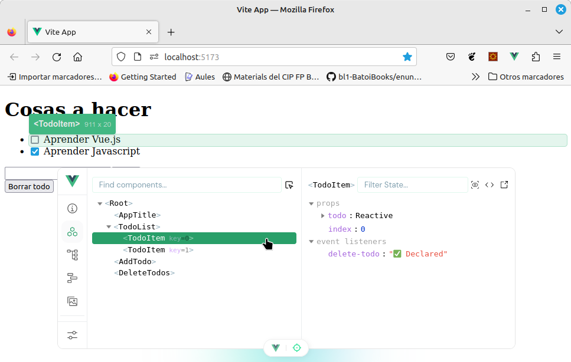
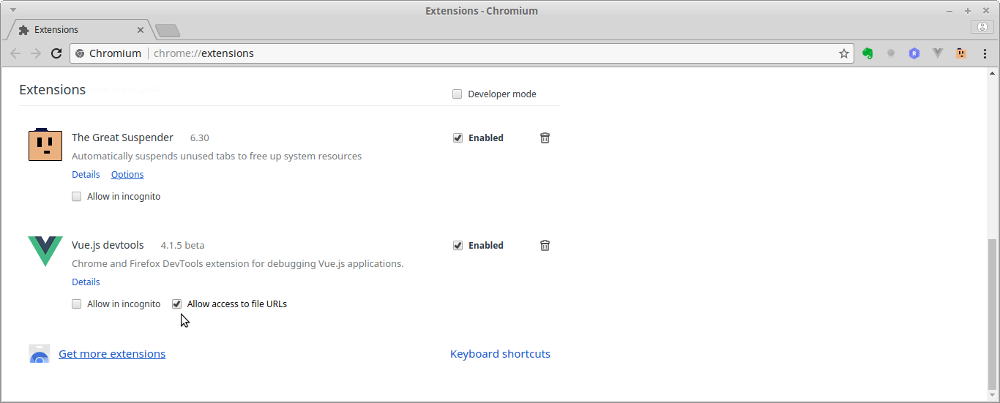

<!-- START doctoc generated TOC please keep comment here to allow auto update -->
<!-- DON'T EDIT THIS SECTION, INSTEAD RE-RUN doctoc TO UPDATE -->
Tabla de contenidos

- [Conceptos básicos](#conceptos-b%C3%A1sicos)
  - [Instalar Vue](#instalar-vue)
  - [La primera aplicación Vue](#la-primera-aplicaci%C3%B3n-vue)
    - [HTML](#html)
    - [Javascript](#javascript)
  - [La instancia _Vue_](#la-instancia-_vue_)
  - [_Binding_ de variables](#_binding_-de-variables)
    - [Enlace unidireccional: interpolación {\{...}}](#enlace-unidireccional-interpolaci%C3%B3n-%5C)
    - [Enlazar a un atributo: v-bind](#enlazar-a-un-atributo-v-bind)
    - [Enlace bidireccional: v-model](#enlace-bidireccional-v-model)
  - [Vue devtools](#vue-devtools)
  - [Extensiones para el editor de código](#extensiones-para-el-editor-de-c%C3%B3digo)

<!-- END doctoc generated TOC please keep comment here to allow auto update -->

# Conceptos básicos
Vue es un framework progresivo para la construcción de interfaces de usuario y aplicaciones desde el lado del cliente. Lo de framework "progresivo" significa que su núcleo es pequeño pero está diseñado para crecer: su núcleo está enfocado sólo en la capa de visualización (como React) pero es fácil añadirle otras bibliotecas o proyectos existentes (algunos desarrollados por el mismo equipo de Vue) que nos permitan crear complejas SPA.

Un framework nos facilita enormemente el trabajo a la hora de crear una aplicación. Vue tiene una curva de aprendizaje menor que otros frameworks y es extremadamente rápido y ligero.

Este material está basado en la [guía oficial de Vue2](https://vuejs.org/v2/guide/) y veremos además los servicios de vue-router y axios entre otros.

**¿Qué framework es mejor?**
Depende de la aplicación a desarrollar y de los gustos del programador. Tenéis algunos enlaces al respecto:
* [¿Angular, Reactjs o Vuejs?, mi opinión. Uno de Piera](https://www.uno-de-piera.com/angular-reactjs-vuejs/)
* [Comparativa VueJs](https://vuejs.org/v2/guide/comparison.html)
* [Comparativa Openwebminars](https://openwebinars.net/blog/los-6-mejores-frameworks-javascript/?utm_source=customer-io&utm_medium=newsletter)
* [Openwebminars: Vue vs Angular](https://openwebinars.net/blog/vue-vs-angular/)
* [Carlos Azaustre: Vue vs Angular (vídeo)](https://www.youtube.com/watch?v=jTtab_rnvic)
* [Angular vs. React vs. Vue: A 2017 comparison](https://medium.com/unicorn-supplies/angular-vs-react-vs-vue-a-2017-comparison-c5c52d620176)
* ...

Las razones de que veamos Vue en vez de Angular o React son, en resumen:
* **Sencillez**: aunque Angular es el framework más demandado hoy en el mercado su curva de aprendizaje es muy pronunciada. Vue es mucho más sencillo de aprender pero su forma de trabajar es muy similar a Angular por lo que el paso desde Vue a Angular es relativamente sencillo
* **Uso del framework**: React es también muy sencillo ya que es simplemente Javascript en el que podemos codificar la vista con JSX, pero la forma de trabajar de Vue es más pàrecida a otros frameworks, especialmente a Angular por lo que lo aprendido nos servirá a la hora de aprender otros framework
* **Rendimiento**: Vue hace uso del concepto de _Virtual DOM_ igual que React por lo que también ofrece buen rendimiento
* **Popularidad**: es el framwork cyua popularidad más está creciendo y ya ha superado incluso a React. Como muestra en 2016 los proyectos desarrollados con Vue obtuvieron 7600 estrellas en GitHub, en 2017 fueron 36700 estrellas y en Junio de 2018 ya han superado las 100000.

## Instalar Vue
Para utilizar Vue sólo necesitamos enlazarlo en nuestra página desde un CDN:
```html
<!-- development version, includes helpful console warnings -->
<script src="https://cdn.jsdelivr.net/npm/vue/dist/vue.js"></script>
```
o
```html
<!-- production version, optimized for size and speed -->
<script src="https://cdn.jsdelivr.net/npm/vue"></script>
```

Más adelante usaremos la herramienta `vue-cli` para crear un completo _scaffolding_ que nos facilitará enormemente la creación de nuestras aplicaciones (donde podremos incluir otras herramientas, trabajar con componentes o construir una SPA de forma sencilla).

## La primera aplicación Vue
Vamos a crear la aplicación con Vue que mostrará un saludo. En el HTML necesitamos enlazar la librería de Vue y creamos un elemento (en nuestro caso un DIV) que contendrá la aplicación

<script async src="//jsfiddle.net/juansegura/psk853hL/embed/"></script>
### HTML
En el HTML debemos vincular los scripts de la librería de Vue y de nuestro código. 

Vue se ejecutará dentro de un elemento de nuestra página (al que se le suele poner como id _app_) que en este caso es un `<div>`.

Dentro de ese elemento podemos usar expresiones de Vue. En este ejemplo se usa el _moustache_ ( **{\{ ... }}** ) que muestra en
la página la variable o expresión Javscript que contiene.

### Javascript
En el fichero JS debemos crear un nuevo objeto Vue que recibe como parámetro un objeto con varias propiedades:
* *el*: el elemento que contendrá la aplicación identificado en notación CSS (# para id, . para clase, ...). Si hubiera más 
de 1 elemento identificado así se cogería sólo el primero (es como hacer un querySelector del mismo)
* *data*: objeto donde definiremos todas las variables que vamos a usar en la vista. En nuestro caso sólo tenemos una que 
es _message_. A cada variable le debemos dar un valor inicial.
* pueden haber más como *methods* (objeto con métodos que podemos llamar desde la vista), *props* (array de variables que se 
pasan de inicio, usado en componentes), *computed* (propiedades calculadas), etc. que veremmos más adelante.

## La instancia _Vue_
La instancia que hemos creado (y cada componente) recibe un objeto de opciones con:
* **el**: el elemento que contendrá la aplicación identificado en notación CSS (# para id, . para clase, ...). Si hubiera más de 1 elemento identificado así se cogería sólo el primero (es como hacer un querySelector del mismo)
* **data**: objeto donde definiremos todas las variables que vamos a usar en la vista (las variables que sólo uemos en el javascript las definiremos con **let** en el método donde vayamos a usarlas. Todas son accesibles desde la vista poniendo su nombre y desde el código JS poniendo *this.su_nombre*.
* **methods**: objeto con métodos a los que podemos llamar desde la vista
* **computed**: son métodos igual pero que se 'cachean'
* _Eventos del ciclo de vida de la instancia_: para ejecutar código en determinados momentos: **'created'**, **'mounted'**, **'updated'**, **'destroyed'**. Ej.:

```javascript
created() {
    console.log('instancia creada'); 
}
```
En la siguiente imagen podéis ver el ciclo de vida de la instancia Vue (y de cualquier componente) y los eventos que se generan y que podemos interceptar:


## _Binding_ de variables
Para probar su funcionamiento conviene que nos descarguemos los ficheros y los abramos en local.

Fichero HTML:
```html
<!DOCTYPE html>
<html>
<head>
  <title>Hello world</title>
</head>
<body>

  <div id="app">
    <p>{{ message }}</p>
  </div>

  <script src="https://unpkg.com/vue"></script>
  <script src="01-HelloWorld.js"></script>
</body>
</html>
```
Nuestro código debemos cargarlo después de cargar la librería y de crear el elemento HTML que cnotenga la aplicación.

Fichero JS:
```javascript
var miApp = new Vue({
  el: '#app',
  data: {
    message: 'Hello Vue.js!'
  }
})
```
### Enlace unidireccional: interpolación {\{...}}
Hemos creado una variable _miApp_ que contiene nuestro objeto Vue y que podemos ver y manipular desde la consola. Si cambiamos el valor de la variable _message_
```javascript
miApp.message = "Hola Vue2!";
```
vemos que cambia lo que muestra nuestra página.

Esto es porque Vue (al igual que Angular o React) enlazan el DOM y los datos de forma que cualquier cambio en uno se refleja automáticamente en el otro.

### Enlazar a un atributo: v-bind
Para mostrar un dato en el DOM usamos **{\{  }}** pero si queremos nostrarlo como atributo de una etiqueta debemos usar `v-bind`:
```html
  <p v-bind:title="message">
    Hover your mouse over me for a few seconds
    to see my dynamically bound title!
  </p>
```
Vue incorpora estos '_atributos_' que podemos usar en las etiquetas HTML y que se llaman **directivas**. Todas las directivas comienzan por `v-`. Como la directiva `v-bind` se utiliza mucho se puede abreviar símplemente como `:`. El siguiente código es equivalente al de antes:
```html
  <p :title="message">
```
### Enlace bidireccional: v-model
Tanto **{\{ }}** como `v-bind` son un enlace unidireccional: muestran en el DOM el valor de un dato y reaccionan ante cualquier cambio en dicho valor. 

Tenemos además está la directiva `v-model` que es un enlace bidireccional que enlace un dato a un campo de formulario y permite cambiar el valor del campo al cambiar el dato pero también cambia el dato si se modifica lo introducido en el input. 
```html
  <input v-model="message">
```

<script async src="//jsfiddle.net/juansegura/psk853hL/24/embed/"></script>

Vemos que al escribir en el _input_ automáticamente cambia lo mostrado en el primer párrafo. Esta característica nos permite ahorrar innumerables líneas de código para hacer que el DOM refleje los cambios que se producen en los datos (cosa que no tiene por ejemplo la librería jQuery).

NOTA: toda la apliación debe estar dentro del elemento _app_ para que funcione.

## [Vue devtools](https://chrome.google.com/webstore/detail/vuejs-devtools/nhdogjmejiglipccpnnnanhbledajbpd?utm_source=chrome-app-launcher-info-dialog)
Es una extensión para Chrome y Firefox que nos permite inspeccionar nuestro objeto Vue y acceder a todos los datos de nuestra aplicación. Conviene instalarlo porque nos ayudará mucho a depurar nuestra aplicación, especialmente cuando comencemos a usar componentes.

Si tenemos las DevTools instaladas en la herramienta de desarrollador aparece una nueva opción, _Vue_, con 4 botones:
* Componentes: es la vista por defecto y nos permite inspeccionar todos los componentes Vue creados (ahora tenemos sólo 1, el principal, pero más adelante haremos componentes hijos)
* Vuex: esla herramienta de gestión de estado para aplicaciones medias/grandes
* Eventos: permite ver todos los eventos emitidos
* Refrescar: refresca la herramienta



Junto al componente que estamos inspeccionando aparece **= $vm0** que indica que DevTools ha creado una variable con ese nombre que contiene el componente por si queremos inspeccionarlo usando la consola.

Cuando inspeccinamos nuestros componentes, bajo la barra de botones aparece otra barra con 3 herramientas:
* Buscar: permite buscar el componente con el ombre introducido aquí
* Seleccionar componente en la página: al pulsarlo (se dibuja un punto en su interior) hace que al pulsar sobre un componente en nuestra página se seleccione en la herramienta de inspeccionar componentes
* Formatear nombre de componentes: muestra los nombres de componentes en el modo _camelCase_ o _kebab-case_

NOTA: Si por algún motivo queremos trabajar sin servidor web (desde file://...) hay que habilitar el acceso a ficheros en la extensión.



## Extensiones para el editor de código
Cuando empecemos a trabajar con componentes usaremos ficheros con extensión **.vue** que integran el HTML, el JS y el CSS de cada componente. Para que nuestro editor los detecte correctamente es conveniente instalar la extensión para Vue (en el caso de Visual Studio Code se llama **Vetur**).
