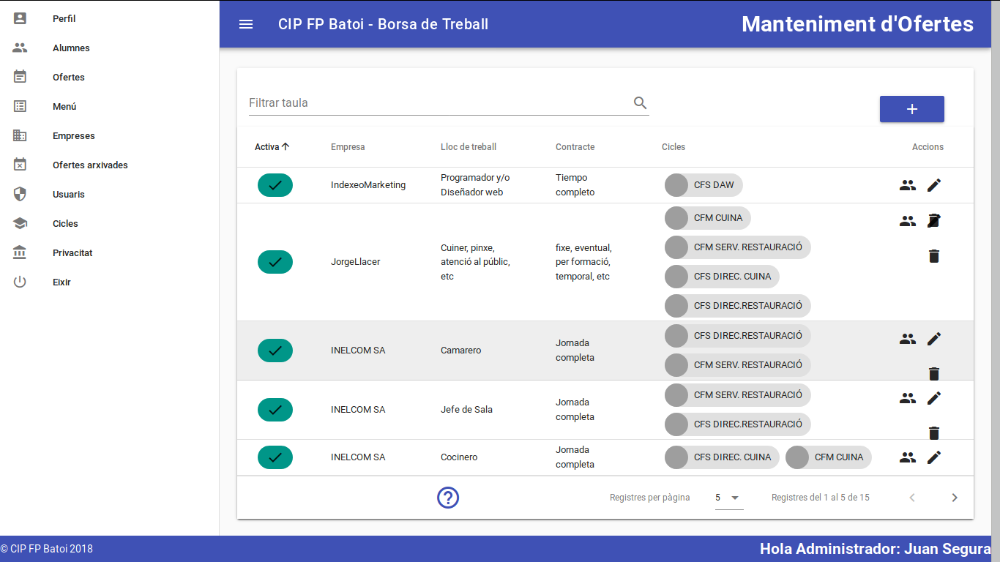

# Componentes en Vue
- [Componentes en Vue](#componentes-en-vue)
  - [Introducción](#introducción)
  - [Usar un componente](#usar-un-componente)
  - [Parámetros: _props_](#parámetros-props)
  - [Ejemplo de aplicación](#ejemplo-de-aplicación)
  - [Separación de componentes en ficheros. _SFC_](#separación-de-componentes-en-ficheros-sfc)
    - [Crear un SFC](#crear-un-sfc)
    - [Usar un SFC](#usar-un-sfc)
    - [Ejemplo](#ejemplo)


## Introducción
El sistema de componentes es un concepto importante en Vue y en cualquier framework moderno. En lugar de separar nuestra aplicación en ficheros según el tipo de información que contienen (ficheros html, css o js) es más lógico separarla según su funcionalidad. Una página web muestra una UI donde se pueden distinguir diferentes partes. En el siguiente ejemplo tenemos:



- un menú que es una lista que contiene
  - (repetido) un elemento del menú, cada uno formado por un logo y un texto
- un título
- una tabla con la información a mostrar, formada por
  - un elemento para filtrar la información formado por un input y un botón de buscar
  - un botón para añadir nuevos elementos a la tabla
  - una cabecera con los nombres de cada campo
  - (repetido) una fila para mostrar cada elemento de información, con botones para realizar diferentes acciones
  - un pie de tabla con información sobre los datos mostrados
- un pie de página

Pues estos elementos podrían constituir diferentes componentes: nuestras aplicaciones estarán compuestas de pequeños componentes independientes y reusables en diferentes partes de nuestra aplicación o en otras aplicaciones (podemos usar el elemento de buscar para otras páginas de nuestra web o incluso para otras aplicaciones). También es habitual que un componente contenga otros subcomponentes, estableciéndose relaciones padre-hijo (por ejemplo en componente fila contendrá un subcomponente por cada botón que queramos poner en ella).

Para saber qué debe ser un componente y que no, podemos considerar un componente como un elemento que tiene entidad propia, tanto a nivel funcional como visual, es decir, que puede ponerse en el lugar que queramos de la aplicación y se verá y funcionará correctamente. Además es algo que es muy posible que pueda aparecer en más de un lugar de la aplicación. En definitiva un componente:
- es una parte de la UI
- debe poder reutilizarse y combinarse con otros componentes para formar componentes mayores
- son objetos JS

El componente es un objeto con una parte de **HTML** donde definimos su estructura, una parte **JS** que le da su funcionalidad y una parte (opcional) **CSS** para establecer su apariencia.

Separar nuestra aplicación en componentes nos va a ofrecer muchas ventajas:
* encapsulamos el código de la aplicación en elementos más sencillos
* facilita la reutilización de código
* evita tener código repetido

El primer paso a la hora de hacer una aplicación debe ser analizar qué componentes tendrá

En definitiva nuestra aplicación será como un árbol de componentes con la instancia principal de Vue como raíz.


## Usar un componente
Para usarlo basta con crearlo con **`app.component`** (`Vue.component` en Vue2), darle un nombre y definir el objeto con sus propiedades _data_, _methods_, .... Además tendrá una propiedad **_template_** con el código HTML que se insertará donde pongamos el componente. Lo hacemos en nuestro fichero JS.

Por ejemplo, vamos a crear un componente para mostrar cada elemento de la lista de tareas a hacer:
```vue
const app = Vue.createApp({
  ...
})

app.component('todo-item', {
  template: `
    <li>
      <input type="checkbox" v-model="elem.done">
      <del v-if="elem.done">
        { { elem.title }}
      </del>
      <span v-else>
        { { elem.title }}
      </span>
    </li>`,
  data: ()=>({
    elem: { title: 'Cosa a hacer', done: true }
  })
})
...
app.mount('#app')
```

**NOTA**: En Vue2 la propiedad _template_ sólo podía tener un nodo principal. En VUe3 esta limitación no existe aunque en _dev-tools_ se depura más fácilmente si solo hay 1. Si queremos más los envolvemos en otra etiqueta (normalmente un <div>):

```javascript
// MAL en Vue2
Vue.component('my-comp', {
  template: `<input id="query">
             <button id="search">Buscar</button>`,
})

// BIEN en Vue2
Vue.component('my-comp', {
  template: `<div>
               <input id="query">
               <button id="search">Buscar</button>
             </div>`,
})
```

El nombre de un componente puede estar en _PascalCase_ (MyComponentName) o en _kebab-case_ (my-component-name). Lo recomendado es que en Javascript lo pongamos en _PascalCase_ y en el HTML en _kebab-case_ (_Vue_ hace la traducción automáticamente). Se recomienda que el nombre de un componente tenga al menos 2 palabras para evitar que pueda llamarse como alguna futura etiqueta HTML.

Ahora ya podemos usar el componente en nuestro HTML:
```html
<ul>
  <todo-item></todo-item>
</ul>
```

>**Resultado:**
><ul>
>  <li>
>    <input type="checkbox" checked>
>    <del>
>      Cosa a hacer
>    </del>
>  </li>
></ul>

Podemos utilizar la etiqueta tal cual (_`<todo-item>`_) o usar una etiqueta estándar y poner la nuestra como valor de su atributo _is_:
```html
<ul>
  <li is="todo-item"></li>
</ul>
```
De esta forma evitamos errores de validación de HTML ya que algunos elementos sólo pueden tener determinados elementos hijos (por ejemplo los hijos de un \<ul> deben ser \<li> o los de un \<tr> deben ser \<td>).

| Haz el ejercicio del tutorial de [Vue.js](https://vuejs.org/tutorial/#step-11)

## Parámetros: _props_
Podemos pasar parámetros a un componente añadiendo atributos a su etiqueta:
```html
<ul>
  <todo-item :todo="{ title: 'Nueva cosa', done: false }"></todo-item>
</ul>
```
NOTA: recuerda que si no ponemos el _v-bind_ estaríamos pasando texto y no una variable.

El parámetro lo recibimos en el componente en _props_:
```javascript
app.component('todo-item', {      // En Vue2: Vue.component('todo-item', {
  props: {
    todo: String
  },
  template: `
    <li>
      <input type="checkbox" v-model="todo.done">
      ...`
})
```

| Haz el ejercicio del tutorial de [Vue.js](https://vuejs.org/tutorial/#step-12)

Se pueden declarar las _props_ recibidas como un array de cadenas (`props: ['todo']`), aunque si los declaramos como un objeto podemos hacer ciertas comprobaciones (en este caso que se recibe un _String_).

NOTA: si un parámetro tiene más de 1 palabra en el HTML lo pondremos en forma kebab-case (ej.: `<todo-item :todo-elem=...>`) pero en el Javascript irá en camelCase (`app.component('todo-item',{ props: ['todoElem'],...})`). Vue hace la traducción automáticamente.

>**Resultado:**
><ul>
>  <li>
>    <input type="checkbox">
>    <span>
>      Nueva cosa a hacer
>    </span>
>  </li>
></ul>

En nuestro caso queremos un componente _todo-item_ para cada elemento del array _todos_:
```html
<ul>
  <todo-item v-for="item in todos" :key="item.id" :todo="item"></todo-item>
</ul>
```

>**Resultado:**
><ul>
>  <li>
>    <input type="checkbox" checked>
>    <del>
>      Learn JavaScript
>    </del>
>  </li>
>  <li>
>    <input type="checkbox">
>    <span>
>      Learn Vue
>    </span>
>  </li>
>  ...
></ul>

**IMPORTANTE**: al usar _v-for_ en un componente debemos indicarle obligatoriamente en la propiedad _key_ la clave de cada elemento. Si no tuviera ninguna podemos usar como clave su índice en el array como vimos al hablar de _v-for_:

```html
<ul>
  <todo-item v-for="(item, index) in todos" :key="index" :todo="item"></todo-item>
</ul>
```

## Ejemplo de aplicación
Para empezar a ver el uso de componentes vamos a seguir con la aplicación de la lista de cosas que hacer pero dividiéndola en componentes.

La decisión de qué componentes crear es subjetiva pero en principio cuanto más descompongamos más posibilidades tendremos de reutilizar componentes. Nosotros haremos los siguientes componentes:
* todo-list: muestra la lista de tareas a realizar. Dentro tendrá:
  * todo-item: cada una de las tareas a hacer
* add-item: incluye el formulario para añadir una nueva tarea (el input y el botón)
* del-all: el botón para borrar toda la lista
  
**Solución**

<p class="codepen" data-height="300" data-default-tab="html,result" data-slug-hash="wvqjJjY" data-user="juanseguravasco" style="height: 300px; box-sizing: border-box; display: flex; align-items: center; justify-content: center; border: 2px solid; margin: 1em 0; padding: 1em;">
  <span>See the Pen <a href="https://codepen.io/juanseguravasco/pen/wvqjJjY">
  to-do app components</a> by Juan Segura (<a href="https://codepen.io/juanseguravasco">@juanseguravasco</a>)
  on <a href="https://codepen.io">CodePen</a>.</span>
</p>
<script async src="https://cpwebassets.codepen.io/assets/embed/ei.js"></script>

**Pasos que he hecho**:
1. Creamos la instancia principal de Vue. No tiene _data_ ni _methods_ ni ningún otro elemento porque está todo en los componentes
2. Creo el componente encargado de renderizar un elemento de la lista de tares, _todo-item_. 
    - recibirá un objeto con la tarea a mostrar
    - su template será el <li> que tenía en el HTML pero quitando el _v-for_ porque él sólo se encarga de mostrar 1 item
    - el método para borrarlo al hacer doble click ya no puede funcionar porque el componente no tiene acceso al array de tareas. De momento sólo ponemos un _alert_ que nos diga que lo queremos borrar
3. Creo el componente _add-item_.
    - su _template_ será el \<input> y el \<button> que teníamos en el HTML, pero como sólo puede haber un elemento en el template los incluimos dentro de un <div>
    - no recibe ningún parámetro pero sí tiene una variable propia, _newTodo_, que quitamos del componente principal para añadirla a este componente
    - el método addTodo ya no funciona porque no tengo acceso al array de tareas así que de momento muestro un _alert_ con lo que querría añadir
4. Creo el componente _del-all_
    - su _template_ es el botón
    - ni recibe parámetros ni tiene variables propias
    - con el método pasa lo mismo que en los otros casos así que simplemente muestro un _alert_
5. Creo el componente que mostrará la lista: _todo-list_.
    - Su _template_ es un div que incluye el título (que será una variable para poderlo reutilizar) y la lista con las tareas a mostrar. Cada una de ellas será un subcomponente llamado _todo-item_
    - como parámetro recibirá el título de la lista como hemos indicado antes
    - llama al subcomponente _todo-item_ para cada tarea (v-for) y le pasa la tarea que debe mostrar
    - sus datos será el array de tareas
    - Los métodos los dejamos tal cual aunque ahora no funcionan porque nadie los llama. Ya lo arreglaremos
  

## Separación de componentes en ficheros. _SFC_
La utilidad de separar nuestra aplicación en componentes es que cada uno de ellos puede guardarse en su propio fichero y así no tenemos un fichero con demasiado código. A estos ficheros que contienen un componente se les llama _Single File Component (SFC)_.

### Crear un SFC
Creamos el fichero (con extensión _.js_) en el que definimos el componente. Aquí NO creamos el componente sino que simplemente ponemos el objeto que lo forma (el segundo parámetro del `app.component()`) y lo exportamos:
```javascript
export default{
    props: ['todo'],
    template: 
      `<li @dblclick="delTodo">
        <label>
          <input type="checkbox" v-model="todo.done">
          <del v-if="todo.done">
            {{ todo.title }}
          </del>
          <span v-else>
            {{ todo.title }}
          </span>
        </label>
      </li>`,
    methods: {
      delTodo() {
        alert('Quiero borrar "' + this.todo.title + '"');
      }
    }
  }
```

### Usar un SFC
Donde queramos usar este componente (puede ser en otro componente o en la instancia raíz de _Vue_) debemos:
- importar el SFC
- registrar el componente: lo anotamos dentro de una propiedad llamada _components_

Siguiendo con el ejemplo de antes, en el componente que muestra la lista (_todo-list_) haremos:

```javascript
import TodoItem from './TodoItem.js'

export default {
    components: {
      TodoItem,    // recordad que equivale a TodoItem: TodoItem,
    },
    data() {
        ...
    }
}
```

Y en la instancia principal importamos y registramos todos los componentes que usa:

```javascript
import TodoList from './TodoList.js'
import TodoAdd from './TodoAdd.js'
import TodoDellAll from './TodoDellAll.js'

var myApp=Vue.createApp({
    components:  {
        TodoList,
        TodoAdd,
        TodoDellAll,
    }
})
```

Para que el navegador entienda la sentencia `import` debemos indicar que el script que lo contiene es de tipo **module**:
```html
  <script type="module" src="index.js"></script>
```

**NOTA**: esto sólo funciona si abrimos la aplicación desde un servidor web, no desde local (sí _http://..._, no _file://..._). Si no tenéis ninguno podéis instalar la extensión **Live Server** de Visual Studio Code para ejecutar este programa.

### Ejemplo
Podéis ver aquí cómo quedará nuestra aplicación de ejemplo con los componentes separados en ficheros:

<iframe src="https://codesandbox.io/embed/gracious-kepler-mq9ypp?fontsize=14&hidenavigation=1&theme=dark"
     style="width:100%; height:500px; border:0; border-radius: 4px; overflow:hidden;"
     title="gracious-kepler-mq9ypp"
     allow="accelerometer; ambient-light-sensor; camera; encrypted-media; geolocation; gyroscope; hid; microphone; midi; payment; usb; vr; xr-spatial-tracking"
     sandbox="allow-forms allow-modals allow-popups allow-presentation allow-same-origin allow-scripts"
   ></iframe>
   
