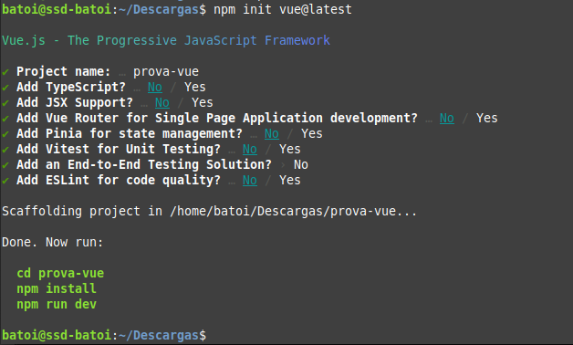
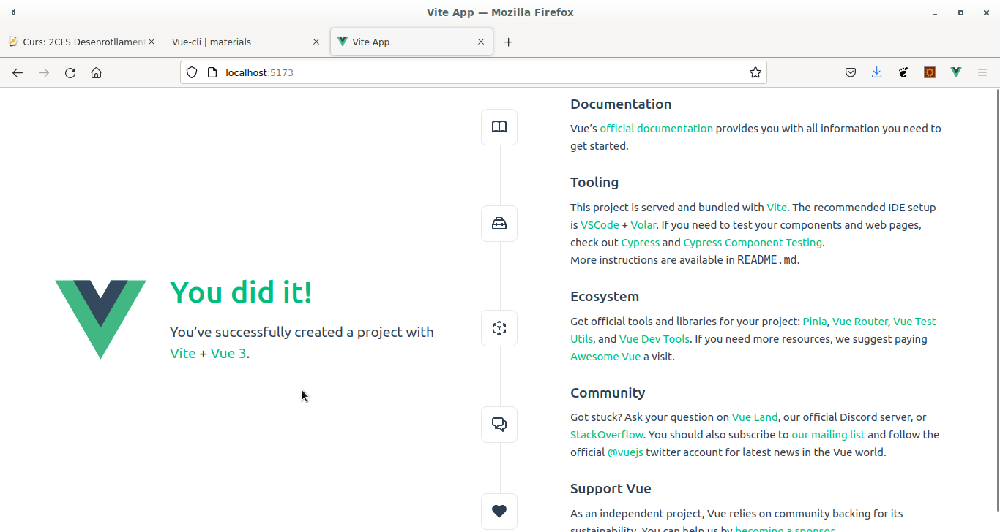
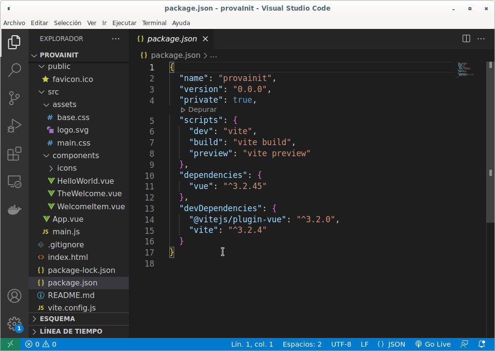
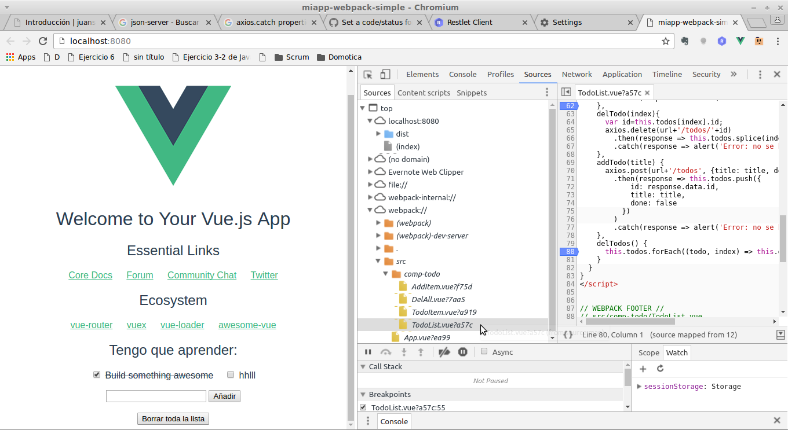
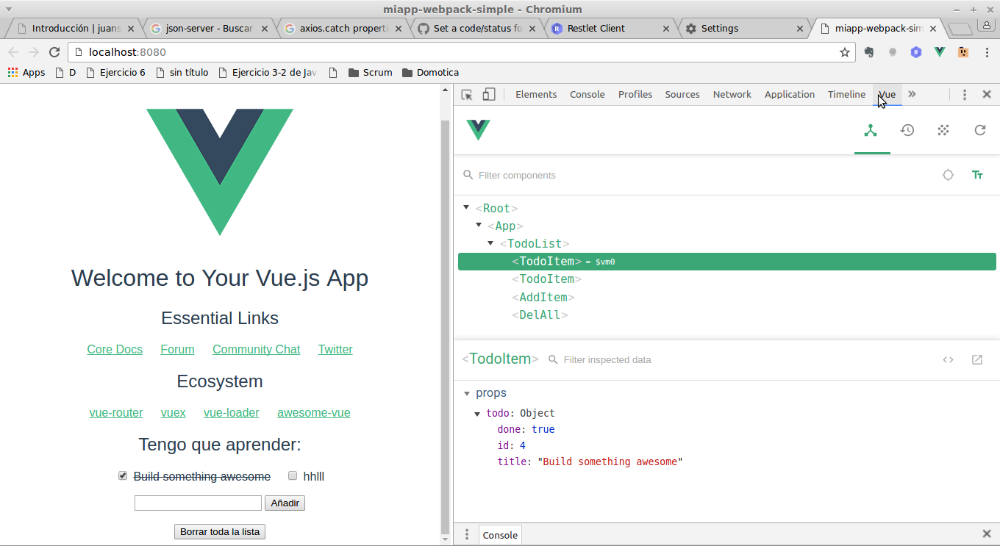

# Single File Components
- [Single File Components](#single-file-components)
  - [Introducción](#introducción)
    - [Recordatorio de cómo separar componentes en ficheros](#recordatorio-de-cómo-separar-componentes-en-ficheros)
    - [Solución del ejemplo](#solución-del-ejemplo)
  - [Crear un proyecto Vue](#crear-un-proyecto-vue)
    - [Creación de un nuevo proyecto](#creación-de-un-nuevo-proyecto)
    - [_Scaffolding_ creado](#scaffolding-creado)
      - [package.json](#packagejson)
      - [Estructura de nuestra aplicación](#estructura-de-nuestra-aplicación)
    - [_Build and Deploy_ de nuestra aplicación](#build-and-deploy-de-nuestra-aplicación)
  - [El fichero SFC (_Single File Component_)](#el-fichero-sfc-single-file-component)
    - [Secciones de un Single File Component](#secciones-de-un-single-file-component)
      - [\<template\>](#template)
      - [\<script\>](#script)
      - [\<style\>](#style)
      - [Custom blocks](#custom-blocks)
  - [Añadir nuevos paquetes y plugins](#añadir-nuevos-paquetes-y-plugins)
    - [Bootstrap](#bootstrap)
  - [Crear un nuevo componente](#crear-un-nuevo-componente)
  - [Depurar el código en la consola](#depurar-el-código-en-la-consola)
- [Aplicación de ejemplo](#aplicación-de-ejemplo)

## Introducción
La utilidad de separar nuestra aplicación en componentes es que cada uno de ellos puede guardarse en su propio fichero y así no tenemos un fichero con demasiado código. A estos ficheros que contienen un componente se les llama _Single File Component (SFC)_.

### Recordatorio de cómo separar componentes en ficheros
Como vimos en la unidad anterior, en el fichero en que definimos el componente exportamos un objeto con las opciones del componente (el segundo parámetro del `app.component()`):
```javascript
export default{
    props: ['todo'],
    template: 
      `<li @dblclick="delTodo">
        <label>
          <input type="checkbox" v-model="todo.done">
          <del v-if="todo.done">
            {{ todo.title }}
          </del>
          <span v-else>
            {{ todo.title }}
          </span>
        </label>
      </li>`,
    methods: {
      delTodo() {
        alert('Quiero borrar "' + this.todo.title + '"');
      }
    }
  }
```

Y donde queramos usarlo (puede ser en otro componente o en la instancia raíz de _Vue_) debemos:
- importar el fichero del componente
- registrar el componente en una propiedad llamada _components_

El fichero `main.js` de nuestra aplicación de la _Lista de tareas_ quedaba:

```javascript
import TodoList from './TodoList.js'
import TodoAdd from './TodoAdd.js'
import TodoDellAll from './TodoDellAll.js'

var myApp=Vue.createApp({
    components:  {
        TodoList,
        TodoAdd,
        TodoDellAll,
    }
})
```

Recuerda que para que el navegador entienda la sentencia `import` debemos indicar que el script que lo contiene es de tipo **module**:
```html
  <script type="module" src="main.js"></script>
```

### Solución del ejemplo
Podéis ver aquí cómo quedará nuestra aplicación de ejemplo con los componentes separados en ficheros:

<iframe src="https://codesandbox.io/embed/gracious-kepler-mq9ypp?fontsize=14&hidenavigation=1&theme=dark"
     style="width:100%; height:500px; border:0; border-radius: 4px; overflow:hidden;"
     title="gracious-kepler-mq9ypp"
     allow="accelerometer; ambient-light-sensor; camera; encrypted-media; geolocation; gyroscope; hid; microphone; midi; payment; usb; vr; xr-spatial-tracking"
     sandbox="allow-forms allow-modals allow-popups allow-presentation allow-same-origin allow-scripts"
   ></iframe>
   
## Crear un proyecto Vue
Aunque puede usarse _Vue_ como hemos visto, enlazándolo directamente en el _index.html_ lo más habitual es crear un nuevo proyecto para la aplicación que vamos a desarrollar usando **npm** y **Vite**. Esto:
* Crea automáticamente el _scaffolding_ básico de nuestro proyecto basándose en una serie de plantillas predefinidas
* Facilita el trabajo con componentes, permitiendo que cada uno de ellos esté en su propio fichero (**SFC**, _Single File Components_)
* Incluye utilidades y herramientas como Webpack, Babel, Uglify, ... que permiten
  * gestionar las dependencias de nuestro código
  * empaquetar todos los ficheros _.vue_ y librerías en un único fichero JS y CSS
  * traspilar el código ES2015/2016, SCSS, etc a ES5 y CSS3 estándar
  * minimizar el código generado
* Incluye herramientas que facilitan el desarrollo

### Creación de un nuevo proyecto
Para crear un nuevo proyecto ejecutamos:

```bash
npm init vue@latest
```

Al ejecutar este comando se nos pregunta el nombre del proyecto a crear y si queremos usar o no determinadas herramientas (más adelante veremos qué es cada una, de momento decimos que _No_) y se creará el directorio para el mismo con el **_package.json_** del proyecto en su interior con su configuración. 



Lo primero que haremos es entrar al directorio del proyecto e instalar las dependencias (`npm install`) y a continuación ejecutar:
```bash
npm run dev
```

Este script de _Vite_ funciona como ya vismo en el bloque de Javascript: compila el código, muestra si hay errores, lanza un servidor web en el puerto 5173 y carga el proyecto en el navegador (http://localhost:5173). Si cambiamos cualquier fichero del directorio _src_ recompila y recarga la página automáticamente. La página generada es:



El proyecto creado usa **_Vite_**, que es un _bundler_ más eficiente que _webpack_ (que es el que se usaba en versiones anteriores de _Vue_) a la hora de gestionar nuestro código tanto en desarrollo como en producción.

### _Scaffolding_ creado
Se ha creado la carpeta con el nombre del proyecto y dentro el scaffolding para nuestro proyecto:



Los principales ficheros y directorios creados son:
* `package.json`: configuración del proyecto (nombre, autor, ...) y dependencias
* `vite.config.js`: configuración de Vite
* `index.html`: html con un div donde se cargará la app
* `node_modules`: librerías de las dependencias
* `public`: lugar donde dejar elementos estáticos que no pasarán por _vite_. Podemos poner imágenes, CSS, etc y lo referenciaremos de forma ABSOLUTA como si estuviera en `/`
* `src`: todo nuestro código
    * `assets/`: nuestros CSS, imágenes, etc. Elementos que _vite_ procesará y optimizará
    * `components/`: carpeta que contendrá los ficheros .vue de los diferentes componentes
        * `HelloWorld.vue`: componente de ejemplo llamado por App.vue
    * `router/`: carpeta con los ficheros del router si usamos _vue-_router_
    * `store/`: carpeta con los ficheros del store si usamos _pinia_ o _vuex_
    * `views`: si usamos _vue-router_ aquí pondremos los componentes que constituyen una vista de la aplicación
    * `App.vue`: es el componente principal y constituye nuestra página de inicio del proyecto. Aquí cargaremos la cabecera, el menú,... y los diferentes componentes
    * `main.js`: JS principal que crea la instancia de Vue que carga el componente principal llamado _App.vue_ y lo renderiza en _#app_


#### package.json
Aquí se configura nuestra aplicación:
* **name, version, author, license**, ...: configuración general de la aplicación
* **scripts**: ejecutan entornos de configuración para webpack:
  * **dev**: lanza el servidor web de vite y configura vue para el entorno de desarrollo
  * **build**: crea los ficheros JS y CSS dentro de **/dist** con todo el código de la aplicación
* **dependences**: se incluyen las librerías y plugins que utiliza nuestra aplicación en producción. Todas las dependencias se instalan dentro de **/node-modules**.  Para instalar una nueva dependencia de desarrollo ejecutaremos `npm install nombre-del-paquete -S` (la opción -S la añade a package.json como dependencia de producción).
* **devDependencies**: igual pero son paquetes que sólo se usan en desarrollo (vite, etc). También se instalan dentro de node-modules pero no estarán cuando se genere el código para producción. Para instalar una nueva dependencia de desarrollo ejecutaremos `npm install nombre-del-paquete -D` (la opción -D la añade a package.json pero como dependencia de desarrollo).

#### Estructura de nuestra aplicación
**Fichero index.html:**
Simplemente tiene el \<div> _app_ que es el que contendrá la aplicación.

**Fichero main.js:**
```javascript
import { createApp } from 'vue'
import App from './App.vue'
import './assets/main.css'

createApp(App).mount('#app')
```

Es el fichero JS principal. Importa la utilidad _createApp_ de la librería _Vue_ y el componente _App.vue_. Crea la instancia de Vue con el componente definido en _App.vue_ y lo renderiza en el elemento _#app_.

**Fichero App.vue:**
Es el componente raíz de la aplicación, el que contiene el _layout_ de la página. Se trata de un _SFC (Single File Component)_ y lo que contiene dentro de la etiqueta _\<template>_ es lo que se renderizará en el div _app_ que hay en _index.html_. Si contiene algún otro componente se indica aquí dónde renderizarlo (en este caso <HelloWorld> y <TheWelcome>).

En el siguiente apartado explicaremos qué es un _SFC_ y qué partes lo forman. De momento veamos qué contiene cada sección:

_template_
```html
<template>
  <header>
    

    <div class="wrapper">
      <HelloWorld msg="You did it!" />
    </div>
  </header>

  <main>
    <TheWelcome />
  </main>
</template>
```

Muestra la imagen del logo (las imágenes y otros ficheros como ficheros .css se guardan dentro de **/src/assets/**) y los subcomponentes _HelloWorld_ y _TheWelcome_.

_script_
```javascript
<script setup>
import HelloWorld from './components/HelloWorld.vue'
import TheWelcome from './components/TheWelcome.vue'
</script>
```

Importa y registra el componente _HelloWorld_ que se muestra en el template. Está en forma de _Composition API_. En forma de _Options API_ sería:
```javascript
<script>
import HelloWorld from './components/HelloWorld.vue'
import TheWelcome from './components/TheWelcome.vue'

export default {
  name: 'app',
  components: {
    HelloWorld,
    TheWelcome
  }
}
</script>
```

_style_
Aquí se definen los estilos de este componente. Como la etiqueta SÍ tiene el atributo _scoped_ (`<style scoped>`) significa que los estilos aquí definidos se aplicarán SÓLO a este componente, no a sus subcomponentes.

**Fichero components/HelloWorld.vue:**
Es el componente que muestra el texto que aparece bajo la imagen. Recibe como parámetro el título a mostrar. Veamos qué contiene cada sección:

_template_
```html
<template>
  <div class="greetings">
    <h1 class="green">{{ msg }}</h1>
    <h3>
      You’ve successfully created a project with
      <a href="https://vitejs.dev/" target="_blank" rel="noopener">Vite</a> +
      <a href="https://vuejs.org/" target="_blank" rel="noopener">Vue 3</a>.
    </h3>
  </div>
</template>
```

Muestra el _msg_ recibido como parámetro y varios apartados con listas.

_script_
```javascript
<script setup>
defineProps({
  msg: {
    type: String,
    required: true
  }
})
</script>
```

Recibe el parámetro _msg_ que es de tipo String. En sintaxis _Options API_ sería:
```javascript
<script>
export default {
  name: 'HelloWorld',
  props: {
    msg: {
      type: String,
      required: true
    }
  }
}
</script>
```

_style_
También tiene el atributo _scoped_ (`<style scoped>`) por lo que los estilos aquí definidos se aplicarán sólo a este componente.

### _Build and Deploy_ de nuestra aplicación
Normalmente trabajaremos con algún gestor de versiones como _git_. Para subir nuestro proyecto al repositorio lo creamos (en _GitHub_, _GitLab_ o donde queramos) y ejecutamos desde la carpeta del proyecto:
```bash
git init
git add .
git remote add origin https://github.com/mi-usuario/mi-proyecto
git commit -m "Primer commit"
git push -u origin main
```

Cuando nuestra aplicación esté lista para subir a producción ejecutaremos el script:
```bash
npm run build
```

Este comando genera los JS y CSS para subir a producción dentro de la carpeta _dist_. El contenido de esta carpeta es lo único que debemos subir a nuestro servidor de producción.

## El fichero SFC (_Single File Component_)
Guardar los componentes en ficheros `.js` como hicimos en el tema anterior genera varios problemas:
* El HTML del template está en ese fichero en medio del JS lo que lo hace menos legible y el editor no lo resalta adecuadamente (ya que espera encontrar código JS no HTML)
* El HTML y el JS del componente están juntos pero no su CSS
* No podemos usar fácilmente herramientas para convertir SCSS a CSS, ES2015 a ES5, etc

Por tanto eso puede ser adecuado para proyectos muy pequeños pero no lo es cuando estos empiezan a crecer.

La solución es guardar cada componente en un único fichero (SFC), que tendrá extensión **.vue**. Estos ficheros contienen 3 secciones diferentes:
* \<template>: contiene todo el HTML del componente
* \<script>: con el JS del mismo
* \<style>: donde pondremos el CSS del componente
  
Aunque esto va contra la norma de tener el HTML, JS y CSS en ficheros separados en realidad sí están separados en diferentes secciones y tenemos la ventaja de tener en un único fichero todo lo que necesita el componente.

La mayoría de editores soportan estos ficheros instalándoles algún plugin, (como _Volar_ para Visual Studio Code) por lo que el resaltado de las diferentes partes es correcto. Además **Vite** nos permite usar ES2015 o posterior y los preprocesadores más comunes (SASS, Pug/Jade, Stylus, ...) y ya se se traducirá automáticamente el código a ES5, HTML5 y CSS3.

### Secciones de un Single File Component
Veamos en detalle cada una de las secciones del SFC.

#### \<template>
Aquí incluiremos el HTML que sustituirá a la etiqueta del componente. Recuerda que en las versiones anteriores a Vue3 dentro sólo puede haber un único elemento HTML (si queremos poner más de uno los incluiremos en otro que los englobe).

Si el código HTML a incluir en el template es muy largo podemos ponerlo en un fichero externo y vincularlo en el template, así nuestro SFC queda más pequeño y legible:
```vue
<template src="./myComp.html">
</template>
```

Respecto al lenguaje, podemos usar HTML (la opción por defecto) o [PUG](https://pugjs.org/api/getting-started.html) que es una forma sencilla de escribir HTML. Lo indicamos como atributo de \<template>:
```html
<template lang="pug">
...
```

#### \<script>
Aquí definimos y exportamos el componente, que será un objeto con diferentes propiedades. Si utiliza subcomponentes hay que importarlos antes de definir el objeto y registrarlos dentro de este.

Entre las propiedades que puede tener el objeto están:
- **name**: el nombre del componente. Es recomendable ponerlo, aunque sólo es obligatorio en caso de componentes recursivos
- **components**: aquí registramos componentes hijos que queramos usar en el _template_ de este componente (debemos haber importado previamente los ficheros _.vue_ que los contienen). En el _template_ usaremos como etiqueta el nombre con que lo registramos aquí
- **props**: donde registramos los parámetros que nos pasa el componente padre como atributos de la etiqueta que renderiza este componente
- **data**: función que devuelve un objeto con todas las variables locales del componente
- **methods**: objeto con los métodos del componente
- **computed**: aquí pondremos las variables calculadas del componente. Lo veremos en detalle en la [unidad 6](https://cipfpbatoi.github.io/materials/daw/dwc/02-vue/06-profundizando.html#computed)
- **created()**, **mounted()**, ...: funciones _hook_ que se ejecutan al crearse el componente, al montarse, ... Aquí pondremos el código que queremos que se ejecute al cargar un componente, como pedir a la BBDD los datos que necesita. Veremos los diferentes _hooks_ en la [unidad 6](https://cipfpbatoi.github.io/materials/daw/dwc/02-vue/06-profundizando.html#ciclo-de-vida-del-componente)
- **watch**: si queremos observar manualmente cambios en alguna variable y ejecutar código como respuesta a ellos (recuerda que Vue ya se encarga de actualizar la vista al cambiar las variables y viceversa). Lo veremos en detalle en la [unidad 6](https://cipfpbatoi.github.io/materials/daw/dwc/02-vue/06-profundizando.html#watchers)
- ...

#### \<style>
Aquí pondremos estilos CSS que se aplicarán al componente. Podemos usar CSS, SASS o [PostCSS](https://postcss.org/). Si queremos importar ficheros de estilo con `@import` deberíamos guardarlos dentro de la carpeta _assets_ de nuestra aplicación.

Si la etiqueta incluye el atributo _**scoped**_ estos estilos se aplicarán únicamente a este componente (y sus descendientes) y no a todos los componentes de nuestra aplicación. Si tenemos estilos que queremos que se apliquen a toda la aplicación y otros que son sólo para el componente y sus descendientes pondremos 2 etiquetas \<style>, una sin el atributo _scoped_ y otra con él.

La forma más común de asignar estilos a elementos es usando clases. Para conseguir que su estilo cambie fácilmente podemos asignar al elemento clases dinámicas que hagan referencia a variables del componente. Ej.:
```vue
<template>
  <p :class="[decoration, {weight: isBold}]">Hi!</p>
</template>

<script>
export default {
  data() {
    return {
      decoration: 'underline',
      isBold: true
    }
  }
}
</script>

<style lang="css">
  .underline { text-decoration: underline; }
  .weight { font-weight: bold; }
</style>
```

El párrafo tendrá la clase indicada en la variable `decoration` (en este caso _underline_) y además como el valor de `isBold` es verdadero tendrá la clase _weight_. Hacer que cambien las clases del elemento es tan sencillo como cambiar el valor de las variables.

Podemos ver las diferentes maneras de asignar clases a los elementos HTML en la [documentación de Vue](https://vuejs.org/guide/essentials/class-and-style.html).

Igual que vimos en la etiqueta \<template>, si el código de los estilos es demasiado largo podemos ponerlo en un fichero externo que vinculamos a la etiqueta con el atributo _src_.

#### Custom blocks
Además de estos 3 bloques un SFC puede tener otros bloques definidos por el programador para, por ejemplo, incluir la documentación del componente o sus test unitarios:
```vue
<custom1 src="./unit-test.js">
    Aquí podríamos incluir la documentación del proyecto
</custom1>
```

## Añadir nuevos paquetes y plugins
Si queremos usar un nuevo paquete en nuestra aplicación lo instalaremos con _npm_:
```bash
npm install nombre-paquete
```

Este comando además de instalar el paquete en _node-modules_ lo añade a las dependencias del _package.json_. La opción **`--save`** o **`-S`** lo añadirá como dependencia de producción y **`--dev`** o **`-D`** como dependencia de desarrollo. Si no ponemos nada se añade como una dependencia de producción. Ej.:
```bash
npm install -S axios
```

Para usarlo en nuestros componentes debemos importarlo y registrarlo tal y como se indique en su documentación. Lo normal es hacerlo en el **_main.js_** (o en algún fichero JS que importemos en _main.js_ como en el caso de los plugins) si queremos poderlo usar en todos los componentes.

Si el paquete que queremos instalar se encuentra como plugin el proceso es más sencillo ya que sólo es necesario usar `app.use(myPlugin, { /* opciones opcionales */})` en el fichero `main.js`.

### Bootstrap
Podemos utilizar _Bootstrap 5_ directamente en Vue ya que esta versión no necesita de la librería _jQuery_.

Para usarlo simplemente lo instalaremos como una dependencia de producción y después lo añadimos al fichero `src/main.js`:
```javascript
import "bootstrap/dist/css/bootstrap.css"
```

Recuerda que siempre es conveniente importar _Bootstrap_ antes de importar nuestro propio CSS (antes de la línea `import './assets/main.css'`). Si necesitamos algún componente de _Bootstrap_ que utilice javascript importaríamos también su javascript en el fichero _main.js_ pero en este caso después de montar la aplicación vue:

```javascript
// src/main.js
import { createApp } from 'vue'
import App from './App.vue'

import "bootstrap/dist/css/bootstrap.css"
import './assets/main.css'

createApp(App).mount('#app')

import "bootstrap/dist/js/bootstrap.js"
```

Para usar los iconos de _Bootstrap 5_ podemos instalar el paquete _bootstrap-icons_ o bien importarlos en el CSS desde su CDN, tal y como se explica en la [documentación de Bootstrap](https://icons.getbootstrap.com/#install). Una vez hecho ya podemos incluir los iconos en etiquetas _\<i>_.

Por ejemplo, si importamos el CSS incluiremos en el _\<style>_ del componente **App.vue**:
```javascript
@import url("https://cdn.jsdelivr.net/npm/bootstrap-icons@1.7.2/font/bootstrap-icons.css");
```

y donde queramos incluir el icono de la papelera, por ejemplo, incluimos:
```html
<i class="bi bi-trash"></i>
```

Respecto a los componentes de _Bootstrap_, para que funcionen sólo tenemos que usar los atributos `data-bs-` (recuerda que muchos de estos componenetes necesitan su javascript por lo que deberemos importarlo como se ha explicado antes). Por ejemplo para hacer un botón colapsable haremos:
```html
<button 
  class="btn btn-primary" 
  data-bs-target="#collapseTarget" 
  data-bs-toggle="collapse">
  Bootstrap collapse
</button>
<div class="collapse py-2" id="collapseTarget">
  This is the toggle-able content!
</div>
```

En lugar de usar atributos _data-bs-_ podemos _envolver_ los componentes bootstrap en componentes Vue como se explica en muchas páginas, como [Using Bootstrap 5 with Vue 3](https://stackoverflow.com/questions/65547199/using-bootstrap-5-with-vue-3).

## Crear un nuevo componente
Creamos un nuevo fichero en **/src/components** (o en alguna subcarpeta dentro) con extensión _.vue_. Donde queramos usar ese componente debemos importarlo y registrarlo como ya hemos visto:

```javascript
import CompName from './CompName.vue'

export default {
  ...
  components: {
    'comp-name': CompName
  }
  ...
}
```
Y ya podemos incluir el componente en el HTML:
```html
<comp-name ...> ... </comp-name>
```

## Depurar el código en la consola
Podemos seguir depurando nuestro código, poniendo puntos de interrupción y usando todas las herramientas que nos proporciona la consola mientras estamos en modo de depuración (si hemos abierto la aplicación con `npm run dev`).

Si estamos usando _webpack_ no podemos ver nuestro código directamente sino que nuestros fichero se localizan dentro del apartado **webpack**:



Recordad que si hemos instalado las **Vue DevTools** tenemos una nueva pestaña en la consola desde la que podemos ver todos nuestros componentes con sus propiedades y datos:



# Aplicación de ejemplo
Recordemos que la aplicación que estamos desarrollando tiene los componentes:
- todo-list: lista de tareas a hacer. Cada item de la lista es un componente _todo-item_
- todo-item: cada elemento de la lista de tareas a hacer
- todo-add: formulario para añadir una nueva tarea
- todo-del-all: botón para eliminar todas las tareas

Para transformar esto en SFC simplemente crearemos un fichero para cada uno de estos componentes. Nuestro anterior _index.html_ será el \<template> del componente principal **App.vue**, que en un sección \<script> deberá importar y registrar cada uno de los componentes usados en el _template_ (_todo-list_, _todo-add_ y _todo-del-all_).

Solución:

<iframe src="https://codesandbox.io/embed/cranky-mclean-f6xwo3?fontsize=14&hidenavigation=1&theme=dark"
     style="width:100%; height:500px; border:0; border-radius: 4px; overflow:hidden;"
     title="cranky-mclean-f6xwo3"
     allow="accelerometer; ambient-light-sensor; camera; encrypted-media; geolocation; gyroscope; hid; microphone; midi; payment; usb; vr; xr-spatial-tracking"
     sandbox="allow-forms allow-modals allow-popups allow-presentation allow-same-origin allow-scripts"
   ></iframe>
