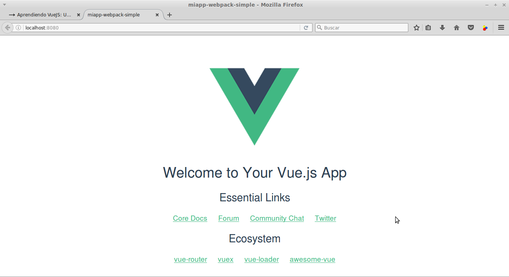
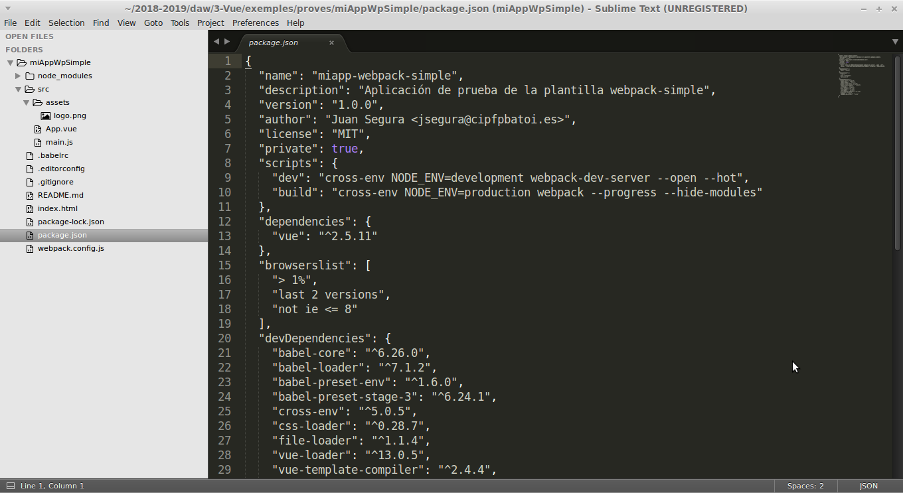

<!-- START doctoc generated TOC please keep comment here to allow auto update -->
<!-- DON'T EDIT THIS SECTION, INSTEAD RE-RUN doctoc TO UPDATE -->
Tabla de contenidos

- [Vue-cli](#vue-cli)
  - [Instalación](#instalaci%C3%B3n)
  - [Creación de un nuevo proyecto](#creaci%C3%B3n-de-un-nuevo-proyecto)
    - [Ejemplo proyecto por defecto](#ejemplo-proyecto-por-defecto)
    - [_Scaffolding_ creado](#scaffolding-creado)
      - [package.json](#packagejson)
      - [Estructura de nuestra aplicación](#estructura-de-nuestra-aplicaci%C3%B3n)
  - [Añadir nuevos plugins y dependencias](#a%C3%B1adir-nuevos-plugins-y-dependencias)
    - [bootstrap-vue](#bootstrap-vue)
  - [Crear un nuevo componente](#crear-un-nuevo-componente)
  - [Depurar el código en la consola](#depurar-el-c%C3%B3digo-en-la-consola)
- [Aplicación de ejemplo](#aplicaci%C3%B3n-de-ejemplo)
- [Comunicación entre componentes en Vue-cli](#comunicaci%C3%B3n-entre-componentes-en-vue-cli)
  - [Event Bus](#event-bus)
  - [Store pattern](#store-pattern)

<!-- END doctoc generated TOC please keep comment here to allow auto update -->

# Vue-cli
Se trata de una herramienta que incluye Vue que nos ayuda en:
* Crea automáticamente el _scaffolding_ básico de nuestro proyecto basándose en una serie de plantillas predefinidas
* Incluye herramientas como Webpack, Babel, Uglify, ... que permiten
  * gestionar las dependencias de nuestro código
  * empaquetar todos los ficheros _.vue_ y librerías en un único fichero JS y CSS
  * traspilar el código ES2015/2016, SCSS, etc a ES5 y CSS3 estándar
  * minimizar el código generado
* Incluye herramientas que facilitan el desarrollo

La versión actual es la 3.0 (lanzada en 2018) que ha cambiado de una arquitectura basada en plantillas a una basada en plugins lo que mejora enormemente su rendimiento. Podemos encontrar todoa la documentación en [Vue CLI](https://cli.vuejs.org/).

## Instalación
Para usar **vue-cli** necesitamos tener instalado **npm** (el gestor de paquetes de Node.js). Si no lo tenemos instalaremos **node.js**. 

Podemos instalarlo desde los repositorios como cualquier otro programa (`apt install nodejs`), pero posiblemente nos instalará una versión poco actualizada por lo que es mejor [instalarlo desde NodeSource](https://nodejs.org/es/download/package-manager/#distribuciones-de-linux-basadas-en-debian-y-ubuntu)_ siguiendo las instrucciones que se indican y que básicamente son:
```bash
curl -sL https://deb.nodesource.com/setup_X.y | sudo -E bash -
sudo apt-get install -y nodejs
```

(cambiaremos _X.y_ por la versión que queramos, vue-cli requiere al menos la 8.10.0).

También podemos [descargarlo desde NodeJS.org](https://nodejs.org/es/download/), descomprimir el paquete e instalarlo (`dpkg -i _nombrepaquete_`).

Una vez instalado **npm** Vue-cli se instala con
```bash
npm install -g @vue/cli
```

La opción -g es para que lo instale globalmente en el sistema y no instale una copia para cada proyecto.

## Creación de un nuevo proyecto
Para crear un nuevo proyecto haremos:
```bash
vue create _<directorio_proyecto>_
```
Vue nos ofrece la opción de crear el nuevo proyecto para Vue2 o Vue3 por defecto con los plugins para _Babel_ y _esLint_ (mäs adelante podremos añadir más si los necesitamos) o bien la opción **manual** donde escogemos que plugins instalar para el proyecto de entre los siguientes:


Tabién podemos crear y gestionar nuestros proyectos desde el entorno gráfico ejecutando el comando:
```bash
vue ui
```
Este comando arranca un servidor web en el puerto 8000 y abre el navegador para gestionar nuestros proyectos.

### Ejemplo proyecto por defecto
Para arrancar el proyecto entramos a la carpeta y ejecutamos en la terminal
```bash
npm run serve
```
Este script compila el código, muestra si hay errores, lanza un servidor web en el puerto 8080 y carga el proyecto en el navegador (http://localhost:8080). Si cambiamos cualquier fichero JS de _src_ recompila y recarga la página automáticamente. La página generada es:


Cuando nuestra aplicación esté lista para subir a producción ejecutaremos el script:
```bash
npm run build
```
Este comando genera los JS y CSS para subir a producción dentro de la carpeta _dist_.

También podemos ejecutar el comando `npm run lint` para ejecutar esta herramienta y comprobar nuestro código.

### _Scaffolding_ creado
Se ha creado la carpeta con el nombre del proyecto y dentro el scaffolding para nuestro proyecto:


Los principales ficheros y directorios creados son:
* package.json: configuración del proyecto (nombre, autor, ...) y dependencias
* babel.config.js: configuración de Babel
* public/index.html: html con un div donde se cargará la app y que carga el script build.js
* node_modules: librerías de las dependencias
* src: todo el código
    * assets/: nuestros CSS, imágenes, etc
    * main.js: JS principal que carga componentes y crea la instancia de Vue que 'pinta' el App.vue 
    * App.vue: página de inicio del proyecto. Aquí cargaremos la cabecera, el menú,... y los diferentes componentes
    * components/: carpeta que contendrá los ficheros .vue de los diferentes componentes
        * HelloWorld.vue: componente de ejemplo llamado por App.vue

#### package.json
Aquí se configura nuestra aplicación:
* name, version, author, license, ...: configuración general de la aplicación
* scripts: ejecutan entornos de configuración para webpack. Por defecto tenemos 3:
  * serve: lanza el servidor web de webpack y configura webpack y vue para el entorno de desarrollo
  * build: crea los ficheros JS y CSS dentro de **/dist** con todo el código de la aplicación (es lo único que vincularemos en index.html)
* dependences: se incluyen las librerías y plugins que utiliza nuestra aplicación en producción. Todas las dependencias se instalan dentro de **/node-modules**. Posteriormente veremos como añadir nuevas dependencias
* devDependencies: igual pero son paquetes que sólo se usan en desarrollo (babel, webpack, etc). También se instalan dentro de node-modules pero no estarán en build.js cuando se genere el fichero para producción. Para instalar una nueva dependencia de desarrollo ejecutaremos `npm install _paquete_ -D` (la opción -D la añade a package.json pero como dependencia de desarrollo).

#### Estructura de nuestra aplicación
**Fichero index.html:**
```html
<!DOCTYPE html>
<html lang="en">
  <head>
    <meta charset="utf-8">
    <meta http-equiv="X-UA-Compatible" content="IE=edge">
    <meta name="viewport" content="width=device-width,initial-scale=1.0">
    <link rel="icon" href="<%= BASE_URL %>favicon.ico">
    <title><%= htmlWebpackPlugin.options.title %></title>
  </head>
  <body>
    <noscript>
      <strong>We're sorry but <%= htmlWebpackPlugin.options.title %> doesn't work properly without JavaScript enabled. Please enable it to continue.</strong>
    </noscript>
    <div id="app"></div>
    <!-- built files will be auto injected -->
  </body>
</html>
```
Simplemente tiene el \<div> _app_ que es el que contendrá la aplicación.

**Fichero main.js:**
```javascript
import { createApp } from 'vue'
import App from './App.vue'

createApp(App).mount('#app')

```
Es el fichero JS principal. Importa la utilidad _createApp_ de la librería _Vue_ y el componente _App.vue_. Crea la instancia de Vue con el componente definido en _App.vue_ y la renderiza en el elemento _#app_.

**Fichero App.vue:**
Es el componente principal de la aplicación, el que contiene el _layout_ de la página. Lo que contiene el apartado _template_ es lo que se renderizará en el div _app_ que hay en _index.html_. Si contiene algún otro componente se indica aquí dónde renderizarlo (en este caso <HelloWorld>).

Veamos qué contiene cada sección

_template_
```html
<template>
  <div id="app">
    
    <HelloWorld msg="Welcome to Your Vue.js App"/>
  </div>
</template>
```
Muestra una imagen (las imágenes y otros ficheros como ficheros .css se guardan dentro de **/src/assets/**) y el subcomponente _HelloWorld_.

_script_
```javascript
<script>
import HelloWorld from './components/HelloWorld.vue'

export default {
  name: 'app',
  components: {
    HelloWorld
  }
}
</script>
```
Importa y registra el componente _HelloWorld_ que se muestra en el template.

_style_
Aquí se definen los estilos de este componente. Como la etiqueta NO tiene el atributo _scoped_ (`<style scoped>`) significa que los estilos incluidos se aplicarán a TODOS los componentes.

**Fichero components/HelloWorld.vue:**
Es el componente que muestra el texto que aparece bajo la imagen. Recibe como parámetro el título a mostrar. Veamos qué contiene cada sección:

_template_
```html
<template>
  <div class="hello">
    <h1>{{ msg }}</h1>
    <p>
      For a guide and recipes on how to configure / customize this project,<br>
      check out the
      <a href="https://cli.vuejs.org" target="_blank" rel="noopener">vue-cli documentation</a>.
    </p>
    <h3>Installed CLI Plugins</h3>
    <ul>
       ...
  </div>
</template>
```
Muestra el _msg_ recibido y varios apartados con listas.

_script_
```javascript
<script>
export default {
  name: 'HelloWorld',
  props: {
    msg: String
  }
}
</script>
```
Recibe el parámetro _msg_ que es de tipo String.

_style_
Aquí la etiqueta SÍ tiene el atributo _scoped_ (`<style scoped>`) por lo que los estilos incluidos se aplicarán sólo a este componente.

## Añadir nuevos plugins y dependencias
Para instalar un nuevo plugin a nuestro proyecto (antes conviene haber hecho un _commit_) usamos `vue add` desde la carpeta del proyecto, por ejemplo para añadir el plugin _vuetify_ ejecutamos:
```bash
vue add vuetify
```

Esto automáticamente:
* instala el plugin dentro de _node-modules_
* modifica el fichero _package.json_
* crea un fichero JS dentro de la carpeta **_plugins_** que importa y registra la librería
* importa dicho fichero al **_main.js_**

NOTA: actualmente Vuetify no soporta Vue3 por lo que esto sólo funcionará en Vue2

Si queremos instalar un paquete que no funciona como plugin lo haremos desde _npm_:
```bash
npm install nombre-paquete
```

El comando `npm install` sólo instala el paquete en _node-modules_. Para que lo añada a las dependencias del _package.json_  le pondremos la opción **--save** o **-S** (si se trata de una dependencia de producción) o bien **--dev** o **-D** (si es una dependencia de desarrollo). Ej.:
```bash
npm install -S vue-router
```

Para usarlo debemos importarlo y registrarlo nosotros en el **_main.js_** (o en algún fichero JS que importemos en _main.js_ como en el caso de los plugins).

### bootstrap-vue
Esta librería es una implementación de **Bootstrap** para Vue de la que se ha eliminado jQuery y otras cosas innecesarias. El aspecto de los elementos varía un poco pero es muy parecido. Nosotros la usaremos en nuestros proyectos para mejorar el aspecto de nuestras aplicaciones.

Podemos ver todo lo que incluye y cómo usarla en su [página oficial](https://bootstrap-vue.js.org/).

Como es un plugin lo instalamos como hemos visto antes:
```bash
vue add bootstrap-vue
```

Además incluye [iconos](https://bootstrap-vue.js.org/docs/icons) y si queremos usarlos tenemos que modificar el fichero creado dentro de _plugins_ y añadir:
```bash
import { BootstrapVueIcons } from 'bootstrap-vue'

Vue.use(BootstrapVueIcons)
```

## Crear un nuevo componente
Creamos un nuevo fichero en **/src/components** (o en alguna subcarpeta dentro) con extensión _.vue_. Donde queramos usar ese componente debemos importarlo y registrarlo como hemos visto con _HelloWorld_ (y como se explica en el artículo de los _Single File Components_). 
```javascript
import CompName from './CompName.vue'

export default {
  ...
  components: {
    'comp-name': CompName
  }
  ...
}
```
Y ya podemos incluir el componente en el HTML:
```html
<comp-name ...> ... </comp-name>
```

## Depurar el código en la consola
Podemos seguir depurando nuestro código, poniendo puntos de interrupción y usando todas las herramientas que nos proporciona la consola mientras estamos en modo de depuración (si hemos abierto la aplicación con `npm run serve`).

Para localizar nuestros fichero varemos que en nuestras fuentes de software aparece **webpack** y dentro nuestras carpetas con el código (**src**, ...):


Recordad que si hemos instalado las **Vue DevTools** tenemos una nueva pestaña en la consola desde la que podemos ver todos nuestros componentes con sus propiedades y datos:


# Aplicación de ejemplo
La aplicación que estamos haciendo  tendrá los componentes indicados en el [capítulo anterior](./03_2-single_file_components.html) y el contenido del componente **App.vue** será el de **TodoApp.vue**.

# Comunicación entre componentes en Vue-cli
Como ya hemos visto los componentes tienen sus propios datos que son **datos de nivel de componente**. Pero hay ocasiones en que varios componentes necesitan acceder a los mismos datos. Estos datos se consideran **datos de nivel de aplicación** y hay varias formas de tratarlos.

Entre padres e hijos ya hemos visto que se puede intercambiar información mediante _props_ (aunque no debemos modificar en el hijo los datos pasados como _prop_) y emitiendo eventos del hijo al padre. Para comunicarse componentes que no son padre/hijo tenemos 2 maneras de comunicación:
* Event Bus (no soportado en Vue3, a menos que usemos alguna librería como _mitt_ o _tiny emiter_)
* Pattern Store

Y si nuestra aplicación es media-grande lo recomendado es usar Vuex.

## Event Bus
Creamos un fichero **event-bus.js** donde declaramos el objeto que usaremos como bus de comunicaciones:
```javascript
import Vue from 'vue';
export const EventBus = new Vue;
```

En los componentes donde queramos usar el _EventBus_ sólo tenemos que importar el fichero anterior:
```javascript
import { EventBus } from '../event-bus.js';

export default {
  name: "MyCOmponent",
  created() {
    EventBus.$on(...)
      ...
```

## Store pattern
La solución en este caso es muy similar. Creamos un fichero **store.js** en el que guardamos el _store_ con los datos compartidos y los métodos que los modifican:
```javascript
export const store = {
  state: {
    todos: []
  },
  addTodoAction(newTodo) {
    this.state.todos.push(newTodo);
  }
};
```

Y donde vayamos a usar los datos compartidos importaremos el fichero anterior:
```javascript
import { store } from '../store.js';

export default {
  name: "MyCOmponent",
  data() {
    return {
      storeState: store.state
      ...
```
