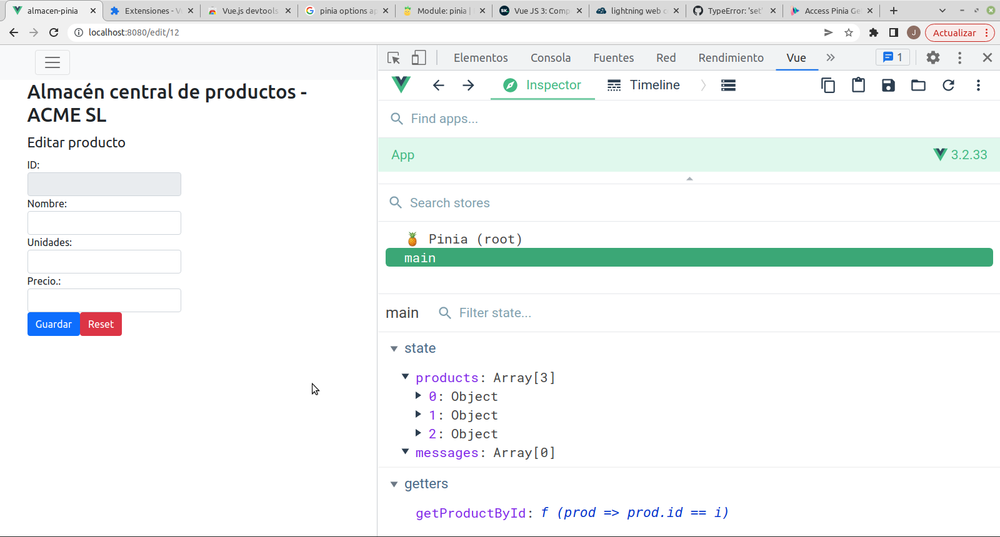
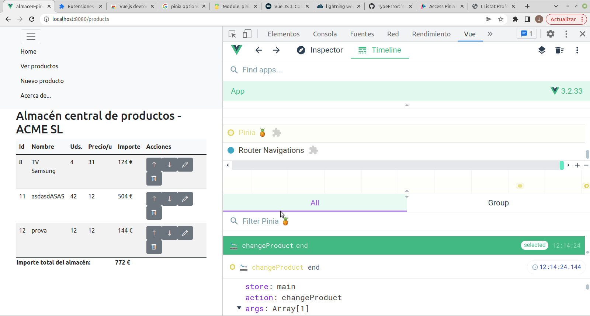

# Pinia
Tabla de contenidos
- [Pinia](#pinia)
  - [Introducción](#introducción)
  - [Instalar y configurar Pinia](#instalar-y-configurar-pinia)
  - [Crear el store](#crear-el-store)
  - [Usar Pinia](#usar-pinia)
    - [Getters](#getters)
    - [Actions](#actions)
  - [state en formularios](#state-en-formularios)


## Introducción
Es un '_State Management Pattern_' basado en el patrón **Flux** que sirve para controlar el flujo de datos en una aplicación. Sustituye a la anterior librería usada en _Vue 2_ llamada _Vuex_.

En Vue la comunicación entre componentes se hace hacia abajo mediante `props` y hacia arriba emitiendo eventos. Ya vimos que cuando distintos componentes que no son padre-hijo tenían que compartir un mismo estado (acceder a los mismos datos) surgían problemas e intentamos solucionarlos con el patrón _store pattern_. Esto puede servir para pequeñas aplicaciones pero cuando crecen se hace difícil seguir los cambios. Para esos casos debemos usar _Pinia_, que proporciona un almacén de datos centralizado para todos los componentes de la aplicación y asegura que los datos sólo puedan cambiarse de forma controlada.

El uso de _Pinia_ es imprescindible en aplicaciones de tamaño medio o grande pero incluso para aplicaciones pequeñas nos ofrece ventajas frente a un _store pattern_ hecho por nosotros como soporte para las _DevTools_ y para _Server Side Rendering_ o uso de Typescript. 

Como ya dijimos, no debemos almacenar todos los datos en el _store_, sólo los que necesitan varios componentes (los datos privados de un componente deben permanecer en él).

## Instalar y configurar Pinia
A día de hoy, al crear nuestro proyecto con _vue-cli_ tenemos en las opciones una para que incluya Vuex pero no Pinia. Marcar aquí la opción haría que la instalación y configuración de la herramienta se haga automáticamente. Al no poder hacerlo debemos hacerlo nosotros manualmente:
- se instala el paquete **pinia**
```bash
npm install -S pinia
```

- se importa _pinia_ en el **main.js** añadiendo:
```javascript
...
import { createPinia } from 'pinia'

createApp(App).use(createPinia())...mount('#app')
```

## Crear el store
Ahora hay que crear el fichero del store. Podemos tener todos los datos en un único fichero o, si son muchos, hacer ficheros diferentes. Por ejemplo para la aplicación de 'ToDo' podemos crear su store en **/src/stores/toDoStore.js**. 

Al crear un almacén pondremos en él todas las variables que vaya a usar más de un componente (dentro de **`state`**) y los métodos para acceder a ellas y modificarlas (dentro de **`actions`**), por ejemplo, para compartir un contador haríamos:

```javascript
import { defineStore } from 'pinia'

export const useConterStore = defineStore('counter', {
  state: () => {
    return {
      count: 0
    }
  },
  actions: {
    increment () {
      this.count++
    },
    decrement () {
      this.count--
    },
  }
})
```

En este ejemplo hemos creado un almacén que tiene un dato (_count_) y dos métodos para cambiar su valor (_increment_ y _decrement_). El primer parámetro de `defineStore` es el nombre con el que veremos el almacén desde las _DevTools_ (por si tenemos varios).

## Usar Pinia
En cada componente que lo necesitemos podemos usar el almacén de datos. La forma más cómoda es usar los _helpers_ de `mapState` y `mapActions` en los que indicaremos las variables y métodos del _store_ que queremos usar en este componente:
```javascript
//MyComponent.vue
import { useConterStore } from '../stores/conterStore';
import { mapState, mapActions } from 'pinia';

export default {
  ...
  computed: {
    ...mapState(useConterStore, {
      counter: 'counter',
    })
  },
  methods: {
    ...mapActions(useConterStore, ['increment'], ['decrement'])
  }
}
```

```javascript
//MyComponent.vue
import { useToDoStore } from '../stores/toDoStore';
import { mapState, mapActions } from 'pinia';

export default {
  ...
  computed: {
    ...mapState(useToDoStore, {
      todos: 'todos',
      finishedTodos: 'finishedTodos',
    })
  },
  methods: {
    ...mapActions(useToDoStore, ['addTodo'])
  }
}
```

Con esto se _mapean_ las variables, _getters_ y _actions_ a variables y métodos locales a los que podemos acceder desde **`this.`** (por ejemplo `this.counter` o `this.increment()`).

Desde la consola del navegador podemos usar las _DevTools_ para ver nuestro almacén. Para ello vamos a la pestaña de Vue y desde el _Inspector_ buscamos _Pinia_:



### Getters
En ocasiones no necesitamos una variable del _state_ sino cierta información sobre ella (por ejemplo no todas las tareas del array _todos_ sino sólo las tareas pendientes). En ese caso podemos filtrarlas en cada componente que las necesite o podemos hacer un método en el almacén (dentro de **`getters`**) que nos devuelva directamente las tareas filtradas. Estos _getters_ funcionan como las variables  _computed_ (sólo se ejecutan de nuevo si cambian los datos de que dependen):

```javascript
import { defineStore } from 'pinia'

export const useToDoStore = defineStore('todo', {
  state: () => {
    return {
      /** @type { { title: string, id: number, isFinished: boolean }[]} */
      todos: [
        { id: 1, title: '...', done: true },
        { id: 2, title: '...', done: false }
      ],
      /** @type {'all' | 'finished' | 'unfinished'} */
      filter: 'all',
      // type will be automatically inferred to number
      nextId: 0,
      /** @type { string[]} */
      errors: [],
    }
  },
  getters: {
    // reciben como primer parámetro el 'state'
    finishedTodos: (state) => state.todos.filter((todo) => todo.isFinished),
    unfinishedTodos: (state) => state.todos.filter((todo) => !todo.isFinished),
    /**
     * @returns { { title: string, id: number, isFinished: boolean }[]}
     */
    filteredTodos(state) {
      if (this.filter === 'finished') {
        return this.finishedTodos
      } else if (this.filter === 'unfinished') {
        return this.unfinishedTodos
      }
      return this.todos
    },
  },
  actions: {
    // any amount of arguments, return a promise or not
    addTodo(title) {
        this.nextId++
        this.todos.push({
          title,
          id: this.nextId,
          isFinished: false
        })
    },
  },
})
```

Cada _getter_ recibe como primer parámetro el _state_ del almacén.

Dentro de los componentes se usan como cualquier variable:
```javascript
export default {
  ...
  computed: {
    ...mapState(useToDoStore, {
      todos: 'todos',
      finishedTodos: 'finishedTodos',
    })
  },
```

Los getters pueden recibir parámetros, por ejemplo, para hacer búsquedas:
```javascript
getters: {
  getTodoById: (state) => (id) => {
    return state.todos.find((todo) => todo.id === id)
  }
}
```

Desde el componente lo llamaremos con `this.getTodoById(2)`.

### Actions
La manera de cambiar los datos del almacén es llamando a las acciones que hayamos definido, y que hemos _mapeado_ al componente como métodos locales. Estas acciones pueden recibir tantos parámetros como se desee.

Cada vez que se llama a una acción se registra en las _DevTools_ y podemos ver la acción llamada y los datos que se le han pasado:




Las acciones pueden hacer llamadas asíncronas. Lo normal es llamar a la BBDD y cuando el servidor responda modificaremos los datos del _store_. 
```javascript
import { defineStore } from 'pinia'

export const useToDoStore = defineStore('todo', {
  state: () => {
    return {
      todos: [],
      nextId: 0,
      errors: [],
    }
  },
  actions: {
    async addTodo(title) {
      try {
        const newToDo = await axios.post({ 
          title, 
          id: this.nextId + 1, 
          isFinished: false 
        });
        this.nextId++
        this.todos.push(newToDo)
      } catch(error) {
        this.errors.push(error);
      }
    },
  },
})
```

Si la acción realiza una llamada asíncrona y el componente que la llama tiene que enterarse de cuándo finaliza debe devolver una promesa (debe declararse con `async`). En el componente podemos usar `await` o `then / catch` para saber cuándo ha acabado la acción:
```javascript
try {
  await this.addTodo(this.newTodo)
  alert('Añadida la tarea ' + this.newTodo.title)
  this.$router.push('/todos')
} catch(error) {
  alert(error)
}
```

**NOTA**: si quien llama a una acción no necesita saber cuándo termina la acción ni su resultado no es necesario llamarla con `await`.

## state en formularios
Aunque no es lo habitual, si queremos usar un formulario para modificar un _state_ del _store_ no podemos asociarlo al input con la directiva **v-model** porque cuando el usuario cambie el valor del input estaría escribiendo directamente sobre un _state_, lo que debe hacerse por medio de una acción.

Tenemos 2 soluciones al problema:
- podemos no usar el v-model sino descomponerlo en un _:value_ y un _@input_ como vimos al hablar de poner un input en un subcomponente
- podemos ponerle al computed de ese state un setter y un getter como vimos en el capítulo de [Profundizando en Vue](./06-profundizando.md)

Más información en la [documentación oficial de Pinia](https://pinia.vuejs.org/).
