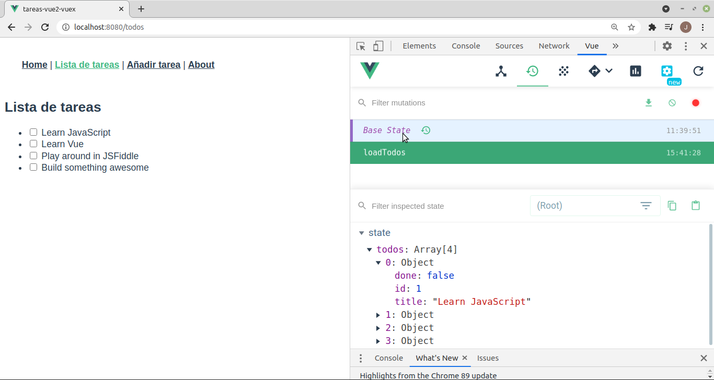
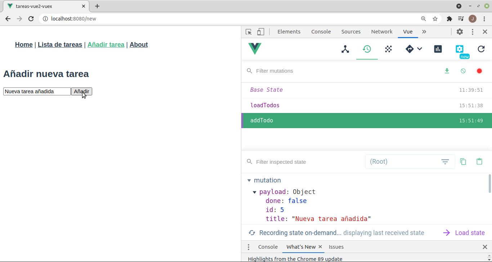

# Pinia
Tabla de contenidos
- [Pinia](#pinia)
  - [Introducción](#introducción)
  - [Instalar y configurar Pinia](#instalar-y-configurar-pinia)
  - [Usar Pinia](#usar-pinia)
    - [Acceder al State desde un componente](#acceder-al-state-desde-un-componente)
    - [Getters](#getters)
    - [Mutations](#mutations)
    - [Actions](#actions)
  - [state en formularios](#state-en-formularios)
  - [Saber más](#saber-más)


## Introducción
Es un '_State Management Pattern_' basado en el patrón **Flux** que sirve para controlar el flujo de datos en una aplicación. Sustituye al anterior _store_ llamado _Vuex_.

En Vue la comunicación entre componentes se hace hacia abajo mediante _props_ y hacia arriba emitiendo eventos. Ya vimos que cuando distintos componentes que no son padre-hijo tenían que compartir un mismo estado (acceder a los mismos datos) surgían problemas e intentamos solucionarlos con el patrón _store pattern_. Esto puede servir para pequeñas aplicaciones pero cuando crecen se hace difícil seguir los cambios. Para esos casos debemos usar _Pinia_, que proporciona un almacén de datos centralizado para todos los componentes de la aplicación y asegura que los datos sólo puedan cambiarse de forma controlada.

El uso de _Pinia_ es imprescindible en aplicaciones de tamaño medio o grande pero incluso para aplicaciones pequeñas nos ofrece ventajas frente a con un _store  pattern_ hecho por nosotros como soporte para las _DevTools_ o para _Server Side Rendering_ o uso de Typescript. Como ya sabemos, no debemos almacenar todos los datos en el _store_, sólo los que necesitan varios componentes (los datos privados de un componente deben permanecer en él).

## Instalar y configurar Pinia
A día de hoy, al crear nuestro proyecto Vue tenemos en las opciones una para que incluya Vuex pero no Pinia. Marcar aquí la opción hace que la instalación y configuración de la herramienta se haga automáticamente.

Al no poder hacerlo debemos hacerlo nosotros manualmente:
- se instala el paquete **pinia**
```bash
npm install -S vuex
```

- se crea el fichero del store, por ejemplo para la aplicación de 'ToDo' puede estar en **/src/stores/useToDoStore.js**. Es nuestro almacén donde se guardan todas las variables que vaya a usar más de un componente y los métodos para acceder a ellas y modificarlas. Su contenido es:

```javascript
import { defineStore } from 'pinia'

export const useToDoStore = defineStore('useToDoStore', {
  state: () => ({
    /** @type { { text: string, id: number, isFinished: boolean }[]} */
    todos: [],
    /** @type {'all' | 'finished' | 'unfinished'} */
    filter: 'all',
    // type will be automatically inferred to number
    nextId: 0,
    /** @type { string[]} */
    errors: [],
  }),
  getters: {
    finishedTodos(state) {
      return state.todos.filter((todo) => todo.isFinished)
    },
    unfinishedTodos(state) {
      return state.todos.filter((todo) => !todo.isFinished)
    },
    /**
     * @returns { { text: string, id: number, isFinished: boolean }[]}
     */
    filteredTodos(state) {
      if (this.filter === 'finished') {
        return this.finishedTodos
      } else if (this.filter === 'unfinished') {
        return this.unfinishedTodos
      }
      return this.todos
    },
  },
  actions: {
    // any amount of arguments, return a promise or not
    async addTodo(text) {
      try {
        newToDo = await axios.post({ 
          text, 
          id: this.nextId + 1, 
          isFinished: false 
        });
        this.nextId++
        this.todos.push(newToDo)
      } catch(error) {
        this.errors.push(error);
      }
    },
  },
})
```

- se importa dicho fichero en el **main.js** para que el almacén esté disponible para todos los componentes en la variable `this.$store`. Es igual que pasaba con _vue-router_:

```javascript
...
import { createPinia } from 'pinia'

app.use(createPinia())
```

## Usar Pinia
En cada componente que lo necesitemos podemos usar el almacén de datos:
```javascript
//MyComponent.vue
import { useToDoStore } from './stores/useToDoStore ';  
import { computed } from 'vue';

export default {  
 setup() {

   // store
   const toDoStore = useToDoStore();

   //getters
   const finishedTodos = computed(() => toDoStore.finishedTodos);
   const unFinishedTodos = computed(() => toDoStore.unFinishedTodos);
   const filteredTodos = computed(() => toDoStore.filteredTodos);

   //actions
   const add = () => toDoStore.add();
   const remove = () => toDoStore.remove();
 }
}
```

El corazón de Vuex es el **_store_** que es un objeto donde almacenar **_states_** (datos globales) de la aplicación pero se diferencia de un objeto normal en que:
- es reactivo
- sólo se puede modificar haciendo _commits_ de mutaciones

Desde la consola del navegador podemos usar las _DevTools_ para ver nuestro almacén. Para ello vamos a Vue y elegimos la segunda opción (Vuex):



Al crear el almacén (normalmente en el fichero **src/store/index.js**) pondremos en _state_ nuestras variables globales y en _mutations_ los métodos que se pueden usar para cambiarlas, ej.:

```javascript
import Vue from 'vue'
import Vuex from 'vuex'

Vue.use(Vuex)

export default new Vuex.Store({
  state: {
    count: 0
  },
  mutations: {
    increment (state) {
      state.count++
    },
    decrement (state) {
      state.count--
    },
  }
})
```

Cada mutación recibe como primer parámetro el _state_ del almacén para que pueda modificarlo y el componente lo llama mediante el método `commit`:
```javascript
this.$store.commit('increment')
```

En este ejemplo hemos creado un almacén que tiene un dato (_count_) y dos mutaciones para cambiar su valor (_increment_ y _decrement_). Lo usa un componente que muestra el valor del contador e incluye un botón para incrementar su valor y otro para decrementarlo:
```html
<template>
  <div>
    <p>Valor del contador: { { contador }}</p>
    <button @click="incrementa">Incrementar</button>
    <button @click="decrementa">Decrementar</button>
  </div>
</template>
```

```javascript
export default {
  computed: {
    contador() {
      return this.$store.state.count
    }
  },
  methods: {
    incrementa() {
      this.$store.commit('increment')
    },
    decrementa() {
      this.$store.commit('decrement')
    },
  }
}
```

Si no hemos importado el almacén en el `main.js` lo tendremos que importar en cada componente que lo necesite (no es lo habitua):
```javascript
import store from '@/store'

export default {
  computed: {
    contador() {
      return store.state.count
    }
  },
  methods: {
    incrementa() {
      store.commit('increment')
  ...
```

### Acceder al State desde un componente
La mejor forma de acceder a propiedades del almacén es creando métodos _computed_ que cambiarán al cambiar el estado del mismo:
```javascript
  computed: {
    count () {
      return this.$store.state.count
    },
  },
```

Si queremos usar varias propiedades del _store_ en un componente en vez de hacer un método _computed_ para cada una podemos usar el _helper_ **mapState**:
```javascript
import { mapState } from 'vuex'

  computed: mapState([
    'count'	    // map this.count to store.state.count
  ])
```

### Getters
En ocasiones no necesitamos una variable del _state_ sino cierta información sobre ella (por ejemplo no todas las tareas del array _todos_ sino sólo las tareas pendientes). En ese caso podemos filtrarlas en cada componente que las necesite o podemos hacer un _getter_ en el almacén que nos devuelva directamente las tareas filtradas. Estos _getters_ funcionan como las variables  _computed_ (sólo se ejecutan de nuevo si cambian los datos de que dependen):
```javascript
export default new Vuex.Store({
  state: {
    todos: [
      { id: 1, text: '...', done: true },
      { id: 2, text: '...', done: false }
    ]
  },
  getters: {
    pendingTodos: state => {
      return state.todos.filter(todo => !todo.done)
    },
    doneTodos: state => {
      return state.todos.filter(todo => todo.done)
    },
    pendingTodosCount: (state, getters) => {
      return getters.pendingTodos.length
    }
  }
})
```

Cada _getter_ recibe como primer parámetro el _state_ del almacén.

Dentro de los componentes se usan como cualquier variable:
```javascript
computed: {
  pendingTodos () {
    return this.$store.getters.pendingTodos
  }
}
```

Y también podemos usar varios con el _helper_ **mapGetters**:
```javascript
import { mapGetters } from 'vuex'

export default {
  // ...
  computed: {
    // mix the getters into computed with object spread operator
    ...mapGetters([
      'pendingTodos',
      'pendingTodosCount',
      // ...
    ])
  }
}
```

Si queremos podemos hacer getters también para los states y así no necesitamos mapState sino que accedemos a todo con mapGetters.

Los getters pueden recibir parámetros, por ejemplo, para hacer búsquedas:
```javascript
getters: {
  // ...
  getTodoById: (state) => (id) => {
    return state.todos.find((todo) => todo.id === id)
  }
}
```
Y lo llamaremos con `this.$store.getters.getTodoById(2)`.

### Mutations
**NOTA**: Una mutación no puede hacer una llamada asíncrona (por ejemplo llamar a _axios_)

La única manera de cambiar los datos del almacén es llamando a las mutaciones que hayamos definido, pero no se llaman como si fueran métodos sino que se lanzan (como si fueran eventos) con **commit**: `this.$store.commit('increment')`.

Las mutaciones reciben como primer parámetro el _store_ pero pueden recibir otro parámetro adicional, llamado **_payload_**, donde incluyamos los datos a pasarle a la mutación:
```javascript
mutations: {
  addTodo (state, toDo) {
    state.todos.push(toDo)
  }
}
```

Al llamar a la mutación le pasamos el valor esperado: `this.$store.commit('addTodo', this.newTodo)`. 

Cada vez que se llama a una mutación se registra en las _DevTools_ y podemos ver la mutación llamada y los datos que se le han pasado:



Si queremos pasar varios parámetros el _payload_ deberá ser un objeto. En ese caso podemos pasar el nombre de la mutación como propiedad _type_ del objeto:
```javascript
this.$store.commit({
  type: 'incrementBy',
  amount: 10
})
```

Podemos llamar a las mutaciones desde un componente, aunque lo habitual es llamar a acciones que ejecuten esas mutaciones. Recuerda que el código de las mutaciones **NO puede ser asíncrono**, por lo que no pueden, por ejemplo, hacer una llamada a _axios_.

Para llamar a la mutación desde un componente haríamos:
```javascript
this.$store.commit('increment'):
```

Al igual con con el estado o los _getters_ podemos _mapear_ las mutaciones a métodos locales para poder hacer `this.increment()` en lugar de `this.$store.commit('increment')` con el _helper_ _mapMutatios_:
```javascript
import { mapMutations } from 'vuex'

export default {
  // ...
  methods: {
    ...mapMutations([
      'increment', // map `this.increment()` to `this.$store.commit('increment')`
      'incrementBy' // map `this.incrementBy(amount)` 
                    // to `this.$store.commit('incrementBy', amount)`
    ]),
    // Y podemos hacer 'alias' de las mutaciones
    ...mapMutations({
      add: 'increment' // map `this.add()` to `this.$store.commit('increment')`
    })
  }
}
```

### Actions
Son métodos del almacén como las mutaciones pero que **SÍ pueden hacer llamadas asíncronas**. Por tanto es aquí donde haremos las llamadas a la BBDD y cuando el servidor responda modificaremos los datos del _store_. Lo mejor es no cambiarlos directamente en la _action_ (aunque podría hacerse) sino que la _action_ debería llamar a una _mutation_ que la cambie y así se registra en las _DevTools_. Las acciones reciben como parámetro un objeto _context_ con las mismas propiedades y métodos que el almacén, lo que permite:
- lanzar una mutación con `context.commit(`
- acceder a los datos con `context.state.`
- acceder a los getters con `context.getters.`
- llamar a otras acciones con `context.dispatch(`

```javascript
...
import axios from 'axios'

export default new Vuex.Store({
  state: {
    todos: []
  },
  mutations: {
    addTodo(state, todo) {
      state.todos.push(todo);
    },
  },
  actions: {
    addTodo(context, item) {
      axios.post(`${baseURL}/todos`, item)
      .then((response) => context.commit('addTodo', response.data))
      .catch((error) => alert(error))
    },
  },
```

Para llamarla desde un componente hacemos:
```javascript
this.$store.dispatch('addTodo', this.newTodo)
```

También podemos usar la desestructuración de objetos de ES2015 para obtener sólo la parte del contexto que nos interesa:
```javascript
  actions: {
    addTodo({ commit }, item) {
      axios.post(`${baseURL}/todos`, item)
      .then((response) => commit('addTodo', response.data))
      .catch((error) => alert(error))
    },
```

Igual que antes podemos usar el _helper_ _mapActions_ para mapear acciones y no tener que llamarlas en el componente con `this.$store.dispatch('...')`.

Si la acción realiza una llamada asíncrona y el componente que la llama tiene que enterarse de cuándo finaliza debe devolver una promesa:
```javascript
  actions: {
    addTodo(context, item) {
      return new Promise((resolve, reject) => {
        addTodo(context, item) {
          axios.post(`${baseURL}/todos`, item)
          .then((response) => {
            context.commit('addTodo', response.data)
            resolve(response.data)
          })
          .catch((error) => reject(error))
        }
    },
  },
```

En este caso en el componente tenemos los métodos _then_ y _catch_ para saber cuándo ha acabado la acción:
```javascript
this.$store.dispatch('addTodo', this.newTodo)
.then((todo) => {   	      // se ejecutará si la acción ha hecho un resolve()
  alert('Añadida la tarea ' + todo.id)
  this.$router.push('/todos')
})
.catch((error) => alert(error))	// se ejecutará si la acción ha hecho un reject()
```

**NOTA**: si quien llama a una acción no necesita saber cuándo termina la acción ni su resultado la acción no es necesario que devuelva una promesa

## state en formularios
Si queremos usar un formulario para modificar un state del store no podemos asociarlo al input con la directiva **v-model** porque cuando el usuario cambie el valor del input estaría escribiendo directamente sobre un state, lo que no puede hacerse más que por medio de una mutación.

Tenemos 2 soluciones al problema:
- podemos no usar el v-model sino descomponerlo en un _:value_ y un _@input_ como vimos al hablar de poner un input en un subcomponente
- podemos ponerle al computed de ese state un setter y un getter como vimos en el capítulo de [Profundizando en Vue](./06-profundizando.md)

Más información en la [documentación oficial](https://vuex.vuejs.org/guide/forms.html) de Vuex.

## Saber más
* [Vuex](https://vuex.vuejs.org/)
* [Cómo Construir Aplicaciones Complejas y a Gran Escala Vue.js con Vuex](https://code.tutsplus.com/es/tutorials/how-to-build-complex-large-scale-vuejs-applications-with-vuex--cms-30952)
* [Vuex for Everyone](https://vueschool.io/courses/vuex-for-everyone)
* [VueJS: Introducción a vuex](https://elabismodenull.wordpress.com/2017/05/29/vuejs-introduccion-a-vuex/)
* [Managing State in Vue.js](https://medium.com/fullstackio/managing-state-in-vue-js-23a0352b1c87)
