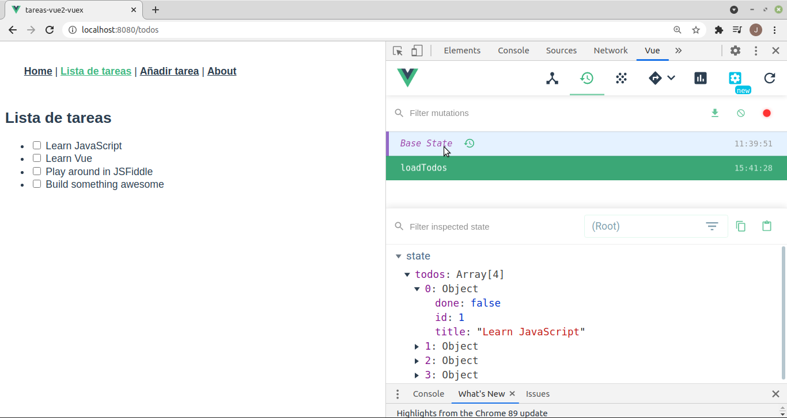
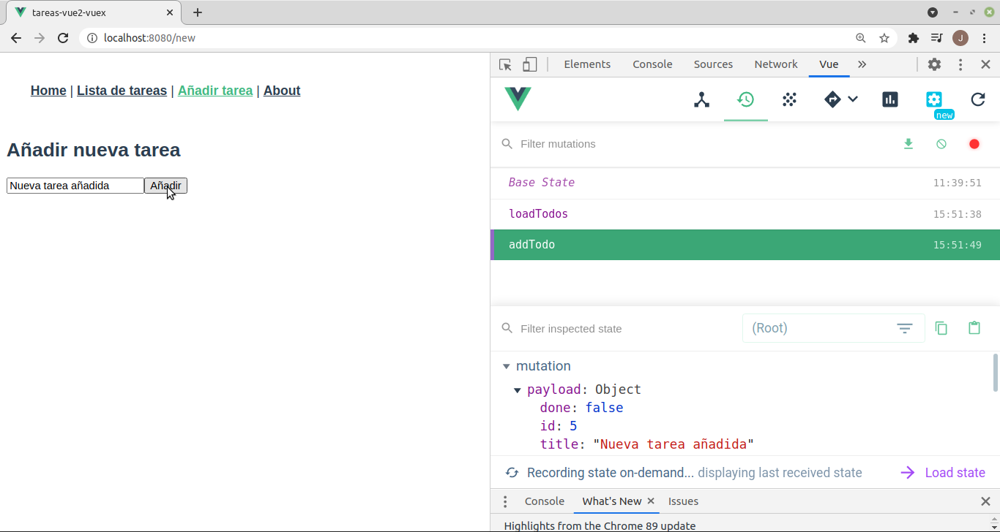

# Vuex
Tabla de contenidos
- [Vuex](#vuex)
  - [Introducción](#introducción)
  - [Instalar y configurar Vuex](#instalar-y-configurar-vuex)
  - [Usar Vuex](#usar-vuex)
    - [Acceder al State desde un componente](#acceder-al-state-desde-un-componente)
    - [Getters](#getters)
    - [Mutations](#mutations)
    - [Actions](#actions)
  - [state en formularios](#state-en-formularios)
  - [Saber más](#saber-más)


## Introducción
Es un '_State Management Pattern_' basado en el patrón **Flux** que sirve para controlar el flujo de datos en una aplicación. 

En Vue la comunicación entre componentes se hace hacia abajo mediante _props_ y hacia arriba emitiendo eventos. Ya vimos que cuando distintos componentes que no son padre-hijo tenían que compartir un mismo estado (acceder a los mismos datos) surgían problemas e intentamos solucionarlos con _event Bus_ o _store pattern_. Estas soluciones pueden servir para pequeñas aplicaciones pero cuando crecen se hace difícil seguir los cambios con estos patrones. Para esos casos debemos usar _Vuex_, que proporciona un almacén de datos centralizado para todos los componentes de la aplicación y asegura que los datos sólo puedan cambiarse de forma controlada.

El uso de Vuex implica mayor complejidad en nuestra aplicación por lo que es recomendable su uso en aplicaciones de tamaño medio o grande (para aplicaciones pequeñas basta con un _eventBus_ o un _store  pattern_ hecho por nosotros). Como dijo _Dan Abramov_, el creador de _Redux_ 

> Las librerías _Flux_ son como las gafas: lo sabrás cuando las necesites

Vuex se integra con las _DevTools_ por lo que es muy sencillo depurar los datos del almacén y los cambios que se producen en ellos. Sin embargo no debemos almacenar todos los datos en Vuex, sólo los que necesitan varios componentes (los datos privados de un componente deben permanecer en él).

El flujo de datos de una aplicación podemos verlo (de manera muy simplificada) en el siguiente esquema:


- El **estado** es el conjunto de datos de nuestra aplicación
- La **vista** representa el estado al usuario
- Las **acciones** son las formas en que podemos cambiar el estado, normalmente en respuesta a entradas del usuario desde la vista

El **estado** de los datos se representa en la **vista**, donde el usuario tiene herramientas que provocan **acciones** que modifican el **estado**. Este esquema funciona perfectamente cuando cada componente tiene su propio estado, pero empieza a dar problemas cuando el estado debe compartirse entre varios componentes. Para ese caso ya vimos soluciones como el _Event Bus_ o el _state management pattern_ pero son soluciones difícilmente mantenibles cuando nuestra aplicación crece. En aplicaciones medias o grandes es conveniente usar _Vuex_.

Vuex centraliza la forma en que nuestros componentes se comunican entre ellos. Con Vuex el flujo de datos podemos verlo de la siguiente manera:


Los componentes de Vue pueden renderizar datos de Vuex y es reactivo frente a ellos (si se modifican se volverá a renderizar el componente). Si el componente quiere modificar estos datos debe enviar (**dispatch**) acciones que ejecutan un proceso (que puede ser asíncrono, por ejemplo una petición a una API). Cuando se resuelve la acción realiza una confirmación (**commit**) que **muta** el _estado_ de la aplicación (aquí podemos depurar con las _DevTools_) por lo que se renderiza de nuevo el componente para mostrar el nuevo estado. En _Vuex_ almacenaremos tanto datos (accesibles desde cualquier componente) como métodos que se utilicen en más de un componente.

## Instalar y configurar Vuex
Si al crear nuestro proyecto Vue marcamos en las opciones que incluya Vuex la instalación y configuración de la herramienta se hará automáticamente:
- se instala el paquete **vuex**. Si no marcamos _vuex_ al crear el proyecto debemos instalarlo nosotros
```bash
npm install -S vuex
```

- se crea el fichero de vuex en **/src/store/index.js**. Es nuestro almacén donde se guardan todas las variables que vaya a usar más de un componente y los métodos para acceder a ellas y modificarlas. Su contenido en Vue2 es

```javascript
import Vue from 'vue'
import Vuex from 'vuex'

Vue.use(Vuex)

export default new Vuex.Store({
  state: {
  },
  mutations: {
  },
  actions: {
  },
  modules: {
  },
})
```
y en Vue3
```javascript
import { createStore } from 'vuex'

export default createStore({
  state: {
  },
  mutations: {
  },
  actions: {
  },
  modules: {
  },
})
```

- se importa dicho fichero en el **main.js** para que el almacén esté disponible para todos los componentes en la variable `this.$store`. Es igual que pasaba con _vue-router_:

```javascript
...
import router from './router'
import store from './store'

new Vue({
  router,	
  store,
  render: h => h(App)
}).$mount('#app')
```

Si no hemos seleccionado _vuex_ al crear el proyecto deberemos hacer estos 3 pasos nosotros manualmente. También tenemos la opción de no importar el _store_ en el fichero _main.js_ sino importarlo únicamente en cada componente que vaya a utilizarlo.

## Usar Vuex
El corazón de Vuex es el **_store_** que es un objeto donde almacenar **_states_** (datos globales) de la aplicación pero se diferencia de un objeto normal en que:
- es reactivo
- sólo se puede modificar haciendo _commits_ de mutaciones

Desde la consola del navegador podemos usar las _DevTools_ para ver nuestro almacén. Para ello vamos a Vue y elegimos la segunda opción (Vuex):



Al crear el almacén (normalmente en el fichero **src/store/index.js**) pondremos en _state_ nuestras variables globales y en _mutations_ los métodos que se pueden usar para cambiarlas, ej.:

```javascript
import Vue from 'vue'
import Vuex from 'vuex'

Vue.use(Vuex)

export default new Vuex.Store({
  state: {
    count: 0
  },
  mutations: {
    increment (state) {
      state.count++
    },
    decrement (state) {
      state.count--
    },
  }
})
```

Cada mutación recibe como primer parámetro el _state_ del almacén para que pueda modificarlo y el componente lo llama mediante el método `commit`:
```javascript
this.$store.commit('increment')
```

En este ejemplo hemos creado un almacén que tiene un dato (_count_) y dos mutaciones para cambiar su valor (_increment_ y _decrement_). Lo usa un componente que muestra el valor del contador e incluye un botón para incrementar su valor y otro para decrementarlo:
```html
<template>
  <div>
    <p>Valor del contador: { { contador }}</p>
    <button @click="incrementa">Incrementar</button>
    <button @click="decrementa">Decrementar</button>
  </div>
</template>
```

```javascript
export default {
  computed: {
    contador() {
      return this.$store.state.count
    }
  },
  methods: {
    incrementa() {
      this.$store.commit('increment')
    },
    decrementa() {
      this.$store.commit('decrement')
    },
  }
}
```

Si no hemos importado el almacén en el `main.js` lo tendremos que importar en cada componente que lo necesite (no es lo habitua):
```javascript
import store from '@/store'

export default {
  computed: {
    contador() {
      return store.state.count
    }
  },
  methods: {
    incrementa() {
      store.commit('increment')
  ...
```

### Acceder al State desde un componente
La mejor forma de acceder a propiedades del almacén es creando métodos _computed_ que cambiarán al cambiar el estado del mismo:
```javascript
  computed: {
    count () {
      return this.$store.state.count
    },
  },
```

Si queremos usar varias propiedades del _store_ en un componente en vez de hacer un método _computed_ para cada una podemos usar el _helper_ **mapState**:
```javascript
import { mapState } from 'vuex'

  computed: mapState([
    'count'	    // map this.count to store.state.count
  ])
```

### Getters
En ocasiones no necesitamos una variable del _state_ sino cierta información sobre ella (por ejemplo no todas las tareas del array _todos_ sino sólo las tareas pendientes). En ese caso podemos filtrarlas en cada componente que las necesite o podemos hacer un _getter_ en el almacén que nos devuelva directamente las tareas filtradas. Estos _getters_ funcionan como las variables  _computed_ (sólo se ejecutan de nuevo si cambian los datos de que dependen):
```javascript
export default new Vuex.Store({
  state: {
    todos: [
      { id: 1, text: '...', done: true },
      { id: 2, text: '...', done: false }
    ]
  },
  getters: {
    pendingTodos: state => {
      return state.todos.filter(todo => !todo.done)
    },
    doneTodos: state => {
      return state.todos.filter(todo => todo.done)
    },
    pendingTodosCount: (state, getters) => {
      return getters.pendingTodos.length
    }
  }
})
```

Cada _getter_ recibe como primer parámetro el _state_ del almacén.

Dentro de los componentes se usan como cualquier variable:
```javascript
computed: {
  pendingTodos () {
    return this.$store.getters.pendingTodos
  }
}
```

Y también podemos usar varios con el _helper_ **mapGetters**:
```javascript
import { mapGetters } from 'vuex'

export default {
  // ...
  computed: {
    // mix the getters into computed with object spread operator
    ...mapGetters([
      'pendingTodos',
      'pendingTodosCount',
      // ...
    ])
  }
}
```

Si queremos podemos hacer getters también para los states y así no necesitamos mapState sino que accedemos a todo con mapGetters.

Los getters pueden recibir parámetros, por ejemplo, para hacer búsquedas:
```javascript
getters: {
  // ...
  getTodoById: (state) => (id) => {
    return state.todos.find((todo) => todo.id === id)
  }
}
```
Y lo llamaremos con `this.$store.getters.getTodoById(2)`.

### Mutations
**NOTA**: Una mutación no puede hacer una llamada asíncrona (por ejemplo llamar a _axios_)

La única manera de cambiar los datos del almacén es llamando a las mutaciones que hayamos definido, pero no se llaman como si fueran métodos sino que se lanzan (como si fueran eventos) con **commit**: `this.$store.commit('increment')`.

Las mutaciones reciben como primer parámetro el _store_ pero pueden recibir otro parámetro adicional, llamado **_payload_**, donde incluyamos los datos a pasarle a la mutación:
```javascript
mutations: {
  addTodo (state, toDo) {
    state.todos.push(toDo)
  }
}
```

Al llamar a la mutación le pasamos el valor esperado: `this.$store.commit('addTodo', this.newTodo)`. 

Cada vez que se llama a una mutación se registra en las _DevTools_ y podemos ver la mutación llamada y los datos que se le han pasado:



Si queremos pasar varios parámetros el _payload_ deberá ser un objeto. En ese caso podemos pasar el nombre de la mutación como propiedad _type_ del objeto:
```javascript
this.$store.commit({
  type: 'incrementBy',
  amount: 10
})
```

Podemos llamar a las mutaciones desde un componente, aunque lo habitual es llamar a acciones que ejecuten esas mutaciones. Recuerda que el código de las mutaciones **NO puede ser asíncrono**, por lo que no pueden, por ejemplo, hacer una llamada a _axios_.

Para llamar a la mutación desde un componente haríamos:
```javascript
this.$store.commit('increment'):
```

Al igual con con el estado o los _getters_ podemos _mapear_ las mutaciones a métodos locales para poder hacer `this.increment()` en lugar de `this.$store.commit('increment')` con el _helper_ _mapMutatios_:
```javascript
import { mapMutations } from 'vuex'

export default {
  // ...
  methods: {
    ...mapMutations([
      'increment', // map `this.increment()` to `this.$store.commit('increment')`
      'incrementBy' // map `this.incrementBy(amount)` 
                    // to `this.$store.commit('incrementBy', amount)`
    ]),
    // Y podemos hacer 'alias' de las mutaciones
    ...mapMutations({
      add: 'increment' // map `this.add()` to `this.$store.commit('increment')`
    })
  }
}
```

### Actions
Son métodos del almacén como las mutaciones pero que **SÍ pueden hacer llamadas asíncronas**. Por tanto es aquí donde haremos las llamadas a la BBDD y cuando el servidor responda modificaremos los datos del _store_. Lo mejor es no cambiarlos directamente en la _action_ (aunque podría hacerse) sino que la _action_ debería llamar a una _mutation_ que la cambie y así se registra en las _DevTools_. Las acciones reciben como parámetro un objeto _context_ con las mismas propiedades y métodos que el almacén, lo que permite:
- lanzar una mutación con `context.commit(`
- acceder a los datos con `context.state.`
- acceder a los getters con `context.getters.`
- llamar a otras acciones con `context.dispatch(`

```javascript
...
import axios from 'axios'

export default new Vuex.Store({
  state: {
    todos: []
  },
  mutations: {
    addTodo(state, todo) {
      state.todos.push(todo);
    },
  },
  actions: {
    addTodo(context, item) {
      axios.post(`${baseURL}/todos`, item)
      .then((response) => context.commit('addTodo', response.data))
      .catch((error) => alert(error))
    },
  },
```

Para llamarla desde un componente hacemos:
```javascript
this.$store.dispatch('addTodo', this.newTodo)
```

También podemos usar la desestructuración de objetos de ES2015 para obtener sólo la parte del contexto que nos interesa:
```javascript
  actions: {
    addTodo({ commit }, item) {
      axios.post(`${baseURL}/todos`, item)
      .then((response) => commit('addTodo', response.data))
      .catch((error) => alert(error))
    },
```

Igual que antes podemos usar el _helper_ _mapActions_ para mapear acciones y no tener que llamarlas en el componente con `this.$store.dispatch('...')`.

Si la acción realiza una llamada asíncrona y el componente que la llama tiene que enterarse de cuándo finaliza debe devolver una promesa:
```javascript
  actions: {
    addTodo(context, item) {
      return new Promise((resolve, reject) => {
        addTodo(context, item) {
          axios.post(`${baseURL}/todos`, item)
          .then((response) => {
            context.commit('addTodo', response.data)
            resolve(response.data)
          })
          .catch((error) => reject(error))
        }
    },
  },
```

En este caso en el componente tenemos los métodos _then_ y _catch_ para saber cuándo ha acabado la acción:
```javascript
this.$store.dispatch('addTodo', this.newTodo)
.then((todo) => {   	      // se ejecutará si la acción ha hecho un resolve()
  alert('Añadida la tarea ' + todo.id)
  this.$router.push('/todos')
})
.catch((error) => alert(error))	// se ejecutará si la acción ha hecho un reject()
```

**NOTA**: si quien llama a una acción no necesita saber cuándo termina la acción ni su resultado la acción no es necesario que devuelva una promesa

## state en formularios
Si queremos usar un formulario para modificar un state del store no podemos asociarlo al input con la directiva **v-model** porque cuando el usuario cambie el valor del input estaría escribiendo directamente sobre un state, lo que no puede hacerse más que por medio de una mutación.

Tenemos 2 soluciones al problema:
- podemos no usar el v-model sino descomponerlo en un _:value_ y un _@input_ como vimos al hablar de poner un input en un subcomponente
- podemos ponerle al computed de ese state un setter y un getter como vimos en el capítulo de [Profundizando en Vue](./06-profundizando.md)

Más información en la [documentación oficial](https://vuex.vuejs.org/guide/forms.html) de Vuex.

## Saber más
* [Vuex](https://vuex.vuejs.org/)
* [Cómo Construir Aplicaciones Complejas y a Gran Escala Vue.js con Vuex](https://code.tutsplus.com/es/tutorials/how-to-build-complex-large-scale-vuejs-applications-with-vuex--cms-30952)
* [Vuex for Everyone](https://vueschool.io/courses/vuex-for-everyone)
* [VueJS: Introducción a vuex](https://elabismodenull.wordpress.com/2017/05/29/vuejs-introduccion-a-vuex/)
* [Managing State in Vue.js](https://medium.com/fullstackio/managing-state-in-vue-js-23a0352b1c87)
