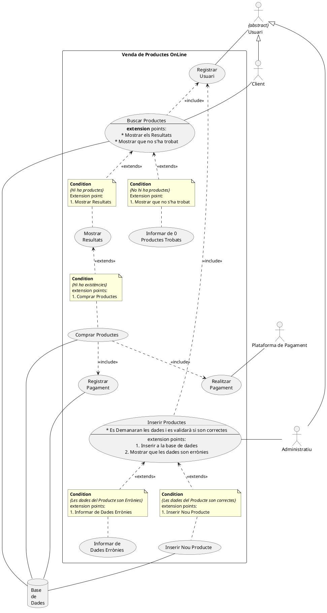
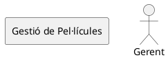
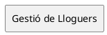

# UD5 - PRÀCTICA 1: Diagrama de Casos d’Ús

## 1. Venda de Productes on-line

> Realització del diagrama de casos d'ús comprar.

![Casos de Uso](/png/dLRDJXin4BxxAKPmI8YqeUrnXH0GKXM9qWgL7aeuEBikMDhOgUsjK2dlqcFFVGLUhEFVZPCbeesqoNeyyytd-NEEjA7Aj8i69bHB3JM3Aor9-R6XXdwLQa6jw2EzfGicJ0bKmp9jaNBIS2icvN6zu89hewZXBQxtzn_et2uhyxY_FnDNkgMAEtl_2a32oy7Fee3CFjlnBaYDJkTKCzWvmU-PgF4vfJNJEnQpdXF5AaF5ROCQdvceFMybwxOoJCC7SSu5su47GW2WrQooMFDMLrJ1jPNXvyGlarKG5qLu6OtOlM52Sob68rXABemkunwybvQ-0jPek6IwRGmrUcFtMyj0ID23Emf6oJarLkN6qHe6fPb8zdlsT4s3aQ4PhU6PS2bGzfYlPg8xwIS7wWqhfcH6PNZ9RddmuOFiz5IKEfs9N2pLQXmybfS65DfmyyEYnD9mEajSg7K_cKRo5ALMEpv26ipUQ3IHekR6HNaci9BUSS1eBICTLr3Jc0cVXt8cTbECqv5TRLpuy2copSM5XBj_zBAPIU_k2mQzysKbx1u9C57nL58PWI1B1tNgJx-TFh88soodaWfl5pRoPNUm1Hm1aXKy5vef7Yh-B2mok_6Ok7gTQZXb2ogeeW8QhAlQDXjmmA_lcFsQggTVe3beP5H9PTlF8_XswQNxUfoSKcWek8R60dROLk7DE0jlvzTwOKez_H4XY3VPkM8tk8amLKfQjTJNgxqIH4uHfX4H-Y0TqGlPnlYiuFapu5uANWUGqjw3i3tzv-cuDMiISXxXbnJ4S_owciXfziJkluccaBwCQ9UOjOnaV1_9uBX54CDnFiVR0U-6RcwHmTiM6qOAEvYeiO1XO8s9lq6ilf_t9Ep0k2tovbnTsDt3zT4B9HmSkFFK-l0GIBX041fl8BAkxF3Zz8al7ZSOPd24PFCQ5ST-cW3nFoXunZ887NGAYjFXechQcbdqxkAsXDsiXYuMQEb59MHcKI6SSLL_OvXd3e5ix7iGsCpMW6RtVndcL0d5zHslQoPksgBdxbZxsm55KyGHjuAnBIf01glT4gS_37qvJcBRxP6-TdR8SQRc6UdNxXiAVQe-s5kfdOag8zSt0BVoUyRWkO50o16QuZ_5lm00 "Casos de Uso")

> L'administratiu, una vegada autenticat, interactua amb el sistema per a inserir nous productes. El sistema demanarà les dades del producte i validarà si son correctes abans d'inserir el nou producte. En cas contrari indicarà que son errònies.

## 2. GESTIÓ D’UN VIDEOCLUB

El gerent de **l'únic** videoclub de la nostra ciutat vol que li desenvolupem una aplicació que li permeta gestionar-lo eficientment.  Hem parlat amb ell i hem pres nota dels requeriments:

"El videoclub té, al menys una còpia en DVD de cada pel·lícula que té registrada. Només lloga pel·lícules a les persones que siguen sòcies o les autoritzades pel soci. Es vol portar registre  de  totes  les  pel·lícules  que  lloga  cada  soci.  Es  poden  llogar  diverses  pel·lícules alhora, però sempre amb una data límit per a la seva devolució. Es sancionarà amb 1€ per cada dia de retard en la devolució d'una pel·lícula. Interessa poder consultar les sancions que tinga cada soci. També, es vol poder consultar els DVD que hagen estat llogats més vegades per tenir l'opció de donar-los de baixa si presenten danys que poden afectar la seua visualització." Després analitzar el sistema, s’ha decidit implementar una aplicació que acompleixa amb els següents objectius.

S’han identificat els següents subsistemes *(cada subsistema serà un diagrama de casos d’ús 
independent)*:  

* Gestió de Pel·lícules,  
* Gestió de Socis i  
* Gestió de Lloguers

> Gestió de Pel·lícules

> Gestió de Socis

```plantuml
@startuml

rectangle "Gestió de Socis" {

}

@enduml
```

> Gestió de Lloguers

### 2.1. Treball a realitzar

Elabora els diagrames de casos d'ús que modelen l'anàlisi de requisits per a cadascun dels 
subsistemes identificats.

## 3. ESCOLA INFANTIL

Es vol crear una aplicació per portar la gestió d'una escola infantil:  

"Per a la inscripció dels xiquets, el supervisor docent rep els documents sol·licitats per a la seva incorporació a l'escola per part de tutor o representant i posteriorment els  analitza  per  aprovar-los  o  rebutjar-los.  Si  són  aprovats,  els  documents  són lliurats a el cap d'estudis perquè realitze l'alta de l'expedient del nou alumne. En cas de ser rebutjat, el supervisor docent elabora un informe de rebuig que serà lliurat al tutor o al representant i al director de l'escola. L'escola també contracta nous docents. Per a això, el supervisor de docents sol·licita el currículum i després realitza una entrevista. En el cas de superar l'entrevista, el docent  haurà  de  realitzar  una  prova  pràctica  i  una  prova  escrita,  que  en  cas d'aprovar totes dues el docent serà contractat i es crearà un expedient per al docent. En cas de no superar l'entrevista, se li informarà per escrit la no acceptació explicant el motiu de la mateixa."

1. Per als requisits d’abans, és sol·licita:  
   * **Diagrama** de **casos d'ús** del sistema de gestió de l’escola infantil (on es reflexe la interacció amb tots els actors del sistema
   * **Diagrama** de **casos d'ús** per als **subsistemes** Gestionar Inscripcions i Contractar Docents.
2. Usa les següents plantilles per a la **descripció d'actors** i dels **casos d'ús**:
   * Especificació dels actors: ( En un format taula)  
     * **Nom** `<nom de l’actor>`
     * **Descripció** `<descripció del rol>`
     * **Anotacions** `<altres dades addicionals>`
   * Especificació dels casos d’ús:
     * **Nom** `<nom del caso de uso>`
     * **Descripció** `<descripció general>`
     * **Flux Normal** `<seqüència de passos/events>` 
     * **Flux Alternatius/Excepcions** `<passos/events alternatius>`